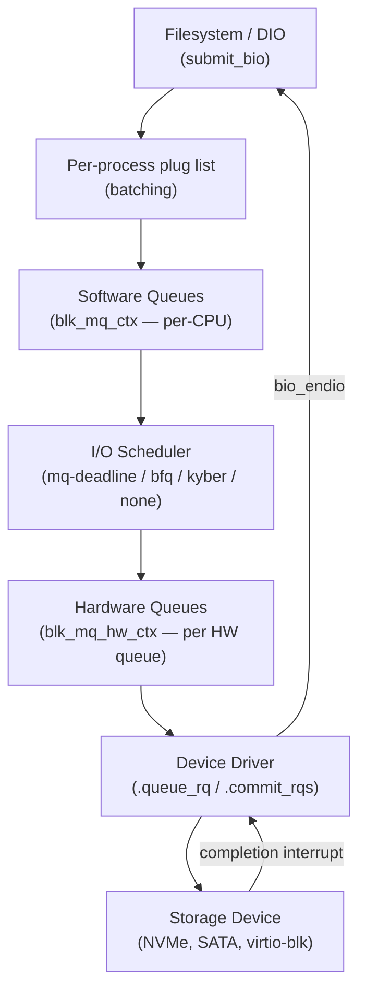

# Block Layer Subsystem

## Overview

The Linux block layer (`block/`) sits between filesystems, direct-I/O paths, and block device drivers. It translates high-level I/O requests into `bio` structures, queues and merges them, optionally reorders them via an I/O scheduler, and dispatches them to driver hardware queues. It abstracts over every storage technology — spinning disks, NVMe SSDs, network block devices, device-mapper stacks — behind a uniform interface.

## Mental Model

Think of the block layer as a **post office** with two counter types. Submitters (filesystems, dm, md) drop parcels (`bio`s) at a per-CPU counter (software queue). Mail sorters (I/O schedulers) optionally reorder and merge parcels for the route. Couriers (driver threads) pick up batches and deliver them to the hardware (hardware queues). On return, the courier stamps the parcel complete and the filesystem is notified. The old post office had one central counter with a lock everyone fought over; blk-mq replaced it with per-CPU counters.

## Architecture



---

## Core Components

### [[bio-layer]]

**Purpose** — Represent a single I/O request as a scatter/gather list of memory pages destined for a contiguous range of device blocks.

**How it works** — A `struct bio` is the atomic unit of I/O in the block layer. It identifies:
- `bi_bdev` / `bi_disk` — the target block device
- `bi_iter.bi_sector` — starting LBA on the device
- `bi_opf` — operation flags: `REQ_OP_READ`, `REQ_OP_WRITE`, `REQ_OP_FLUSH`, `REQ_OP_DISCARD`, etc.
- `bi_io_vec` — array of `bio_vec` structs, each describing one page + offset + length

```c
struct bio_vec {
    struct page  *bv_page;
    unsigned int  bv_len;
    unsigned int  bv_offset;
};
```

A bio can contain up to `BIO_MAX_VECS` bio_vecs; if a request spans more pages, `bio_split()` divides it into chained bios. Filesystems and the page cache construct bios using `bio_add_page()`.

Submission goes through `submit_bio()` → `submit_bio_noacct()` → `__submit_bio()`. For stacked devices (dm, md), `submit_bio_noacct()` detects recursion via a per-process list, queuing inner bios for processing after the outer returns — preventing stack overflow.

Per-process **plugging** (`blk_start_plug()` / `blk_finish_plug()`) accumulates bios on a local list. At unplug, `blk_flush_plug_list()` submits them all at once, enabling the I/O scheduler to see and merge related requests together.

**Key struct**: `struct bio` (`include/linux/blk_types.h`)
- `bi_io_vec` — scatter/gather page list
- `bi_iter` — current position (sector, size, index) for iteration or splitting
- `bi_end_io` — completion callback
- `bi_private` — caller's private data
- `bi_status` — `BLK_STS_OK` or error code

**Key functions**:
- `submit_bio(bio)` — submits a bio into the block layer
- `bio_add_page(bio, page, len, offset)` — appends a page to the bio's vec list
- `bio_split(bio, sectors, gfp, bs)` — splits a bio at `sectors` boundary
- `bio_endio(bio)` — called by driver on completion; walks the bio chain

---

### [[blk-mq]]

**Purpose** — Provide a scalable multiqueue submission/dispatch path that eliminates the single global lock of the legacy block layer, enabling millions of IOPS on NVMe and other fast storage.

**How it works** — blk-mq maintains two tiers of queues:

**Software queues (`blk_mq_ctx`)**: one per CPU (or per NUMA node). When a bio is submitted, it is converted to a `struct request` and placed on the CPU-local software queue with minimal locking. Requests on the same queue can be merged (adjacent sectors, same direction) before dispatch.

**Hardware queues (`blk_mq_hw_ctx`)**: one per hardware submission queue supported by the device (NVMe may expose 32+; a single-queue SATA disk exposes 1). The block layer maps N software queues to M hardware queues. Each `blk_mq_hw_ctx` tracks in-flight requests and drives the driver's `queue_rq()`.

The dispatch path (`blk_mq_run_hw_queue()` → `blk_mq_dispatch_rq_list()`) picks requests from the scheduler or directly from the software queue (if `none` scheduler), and calls `ops->queue_rq()` on the driver for each batch.

**Key struct**: `struct blk_mq_hw_ctx` (`include/linux/blk-mq.h`)
- `queue_depth` — how many requests can be in-flight simultaneously
- `nr_active` — current in-flight count
- `dispatch` — list of requests waiting to be sent to the driver
- `tags` — tag allocator (each in-flight request gets a unique tag for completion matching)

**Key functions**:
- `blk_mq_init_queue(set)` — initialises a blk-mq queue from a `blk_mq_tag_set`
- `blk_mq_run_hw_queue(hctx, async)` — triggers dispatch on a hardware queue
- `blk_mq_complete_request(rq)` — driver calls this on completion; wakes the submitter

**Config & flags**: `blk_mq_ops.queue_rq` — driver's entry point; receives a `blk_mq_queue_data` with the request and a `last` flag indicating whether more requests follow in this batch.

---

### [[io-scheduler]]

**Purpose** — Reorder and merge requests to improve throughput (reduce seek time for HDDs) or enforce fairness/latency guarantees (for mixed workloads).

**How it works** — Schedulers implement `elevator_mq_ops` and plug into blk-mq via `blk_mq_sched_*` hooks. Three multiqueue schedulers are available:

- **mq-deadline**: enforces read/write deadline queues (default on HDDs); prevents starvation of reads by writes. `read_expire` (default 500ms) and `write_expire` (5s) bound maximum latency.
- **BFQ (Budget Fair Queuing)**: proportional-share scheduling per process/group; models each queue as a virtual disk and assigns a budget (number of sectors); good for mixed interactive + sequential workloads.
- **Kyber**: low-overhead, latency-oriented; uses per-CPU staging queues with token buckets to bound read and write latency independently; designed for fast NVMe devices.
- **none**: no reordering; requests go directly from software queues to hardware queues; fastest for devices with their own internal queuing (NVMe with NCQ).

**Config & flags**: set via `echo scheduler > /sys/block/sdX/queue/scheduler`; mq-deadline is the default for rotating media, `none` for NVMe.

---

### [[io-polling]]

**Purpose** — For ultra-low-latency NVMe devices, interrupt-driven completion adds ~10–20 µs overhead. Polling-based completion (`IORING_OP_READ` + `IOPOLL`) eliminates this by having the submitting thread spin-check the completion queue.

**How it works** — When a bio is submitted with `REQ_HIPRI`, blk-mq dispatches it to a polling hardware queue. The calling thread calls `blk_poll()` which repeatedly calls `ops->poll()` on the driver (e.g. `nvme_poll()`) until the specific request completes. No interrupt is generated; the CPU stays warm on the completion path. io_uring uses this path transparently for `IORING_OP_READ`/`WRITE` on polling-enabled devices.

---

## How Components Interact

**Scenario 1 — Filesystem write reaching NVMe**

1. `ext4_write_pages()` constructs a bio with dirty page cache pages.
2. `submit_bio()` converts the bio to a `request` and places it on the CPU's `blk_mq_ctx` queue.
3. At unplug (`blk_finish_plug()`), `blk_mq_flush_plug_list()` delivers the request to the kyber scheduler.
4. Kyber decides the request is within the write-latency budget and moves it to the NVMe hardware queue.
5. `nvme_queue_rq()` posts a submission queue entry (SQE) to the NVMe controller.
6. The NVMe controller signals completion via doorbell; `nvme_irq()` dequeues the completion queue entry (CQE) and calls `blk_mq_complete_request()`.
7. `bio_endio()` is called, waking the writeback thread.

**Scenario 2 — dm-crypt stacked device**

1. Application writes to `/dev/dm-0` (encrypted device).
2. dm-crypt submits a bio to `dm-0`; `submit_bio_noacct()` detects the current process is already inside the block layer and defers it.
3. After the outer bio processing returns, the deferred bio is submitted to the underlying `/dev/nvme0n1`.

---

## Where It Fits in the Kernel

- **↑ Filesystems**: `submit_bio()` is the universal filesystem-to-block interface; all FS writeback, readahead, and direct I/O goes through it.
- **↑ Direct I/O**: `__blkdev_direct_IO()` submits bios directly, bypassing the page cache.
- **→ Device drivers**: `blk_mq_ops.queue_rq()` is the handoff to the driver; `blk_mq_complete_request()` is the return path.
- **→ Device mapper / md**: stacked block devices intercept `make_request_fn` and re-submit transformed bios to underlying devices.
- **← mm**: writeback triggers bio submission from the page cache; readahead submits read bios on page fault.

## Design Decisions & Tradeoffs

**blk-mq vs. single queue**: the single-queue design (pre-3.13) serialised all requests through one spinlock. On a 32-core system with NVMe doing 3M IOPS, this lock bounced constantly. blk-mq eliminates this by making the hot path (per-CPU queue) lock-free or minimally locked.

**Tag-based completion**: each in-flight request is assigned a unique tag (integer index into a pre-allocated array). Driver completion handlers use the tag to locate the `request` in O(1). This replaces the list-scan approach of the old layer.

**Plugging as a batching mechanism**: rather than submitting one bio at a time, plugging accumulates a batch. The I/O scheduler sees multiple requests at once and can merge them, improving sequentiality for HDDs and reducing doorbell-ring overhead for NVMe.

**Scheduler opt-out for fast devices**: the `none` scheduler exists explicitly because I/O reordering costs CPU time that exceeds its benefit on sub-100µs NVMe. Fast devices with deep hardware queues do their own internal reordering.

## How It Has Evolved

- **2.4 (2001)**: Deadline and anticipatory I/O schedulers merged.
- **2.6.0 (2003)**: CFQ (Completely Fair Queuing) merged — per-process fairness.
- **3.13 (2014)**: blk-mq merged; old single-queue path begins deprecation.
- **4.12 (2017)**: BFQ merged; Kyber merged.
- **5.0 (2019)**: All major drivers ported to blk-mq; legacy single-queue path removed.
- **5.10 (2020)**: Bio-based I/O polling (`REQ_HIPRI`) generalised.

## Recent Development Activity

- **io_uring + block polling**: tight integration between io_uring and block layer polling for sub-100µs read/write latency.
- **Zone append** (`REQ_OP_ZONE_APPEND`): for zoned storage (SMR HDDs, ZNS NVMe); appends to the current write pointer without requiring the host to track it.
- **Block passthrough**: improved NVMe passthrough for `io_uring_cmd` enabling direct NVMe admin and I/O commands from userspace without kernel involvement per-command.

## Further Reading

1. **LWN — "A block layer introduction part 1: the bio layer"** (2017): https://lwn.net/Articles/736534/
2. **LWN — "Block layer introduction part 2: the request layer"** (2017): https://lwn.net/Articles/738449/
3. **LWN — "The multiqueue block layer"** (2013): https://lwn.net/Articles/552904/
4. **LWN — "blk-mq and I/O scheduling"** (2016): https://lwn.net/Articles/665001/

## LKML Highlights

- **blk-mq initial merge** (Jens Axboe + Shaohua Li, 2013): extensive debate on whether the performance gain justified the complexity; the SSD benchmark data (10× throughput improvement on 32-core systems) settled it.
- **Removal of legacy single-queue** (5.0): contentious because several drivers still used the old path; required porting ~50 drivers to blk-mq ops before the old code could be deleted.
