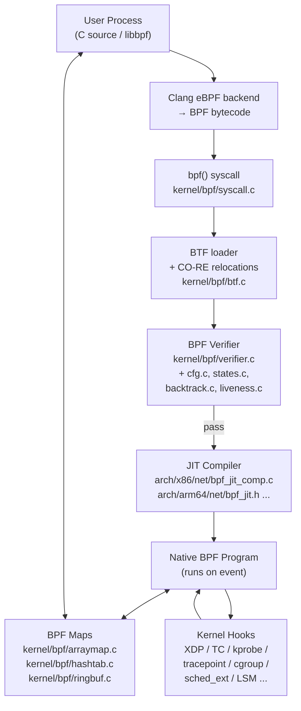

# BPF (eBPF) Subsystem

## Overview

The BPF subsystem provides a sandboxed, event-driven execution environment for safely running kernel-space programs written in a restricted form of C. Programs pass a static safety analysis (the *verifier*) before being JIT-compiled to native machine code and attached to kernel hooks ranging from network drivers to scheduler internals. BPF eliminates the kernel-recompile/reboot cycle of traditional module development while guaranteeing that programs terminate, respect memory bounds, and cannot corrupt kernel state.

## Mental Model

Think of BPF as a **kernel extension bus**: a user submits a bytecode program, the kernel inspects every possible execution path statically to confirm safety, compiles it to native code, and wires it to a hardware or software event. From that moment the program runs inside the kernel with nanosecond latency and zero syscall overhead — yet with a safety contract enforced before a single instruction executes. Maps serve as the shared memory mailboxes connecting the BPF-side logic to userspace control and observation.

## Architecture

Control flows downward through the load path (compile → verify → JIT → attach). At runtime, hardware or software events trigger the attached program; the program reads/writes maps; userspace polls those maps for results.

---

## Core Components

### [[bpf-verifier]]

**Purpose** — The verifier is the safety gatekeeper. Without it, an arbitrary C function executing in the kernel could read out-of-bounds, dereference a stale pointer, or loop forever. The verifier proves — statically, before any instruction runs — that none of these things can happen.

**How it works** — Verification proceeds in two phases. In the first phase the verifier constructs a directed acyclic graph (DAG) of the program's control flow, rejecting cycles (unbounded loops) and unreachable instructions. The second phase performs *abstract interpretation*: it simulates every possible execution path instruction by instruction, tracking an abstract state for each of the eleven BPF registers and all stack slots in a `struct bpf_reg_state`.

Each register's abstract state is richer than a single value. The verifier tracks the register's *type* (e.g. `SCALAR_VALUE`, `PTR_TO_MAP_VALUE`, `PTR_TO_CTX`, `PTR_TO_STACK`), and for scalar types it maintains a *tnum* — a 64-bit (mask, value) pair where mask bits indicate uncertainty. It also maintains signed and unsigned minimum/maximum bounds. For example, after reading a byte into a register, the tnum becomes `(0x0, 0xff)` — the upper 56 bits are certainly zero, the low 8 are unknown.

When a conditional branch is reached, the verifier clones the current abstract state and explores both arms. Without pruning this would be exponential. The verifier avoids this with a *state cache*: each time it finishes verifying a code point, it saves the resulting `struct bpf_verifier_state`. On the next visit it checks whether the new state is *subsumed* by any cached state (i.e. the cached state is at least as constrained). If so, the branch is pruned. Liveness tracking refines pruning further: registers that are written but never subsequently read are excluded from state comparison, allowing more states to collide.

Pointer arithmetic is validated through the tnum and bound information: before any dereference the verifier must be able to prove the offset stays within the object's bounds. Pointer types carry an `id` field so that the verifier can correlate copies of the same pointer (e.g. for range-check patterns that guard a later load).

Function calls resolve against the allowed helper/kfunc set for the program's type. Callee-saved registers (R6–R9) survive calls; R1–R5 become unreadable until rewritten.

**Key struct**: `struct bpf_reg_state` (`include/linux/bpf_verifier.h`)
- `type` — register type enum (`SCALAR_VALUE`, `PTR_TO_MAP_VALUE`, etc.)
- `var_off` — tnum (mask + value) encoding what bits are known
- `umin_value` / `umax_value` — unsigned bounds on the value
- `smin_value` / `smax_value` — signed bounds
- `id` — links register copies sharing the same pointer origin
- `off` / `delta` — constant offset from the pointed-to object's base

**Key functions**:
- `do_check()` (`kernel/bpf/verifier.c`) — main per-instruction simulation loop
- `check_mem_access()` — validates pointer type, offset, and bounds before load/store
- `states_equal()` / `regsafe()` (`kernel/bpf/states.c`) — pruning subsumption check
- `check_helper_call()` / `check_kfunc_call()` — validates function call arguments and updates return-register type
- `bpf_check()` — top-level entry called from `bpf_prog_load()`

**Config & flags** — `CONFIG_BPF_JIT_ALWAYS_ON` requires JIT (disables interpreter, closes a Spectre v2 vector). `BPF_UNPRIV_DEFAULT_OFF` (introduced after Spectre findings) disables unprivileged BPF by default. The verifier log is accessible via the `log_level` field in `bpf_attr`.

---

### [[bpf-maps]]

**Purpose** — BPF programs execute in interrupt or kernel context and cannot call blocking syscalls. Maps provide the only structured path to share state between a running BPF program and userspace, or between multiple BPF programs.

**How it works** — A map is created via `BPF_MAP_CREATE` and identified by an fd in userspace, or a pinned path in bpffs. The kernel allocates the backing store — an array, a hash table, a ring buffer, etc. — and returns a reference-counted handle. A BPF program receives a pointer to the map value at `bpf_map_lookup_elem()` time; that pointer is verified to be within bounds before the program can dereference it.

From userspace, `BPF_MAP_LOOKUP_ELEM`, `BPF_MAP_UPDATE_ELEM`, and `BPF_MAP_DELETE_ELEM` commands on the `bpf()` syscall provide the control plane. From the BPF side, the compiled program calls in-kernel helper functions (`bpf_map_lookup_elem`, `bpf_map_update_elem`) that are translated by the JIT into direct calls to the map's ops vtable.

Different map types serve different needs:
- `BPF_MAP_TYPE_ARRAY` — fixed-size, pre-allocated; fastest lookup; zero-initialised
- `BPF_MAP_TYPE_HASH` — general key-value; per-CPU variants avoid lock contention
- `BPF_MAP_TYPE_PERCPU_ARRAY` / `_HASH` — eliminates SMP spinlocks for counters/histograms
- `BPF_MAP_TYPE_LRU_HASH` — auto-evicts least-recently-used entries; for connection tracking
- `BPF_MAP_TYPE_LPM_TRIE` — longest-prefix match; used for IP routing tables in XDP
- `BPF_MAP_TYPE_PROG_ARRAY` — stores BPF program fds for tail calls (trampolining between programs)
- `BPF_MAP_TYPE_RINGBUF` — single shared ring buffer readable by multiple CPUs; replaces perf buffer for high-frequency events
- `BPF_MAP_TYPE_SOCK_MAP` / `SOCKARRAY` — redirects between sockets without userspace round-trips

BTF annotations on maps let the kernel expose type information so `bpftool map dump` can pretty-print keys and values without a separate schema.

**Key struct**: `struct bpf_map` (`include/linux/bpf.h`)
- `ops` — vtable (`struct bpf_map_ops`) providing `map_lookup_elem`, `map_update_elem`, `map_delete_elem`, `map_alloc`, `map_free`
- `key_size` / `value_size` / `max_entries` — dimensions
- `map_type` — enum selecting the ops implementation
- `btf` / `btf_key_type_id` / `btf_value_type_id` — type-system annotations
- `refcnt` — reference count; map freed when both userspace fd and all BPF prog references are dropped

**Key functions**:
- `map_create()` (`kernel/bpf/syscall.c`) — allocates and initialises map from `BPF_MAP_CREATE` cmd
- `bpf_map_lookup_elem()` — helper visible to BPF programs; maps to `ops->map_lookup_elem`
- `bpf_ringbuf_output()` / `bpf_ringbuf_reserve()` / `bpf_ringbuf_commit()` (`kernel/bpf/ringbuf.c`) — ring buffer API

**Config & flags** — `BPF_F_NO_PREALLOC` defers hash-map memory allocation to insert time (saves memory, adds latency). `BPF_F_LOCK` enables spin-lock-protected value updates. Per-CPU variants require `nr_cpu_ids` allocation multipliers.

---

### [[bpf-jit-compiler]]

**Purpose** — The BPF bytecode interpreter is ~3× slower than native code and is a Spectre v2 gadget surface. The JIT compiler translates verified bytecode to native instructions so BPF programs run at near-native speed with no interpreter overhead.

**How it works** — After the verifier succeeds, `bpf_prog_select_runtime()` calls the architecture-specific JIT if available. The JIT iterates over BPF instructions and emits native equivalents. Because the BPF register model was designed to map cleanly to modern ISAs, the mapping is usually 1:1: BPF R0 → RAX on x86-64 / X0 on arm64, R1–R5 for arguments (matching the System V ABI), R6–R9 callee-saved (mapped to RBX, R13, R14, R15 on x86-64).

Each BPF instruction type (ALU64, LD, ST, JMP, CALL, EXIT) has a corresponding emitter function. Memory loads and stores become `movq [rdi + offset], rax` patterns; conditional jumps become `cmp + j*`; helper calls become `callq <helper_address>` after address patching. BPF-to-BPF calls (subprograms) are emitted as separate images and back-patched once all subprogram offsets are known.

Constant blinding is applied to BPF immediate values in JIT images to prevent JIT-spray attacks: large constants are XOR-folded at compile time so they never appear literally in the instruction stream.

Supported architectures (as of 6.x): x86-64, arm64, arm32, ppc64, s390x, mips64, sparc64, arc, riscv64.

**Key struct**: `struct bpf_prog` (`include/linux/filter.h`)
- `jited` — bool; set when JIT image is valid
- `bpf_func` — pointer to the JIT-compiled native code entry point
- `jited_len` — size of the JIT image in bytes
- `aux` — `struct bpf_prog_aux`; holds maps, subprog info, BTF reference

**Key functions**:
- `bpf_int_jit_compile()` (`arch/x86/net/bpf_jit_comp.c`) — x86-64 JIT entry
- `do_jit()` — inner translation loop: one BPF instruction → one or more x86 instructions
- `bpf_jit_blind_constants()` — constant blinding pass

**Config & flags** — `CONFIG_BPF_JIT` enables JIT; `CONFIG_BPF_JIT_ALWAYS_ON` removes the interpreter, forcing JIT. `net.core.bpf_jit_enable` sysctl (1 = enable, 2 = debug dump). `net.core.bpf_jit_harden` (1 = blind constants for unprivileged, 2 = always blind).

---

### [[bpf-program-types]]

**Purpose** — BPF programs attach to specific kernel events. The program type determines what context is passed as the first argument, which helpers are callable, and what the return value means to the kernel. Without typed programs there would be no way to enforce that a network filter can't accidentally call a scheduler-only API.

**How it works** — Each program type is registered as a `struct bpf_prog_type_list` entry that supplies a `struct bpf_verifier_ops`. The verifier uses `verifier_ops->get_func_proto()` to decide which helpers the program may call, and `verifier_ops->is_valid_access()` to decide which context fields it may read or write.

When a program is loaded with `BPF_PROG_LOAD`, the `prog_type` field selects the verifier_ops. When it is attached (`BPF_PROG_ATTACH`, `bpf_link_create`, `netlink`, or driver ioctl depending on the hook), the kernel wires its `bpf_prog.bpf_func` pointer into the appropriate kernel data structure.

Major program types and their hooks:

| Type | Attachment | Context | Return meaning |
|------|-----------|---------|---------------|
| `BPF_PROG_TYPE_XDP` | netdev RX queue (pre-SKB) | `struct xdp_md` | Pass, drop, redirect, TX |
| `BPF_PROG_TYPE_SCHED_CLS` | TC qdisc (post-SKB) | `struct __sk_buff` | Verdict + mark |
| `BPF_PROG_TYPE_KPROBE` | kprobe / kretprobe / fentry/fexit | `struct pt_regs` | Ignored |
| `BPF_PROG_TYPE_TRACEPOINT` | static tracepoints | per-TP format struct | Ignored |
| `BPF_PROG_TYPE_PERF_EVENT` | perf events | `struct bpf_perf_event_data` | Ignored |
| `BPF_PROG_TYPE_CGROUP_SKB` | cgroup2 ingress/egress | `struct __sk_buff` | Allow/deny |
| `BPF_PROG_TYPE_SK_SKB` | sockmap verdict / parser | `struct __sk_buff` | Redirect / consume |
| `BPF_PROG_TYPE_LSM` | LSM hooks | hook-specific struct | 0 = allow, <0 = deny |
| `BPF_PROG_TYPE_STRUCT_OPS` | struct_ops vtable | ops-specific | ops-specific |
| `BPF_PROG_TYPE_SYSCALL` | `bpf_prog_run()` test path | user-provided | returned to caller |

`sched_ext` (6.12+) is implemented via `BPF_PROG_TYPE_STRUCT_OPS` over `struct sched_ext_ops` and allows complete scheduler policy replacement. Programs enqueue runnable tasks onto dispatch queues (DSQs) and consume them per-CPU. Watchdogs detect task starvation and unload a misbehaving scheduler gracefully.

**Key struct**: `struct bpf_prog_type_list` / `struct bpf_verifier_ops` (`include/linux/bpf.h`)
- `get_func_proto()` — returns the allowed `struct bpf_func_proto` for a given helper id
- `is_valid_access()` — validates context field offsets and sizes

**Key functions**:
- `bpf_prog_load()` (`kernel/bpf/syscall.c`) — validates type, calls `bpf_check()` and JIT
- `bpf_prog_run()` / `BPF_PROG_RUN()` — inline trampoline to `prog->bpf_func(ctx, prog->insnsi)`

**Config & flags** — `CONFIG_BPF_SYSCALL` enables the `bpf()` syscall. Individual program types may require additional Kconfig: `CONFIG_CGROUP_BPF`, `CONFIG_BPF_LSM`, `CONFIG_SCHED_CLASS_EXT`.

---

### [[bpf-helpers-and-kfuncs]]

**Purpose** — BPF programs cannot call arbitrary kernel functions (the verifier cannot track an open-ended call). Helpers and kfuncs are the curated, verifier-approved APIs through which BPF programs interact with the rest of the kernel: accessing maps, timing, networking, memory allocation, locking, and more.

**How it works** — *Helpers* are a stable, versioned API declared in `include/uapi/linux/bpf.h` as `BPF_FUNC_*` enum values. Each helper has a `struct bpf_func_proto` that lists argument constraints and return type. The verifier matches a `BPF_CALL` instruction to the proto via `get_func_proto()` for the program type, checks each argument's type, and updates the return-register type. At JIT time the `BPF_CALL` emits a direct call to the helper's C function.

*kfuncs* (`BPF_KCALL`) are a newer mechanism: any kernel function decorated with `BTF_KFUNCS_START/END` macros becomes potentially callable. Unlike helpers, kfuncs have **no ABI stability guarantee** and can change between releases. The verifier resolves kfuncs through BTF: it finds the function's BTF type ID, checks that it is in the allow-list for the program type, and validates argument types by walking the BTF type graph. This allows the verifier to enforce rich ownership semantics (e.g. that a `struct task_struct *` passed to a kfunc must be a "trusted" pointer, not an arbitrary value).

Key helpers (selected):
- `bpf_map_lookup_elem()` — O(1) map lookup; returns pointer to value or NULL
- `bpf_ktime_get_ns()` — monotonic clock without syscall overhead
- `bpf_perf_event_output()` — write data to a perf ring buffer
- `bpf_redirect()` / `bpf_redirect_map()` — XDP/TC packet forwarding
- `bpf_get_current_task()` — returns `struct task_struct *` for current; useful in tracing
- `bpf_ringbuf_reserve()` / `bpf_ringbuf_commit()` — zero-copy ring buffer writes
- `bpf_spin_lock()` / `bpf_spin_unlock()` — non-preemptible per-map-value spinlocks

**Key struct**: `struct bpf_func_proto` (`include/linux/bpf.h`)
- `func` — function pointer to the C implementation
- `gpl_only` — whether the calling program must be GPL-licensed
- `ret_type` — `enum bpf_return_type` (scalar, pointer-to-map-value, etc.)
- `arg1_type` … `arg5_type` — per-argument type constraints

**Key functions**:
- `check_helper_call()` (`kernel/bpf/verifier.c`) — resolves and type-checks a helper call
- `check_kfunc_call()` — resolves kfunc via BTF, validates argument ownership
- `bpf_base_func_proto()` (`kernel/bpf/helpers.c`) — returns proto for base helpers available to all program types

**Config & flags** — `CONFIG_BPF_EVENTS` enables tracing helpers. GPL-only helpers require the BPF program to declare `char _license[] = "GPL"`.

---

### [[btf-and-co-re]]

**Purpose** — BPF programs compiled on one kernel version break on another because struct field offsets change. BTF (BPF Type Format) encodes kernel type information in the kernel image; CO-RE (Compile Once – Run Everywhere) uses that information to relocate field accesses at load time so a single BPF binary runs portably across kernel versions.

**How it works** — The kernel builds a `.BTF` ELF section containing a compact encoding of all struct, union, enum, and function types in the image. When a BPF program is compiled with Clang's `__builtin_preserve_access_index()` on every field access, the compiler emits *CO-RE relocation records* alongside the bytecode. Each relocation record names the struct and field being accessed.

When libbpf loads the program, it walks the CO-RE records, queries the *running kernel's BTF* (via `/sys/kernel/btf/vmlinux`) to find the field's current offset, and patches the BPF instruction's immediate offset before calling `BPF_PROG_LOAD`. Since kernel 5.14 the kernel itself processes `struct bpf_core_relo` entries passed in the load attrs, enabling language runtimes that bypass libbpf to still get CO-RE benefits.

BTF encodes six kinds: `BTF_KIND_INT`, `BTF_KIND_STRUCT`, `BTF_KIND_UNION`, `BTF_KIND_ARRAY`, `BTF_KIND_FUNC`, `BTF_KIND_VAR`, plus recent additions (`BTF_KIND_DECL_TAG`, `BTF_KIND_TYPE_TAG`, and layout metadata via `BTF_KIND_LAYOUT` added in 7.1). BTF is also used for map pretty-printing (bpftool), function signature display, and verifier type inference for kfuncs.

**Key struct**: `struct btf` (`include/linux/btf.h`) — opaque reference-counted handle; accessed via `btf_type_by_id()` and `btf_name_by_offset()`.

**Key functions**:
- `btf_parse_vmlinux()` (`kernel/bpf/btf.c`) — parses `.BTF` section at boot; stored as `btf_vmlinux`
- `btf_check_func_arg_match()` — validates kfunc arguments against BTF types
- `bpf_core_apply_relo()` (`tools/lib/bpf/relo_core.c` / `kernel/bpf/core.c`) — applies one CO-RE relocation

**Config & flags** — `CONFIG_DEBUG_INFO_BTF` embeds BTF in the kernel image (required for CO-RE). `pahole --btf_encode` is the build-time tool. `BPF_F_TOKEN_FD` (in-progress): future capability token for fine-grained BPF access control without CAP_BPF.

---

### [[bpf-ring-buffer]]

**Purpose** — High-frequency tracing programs that push events to userspace exhausted perf buffer's per-CPU model: each CPU needed its own buffer, wasting memory, and readers had to poll all CPUs. The BPF ring buffer provides a single shared buffer backed by a power-of-two contiguous memory region that multiple CPUs can write concurrently without locking the consumer side.

**How it works** — The ring buffer is implemented as a `BPF_MAP_TYPE_RINGBUF` map whose backing is a contiguous memory region exposed read-only to userspace via `mmap()`. The kernel side uses a producer spinlock only for the reservation step; once a slot is reserved, the BPF program fills it inline and commits without further locking.

A BPF program calls `bpf_ringbuf_reserve(map, size, flags)` to get a pointer to a reserved slot, writes data into it, then calls `bpf_ringbuf_commit(data, flags)` or `bpf_ringbuf_discard()`. The verifier tracks the reserved pointer as `PTR_TO_RINGBUF_MEM`; writing past the reserved size fails verification. An `epoll`-able file descriptor and a `BPF_RINGBUF_QUERY_AVAIL` helper let userspace detect new data without busy-polling.

`BPF_RINGBUF_NO_WAKEUP` batches notifications — the BPF program skips the wakeup call on each commit and explicitly triggers it later — avoiding the cost of waking a sleeping consumer on every event.

`BPF_MAP_TYPE_USER_RINGBUF` (5.20+) inverts the direction: userspace reserves and commits, BPF programs drain via `bpf_user_ringbuf_drain()`. Used for efficient userspace-to-BPF data injection.

**Key struct**: `struct bpf_ringbuf` (`kernel/bpf/ringbuf.c`)
- `mask` — `(size - 1)` bitmask for wrap-around
- `consumer_pos` / `producer_pos` — atomic positions; `mmap`-ed read-only to userspace
- `data[]` — ring of `struct bpf_ringbuf_hdr` + payload pairs

**Key functions**:
- `bpf_ringbuf_reserve()` — acquires a slot (spinlock + producer_pos advance)
- `bpf_ringbuf_commit()` — marks slot `BPF_RINGBUF_HDR_F_DISCARD` clear; wakes epoll if needed
- `bpf_ringbuf_poll()` (`tools/lib/bpf/ringbuf.c`) — userspace consumer; calls callback per record

**Config & flags** — Map flags `BPF_F_MMAPABLE` is implicitly set. `BPF_RB_FORCE_WAKEUP` overrides per-commit wakeup suppression. No Kconfig required beyond `CONFIG_BPF_SYSCALL`.

---

### [[libbpf-and-toolchain]]

**Purpose** — The `bpf()` syscall is powerful but low-level: loading a program requires marshalling bytecode, BTF, relocation records, and map file descriptors into a `union bpf_attr` struct. libbpf is the standard userspace library that handles this plumbing, plus CO-RE relocations, skeleton code generation, pin/unpin, and auto-attachment.

**How it works** — A developer writes BPF C source, compiles it with Clang (`-target bpf`), and gets an ELF object file. libbpf's `bpf_object__open()` parses the ELF sections: `.maps` for map definitions, `tp/<name>` and `kprobe/<name>` for attachment hints, `.BTF` and `.BTF.ext` for type and relocation info. `bpf_object__load()` creates maps via `BPF_MAP_CREATE`, applies CO-RE relocations, then loads each program via `BPF_PROG_LOAD`. `bpf_program__attach()` picks the right attachment mechanism (netlink for TC, perf_event_open for kprobes, etc.).

The *skeleton* workflow (`bpftool gen skeleton`) generates a header that wraps the above into typed C accessors, making map and global-variable access trivially safe from userspace. `struct my_prog_bpf` includes typed pointers to each map, program, and link; `my_prog_bpf__open_and_load()` / `__attach()` / `__destroy()` manage the lifecycle.

`bpftool` provides introspection (`bpftool prog show`, `bpftool map dump`, `bpftool btf dump`), JIT disassembly, and skeleton generation. It links against libbpf and communicates entirely through the `bpf()` syscall and bpffs.

**Key struct**: `struct bpf_object` (`tools/lib/bpf/libbpf_internal.h`) — opaque; contains lists of `bpf_program` and `bpf_map` with ELF parse state.

**Key functions** (libbpf public API):
- `bpf_object__open_file()` — parse ELF, discover programs/maps
- `bpf_object__load()` — create maps, relocate, load programs
- `bpf_program__attach()` — auto-attach based on section name
- `bpf_ringbuf_poll()` — consume ring buffer records with a callback

**Config & flags** — `libbpf_set_strict_mode()` controls backwards-compat behaviour. `BPF_PROG_QUERY` syscall command lists attached programs per cgroup / netdev.

---

## How Components Interact

### Scenario 1: Loading an XDP program for DDoS mitigation

1. **Compile**: Clang translates `xdp_drop_udp.c` to BPF bytecode, embedding CO-RE relocation records referencing `struct iphdr.protocol`.
2. **Open**: `bpf_object__open_file()` parses the ELF; finds one XDP program and one hash map.
3. **Map create**: `bpf_object__load()` issues `BPF_MAP_CREATE` → `map_create()` → `htab_map_alloc()`. The kernel returns an fd.
4. **Relocate + load**: libbpf queries `/sys/kernel/btf/vmlinux`, applies CO-RE relocations to patch `iphdr.protocol`'s offset, then calls `BPF_PROG_LOAD`. The kernel calls `bpf_check()` → verifier runs abstract interpretation, validates that every map pointer is within bounds, confirms XDP-allowed helpers only. Verifier passes; JIT compiles the bytecode.
5. **Attach**: `bpf_program__attach_xdp(prog, ifindex)` calls `netlink` with `XDP_FLAGS_DRV_MODE`. The NIC driver installs `prog->bpf_func` as its XDP hook.
6. **Runtime**: On each received packet the driver calls the XDP program with `struct xdp_md *ctx`. The JIT-compiled code inspects the IP header, looks up the source IP in the hash map, and returns `XDP_DROP` or `XDP_PASS` — all without allocating an SKB.

### Scenario 2: Tracing a kernel function with kprobe + ring buffer

1. A `kprobe/tcp_sendmsg` program reserves a slot in a `BPF_MAP_TYPE_RINGBUF`, copies timestamp and PID, commits. The verifier ensures the commit is always reached (no path exits with a reserved-but-uncommitted slot).
2. Userspace calls `bpf_ringbuf_poll()` in a loop; it `mmap`-reads the consumer position, walks committed records, calls the user's callback, advances consumer_pos.
3. No kernel→userspace copy: the userspace mapping is read-only into the same physical pages the BPF program wrote. Zero-copy delivery.

### Scenario 3: Replacing the CPU scheduler with sched_ext

1. A BPF program implements `struct sched_ext_ops` callbacks (`enqueue`, `dispatch`, `select_cpu`).
2. The kernel registers the callbacks via `BPF_PROG_TYPE_STRUCT_OPS`. The verifier uses BTF to verify each callback's argument types match `sched_ext_ops`.
3. A watchdog detects any task that stays runnable beyond a timeout without being scheduled; it unloads the BPF scheduler and falls back to CFS, preventing system-wide stalls from buggy BPF code.

---

## Where It Fits in the Kernel

- **↑ Userspace**: `bpf()` syscall (one entry point for create, load, attach, query, pin). libbpf and bpftool are the standard clients. `/sys/fs/bpf` (bpffs) allows pinning programs and maps beyond process lifetime.
- **→ [[net]] (networking)**: XDP hooks at the driver level; TC hooks via `struct Qdisc`; socket-level filtering (`BPF_PROG_TYPE_SOCKET_FILTER`); sockmap for socket redirection.
- **→ [[scheduler]]**: `sched_ext` integrates BPF programs as a full `sched_class`.
- **→ [[security]]**: `BPF_PROG_TYPE_LSM` attaches to LSM hooks (e.g. `bpf_lsm_socket_connect`). BPF itself requires `CAP_BPF` + `CAP_PERFMON` (or `CAP_SYS_ADMIN` historically).
- **→ [[cgroups]]**: `BPF_PROG_TYPE_CGROUP_SKB/SOCK/DEVICE` enforce network policy per cgroup2 hierarchy. `BPF_PROG_TYPE_CGROUP_SYSCTL` intercepts `sysctl` reads/writes inside containers.
- **→ [[tracing]]**: Reads `struct task_struct`, `struct mm_struct`, etc. via trusted pointer accesses verified by BTF. Integrates with perf events, kprobes, uprobes, and static tracepoints.
- **↓ Hardware**: JIT compilers target x86-64, arm64, ppc64, s390x, mips64, arc, riscv64. XDP programs run at the NIC driver level, potentially on SmartNIC hardware offload.

---

## Design Decisions & Tradeoffs

**Static verification over runtime sandboxing** — WebAssembly uses a sandbox with runtime checks. BPF chose static verification: the verifier proves properties once before execution, so the running program has literally no sandboxing overhead. The cost: the verifier is complex and its bugs are CVEs. Jann Horn's Spectre demonstrations (2017–2019) forced the verifier to additionally simulate speculative execution paths — unique in the industry, and a significant maintenance burden.

**No stable kfunc ABI** — Helper functions (`BPF_FUNC_*`) are frozen: a helper's signature cannot change once released. This caused proliferation of near-duplicate helpers. kfuncs were introduced precisely to avoid this: they are versioned through BTF, and the verifier validates calls by type rather than enum ID, so the kernel team can evolve kfunc signatures between releases. The tradeoff is that programs using kfuncs may break across kernel versions — acceptable for in-tree tools, problematic for third-party distributions.

**Capability split: CAP_BPF + CAP_PERFMON** — Originally BPF required `CAP_SYS_ADMIN`, giving way too broad a privilege. After Spectre made it clear that BPF is a powerful kernel read gadget, two new capabilities were introduced: `CAP_BPF` for BPF operations and `CAP_PERFMON` for reading kernel memory. This allows containers to grant targeted privileges without full admin.

**Unprivileged BPF disabled by default** — Early kernels allowed unprivileged users to load socket-filter programs. After Spectre this was gated behind `BPF_UNPRIV_DEFAULT_OFF` and most distributions ship with it off. The door remains open architecturally for future re-enablement once the verifier matures.

**Verifier complexity vs program expressiveness** — Early BPF required no loops and no function calls — easy to verify, but severely limiting. Each relaxation (bounded loops in 5.3, BPF-to-BPF calls in 4.16, global functions in 5.5, iterators in 5.20, open-coded iterators in 6.4) added verifier complexity. The verifier's `verifier.c` grew to ~30k lines before being split into `backtrack.c`, `cfg.c`, `states.c`, `liveness.c`, `fixups.c` in 7.1 — a purely mechanical refactor with no semantic changes, specifically to make future maintenance tractable.

---

## How It Has Evolved

- **Pre-3.18 (classic BPF)**: 32-bit, two registers, network-only. Used exclusively by `SO_ATTACH_FILTER` / `tcpdump`.
- **3.18 (2014) — eBPF**: Alexei Starovoitov's redesign: 11 64-bit registers, new instruction set, `bpf()` syscall, maps, JIT on x86-64. Kernel commit `daedfb22451d`.
- **4.1 (2015)**: XDP concept sketched; cgroup BPF; `BPF_PROG_TYPE_KPROBE` for tracing.
- **4.9 (2016)**: First JIT for arm64. `BPF_MAP_TYPE_LRU_HASH`.
- **4.16 (2018)**: BPF-to-BPF function calls; per-CPU maps for lockless counters.
- **5.3 (2019)**: Bounded loops (verifier can prove termination via trip-count bounds).
- **5.8 (2020)**: `BPF_MAP_TYPE_RINGBUF` replacing perf buffer; `fentry`/`fexit` hooks.
- **5.13 (2021)**: `BPF_PROG_TYPE_LSM` + `sleepable` programs (can sleep while holding RCU read lock).
- **5.14 (2021)**: Kernel-side CO-RE (`struct bpf_core_relo` in load attrs).
- **5.15 (2021)**: `CAP_BPF` + `CAP_PERFMON` split from `CAP_SYS_ADMIN`.
- **6.0 (2022)**: BPF arena prototype; `BPF_MAP_TYPE_USER_RINGBUF`.
- **6.12 (2024)**: `sched_ext` (BPF extensible scheduler class) merged.
- **7.1 (2026)**: verifier.c split into multiple components; static stack liveness (2× verification speedup); BTF layout encoding; new BPF maintainers.

---

## Recent Development Activity

- **Verifier modularisation** (7.1): `verifier.c` split into `backtrack.c`, `cfg.c`, `states.c`, `liveness.c`, `fixups.c`. Further refactoring planned. Static stack liveness analysis replaced dynamic approach, cutting verification time by ~2× for complex programs.
- **BPF arena** (ongoing): Shared memory region visible to both BPF programs and userspace without a round-trip copy, enabling richer data structures. Under active development for 7.2.
- **sched_ext adoption**: Valve (Steam Deck), Meta (web/ML workloads), Google (ghOSt), ChromeOS all have production or near-production deployments.
- **BPF NUMA balancing** (RFC): Patches propose BPF hooks inside the NUMA balancing path to allow custom NUMA placement policies.
- **cpuidle BPF governor** (RFC): struct_ops over cpuidle governor to allow BPF-controlled idle decisions.
- **Signed BPF programs**: Mechanism for cryptographically signing BPF programs to enable restricted deployment pipelines — design discussion ongoing.

---

## Further Reading

1. [A thorough introduction to eBPF — LWN.net (2017)](https://lwn.net/Articles/740157/)
2. [A look inside the BPF verifier — LWN.net (2024)](https://lwn.net/Articles/982077/)
3. [BPF as a safer kernel programming environment — LWN.net (2022)](https://lwn.net/Articles/909095/)
4. [BPF and security — LWN.net (2022)](https://lwn.net/Articles/946389/)
5. [BPF ring buffer — LWN.net (2020)](https://lwn.net/Articles/821456/)
6. [sched_ext: Implement BPF extensible scheduler class — LWN.net (2024)](https://lwn.net/Articles/972075/)
7. [bpf: CO-RE support in the kernel — LWN.net (2021)](https://lwn.net/Articles/875879/)
8. [eBPF Verifier — kernel.org docs](https://www.kernel.org/doc/html/latest/bpf/verifier.html)
9. [BPF Type Format (BTF) — kernel.org docs](https://www.kernel.org/doc/html/latest/bpf/btf.html)
10. [A JIT for packet filters — LWN.net (2011)](https://lwn.net/Articles/437981/)

## LKML Highlights

- **BPF 7.1 pull request** (`20260413174732.87983-1-alexei.starovoitov@gmail.com`): Splits `verifier.c` into `backtrack.c`, `cfg.c`, `states.c`, `liveness.c`, `fixups.c`; introduces static stack liveness with 2× verification speedup; welcomes Kumar Kartikeya Dwivedi and Eduard Zingerman as new BPF maintainers.
- **RFC: Structured verifier docs** (`20260309121033.2594457-2-bqe@google.com`): Proposes a five-part documentation series covering abstract interpretation, abstract domain (tnum, value lattices), data flow, pruning, and advanced contexts (BTF, concurrency). The RFC reveals the verifier's formal underpinnings and the ongoing effort to make it accessible to new contributors.
