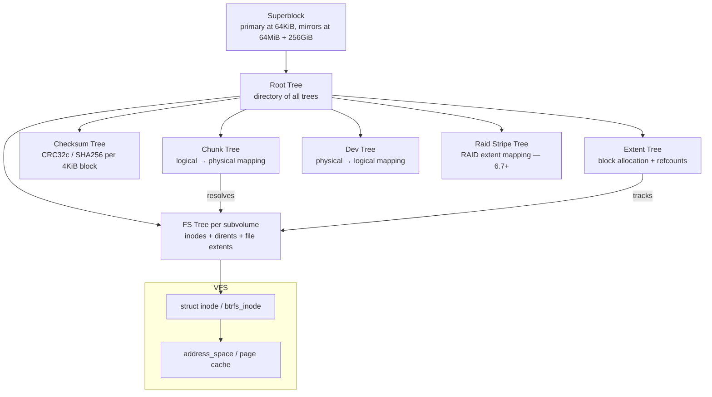
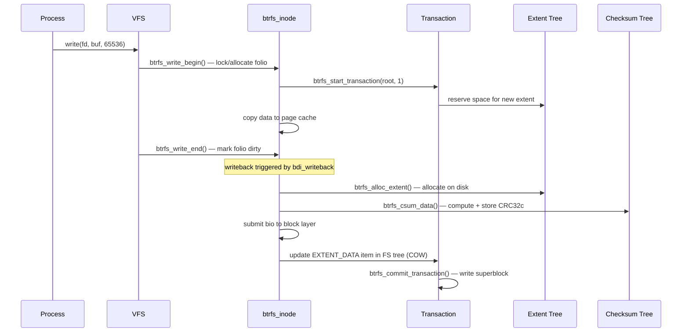

# Btrfs (B-tree Filesystem) Subsystem

> 📘 Plain-language version: [[btrfs-explained]]

## Related Notes

> **See also**: [[fs]] (VFS layer btrfs plugs into), [[vfs]] (dcache, mount API, writeback infrastructure), [[nfs]] (NFS can export btrfs subvolumes).

## Overview

Btrfs ("B-tree filesystem", or "Butter-FS") is a Linux native copy-on-write (COW) filesystem developed jointly by multiple companies and individuals since 2007, merged into mainline at Linux 2.6.29. It is designed around a set of COW B-trees that manage everything from file data to free space to RAID striping — with checksums on all data and metadata, atomic transactions, writable snapshots, dynamic subvolumes, built-in multi-device RAID, and online self-healing (scrub). It is the default filesystem for several Linux distributions (Fedora, openSUSE).

## Mental Model

Every byte on disk — including the filesystem metadata itself — lives inside a **COW B-tree**. Btrfs has not one B-tree but several specialised ones (extent tree, checksum tree, chunk tree, etc.), all anchored by a root tree that the superblock points to. When data changes, btrfs **never overwrites** an existing B-tree block; instead it writes the new version to a freshly allocated location and updates all parent pointers bottom-up to the tree root, and finally atomically writes the new root address into the superblock. A crash at any point leaves the old, consistent tree intact. Snapshots are free: they just create a new root pointer into the same shared tree.

## Architecture



**Reading the diagram**: the superblock is the sole on-disk anchor; it points to the root tree, which contains a directory of all other trees. Every tree access (read or write) goes through the chunk tree for logical-to-physical address translation. File data and metadata live in per-subvolume FS trees. All data and metadata blocks have checksums in the checksum tree.

---

## Core Components

### [[COW B-tree Engine]]

**Purpose** — The B-tree engine is the heart of btrfs. All metadata and (optionally) data is stored in B-trees using the same COW update mechanism. This provides atomic, crash-consistent updates without journaling.

**How it works** — Btrfs uses B+ trees where **internal nodes** contain key-pointer pairs and **leaf nodes** contain key-item pairs with variable-length items packed right-to-left at the end of the leaf. Every node starts with a common header:

```
struct btrfs_header {
    u8      csum[32];        // checksum of the node (minus this field)
    u8      fsid[16];        // filesystem UUID
    __le64  bytenr;          // logical address of this node
    __le64  flags;           // node level, etc.
    u8      chunk_tree_uuid[16];
    __le64  generation;      // transaction generation when last written
    __le64  owner;           // tree ID that owns this node
    __le32  nritems;         // number of items/key-pointers in this node
    u8      level;           // 0 = leaf, >0 = internal
};
```

**COW update path** — When a node needs modification:
1. `btrfs_cow_block()` allocates a new extent via the extent tree.
2. The old block's contents are copied to the new location.
3. The modification is made to the new block.
4. The parent node's key-pointer to the old block is updated to point to the new block — which itself causes the parent to be COW'd, recursively up to the tree root.
5. At transaction commit, the new tree root address is written into the root tree, and the superblock is written atomically.

The old block's reference count in the extent tree is decremented; if it reaches zero it becomes free space.

**Key struct**: `struct btrfs_key` (17 bytes on disk)
- `objectid` (u64) — the object this item belongs to (inode number, tree ID, block group offset, etc.)
- `type` (u8) — item type: `INODE_ITEM (0x01)`, `DIR_ITEM (0x54)`, `EXTENT_DATA (0x6C)`, `EXTENT_ITEM (0xA8)`, etc.
- `offset` (u64) — context-dependent: file offset, item hash, or block group start

**Key struct**: `struct extent_buffer` (`fs/btrfs/extent_buffer.h`)
- The in-memory representation of one B-tree node or leaf.
- Backed by an array of folios (or pages), allowing block sizes larger than the system page size.
- Embedded in an XArray indexed by its logical byte address for fast lookup.
- `eb->start` — logical byte address; `eb->len` — node size (typically 16KiB).

**Key struct**: `struct btrfs_path` (`fs/btrfs/ctree.h`)
- Represents the search result — the path from root to a leaf.
- `nodes[BTRFS_MAX_LEVEL]` — array of `extent_buffer` pointers, one per level.
- `slots[BTRFS_MAX_LEVEL]` — which slot within each node the search reached.
- Used by all tree lookup functions; callers must call `btrfs_release_path()` when done.

**Key functions**:
- `btrfs_search_slot()` — the primary tree lookup; fills a `btrfs_path`
- `btrfs_cow_block()` — COW a node before modification
- `btrfs_insert_item()` / `btrfs_del_item()` — insert or delete leaf items
- `btrfs_tree_read_lock()` / `btrfs_tree_lock()` — per-node locking

---

### [[Transaction Model]]

**Purpose** — Btrfs provides atomic, crash-consistent updates via a generation-based transaction system. Every modification to on-disk state happens within a transaction. At commit, all dirty tree nodes are flushed and the superblock is atomically updated, making the new state visible.

**How it works** — The transaction lifecycle:

1. **Begin**: `btrfs_start_transaction()` returns a `struct btrfs_trans_handle` with the current transaction ID (`transid`). Multiple concurrent writers can share the same open transaction.
2. **Modify**: all COW B-tree updates during the transaction are tagged with the current `transid` in the node header's `generation` field.
3. **Delay writeback**: modified extent buffers go to the `dirty_metadata_bytes` dirty list; they are not written until commit.
4. **Commit**: `btrfs_commit_transaction()`:
   - Runs all delayed references (extent tree ref count updates that were batched).
   - Writes all dirty extent buffers to disk.
   - Writes new root pointers into the root tree.
   - Calls `write_all_supers()` which writes the superblock to all mirrors.
5. **Old generation cleanup**: once the new superblock is durable, old COW'd blocks that are no longer referenced can be returned to free space.

**Generation numbers as integrity anchors** — Every pointer from a parent node to a child node stores the expected generation (`btrfs_key_ptr::generation`). When reading a node, btrfs checks that the node's header `generation` matches the expected value. This detects phantom writes (blocks that were written to the wrong location on disk) without having to re-read and checksum every parent node.

**Key struct**: `struct btrfs_transaction` (`fs/btrfs/transaction.h`)
- `transid` — the transaction sequence number
- `dirty_roots` — list of tree roots modified in this transaction
- `delayed_refs` — batched extent reference count changes
- `state` — `TRANS_STATE_RUNNING`, `TRANS_STATE_COMMIT_PREPARING`, etc.

**Key struct**: `struct btrfs_trans_handle`
- `transid` — the generation this handle belongs to
- `bytes_reserved` — bytes pre-reserved in the space accounting
- `dirty_pages` — pages dirtied via this handle

**Key functions**:
- `btrfs_start_transaction(root, num_items)` — begin; reserves metadata space
- `btrfs_commit_transaction(trans)` — flush and make durable
- `btrfs_end_transaction(trans)` — end without committing (another writer commits)
- `btrfs_join_transaction(root)` — attach to an existing open transaction

---

### [[Multiple B-trees]] (On-disk Tree Taxonomy)

**Purpose** — Different types of metadata have different access patterns and lifetimes. Btrfs uses specialised trees for each, all rooted in the root tree, to allow independent growth and efficient operations.

**Root Tree (tree ID 1)** — The "directory" of all other trees. Contains `ROOT_ITEM` entries for each subvolume and special tree, each storing the tree root's logical address, generation, and level. The superblock points here; every tree lookup starts here.

**Extent Tree (tree ID 2)** — Tracks every allocated byte range on the logical address space. Contains `EXTENT_ITEM` and `METADATA_ITEM` entries storing the size and reference count of each allocated extent, plus **backref** records that trace which tree and which file owns each extent. Used for space accounting, scrub, and repair (backrefs enable finding who owns a corrupt block).

**Chunk Tree (tree ID 3)** — Maps **logical addresses** to **physical addresses** across multiple devices. A `CHUNK_ITEM` record describes one logical stripe: which devices cover it, the stripe size, and the RAID profile. The chunk tree is used by every read/write to translate from VFS file offsets to device offsets. Stored in system block groups (never in data block groups) so it can be found early during mount.

**Device Tree (tree ID 4)** — The reverse of the chunk tree: maps physical addresses back to their logical addresses. Used by the scrub, balance, and device-remove operations that need to enumerate physical extents on a device.

**Checksum Tree (tree ID 7)** — Stores `EXTENT_CSUM` items: a sequence of checksums (default CRC32c; optionally XXHASH64, SHA-256, BLAKE2) covering consecutive 4KiB data blocks. On every read, btrfs looks up the checksum and verifies the data. On corruption detection, btrfs attempts to read a mirror copy.

**FS/Subvolume Trees (tree ID ≥ 5)** — One per subvolume. Contains `INODE_ITEM` (stat data), `DIR_ITEM`/`DIR_INDEX` (directory entries), `EXTENT_DATA` (file content: inline data or pointers to extent tree extents), and `XATTR_ITEM` (extended attributes). Ordinary files and directories live here.

**Free Space Tree (tree ID 10, Linux 4.9+)** — A B-tree representation of free space, replacing the older in-memory free space cache. More reliable after crashes; enabled by `space_cache=v2`. Items are either free space extents (`FREE_SPACE_EXTENT`) or bitmaps (`FREE_SPACE_BITMAP`) for densely fragmented regions.

**Block Group Tree (Linux 6.1+)** — Moves block group items out of the extent tree into their own tree, reducing extent tree size and speeding up mount time on large filesystems.

**Raid Stripe Tree (Linux 6.7+)** — A new tree for tracking the physical stripe layout of RAID extents. Needed for RAID profiles on zoned block devices, where physical placement must follow zone write-pointer constraints. Also enables future RAID 5/6 fixes.

---

### [[Subvolumes and Snapshots]]

**Purpose** — Subvolumes are independently mountable filesystem namespaces within a single btrfs volume. Snapshots are copy-on-write "forks" of a subvolume at a point in time, achieved by sharing extent tree references.

**How subvolumes work** — Each subvolume has its own FS tree in the root tree, with its own root inode. Subvolumes appear as directories in the parent volume but are mounted as independent filesystem roots (`btrfs subvolume create`). Their tree ID is the basis of the `objectid` field in `ROOT_ITEM` keys.

**How snapshots work** — `btrfs_snap_create()` creates a new root tree entry pointing to the *same* FS tree root block as the source subvolume, with the same generation. The snapshot and source immediately diverge: any write to either subvolume COW's the affected B-tree node(s) for that subvolume. Unchanged blocks remain shared — their extent tree reference counts are > 1. No data is physically copied at snapshot creation time; it is O(1).

**Space accounting** — Each extent in the extent tree tracks a reference count plus **backrefs** that identify which subvolumes reference it. The quota system uses this to report:
- `rfer` (referenced): all bytes the subvolume refers to, including shared blocks.
- `excl` (exclusive): bytes only this subvolume references; freeing the subvolume would reclaim exactly this much.

**Send/receive** — `btrfs send` computes the incremental delta between two read-only snapshots by walking both FS trees in parallel and emitting change stream commands. `btrfs receive` replays those commands on a target volume. This is the primary mechanism for efficient incremental backups and filesystem replication.

**Key struct**: `struct btrfs_root` (`fs/btrfs/ctree.h`)
- `node` — the current `extent_buffer` for the tree root
- `root_key` — the key identifying this tree in the root tree
- `root_item` — on-disk `btrfs_root_item` (generation, byte count, root inode)
- `fs_info` — back-pointer to `btrfs_fs_info`
- `inode_lock` / `inode_radix` — inode cache for this subvolume

---

### [[RAID and Multi-device Support]]

**Purpose** — Btrfs has integrated multi-device RAID support without needing a separate device mapper (md/dm) layer. RAID is managed at the chunk level, independently for data and metadata.

**How it works** — The chunk tree describes stripes across devices. When allocating a new block group, btrfs selects RAID parameters and records the physical device list and offsets in a `CHUNK_ITEM`. The profiles are:

| Profile | Copies | Description |
|---|---|---|
| `single` | 1 | No redundancy |
| `DUP` | 2 | Two copies on the same device (SSD error protection) |
| `RAID0` | 0 | Striped, no redundancy |
| `RAID1` | 2 | Mirrored on exactly 2 devices |
| `RAID1C3` | 3 | Mirrored on 3 devices (Linux 5.5+) |
| `RAID1C4` | 4 | Mirrored on 4 devices (Linux 5.5+) |
| `RAID10` | 2 | Striped mirrors (≥4 devices) |
| `RAID5` | — | Parity stripe; **known bugs, not production-safe** |
| `RAID6` | — | Double parity; **known bugs, not production-safe** |

Data and metadata have separate RAID profiles. A typical resilient configuration: `RAID1` for metadata (fast, tolerates one device failure) and `RAID0` or `RAID1` for data depending on the redundancy requirement.

**Scrub** — `btrfs scrub` reads every data and metadata block on the filesystem, verifies checksums against the checksum tree, and (if RAID mirrors exist) repairs corrupted blocks from the good copy. This is btrfs's primary self-healing mechanism.

**Balance** — `btrfs balance` redistributes data across chunk groups. Used to add devices, remove devices, or convert between RAID profiles online.

---

### [[Checksumming and Data Integrity]]

**Purpose** — Btrfs checksums **all** data and metadata, detecting silent corruption (bitrot, firmware bugs, cosmic rays) that traditional filesystems cannot detect.

**How it works** — On every write, btrfs computes a checksum for each 4KiB block and stores it in the checksum tree keyed by the block's logical address. On every read, the checksum is looked up and verified. A mismatch triggers:
1. If only one copy (single, RAID0): I/O error reported.
2. If multiple copies (RAID1, RAID1C3, RAID10): btrfs tries the other copy and, on success, schedules a repair write.

**Checksum algorithms** — Selected at `mkfs` time via `--checksum`:
- `crc32c` (default) — hardware-accelerated on modern CPUs; 4-byte checksum.
- `xxhash` (Linux 5.5+) — 8-byte, faster on CPUs without hardware CRC.
- `sha256` (Linux 5.5+) — 32-byte, cryptographic; resistant to deliberate forgery.
- `blake2b` (Linux 5.5+) — 32-byte, faster than sha256.

**Metadata checksums** — The `btrfs_header.csum` field stores the checksum of the entire node (excluding the checksum field itself). Verified on every read of an extent buffer.

---

### [[Core In-memory Structures]]

**`struct btrfs_fs_info`** (`fs/btrfs/fs.h`) — The single per-mounted-filesystem object. Think of it as the btrfs equivalent of `struct super_block`, but richer. Key fields:
- `tree_root` — the root tree
- `extent_root`, `chunk_root`, `dev_root`, `csum_root` — specialised trees
- `fs_root_cache` — radix tree of cached `btrfs_root` objects (one per subvolume)
- `block_group_cache_tree` — red-black tree of block groups
- `delayed_refs_root` — batched extent reference updates
- `transaction_kthread` — the background commit thread
- `cleaner_kthread` — the background orphan/snapshot cleanup thread
- `compress_type` — default compression algorithm
- `flags` — filesystem flags (`BTRFS_FS_STATE_ERROR`, `BTRFS_FS_QUOTA_ENABLED`, etc.)

**`struct btrfs_inode`** (`fs/btrfs/btrfs_inode.h`) — Embeds `struct inode` plus btrfs-specific fields:
- `root` — the subvolume tree this inode belongs to
- `location` — the `btrfs_key` identifying this inode in the FS tree
- `io_tree` — tracks pending I/O extents and locks
- `extent_tree` — red-black tree of cached file extents
- `flags` — `BTRFS_INODE_COMPRESS`, `BTRFS_INODE_NODATASUM`, `BTRFS_INODE_IMMUTABLE`, etc.
- `delayed_node` — batched inode metadata updates

---

## How Components Interact

### Scenario 1: Writing 64 KiB to a file



### Scenario 2: Creating a snapshot (`btrfs subvolume snapshot src dst`)

1. `btrfs_ioctl_snap_create()` starts a transaction.
2. It reads the source subvolume's `btrfs_root` to find the current FS tree root block address and generation.
3. A new `ROOT_ITEM` is inserted into the root tree pointing to the **same** tree root block — no data is copied.
4. The extent tree reference count on the root block is incremented (it is now shared).
5. The transaction commits. The new snapshot immediately exists as an independent subvolume with no data copy.

### Scenario 3: Scrub detecting and repairing bitrot (RAID1 filesystem)

1. `btrfs scrub start /mnt` triggers `btrfs_scrub_dev()`.
2. The scrub thread reads every extent in each device's address space.
3. For each data extent, it looks up the expected checksum in the checksum tree.
4. On mismatch: btrfs identifies which mirror(s) the extent is replicated on (via backref lookup in the extent tree), reads the mirror, verifies its checksum, and if good, issues a repair write to the corrupt copy.
5. On metadata node mismatch: the `btrfs_header.csum` is checked; corrupt nodes are recovered from the mirror.

---

## Where It Fits in the Kernel

- **↑ Userspace**: btrfs is accessed through standard VFS syscalls plus a set of `ioctl` extensions for btrfs-specific operations: `BTRFS_IOC_SNAP_CREATE`, `BTRFS_IOC_SUBVOL_CREATE`, `BTRFS_IOC_SEND`, `BTRFS_IOC_BALANCE_V2`, `BTRFS_IOC_SCRUB`, `BTRFS_IOC_ENCODED_WRITE`, etc.
- **→ VFS**: btrfs implements all VFS operation tables (`super_operations`, `inode_operations`, `file_operations`, `address_space_operations`). It also implements `export_operations` (for NFS export) and `xattr_handler` (for xattr support).
- **→ Block Layer**: btrfs submits `struct bio` requests to the block layer for physical I/O. Its I/O path uses `struct btrfs_bio` (a wrapper that carries the checksum and stripe information) rather than raw `bio`.
- **→ Writeback / MM**: btrfs integrates with the `bdi_writeback` infrastructure via its `address_space_operations`. `btrfs_writepages()` is called by the BDI writeback worker to flush dirty extents; `btrfs_write_begin()`/`write_end()` bracket buffered writes.
- **← Compression**: btrfs supports transparent compression (zlib, LZO, ZSTD) via the `BTRFS_INODE_COMPRESS` flag. Compression happens in `btrfs_compress_pages()` before writing and `btrfs_decompress_bio()` after reading.
- **← Security (LSM)**: btrfs respects VFS-level LSM hooks (`inode_permission`, `file_open`, etc.) with no btrfs-specific security hooks required.

---

## Design Decisions & Tradeoffs

**Everything-is-a-B-tree** — Unlike ext4/XFS which use different on-disk formats for inodes, directories, and extent trees, btrfs stores all metadata in a unified B-tree framework. This simplifies the COW logic (one update path for everything) but adds overhead: even small directory creates incur B-tree updates in the FS tree, extent tree, and checksum tree. The fragmentation from COW is mitigated by large extents and periodic defragmentation.

**Checksums on all data** — Not just metadata (as in ZFS), but all data blocks too. This catches bitrot at any level. The cost is the extra I/O to the checksum tree on every read and write. The checksum tree can grow large (100 GB data filesystem → ~25 MB checksum tree), but it is accessed sequentially during scrub and cached for random I/O.

**Snapshots at O(1) cost** — Btrfs snapshots are nearly free because they share the underlying B-tree blocks. The cost is deferred: the more divergent the snapshot becomes from the source, the more COW'd blocks exist, and the more work `btrfs balance` must do to reorganize space. Very long-lived snapshots of frequently-written subvolumes can cause significant space amplification.

**RAID 5/6 known defects** — The read-modify-write (RMW) cycle needed for RAID 5/6 parity updates is inherently difficult to make crash-consistent without a journal. Btrfs's RAID 5/6 implementation has not achieved this reliably; the **RAID stripe tree** (Linux 6.7, experimental) is the new infrastructure that will eventually make it safe, but as of 2026 RAID 5/6 is still not recommended for production.

**Delayed references** — Rather than immediately updating the extent tree on every COW, btrfs batches reference count changes in a `delayed_refs` tree and processes them at transaction commit. This amortises the cost of small file operations that would otherwise hammer the extent tree. The downside is that the delayed refs queue can grow large during heavy load, increasing commit time.

---

## How It Has Evolved

- **Linux 2.6.29 (2009)**: Initial merge. COW B-trees, basic checksumming, subvolumes, snapshots.
- **Linux 2.6.31**: Multiple device support, RAID 0/1/10.
- **Linux 3.5 (2012)**: RAID 5/6 added (with known limitations).
- **Linux 3.9 (2013)**: `btrfs send/receive` for incremental backups.
- **Linux 3.14 (2014)**: Online scrub and repair, balance.
- **Linux 4.9 (2016)**: Free space tree (`space_cache=v2`) — persistent B-tree free space accounting replacing the in-memory cache.
- **Linux 5.5 (2020)**: RAID1C3 and RAID1C4 profiles; alternative checksum algorithms (xxhash, sha256, blake2b).
- **Linux 5.10 (2020)**: Zoned block device support (initial).
- **Linux 5.12 (2021)**: RAID on zoned devices (initial, experimental).
- **Linux 5.15 (2021)**: Encoded read/write ioctls for compressed extent I/O without decompression.
- **Linux 6.0 (2022)**: Syslog filesystem state messages; numerous RAID 5/6 reliability improvements.
- **Linux 6.1 (2022)**: Block group tree (`block-group-tree` feature) — moves block groups out of the extent tree, dramatically speeding up mount on large filesystems.
- **Linux 6.2 (2023)**: RAID 5/6 data integrity fix — full read-modify-write with checksum verification before overwrite (RAID 6 still needs work).
- **Linux 6.7 (2024)**: RAID stripe tree (`raid-stripe-tree`) — new tree for logical-to-physical RAID stripe mapping; enables RAID 0/1/10 on zoned devices; foundational for future RAID 5/6 fix.
- **Linux 6.7 (2024)**: Simple quotas (`squota`) — lightweight per-subvolume accounting without the complexity of `qgroups`.
- **Linux 6.9 (2024)**: Block size > page size support (experimental, no direct-IO/RAID56/encoded I/O yet).

---

## Recent Development Activity

- **RAID 5/6 reliability (ongoing)**: The RAID stripe tree introduced in 6.7 provides the infrastructure for a correct RAID 5/6 RMW implementation. Active work by Anand Jain and others on completing the crash-consistency guarantees.
- **Simple quotas (`squota`)**: The traditional `qgroups` system is complex, slow, and fragile. `squota` (6.7+) provides a simpler accounting model that tracks space used per subvolume without the expensive shared/exclusive split. Expected to become the recommended quota system.
- **Large folio support**: Btrfs is being migrated to `read_folio`/`dirty_folio` address_space operations as part of the kernel-wide folio transition. Also working toward supporting block sizes larger than the page size (useful for large NVME devices with 4KiB logical block size but memory configured for 16KiB pages).
- **Direct I/O improvements**: Extending `BTRFS_IOC_ENCODED_WRITE` and improving the direct-I/O path performance.
- **Extent tree scaling**: Large filesystems (PB scale) expose the extent tree as a bottleneck at scrub and balance time. Research ongoing into splitting the extent tree or using the block group tree more aggressively.

---

## Further Reading

1. **[A short history of btrfs — LWN.net (2009)](https://lwn.net/Articles/342892/)** — the design goals and motivations from the initial merge.
2. **[The Btrfs filesystem: An introduction — LWN.net (2012)](https://lwn.net/Articles/576276/)** — accessible three-part series covering COW, extents, and subvolumes.
3. **[Btrfs: Subvolumes and snapshots — LWN.net (2013)](https://lwn.net/Articles/579009/)** — how subvolumes and snapshot sharing work at the B-tree level.
4. **[btrfs: introduce RAID stripe tree — LWN.net (2024)](https://lwn.net/Articles/944631/)** — design of the new RAID stripe tree for zoned devices and future RAID 5/6 fix.
5. **[BTRFS kernel documentation](https://docs.kernel.org/filesystems/btrfs.html)** — official kernel doc overview of features and capabilities.
6. **[Btrfs on-disk format — kernel.org archive](https://archive.kernel.org/oldwiki/btrfs.wiki.kernel.org/index.php/On-disk_Format.html)** — detailed on-disk structures for all tree types, key types, and item types.
7. **[Btrfs status — btrfs.readthedocs.io](https://btrfs.readthedocs.io/en/latest/Status.html)** — current feature stability status; essential before choosing RAID profiles.

---

## LKML Highlights

- **`20240115-raid-stripe-tree-v4-0-d30fb6210db4@kernel.org`** — "btrfs: introduce RAID stripe tree" (Johannes Thumshirn, 2024). The foundational new tree that decouples logical RAID stripe layout from physical device placement, enabling RAID on zoned devices and providing the infrastructure to finally make RAID 5/6 crash-consistent.
- **`20220901-btrfs-block-group-tree-v5-0-b71b9e3c8d08@suse.com`** — "btrfs: add block group tree" (Filipe Manana/David Sterba, 2022). Moves `BLOCK_GROUP_ITEM` records from the extent tree to their own B-tree, reducing extent tree size and mount time on filesystems with many block groups (large SSDs/HDDs at high fill).
- **`20220729-btrfs-simple-quotas-v1-0-7e71e7e3bfa7@google.com`** — "btrfs: simple quotas" (Boris Burkov, 2022). Introduces `squota` as a replacement for the complex and fragile `qgroups` accounting, tracking per-subvolume space usage without expensive backref-walk shared/exclusive accounting.
