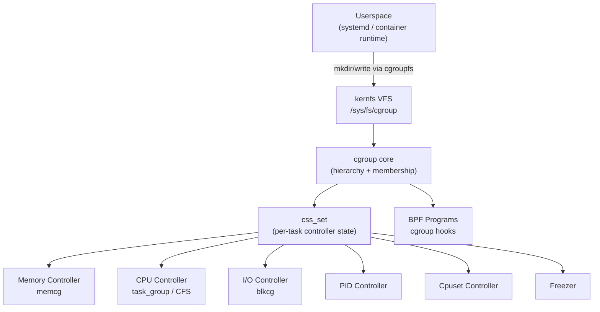

# Control Groups (cgroups) Subsystem

## Overview

Control groups (cgroups) is the kernel mechanism for organizing processes into hierarchical groups and distributing system resources — CPU time, memory, I/O bandwidth, PIDs — among those groups in a controlled and accountable way. The subsystem has two layers: a *core* that manages the hierarchy and process membership, and *controllers* (one per resource type) that enforce limits and share within the tree. Together with namespaces, cgroups form the kernel foundation for Linux containers.

## Mental Model

Think of cgroups as a tree of folders on a filesystem. Each folder is a cgroup. Moving a process into a folder places it under that folder's resource rules. Parent folders bound what children can claim: a child can only distribute what its parent gave it. Every process lives in exactly one leaf folder, and the rules of every ancestor folder apply to it transitively.

## Architecture

The cgroup core manages the directory tree through kernfs and maintains the mapping between tasks and controllers via `css_set`. When a process is forked or migrated, the core updates the `css_set` linkage; individual controllers are called via callbacks to set up or tear down their per-cgroup accounting state.

---

## Core Components

### [[cgroup-core]]

**Purpose** — The cgroup core is the bureaucratic backbone: it maintains the hierarchy of `struct cgroup` nodes, manages which controllers are enabled at each level, and serializes process movements across the tree. Without it, controllers would have no shared notion of which process belongs where.

**How it works** — The hierarchy lives in kernel memory as a tree rooted at `struct cgroup_root`. Each node in the tree is a `struct cgroup`, and its position corresponds to a directory under `/sys/fs/cgroup`. The kernfs layer translates VFS operations (mkdir, write, read) into cgroup operations: `mkdir` calls `cgroup_mkdir()` which allocates a new `struct cgroup`, links it to its parent, and invokes the `css_alloc` callback on each currently-enabled controller so they can allocate per-cgroup state.

When a process is moved (`echo <pid> > cgroup.procs`), `cgroup_attach_task()` runs. It first verifies the **no-internal-process rule**: a non-leaf cgroup (one with active controllers on its subtree_control) may not hold processes directly — this is the key v2 invariant that prevents parent tasks from competing with child-cgroup tasks. After validation, the function finds or creates a `css_set` matching the new controller-state combination, swaps the task's `cgroups` pointer, and updates the linked lists that allow each controller to enumerate all tasks in its cgroup.

Controllers are enabled or disabled per-level by writing to `cgroup.subtree_control`. The core propagates the change downward: if a controller is disabled on a subtree, the corresponding `cgroup_subsys_state` objects are released down the chain; if enabled, `css_alloc` is called afresh for every cgroup in the subtree.

**Key struct**: `struct cgroup` (`include/linux/cgroup-defs.h`)
- `self` — embedded `cgroup_subsys_state` representing the core's own view of this cgroup
- `root` — pointer to the `cgroup_root` owning this hierarchy
- `parent` — pointer to parent cgroup, NULL at root
- `children` — list of child cgroups
- `cset_links` — set of `cgrp_cset_link` records connecting this cgroup to all `css_set`s that have tasks here
- `subtree_control` — bitmask of controllers enabled for direct children
- `kn` — kernfs node backing the filesystem directory
- `flags` — `CGRP_CPUSET_CLONE_CHILDREN` and others

**Key functions**:
- `cgroup_init_early()` — called at boot to create `cgrp_dfl_root` and populate `init_css_set` for pid 1
- `cgroup_mkdir()` — VFS mkdir callback; allocates a new cgroup and invokes `css_alloc` on active controllers
- `cgroup_rmdir()` — removes a cgroup once empty; triggers `css_offline` then `css_free`
- `cgroup_attach_task()` — migrates a task to a new cgroup; updates `css_set`
- `cgroup_subtree_control_write()` — handles writes to `cgroup.subtree_control`; enables/disables controllers recursively

**Config & flags** — `CONFIG_CGROUPS` enables the core. `CONFIG_CGROUP_DEBUG` adds debugging instrumentation. The mount point is `tmpfs`-backed at `/sys/fs/cgroup` (unified v2 hierarchy).

---

### [[css-set-and-subsystem-state]]

**Purpose** — `css_set` is the glue between a task and the resource controllers that govern it. Rather than storing a separate controller-state pointer per task per controller, the kernel shares a single `css_set` among all tasks that belong to the same combination of cgroups. This dramatically reduces memory overhead for large process populations and keeps `fork()` fast.

**How it works** — Every task has a `cgroups` pointer in `task_struct` pointing to a `struct css_set`. The `css_set` contains an array `subsys[CGROUP_SUBSYS_COUNT]` of pointers to `cgroup_subsys_state` (css) objects — one per registered controller plus one for the cgroup core itself. Each `cgroup_subsys_state` is the base class that each controller embeds at the top of its own per-cgroup structure (e.g. `struct mem_cgroup` begins with a `cgroup_subsys_state`).

The sharing works as follows: when two processes live in exactly the same cgroup for every controller, they point to the same `css_set`. When a process moves to a new cgroup, `find_existing_css_set()` looks up a hash table keyed on the new combination of `cgroup_subsys_state` pointers; if a match exists the task gets a reference to that shared `css_set`, otherwise a new one is allocated. Reference counting keeps `css_set` objects alive exactly as long as tasks reference them.

The many-to-many relationship between `css_set` and `cgroup` is tracked through `cgrp_cset_link` nodes: each such node records one (css_set, cgroup) pair and participates in two linked lists — one hanging off the `css_set` and one off the `cgroup` — so that the cgroup core can walk all tasks in a cgroup, and a controller can enumerate all cgroups a `css_set` belongs to.

**Key struct**: `struct css_set` (`include/linux/cgroup-defs.h`)
- `subsys[CGROUP_SUBSYS_COUNT]` — array of `cgroup_subsys_state*`, indexed by subsystem id
- `tasks` — list of tasks using this css_set (for non-threaded mode)
- `cgrp_links` — list of `cgrp_cset_link` nodes, one per cgroup this css_set touches
- `refcount` — reference count; freed when it reaches zero
- `hlist` — hash-table node for O(1) lookup

**Key struct**: `struct cgroup_subsys_state` (`include/linux/cgroup-defs.h`)
- `cgroup` — the cgroup this state belongs to
- `ss` — pointer back to the `cgroup_subsys` descriptor
- `refcnt` — per-cpu reference count for lock-free destruction
- `flags` — `CSS_ONLINE`, `CSS_VISIBLE`, `CSS_DYING`
- `serial_nr` — monotonically increasing ID used for ordering css events

**Key struct**: `struct cgroup_subsys` (`include/linux/cgroup-defs.h`)
- `css_alloc` — callback: allocate per-cgroup state when a cgroup is created
- `css_online` — callback: finalize state after the cgroup appears in the hierarchy
- `css_offline` — callback: begin teardown before the cgroup directory is removed
- `css_free` — callback: release memory after the last reference drops
- `attach` — callback: called when a task is moved into this controller's cgroup
- `fork` / `exit` — hooks for task lifecycle events

**Config & flags** — The subsystem array is populated at compile time by iterating over `#include <linux/cgroup_subsys.h>`. Each controller registers itself with `SUBSYS(name)`.

---

### [[memory-cgroup]]

**Purpose** — The memory controller accounts for and limits the physical memory (anonymous pages, file cache, kernel data structures, swap) consumed by a cgroup's tasks. It enables operators to give containers hard memory ceilings while still providing soft guarantees and reclaim pressure tuning.

**How it works** — Every page of physical memory carries a reference to the `mem_cgroup` that owns it, set at allocation time by `mem_cgroup_charge()`. This per-page charge is the basis for all accounting. The controller tracks usage in a set of per-cpu counters (`memcg_vmstats_percpu`) that are periodically folded into the cgroup's `vmstats` array.

Resource distribution uses a four-tier model, applied bottom-up during reclaim:

- **memory.min** — hard protection: pages in cgroups at or below their `min` limit are exempt from reclaim under all conditions
- **memory.low** — soft protection: the reclaim algorithm deprioritizes these cgroups until all unprotected memory is consumed
- **memory.high** — throttle threshold: tasks that exceed `high` are put to sleep briefly (`mem_cgroup_handle_over_high()`), giving kswapd time to reclaim; no OOM is invoked
- **memory.max** — hard limit: allocation failure triggers direct reclaim; if reclaim cannot free enough pages, the OOM killer is invoked within the cgroup via `mem_cgroup_oom()`

When a process exits, `mem_cgroup_exit()` uncharges its pages. When a cgroup is destroyed, all surviving charges are reparented to the parent cgroup.

The memory controller integrates with the I/O controller: `memory_stat` tracks dirty page ownership per-inode so that writeback debt is attributed to the correct cgroup even if the writing task has since migrated.

**Key struct**: `struct mem_cgroup` (`mm/memcontrol.c`)
- `css` — embedded `cgroup_subsys_state`
- `memory` — `page_counter` for current memory usage and `memory.max` limit
- `swap` — `page_counter` for swap usage
- `high` — soft limit triggering throttle
- `low` / `min` — protection thresholds
- `vmstats` — hierarchical array of memory statistics

**Key functions**:
- `mem_cgroup_charge()` — charges a page to its owning cgroup; called from page fault path
- `mem_cgroup_uncharge()` — reverses a charge at page free
- `mem_cgroup_handle_over_high()` — throttles tasks exceeding `memory.high`
- `mem_cgroup_oom()` — triggers OOM killing within the cgroup scope
- `mem_cgroup_soft_limit_reclaim()` — pressure-based reclaim respecting `memory.low` protections

**Config & flags** — `CONFIG_MEMCG` enables the controller. `CONFIG_MEMCG_SWAP` adds swap accounting. The interface lives at `memory.*` files in the cgroup directory.

---

### [[cpu-cgroups]]

**Purpose** — The CPU controller shapes how much processor time cgroup trees receive. It provides two orthogonal mechanisms: proportional weights for work-conserving fair sharing when CPUs are contested, and bandwidth hard limits for absolute throttling regardless of contention.

**How it works** — The scheduler integrates cgroups through `struct task_group` (one per cgroup), which holds a per-CPU `sched_entity` and `cfs_rq` pair. CFS treats each `task_group` as a scheduling entity that competes with sibling groups; within it, individual task entities compete. This creates a two-level (or deeper, recursively) hierarchy of virtual runtimes that CFS balances.

**Weight-based scheduling**: `cpu.weight` (range 1–10000, default 100) maps to the `task_group.shares` field. When multiple groups compete for a CPU, CFS allocates time in proportion to their shares. Setting a child's weight to 200 and a sibling's to 100 means the first gets roughly twice as much CPU over any long interval. This is work-conserving: if one group is idle, others consume its unused quota.

**Bandwidth control**: `cpu.max` writes a "quota period" tuple. The kernel stores these in `cfs_bandwidth`, a per-`task_group` structure. Each scheduling period, the group is given `quota` nanoseconds of runtime. As tasks run, `cfs_rq.runtime_remaining` is decremented. When it reaches zero, the group is *throttled*: all its `cfs_rq` instances are removed from their per-cpu runqueues. A high-resolution timer fires at period end, restores runtime, and unthrottles the group. CPUs pull runtime from the group's global `cfs_bandwidth.runtime` pool in 5 ms slices to reduce lock contention.

Bandwidth limits are hierarchical in v2: a child's effective quota is the minimum of its own `cpu.max` and the parent's remaining allocation.

**Key struct**: `struct task_group` (`kernel/sched/sched.h`)
- `css` — embedded `cgroup_subsys_state`
- `se[NR_CPUS]` — per-CPU `sched_entity` representing the group in its parent runqueue
- `cfs_rq[NR_CPUS]` — per-CPU runqueue for tasks within this group
- `shares` — current weight value
- `cfs_bandwidth` — bandwidth accounting state

**Key struct**: `struct cfs_bandwidth` (`kernel/sched/sched.h`)
- `quota` — nanoseconds of CPU time allotted per `period`
- `period` — bandwidth replenishment interval (default 100 ms)
- `runtime` — global pool of remaining runtime this period
- `timer` — high-resolution timer for period expiry and refill
- `throttled_cfs_rq` — list of per-cpu runqueues currently throttled

**Key functions**:
- `sched_group_set_shares()` — updates `task_group.shares` and propagates to CFS
- `tg_set_cfs_bandwidth()` — validates and installs a new quota/period pair
- `throttle_cfs_rq()` — dequeues a runqueue when runtime exhausted
- `unthrottle_cfs_rq()` — re-enqueues after the period timer fires
- `distribute_cfs_runtime()` — distributes global pool runtime to per-cpu runqueues

**Config & flags** — `CONFIG_FAIR_GROUP_SCHED` enables weight-based group scheduling. `CONFIG_CFS_BANDWIDTH` enables quota-based throttling. `CONFIG_RT_GROUP_SCHED` covers real-time group scheduling (not yet supported in cgroup v2).

---

### [[io-controller]]

**Purpose** — The I/O controller limits and accounts for block device bandwidth and IOPS consumed by a cgroup, preventing one container from starving others of disk access.

**How it works** — The I/O controller integrates with the block layer through `struct blkcg` and `struct blkcg_gq` (blkg — "block group"). Each cgroup gets one `blkcg`; each (blkcg, request_queue) pair gets a `blkcg_gq` that tracks per-device statistics and scheduling state.

The block layer calls `blkcg_bio_issue_check()` when a BIO is submitted. If the cgroup has an active `io.max` limit, the call delegates to `blk-throttle` which manages per-cgroup token buckets — one for read BPS, write BPS, read IOPS, and write IOPS. If a BIO would exceed the limit, it is placed on a throttle queue and a timer reissues it when the bucket refills.

Weight-based scheduling uses `blk-iocost`, a cost model controller. It assigns a cost to each I/O based on estimated seek and transfer time, then uses a virtual-time scheduler (similar to CFS) to allocate device time proportionally to `io.weight`. Cgroups spending time below their weight accumulate "credit" that can be used in bursts; cgroups exceeding their weight are delayed.

`io.latency` provides workload protection: if a cgroup's average latency exceeds the target, the controller reduces the share of I/O given to other cgroups, not the protected one.

Writeback accounting is jointly managed with the memory controller: dirty pages are tagged with their owning cgroup at `page_mkwrite()` time. The writeback path consults `wb_cgroup_of_inode()` to determine which cgroup's I/O budget to deduct from, ensuring that a process that wrote pages and then migrated still has the writeback charged correctly.

**Key struct**: `struct blkcg` (`block/blk-cgroup.h`)
- `css` — embedded `cgroup_subsys_state`
- `blkg_list` — list of `blkcg_gq` nodes, one per device
- `stats` — per-cgroup aggregated I/O statistics
- `cfqg` / `iocost` — controller-private data pointers

**Key functions**:
- `blkcg_bio_issue_check()` — admission check on BIO submission
- `blk_throtl_bio()` — applies BPS/IOPS limits; queues excess BIOs
- `ioc_rqos_throttle()` — iocost path; may delay BIO based on virtual time
- `cgroup_writeback_by_id()` — selects the writeback worker for a given cgroup

**Config & flags** — `CONFIG_BLK_CGROUP` enables cgroup I/O accounting. `CONFIG_BLK_DEV_THROTTLING` enables `blk-throttle` (io.max). `CONFIG_BLK_CGROUP_IOCOST` enables the iocost cost-model controller.

---

### [[pid-controller]]

**Purpose** — The PID controller limits how many processes (tasks) a cgroup may contain. Its primary use case is preventing fork-bomb denial-of-service inside a container.

**How it works** — The controller is lightweight: `struct pids_cgroup` embeds a `cgroup_subsys_state` and maintains an atomic counter (`pids_current`) and a limit (`pids_limit`). On every `fork()` or `clone()` call, the kernel calls `pids_can_fork()`, which walks up the cgroup hierarchy checking the counter at each level. If any level would be exceeded, the fork returns `-EAGAIN`. The counter is incremented after the fork succeeds and decremented in `pids_release()` when the task exits.

The hierarchical check is the key invariant: a parent's limit encompasses all descendants. Setting `pids.max = 100` on a parent means the sum of tasks in the parent and all its children cannot exceed 100, regardless of per-child limits.

**Key struct**: `struct pids_cgroup` (`kernel/cgroup/pids.c`)
- `css` — embedded `cgroup_subsys_state`
- `pids_current` — atomic count of current tasks in this cgroup and descendants
- `pids_limit` — maximum allowed tasks (`PIDS_MAX` = `PID_MAX_LIMIT` means "no limit")
- `events_limit` — count of times the limit was hit (exposed via `pids.events`)

**Key functions**:
- `pids_can_fork()` — checked before `fork()`; returns `-EAGAIN` if limit would be exceeded
- `pids_cancel_fork()` — rolls back a charge if fork fails after the check
- `pids_release()` — decrements count on task exit

**Config & flags** — `CONFIG_CGROUP_PIDS` enables the controller. The interface files are `pids.max`, `pids.current`, `pids.peak`, and `pids.events`.

---

### [[cpuset-controller]]

**Purpose** — The cpuset controller pins a cgroup's tasks to a subset of CPUs and NUMA memory nodes. On NUMA machines it prevents remote memory accesses that would degrade latency, and it gives HPC and real-time workloads exclusive CPU domains.

**How it works** — The controller stores requested and effective CPU/memory masks in `cpuset` struct per cgroup. The distinction between requested (`cpuset.cpus`) and effective (`cpuset.cpus.effective`) reflects the intersection of the request with the parent's effective set — a child can only use CPUs the parent has been granted.

When `cpuset.cpus` is written, `cpuset_write_resmask()` validates the new mask, computes the effective mask by intersecting with the parent, and calls `cpuset_update_tasks_cpumask()` which iterates all tasks in the cgroup and calls `set_cpus_allowed_ptr()` on each. Memory node changes additionally trigger a migration of pages to the new node set.

The **partition** feature (v2 only) goes further: `cpuset.cpus.partition = root` carves the cpuset's CPUs out of the parent domain entirely, creating an exclusive scheduling domain. This is used for co-location scenarios where one container must have guaranteed isolated CPUs.

**Key struct**: `struct cpuset` (`kernel/cgroup/cpuset.c`)
- `css` — embedded `cgroup_subsys_state`
- `cpus_allowed` — requested CPU mask
- `mems_allowed` — requested memory node mask
- `effective_cpus` — intersection with parent; what tasks actually see
- `effective_mems` — same for memory nodes
- `partition_root_state` — tracks partition root status

**Key functions**:
- `cpuset_write_resmask()` — writes `cpuset.cpus` or `cpuset.mems`; propagates changes
- `cpuset_update_tasks_cpumask()` — applies new effective CPU mask to all tasks
- `cpuset_attach()` — called when a task migrates in; enforces memory migration if needed
- `cpuset_update_active_cpus()` — called by the hotplug path when CPUs go offline

**Config & flags** — `CONFIG_CPUSETS` enables the controller. `CONFIG_NUMA` is required for memory node controls to be meaningful.

---

### [[cgroup-freezer]]

**Purpose** — The cgroup freezer allows operators to suspend all processes in a cgroup atomically, without sending signals. This is used by container runtimes during live migration (checkpointing a frozen group), by job schedulers to pause low-priority batches, and by security tools doing forensic inspection.

**How it works** — The freezer controller exposes a single `cgroup.freeze` knob (v2). Writing `1` initiates a freeze: the kernel sets `CGRP_FREEZE` on the cgroup and calls `css_task_iter_start()` to iterate tasks, sending each a `FREEZE` signal via `cgroup_freeze_task()`. The signal is not a POSIX signal — it uses a kernel-internal mechanism that forces the task into `TASK_FROZEN` state at the next kernel-user boundary.

The state machine has three internal states: `THAWED`, `FREEZING` (some tasks still running), and `FROZEN` (all tasks suspended). The cgroup reports its state in `cgroup.events` (`frozen 1` when fully frozen). Newly forked tasks inside a freezing group inherit the freeze immediately via the `fork` callback.

The freeze is hierarchical: freezing a parent also freezes all descendants. Thawing propagates downward similarly.

In v1, the freezer was a standalone controller with a `freezer.state` file; in v2 it is integrated into the cgroup core via `cgroup.freeze`.

**Key functions**:
- `cgroup_freeze()` — entry point for freeze/thaw operations
- `cgroup_freeze_task()` — forces a specific task into `TASK_FROZEN`
- `cgroup_update_frozen()` — recalculates aggregate frozen state; updates `cgroup.events`

**Config & flags** — `CONFIG_CGROUP_FREEZER` in v1. In v2 the freezer is part of the core (`CONFIG_CGROUPS`).

---

### [[cgroup-bpf]]

**Purpose** — The cgroup BPF subsystem allows eBPF programs to be attached to cgroups to implement custom resource policies, network filtering, device access control, and observability hooks — without modifying kernel code. It replaces several v1 controllers (net_cls, net_prio, devices) with more flexible eBPF equivalents.

**How it works** — BPF programs are attached to a cgroup using `BPF_PROG_ATTACH` with a cgroup file descriptor and a program type. The kernel stores the program reference in the cgroup's `bpf` field. Multiple programs can be attached with configurable `attach_flags` controlling inheritance: `BPF_F_ALLOW_OVERRIDE` allows descendants to replace the program, `BPF_F_ALLOW_MULTI` lets descendants stack additional programs.

At each hook site (e.g. socket creation, device open, network ingress), the kernel calls `BPF_CGROUP_RUN_PROG_*()` macros that walk from the process's cgroup up to the root, invoking all attached programs in order. The walk is implemented with RCU-protected arrays pre-built during attachment to avoid traversing the full hierarchy on every packet.

Common program types include:
- `BPF_PROG_TYPE_CGROUP_SKB` — network packet filtering (replaces net_cls/net_prio)
- `BPF_PROG_TYPE_CGROUP_SOCK` — socket creation control
- `BPF_PROG_TYPE_CGROUP_DEVICE` — device file access control (replaces v1 devices controller)
- `BPF_PROG_TYPE_CGROUP_SYSCTL` — sysctl access control

**Key struct**: `struct cgroup_bpf` (`include/linux/bpf-cgroup.h`)
- `effective[MAX_BPF_ATTACH_TYPE]` — per-attach-type arrays of effective (inherited) programs
- `progs[MAX_BPF_ATTACH_TYPE]` — locally attached programs
- `storages` — per-program local storage references

**Key functions**:
- `cgroup_bpf_prog_attach()` — attaches a BPF program; rebuilds `effective` arrays
- `cgroup_bpf_prog_detach()` — removes a program and rebuilds
- `BPF_CGROUP_RUN_PROG_*()` — fast-path macros called at each hook site

**Config & flags** — `CONFIG_CGROUP_BPF` enables the integration. Programs must be loaded with `bpf()` syscall and attached with `BPF_PROG_ATTACH`.

---

## How Components Interact

### Scenario 1: Forking a New Task Inside a Container

When a process inside a container calls `fork()`, the kernel first calls `pids_can_fork()` — the PID controller increments a tentative counter and checks the cgroup's limit. If allowed, the scheduler clones the `task_group` reference for the new task. The cgroup core's `fork` callback fires: `cgroup_fork()` sets the child's `cgroups` pointer to the parent's `css_set`, incrementing its reference count. After the fork completes, each controller's `fork` callback runs (e.g. memory, cpuset) to copy relevant state. The child is now subject to the same cgroup limits as its parent, but no hierarchy traversal is needed at runtime because the `css_set` pointer provides direct access to all controller states.

### Scenario 2: Container Hits Memory Limit

A task in a container allocates memory, causing a page fault. `do_anonymous_page()` calls `mem_cgroup_charge()`, which calls `try_charge()`. This checks `memory.max` via the page counter: if the usage would exceed the limit, direct reclaim is attempted. If reclaim fails to free enough memory, `mem_cgroup_oom()` is called, which selects a victim task *within the cgroup* (not globally) and sends `SIGKILL`. The OOM event is recorded in `memory.events`. The I/O controller and writeback system run in parallel: dirty pages owned by this cgroup are written back through the normal writeback machinery, but `io.max` limits how fast that I/O proceeds.

### Scenario 3: CPU Throttling Kicks In

A CPU-intensive task runs inside a cgroup with `cpu.max = 500000 1000000` (50% of one CPU per 100 ms). Every time the task is scheduled, CFS calls `account_cfs_rq_runtime()` which decrements `cfs_bandwidth.runtime`. When runtime reaches zero, `throttle_cfs_rq()` removes the cgroup's per-cpu `cfs_rq` from the runqueue and places it on `cfs_bandwidth.throttled_cfs_rq`. No tasks in the group run until the period timer fires (100 ms later), `refill_cfs_bandwidth_runtime()` restores the quota, and `unthrottle_cfs_rq()` requeues the tasks.

## Where It Fits in the Kernel

- **↑ Userspace**: systemd uses cgroups to implement slices and units. Container runtimes (runc, containerd) create cgroup hierarchies via the cgroupfs at `/sys/fs/cgroup`. The `cgroupns` namespace type allows containers to see a rooted sub-hierarchy as their own `/sys/fs/cgroup`.
- **→ [[scheduler]]**: the CPU controller adds `task_group` nodes to CFS, creating a two-level scheduling tree
- **→ [[mm]] / [[memcg]]**: the memory controller integrates tightly with the page allocator, reclaim, writeback, and OOM subsystems
- **→ [[block]]**: the I/O controller sits in the BIO submission path and the writeback path
- **→ [[bpf]]**: the cgroup BPF subsystem provides hook points for eBPF programs to extend policy
- **← Namespaces**: `cgroupns` creates a namespaced view of the cgroup hierarchy for containers
- **↓ Hardware**: cpuset controller directly programs CPU affinity masks via scheduler APIs; memory node masks affect NUMA page allocation

## Design Decisions & Tradeoffs

**Single unified hierarchy (v2)** was the most consequential architectural change. v1 allowed mounting each controller independently, creating separate per-controller hierarchies. This led to a process having a different "position" in each hierarchy — there was no single authoritative answer to "which cgroup does this process belong to?" The v2 unified hierarchy has one answer. The tradeoff was backward compatibility: systemd had to be updated, and many tools assumed v1 semantics.

**No-internal-process rule** prevents non-leaf cgroups from holding tasks directly when controllers are active. This eliminates the "internal competition" problem where a parent's own tasks could compete unfairly against child cgroups. The cost is a slightly more complex directory layout: operators must put tasks in leaf nodes, which sometimes requires creating artificial leaves.

**css_set sharing** was chosen to make `fork()` O(1) in common cases. An alternative would be storing controller state pointers directly in `task_struct`, but that would bloat the task structure by `CGROUP_SUBSYS_COUNT` pointers and make fork proportionally more expensive as more controllers are compiled in. The hash-based sharing is transparent to controllers.

**Delegation model** relies on filesystem DAC permissions rather than a separate privilege system, because cgroups already have a filesystem interface. Unprivileged containers can manage sub-hierarchies by giving a non-root user write access to a subdirectory. This reuses well-understood Unix permission semantics.

**Replacing controllers with BPF** (devices, net_cls, net_prio) was chosen because BPF programs can express arbitrary policies that static controllers cannot. The tradeoff is that operators need BPF tooling (bpftool, libbpf) to configure policy, whereas static controllers were simple file writes.

## How It Has Evolved

- **v1 (2.6.24, 2008)** — Paul Menage's original patch introduced generic cgroup infrastructure plus cpuset, memory, CPU, and I/O controllers as separate per-controller hierarchies
- **kernfs extraction (3.14, 2014)** — Tejun Heo split sysfs into a reusable kernfs layer and ported cgroups to use it, fixing deep VFS locking issues
- **Unified hierarchy prototype (3.16, 2014)** — First version of the unified hierarchy merged as an experiment; cgroup v2 API declared stable in 4.5 (2016)
- **Thread granularity (4.14, 2017)** — "threaded" cgroups allow threads of a process to be in different cgroups within a domain subtree, enabling per-thread resource tracking
- **BPF device controller (5.2, 2019)** — v1 devices controller deprecated in favour of `BPF_PROG_TYPE_CGROUP_DEVICE`
- **Pressure Stall Information (4.20, 2018)** — `cpu.pressure`, `memory.pressure`, `io.pressure` added, exposing PSI metrics per-cgroup for fine-grained saturation monitoring
- **cgroup freezer integrated into core (5.2, 2019)** — v2 freeze/thaw moved from a separate controller to `cgroup.freeze` in the core interface
- **iocost controller (5.4, 2019)** — Replaced the older cfq-based I/O scheduler integration with a cost-model controller offering better hierarchy support

## Recent Development Activity

- **cgroup namespace delegation hardening** — ongoing work to ensure unprivileged container managers cannot escape their hierarchy view
- **CPU isolation improvements** — integrating `cpuset.cpus.partition` with the IRQ affinity and timer subsystems for better RT isolation
- **Memory controller overhead reduction** — per-cpu charging optimizations to reduce the cost of `mem_cgroup_charge()` in high-fork-rate workloads
- **BPF cgroup program composition** — extending `BPF_F_ALLOW_MULTI` semantics to support more complex program stacking and conflict resolution

## Further Reading

1. [Control Group v2 — kernel.org](https://www.kernel.org/doc/html/latest/admin-guide/cgroup-v2.html) — official reference; definitive on interface semantics
2. [Understanding the new control groups API — LWN.net](https://lwn.net/Articles/679786/) — accessible walkthrough of v2 differences
3. [The past, present, and future of control groups — LWN.net](https://lwn.net/Articles/574317/) — Tejun Heo's retrospective on v1 mistakes and v2 goals
4. [The unified control group hierarchy in 3.16 — LWN.net](https://lwn.net/Articles/601840/) — explains the single-hierarchy design decision
5. [CPU cgroup (v1 vs v2) — kernel-internals.org](https://kernel-internals.org/sched/cpu-cgroup/) — detailed bandwidth control walkthrough
6. [Add eBPF hooks for cgroups — LWN.net](https://lwn.net/Articles/697462/) — original BPF cgroup patch discussion
7. [Thread-level management in control groups — LWN.net](https://lwn.net/Articles/656115/) — threaded cgroup design rationale

## LKML Highlights

- **`20131119211802.GA5183@htj.dyndns.org`** (Unified hierarchy v2) — Tejun Heo's cover letter introducing the unified hierarchy, articulating the four fundamental problems with v1; the thread became the design document for cgroup v2
- **`20141003215716.GA14336@htj.dyndns.org`** (kernfs extraction) — discussion of pulling cgroup's filesystem layer into a standalone kernfs module, resolving VFS locking issues that had plagued v1 controllers
- **`20160603205658.GA28048@htj.dyndns.org`** (v2 declared stable) — announcement that the unified hierarchy API was production-ready in kernel 4.5, with notes on the remaining v1→v2 migration work
