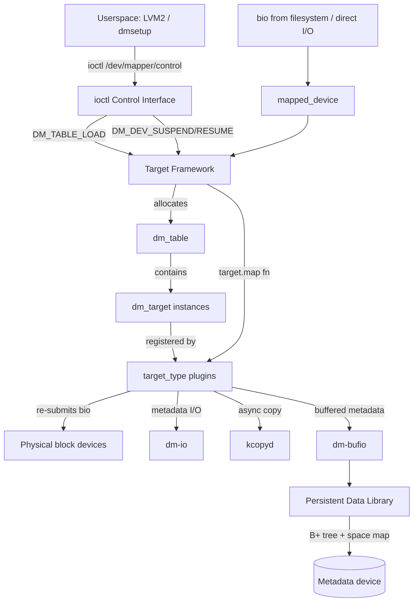
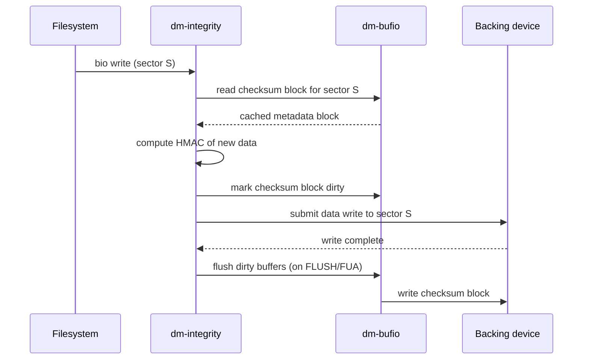

# Device Mapper Subsystem

> 📘 Plain-language version: [[device-mapper-explained]]

## Overview

Device mapper (DM) is a kernel framework for mapping physical block devices onto higher-level virtual block devices. It decouples the logical identity of a block device from its physical layout, allowing the kernel to transparently apply transformations — encryption, striping, mirroring, thin provisioning, integrity checking — as I/O flows through a layered stack. Every LVM logical volume, dm-crypt volume, and software RAID array exposed to userspace is a device-mapper device underneath.

## Mental Model

Think of device-mapper as a programmable block-device pipeline. Each virtual device is described by a **table**: a list of row entries specifying which target plugin handles each sector range. A target is a loaded module (a `target_type`) that receives a `bio`, does whatever it needs to (remapping sectors, encrypting bytes, consulting a snapshot store), and re-submits the modified `bio` downstream. Stacking is natural: a thin-provisioned LV can sit on top of a mirrored LV which sits on top of a striped LV — each is a separate device-mapper device whose table references the one below.

## Architecture



The diagram shows three parallel concerns: **control plane** (ioctl → table management), **data plane** (bio → target → physical device), and **service plane** (dm-io, kcopyd, dm-bufio, persistent-data used internally by targets).

---

## Core Components

### [[target-framework]]

**Purpose** — The target framework is the plugin contract that makes device-mapper extensible. Any module that wants to create a new type of virtual block device implements the `target_type` interface and registers it with `dm_register_target()`.

**How it works** — When a table is loaded via `DM_TABLE_LOAD`, the kernel walks each row, looks up the named `target_type` (e.g. `"linear"`, `"crypt"`, `"thin"`), and calls its constructor (`ctr`) with the row's argument string. The constructor allocates a `dm_target` and populates it with per-instance private state. From that point on, every `bio` that falls within the target's sector range is passed to its `map` function.

The `map` function is the core of a target's runtime behaviour. It inspects the bio, may remap its `bi_bdev` and `bi_iter.bi_sector`, may clone it, may queue it internally, or may return an error. Its return value tells the DM core what to do next:

- `DM_MAPIO_SUBMITTED (0)` — bio has been submitted; DM core does nothing more
- `DM_MAPIO_REMAPPED (1)` — bio was remapped in-place; DM core resubmits it
- `DM_MAPIO_REQUEUE (2)` — push the bio back for retry
- `< 0` — error; terminate the bio

Suspend and resume hooks (`presuspend`, `postsuspend`, `preresume`, `resume`) allow targets to flush in-flight work and restore it cleanly across a table reload, which is how LVM can resize an LV online without dropping I/O.

**Key struct**: `target_type` (`include/linux/device-mapper.h`)
- `name` — string key used in the table row, e.g. `"linear"`
- `version[3]` — major/minor/patch for ABI checks
- `ctr` — constructor: parse args, allocate `dm_target->private`
- `dtr` — destructor: free private state
- `map` — bio mapping function; the hot path
- `end_io` — completion handler for I/Os that need post-processing
- `status` — report target-specific status to `dmsetup status`
- `message` — handle control messages from userspace
- `iterate_devices` — enumerate backing devices (used for queue merging)
- `io_hints` — advertise geometry constraints (sector size, alignment) to blk layer

**Key struct**: `dm_target` (`include/linux/device-mapper.h`)
- `table` — back-pointer to the enclosing `dm_table`
- `type` — pointer to the registered `target_type`
- `begin`, `len` — sector range this target handles
- `private` — opaque pointer to per-instance target state
- `error` — set by constructor on failure

**Key functions**:
- `dm_register_target()` / `dm_unregister_target()` — module lifecycle
- `dm_table_add_target()` — called during `DM_TABLE_LOAD` for each row
- `dm_map_bio()` — the per-bio dispatch that calls `target->type->map()`

**Config & flags** — `CONFIG_BLK_DEV_DM` enables the device-mapper core. Each target type has its own Kconfig symbol (e.g. `CONFIG_DM_CRYPT`, `CONFIG_DM_THIN_PROVISIONING`).

---

### [[ioctl-control-interface]]

**Purpose** — Device-mapper's control plane is entirely userspace-driven. The kernel exposes a single character device (`/dev/mapper/control`) through which all device creation, table loading, and status queries happen via ioctl. This keeps device configuration completely in userspace policy (LVM2, dmsetup), while the kernel enforces the mapping.

**How it works** — The kernel registers a misc device at open time. All 14 DM ioctls share the same `dm_ioctl` header:

```c
struct dm_ioctl {
    uint32_t version[3];   /* interface version */
    uint32_t data_size;    /* total ioctl data including this struct */
    uint32_t data_start;   /* offset to payload after this struct */
    uint32_t target_count; /* number of dm_target_spec entries */
    int32_t  open_count;   /* number of current openers */
    uint32_t flags;        /* DM_READONLY_FLAG, DM_SUSPEND_FLAG, ... */
    uint32_t event_nr;     /* for DM_DEV_WAIT */
    uint64_t dev;          /* device major:minor */
    char     name[128];    /* device name under /dev/mapper/ */
    char     uuid[129];    /* stable UUID set at creation */
};
```

The **dual-table architecture** is the most important design decision: each device always has two table slots, *active* and *inactive*. The typical update workflow is:

1. `DM_TABLE_LOAD` — populate the inactive slot without touching the active table or any live I/O
2. `DM_DEV_SUSPEND` — pause the device; drain in-flight I/O
3. `DM_DEV_RESUME` — atomically swap inactive → active, destroying the old active table, then resume I/O

This is a multi-step transaction with safe rollback: if the new table is wrong, `DM_TABLE_CLEAR` discards the inactive slot without ever interrupting I/O. LVM uses this sequence constantly for online resize, snapshot creation, and pvmove.

The `DM_DEV_SUSPEND` ioctl with `DM_SUSPEND_FLAG` clear (i.e. resume mode) does the table swap atomically: it checks whether an inactive table is present and, if so, promotes it to active before releasing the suspend. This means userspace can pre-load a table during device operation and the kernel holds it pending a single resume call.

**Key ioctls**:
- `DM_VERSION` — version negotiation
- `DM_DEV_CREATE` / `DM_DEV_REMOVE` — lifecycle
- `DM_TABLE_LOAD` / `DM_TABLE_CLEAR` — inactive table management
- `DM_DEV_SUSPEND` — suspend + optional resume (table swap)
- `DM_TABLE_STATUS` / `DM_DEV_STATUS` — operational status
- `DM_DEV_WAIT` — block until next significant event (used by LVM for monitoring)

**Key struct**: `dm_target_spec` — describes one mapping row:
- `sector_start` — logical sector offset in the device
- `length` — number of sectors
- `target_type[16]` — e.g. `"linear"`, `"crypt"`
- (followed by null-terminated arg string at `next` offset)

**Config & flags** — `DM_READONLY_FLAG` loads the table read-only. `DM_SECURE_DATA_FLAG` zeroes any kernel buffer holding ioctl data after the call completes (used by dm-crypt to avoid key leaks).

---

### [[dm-io]]

**Purpose** — `dm-io` provides a thin, low-level I/O submission layer that device-mapper targets use for their own metadata and data copying needs, distinct from the user I/O path. Without it, each target would need to duplicate synchronous and async block I/O plumbing.

**How it works** — A caller creates an `io_client` with `dm_io_client_create()`, specifying how many pages of I/O it expects to perform concurrently. The client holds a mempool sized accordingly, so I/O against metadata devices can always make progress without waiting for the page allocator.

All I/O is described by two structures. `io_region` names a device, starting sector, and sector count. `dm_io_request` bundles the operation type (read/write), an `io_notify` callback (for async), and a memory descriptor:

- **Page-list mode** — scatter-gather list of `struct page *` with an offset into the first page
- **Bio-vector mode** — pre-assembled `bvec_array`, useful when redirecting a portion of an existing bio to a different device
- **Vmalloc mode** — contiguous virtual memory, for large metadata reads without page-by-page allocation

For synchronous calls, `dm_io()` with a NULL callback blocks until all regions complete. The error return is a **bitmask** where bit *i* indicates failure of region *i* — critical for write-to-multiple-regions (e.g. mirroring) where individual region failures must be reported separately.

**Key struct**: `dm_io_request` (`drivers/md/dm-io.h`)
- `bi_op`, `bi_op_flags` — `REQ_OP_READ` / `REQ_OP_WRITE` etc.
- `mem.type` — `DM_IO_PAGE_LIST`, `DM_IO_BIO_VEC`, `DM_IO_VMA`
- `mem.ptr` — union holding the respective buffer descriptor
- `notify.fn` / `notify.context` — async completion callback

**Key functions**:
- `dm_io_client_create(num_pages)` — allocate client with page pool
- `dm_io_client_destroy(client)` — release
- `dm_io(request, num_regions, regions, sync_error_bits)` — submit I/O

---

### [[kcopyd]]

**Purpose** — `kcopyd` is an asynchronous copy engine for block data. Snapshot creation, mirror resync, and cache population all need to copy large amounts of data between devices without blocking the I/O path. kcopyd runs jobs through a kernel workqueue so these operations happen concurrently with normal I/O.

**How it works** — A target creates a `kcopyd_client` with `dm_kcopyd_client_create()`. When it needs data copied, it calls `dm_kcopyd_copy()` with a source `dm_io_region`, up to eight destination regions, and a completion callback. kcopyd then:

1. Allocates pages from the client's private mempool (avoiding contention with the page allocator under memory pressure)
2. Issues an async read from the source via `dm_io`
3. On read completion, fans out async writes to all destination regions simultaneously
4. On all writes completing, invokes the caller's callback with a bitmask of per-destination errors

Large transfers (above `SUB_JOB_SIZE`, originally 128 sectors, now tunable) are automatically split into sub-jobs. Each sub-job runs independently; `segment_complete()` tracks how many segments remain and fires the top-level callback only when all complete. This pipeline design means kcopyd keeps the storage bus busy without ever holding pages for the entire transfer in memory simultaneously.

**Key struct**: `kcopyd_job` (internal to `drivers/md/dm-kcopyd.c`)
- `source` — `dm_io_region` to read from
- `dests[KCOPYD_MAX_REGIONS]`, `num_dests` — write destinations
- `pages` — page pool slice for this job
- `read_err`, `write_err` — bitmask errors for read and each write
- `fn` — caller's completion callback

**Key functions**:
- `dm_kcopyd_client_create()` / `dm_kcopyd_client_destroy()` — lifecycle
- `dm_kcopyd_copy(client, src, num_dests, dests, flags, fn, context)` — submit
- `dm_kcopyd_zero(client, num_dests, dests, flags, fn, context)` — zero-fill destinations (used by thin provisioning to zero new blocks)

**Config & flags** — `CONFIG_DM_KCOPYD` is selected automatically by any target that uses it. The `KCOPYD_IGNORE_ERROR` flag causes kcopyd to continue with remaining destinations even if one fails (used by mirroring to keep a degraded mirror alive).

---

### [[persistent-data-library]]

**Purpose** — Multiple device-mapper targets (thin provisioning, dm-cache, dm-era) need to persist complex metadata on a block device: mappings from virtual blocks to physical blocks, snapshot exception tables, reference counts. The persistent-data library provides a shared, transactional metadata framework so each target doesn't have to implement its own B-tree and transaction journal.

**How it works** — The library is structured in three layers:

**Block manager** (`dm-block-manager.c`) — the lowest layer. It manages a cache of fixed-size blocks (4 KiB by default) on a metadata device, with read/write locking per block. Clients obtain a `dm_block *` with `dm_bm_read_lock()` or `dm_bm_write_lock()` and release it with `dm_bm_unlock()`. Most clients never use this directly; the transaction manager wraps it.

**Transaction manager** (`dm-transaction-manager.c`) — enforces copy-on-write semantics. Writable access to a block is possible only by *shadowing* (allocating a new block, copying the old content, returning a write-locked handle to the new block) or *allocating* a fresh block. Within a single transaction, shadowing is elided: if you shadow a block that was already allocated in this transaction, the transaction manager returns the same block, avoiding double allocation. A `commit()` call flushes all written blocks to disk and then updates the superblock atomically, leaving the on-disk metadata consistent even if power is cut before the next commit.

**Space maps** (`dm-space-map*.c`) — track block reference counts and handle allocation. There are two variants: a simple flat array for data devices (where thin-provisioned data blocks live) and a self-describing space map for metadata devices (which must track its own blocks inside the space it manages). The metadata space map uses a B-tree internally so it can resize without moving the root.

**B+ tree** (`dm-btree.c`) — the primary key-value container. Keys are 64-bit integers; values are arbitrary-length byte arrays. Nesting is supported by having values themselves be B-tree roots, enabling multi-level lookups. Thin provisioning maps `(device_id, virtual_block)` → `physical_block` using a two-level nested B-tree: the outer tree maps device IDs to inner-tree roots; the inner tree maps virtual blocks to physical block addresses.

The transaction model mirrors a traditional database: between commits, all modifications accumulate in shadow blocks. If userspace crashes without a commit, the on-disk metadata is still consistent at the last committed state; the in-progress shadow blocks are simply abandoned (and their space reclaimed at next open, via the repair path).

**Key structs** (`drivers/md/persistent-data/`):
- `dm_block_manager` — manages block cache and locking
- `dm_transaction_manager` — holds a `dm_block_manager` plus shadow tracking
- `dm_space_map` — interface for allocating/freeing blocks, reference-counted
- `dm_btree_info` — describes a tree: key count per level, value size, comparison function

**Key functions**:
- `dm_tm_create()` — create a transaction manager over a block manager
- `dm_tm_commit()` — flush to disk and update superblock
- `dm_btree_insert()`, `dm_btree_lookup()`, `dm_btree_remove()` — tree operations
- `dm_sm_new_block()` — allocate a block via the space map

---

### [[dm-bufio]]

**Purpose** — `dm-bufio` is a simple buffer cache specifically for device-mapper targets that need to read and write on-disk metadata using the kernel's page allocator but cannot use the standard page cache (which is tied to `address_space` objects belonging to inodes). dm-integrity uses it to cache its checksum journal; the new-snapshot implementation uses it for exception store blocks.

**How it works** — A target creates a `dm_bufio_client` by specifying the block device, block size, and maximum number of buffers. `dm_bufio_read()` returns a `dm_buffer *` for the requested block number, reading from disk on a miss and returning the cached buffer on a hit. The returned buffer is pinned until the caller calls `dm_bufio_release()`.

On write, the caller modifies the buffer's data area (obtained via `dm_bufio_get_block_data()`) and marks it dirty with `dm_bufio_mark_buffer_dirty()`. The client periodically writes dirty buffers asynchronously (similar to writeback in the page cache). `dm_bufio_write_dirty_buffers()` forces a synchronous flush.

The cache uses LRU eviction for clean buffers and write-back for dirty ones. Crucially, because dm-bufio is separate from the page cache, its buffers are not subject to memory pressure from filesystem activity — metadata I/O for dm-integrity doesn't compete with page cache LRU.

**Key struct**: `dm_bufio_client` (`drivers/md/dm-bufio.c`)
- `bdev` — the metadata block device
- `block_size` — fixed buffer size (power of 2, ≥ 512)
- `cache_size` — maximum number of buffers to hold
- `dirty_write_list` — buffers awaiting writeback

**Key functions**:
- `dm_bufio_client_create(bdev, block_size, ...)` — create a client
- `dm_bufio_read(client, block)` — read or return cached buffer
- `dm_bufio_new(client, block)` — allocate buffer without reading (for fresh blocks)
- `dm_bufio_mark_buffer_dirty(buf)` — schedule write-back
- `dm_bufio_write_dirty_buffers(client)` — synchronous flush

---

## Notable Targets

Device-mapper ships a large library of targets. The most widely used:

| Target | Purpose | Key mechanism |
|---|---|---|
| `linear` | Concatenate sectors across devices | trivial sector offset math |
| `striped` | Stripe I/O across N devices | sector → stripe chunk → device |
| `mirror` | Synchronous write mirroring | kcopyd for resync, dm-io for writes |
| `snapshot` / `snapshot-origin` | COW snapshots | exception store (COW device) |
| `thin` / `thin-pool` | Thin provisioning | persistent-data B-tree mapping |
| `cache` | SSD-tier caching | hit/miss routing, policy modules |
| `crypt` | Block-level encryption | kernel Crypto API (see [[dm-crypt]]) |
| `integrity` | Per-sector HMAC checksums | dm-bufio journal (see [[dm-integrity]]) |
| `verity` | Read-only integrity verification | Merkle tree hash check |
| `multipath` | I/O failover across paths | path group priority + health check |
| `raid` | MD RAID integration | delegates to md layer |
| `vdo` | Dedup + compression | UDS index + compression streams |
| `zoned` | Zoned block device support | maps sequential write zones |

---

## How Components Interact

### Scenario 1: LVM creates a new thin LV

1. LVM2 calls `DM_TABLE_LOAD` with an inactive table row: `"0 <sectors> thin /dev/mapper/pool <device_id>"`.
2. The thin target's `ctr` is called. It looks up the pool device (an already-active `thin-pool` mapped device), calls `get_pool_device()`, and stores the reference in its private state.
3. LVM2 calls `DM_DEV_SUSPEND` then `DM_DEV_RESUME`, which atomically promotes the inactive table to active.
4. A `write(2)` on the new LV issues a bio. `dm_map_bio()` dispatches it to the thin target's `map()`.
5. The thin target queries the persistent-data B-tree for the virtual block. On a miss (unprovisioned block), it calls `dm_pool_alloc_data_block()`, which allocates a physical block via the space map and inserts a new B-tree entry.
6. The bio's `bi_iter.bi_sector` is remapped to the physical block, and the bio is re-submitted to the thin-pool's backing device.
7. At the next commit boundary (FLUSH or 1-second timer), the transaction manager calls `dm_tm_commit()`, persisting the new mapping atomically.

### Scenario 2: Online LV resize (pvmove)

1. LVM2 starts a `mirror` device covering the old and new PVs.
2. The mirror target uses kcopyd to copy the old PV's data to the new PV in background segments.
3. LVM2 polls `DM_TABLE_STATUS` waiting for the mirror sync to complete.
4. Once synced, LVM2 loads a new `linear` table pointing only to the new PV and swaps it in with suspend/resume. I/O never stops.

### Scenario 3: dm-integrity per-sector checksum



---

## Where It Fits in the Kernel

- **↑ Userspace**: LVM2 and dmsetup issue ioctls to `/dev/mapper/control`. Applications read/write `/dev/mapper/<name>` like any block device.
- **→ [[block]]**: DM devices are registered as `gendisk` / `block_device` objects. Bios from filesystems or direct I/O arrive via `submit_bio()` and are dispatched through blk-mq before reaching the DM core's `dm_make_request()`.
- **→ [[kernel-crypto-api]]**: dm-crypt calls `crypto_alloc_skcipher()` / `crypto_skcipher_encrypt()` per bio segment.
- **→ [[dm-crypt]]**, **→ [[dm-integrity]]**: DM provides the plumbing; these targets implement the security transforms.
- **← filesystems**: ext4, XFS, btrfs treat `/dev/mapper/foo` as a plain block device; they have no awareness of the DM stack below.
- **↓ Hardware**: DM remaps bios and re-submits them to real block devices (`nvme`, `sd`, etc.), which interact with the actual hardware.

## Design Decisions & Tradeoffs

**Pluggable target model over hardcoded logic** — Early Linux storage management (md RAID) hardcoded every configuration. DM was designed from the start (2003) with a `target_type` plugin interface so that encryption, snapshotting, and RAID could be added without touching the core. The cost is some dispatch overhead per bio; the benefit is that new storage features (dm-vdo, dm-zoned) can be merged as modules without core changes.

**Dual-table design for zero-downtime reconfiguration** — The inactive/active table pair means table reloads never require stopping I/O. The alternative would be locking out all I/O during configuration changes, which is unacceptable for production storage. The tradeoff is kernel memory holding two full tables per device simultaneously, which is negligible for the typical number of DM devices.

**Separate persistent-data library** — Before thin provisioning (2012), every target (snapshot, mirror) implemented its own on-disk metadata format, leading to duplicated B-tree and transaction logic. The persistent-data library consolidated this. The tradeoff is that its B-tree format is more complex than targets need individually, but the shared transaction model means metadata consistency bugs are fixed once and benefit all users.

**dm-bufio separate from page cache** — Using the page cache for metadata would be simpler but would tie dm-integrity's checksum pages to inodes and subject them to normal memory pressure. dm-bufio's private LRU avoids this at the cost of a second buffer cache in the system.

**ioctl over netlink** — DM predates netlink becoming the preferred kernel-userspace interface for complex configuration. A 2008 RFC proposed a netlink alternative, but it was not adopted because the ioctl interface was already stable and widely deployed. This is a frozen design decision; LVM2 still uses ioctls.

## How It Has Evolved

- **2.6.0 (2003)** — Initial merge of device-mapper core with linear, striped, snapshot, and mirror targets.
- **2.6.6 (2004)** — dm-crypt merged: block-level encryption via kernel Crypto API.
- **2.6.9 (2004)** — multipath merged: I/O failover across multiple paths to the same storage target.
- **3.2 (2012)** — Thin provisioning and persistent-data library merged; dm-cache followed in 3.9. This was the largest structural addition to DM since the original merge.
- **3.10 (2013)** — dm-era (tracks which blocks were written during an era, for cache migration decisions).
- **4.6 (2016)** — dm-integrity merged: per-sector HMAC checksums with dm-bufio journal.
- **4.16 (2018)** — dm-writecache for persistent-memory write acceleration.
- **5.2 (2019)** — dm-clone for non-destructive live migration between backing devices.
- **5.15 (2021)** — dm-vdo merged: inline deduplication and compression target from Permabit (acquired by Red Hat).
- **6.x (ongoing)** — dm-ima integration for IMA measurement of table loads; zone management improvements; vdo stabilisation.

## Recent Development Activity

- **dm-vdo tuning**: The vdo target is actively being tuned for performance and memory consumption after its initial merge.
- **Zone append support**: Work to support ZNS (Zoned Namespace NVMe) devices properly through DM, where targets need to handle zone-append semantics.
- **dm-ima**: Integration with the [[ima]] subsystem to cryptographically attest the state of device-mapper tables, relevant for measured boot and confidential computing.
- **Multipath improvements**: Ongoing work on faster path failure detection and switchover latency.

## Further Reading

1. [Device Mapper kernel docs](https://www.kernel.org/doc/html/latest/admin-guide/device-mapper/index.html) — official admin guide covering all targets
2. [device-mapper ioctl interface (LWN, 2003)](https://lwn.net/Articles/35077/) — original ioctl design discussion
3. [Persistent data (kernel docs)](https://static.lwn.net/kerneldoc/admin-guide/device-mapper/persistent-data.html) — persistent-data library design
4. [Thin provisioning (kernel docs)](https://www.kernel.org/doc/html/latest/admin-guide/device-mapper/thin-provisioning.html) — thin/thin-pool architecture
5. [Device Mapper Resource Page (sourceware.org)](https://sourceware.org/dm/) — historical design documents, mailing list
6. [dm-vdo (LWN, 2022)](https://lwn.net/Articles/931401/) — dedup/compression target merge discussion
7. [Device Mapper Wikipedia](https://en.wikipedia.org/wiki/Device_mapper) — high-level overview with notable applications
8. [dm-integrity (LWN)](https://lwn.net/Articles/517381/) — integrity target design

## LKML Highlights

- **`[LWN.net] Device-mapper submission 3/7` (2003)** — the original DM merge submission. Alasdair Kergon's cover letter explains the target-plugin model and why a framework was preferable to hardcoded storage types. Message thread at LWN Articles/12729.
- **`[RFC PATCH] dm-csum` (2008)** — an early proposal for per-sector integrity (LWN Articles/334527). The debate around whether integrity belongs in the filesystem or the block layer foreshadowed dm-integrity's eventual design.
- **`Documentation/device-mapper/cache.txt` (2013)** — the dm-cache submission (LWN Articles/540996) contains detailed discussion of the hit/miss policy module interface and why the policy was made pluggable.
