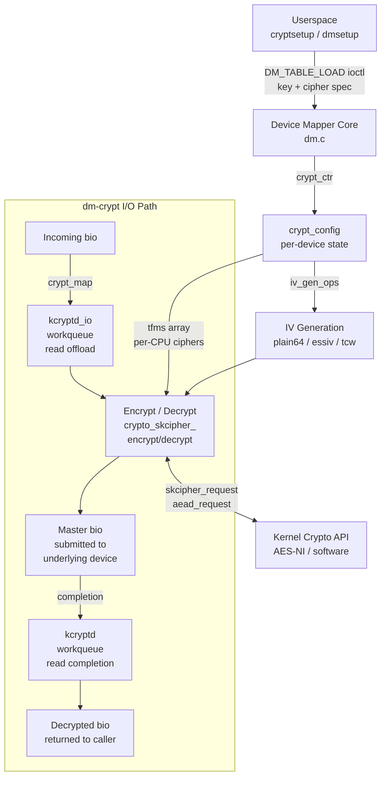

# dm-crypt — Block-Layer Transparent Encryption Subsystem

## Overview

dm-crypt is a Device Mapper target (`drivers/md/dm-crypt.c`) that provides transparent, sector-level encryption for block devices. It intercepts all I/O between filesystems and underlying storage, encrypting writes and decrypting reads using the [[kernel-crypto-api]]. Any filesystem can sit on top of a dm-crypt device without modification, making it the standard mechanism for full-disk encryption on Linux — used by LUKS, cryptsetup, and systemd-cryptsetup.

The kernel handles only the encryption and I/O mechanics. Key derivation, header management, and format negotiation are handled entirely in userspace by `cryptsetup`, which then hands the raw key material to the kernel via the Device Mapper `ioctl` interface.

## Mental Model

Think of dm-crypt as a **transparent encryption lens** placed between the block device and everything above it. A write request that reaches dm-crypt carries plaintext pages; dm-crypt encrypts each page against a sector-derived IV and forwards ciphertext to the real device. A read request does the reverse: ciphertext arrives from disk, decryption happens in a completion handler, and plaintext surfaces to the caller. Nothing above dm-crypt (the VFS, the filesystem, applications) knows or cares that encryption is happening — the virtual device `/dev/mapper/foo` behaves identically to an unencrypted block device.

## Architecture

The Device Mapper core creates a `crypt_config` for each encrypted device. On I/O, `crypt_map()` is the entry point: write bios get queued immediately to the `kcryptd` workqueue for encryption before submission; read bios are submitted to the underlying device first and decryption is deferred to a completion callback on the `kcryptd` workqueue (to avoid running crypto in interrupt context).

---

## Core Components

### [[dm-crypt-crypt-config]]

**Purpose** — `crypt_config` is the per-device singleton that holds everything dm-crypt needs for the lifetime of an encrypted volume: the master key, cipher handles, IV strategy, memory pools, and workqueue references. It is allocated during `crypt_ctr()` (the constructor called when `dmsetup create` runs) and freed only when the device is removed.

**How it works** — When userspace calls `DM_TABLE_LOAD`, the Device Mapper core invokes `crypt_ctr()` with the table line arguments (cipher spec, key, IV offset, backing device). `crypt_ctr()` parses the cipher string — which can be in legacy form (`aes-xts-plain64`) or the CAPI form (`capi:xts(aes)-plain64`) — and allocates one `crypto_skcipher` transform handle *per online CPU*, stored in `cc->tfms`. Per-CPU handles eliminate lock contention: each encryption worker thread picks the transform for its current CPU.

The master key is stored directly in `cc->key`, a `u8` array. Key size depends on the cipher: AES-256-XTS needs 64 bytes (two 256-bit keys). After setup, `crypt_setkey()` pushes the key material into each per-CPU transform handle and then wipes the staging buffer. For AEAD modes, a parallel array `cc->tfms_aead` holds the authenticated cipher handles.

Two mempools are attached to `cc`: `cc->req_pool` supplies `crypt_io` objects (minimum 256) and `cc->page_pool` supplies bounce pages for encryption. Mempools ensure that even under memory pressure, a minimum number of in-flight I/Os can always be allocated without risking deadlock.

**Key struct**: `struct crypt_config` (`drivers/md/dm-crypt.c`)
- `cc_cipher_string` — raw cipher spec from dmsetup table line
- `tfms` — per-CPU `crypto_skcipher *` array for skcipher I/O
- `tfms_aead` — per-CPU `crypto_aead *` array for AEAD mode
- `key[0]` — flexible master key bytes (variable length, at end of struct)
- `key_size` — byte count of key
- `iv_offset` — sector number added to logical sector before IV computation
- `iv_gen_ops` — vtable of IV-generation function pointers
- `kcryptd_io` / `kcryptd` — workqueue handles for I/O offload and crypto
- `req_pool` / `page_pool` — mempools for allocation under pressure

**Key functions**:
- `crypt_ctr()` — constructor; parses cipher, allocates transforms and pools
- `crypt_dtr()` — destructor; zeroes key material, destroys transforms
- `crypt_setkey()` — pushes key into all per-CPU cipher handles

**Config & flags** — `CRYPTO_TFM_REQ_MAY_SLEEP` passed to crypto allocation; `cc->flags` tracks optional behaviours set by table arguments.

---

### [[dm-crypt-crypt-io]]

**Purpose** — `crypt_io` is the per-bio work unit that carries an I/O request through the dm-crypt pipeline. Each incoming bio gets one `crypt_io` allocated from the mempool, tracking the request's state from queueing through crypto completion to final bio submission.

**How it works** — `crypt_map()` is the Device Mapper `map()` callback invoked for every incoming bio. It allocates a `crypt_io` from `cc->req_pool` and embeds the `struct work_struct` that allows the I/O to be queued on the kcryptd workqueues.

For **write bios**, `crypt_map()` queues `dm_crypt_write_io_submit()` work on `cc->kcryptd`. The worker calls `crypt_convert()` which loops through each page segment of the bio, sets the sector-based IV, and calls `crypto_skcipher_encrypt()`. Encrypted pages are accumulated into a new bio targeting the underlying device. After all segments are processed, the encrypted bio is submitted.

For **read bios**, the flow splits: `crypt_map()` immediately submits the *plaintext read* bio to the underlying device (no work queued yet). The bio's `end_io` callback — `crypt_endio()` — fires on completion. If the read succeeded, `crypt_endio()` queues a `crypt_io` work item on `cc->kcryptd` for decryption. The worker calls `crypt_convert()` again, but now with `crypto_skcipher_decrypt()`. Decrypted pages are returned to the original caller's bio.

This asymmetric path exists because decryption *must not* run in interrupt context (where `crypto_skcipher_decrypt()` may sleep for hardware accelerators), but encryption for writes can be done synchronously in the submitter's context when `no_write_workqueue` is set.

**Key struct**: `struct crypt_io` (`drivers/md/dm-crypt.c`)
- `cc` — pointer back to owning `crypt_config`
- `base_bio` — the original bio from the caller
- `work` — `struct work_struct` for queuing on kcryptd
- `error` — accumulated error code across multi-segment encryption
- `ctx` — embedded `convert_context` for the skcipher request state

**Key functions**:
- `crypt_map()` — Device Mapper `map()` callback; entry point for all bios
- `crypt_endio()` — read completion callback; queues decryption work
- `crypt_convert()` — loops through bio segments, calling encrypt or decrypt per page

**Config & flags** — `same_cpu_crypt` table option forces encryption to run on the submitter CPU rather than dispatching to the workqueue, reducing latency for latency-sensitive workloads at the cost of fairness.

---

### [[dm-crypt-iv-generation]]

**Purpose** — Sector-level encryption requires a unique initialization vector (IV) per sector. Without per-sector IVs, an attacker who observes two sectors with the same ciphertext can deduce they contain identical plaintext — a traffic analysis leak. The IV generation component maps each sector number to a cryptographically appropriate IV value.

**How it works** — `crypt_config.iv_gen_ops` is a small vtable of function pointers selected at construction time based on the IV mode name in the cipher string. Before encrypting or decrypting each sector, `crypt_convert()` calls `iv_gen_ops->generator()` to populate the IV buffer.

**plain64** is the simplest mode: `iv_plain64_gen()` writes the 64-bit sector number (logical sector + `iv_offset`) directly into the IV buffer as a little-endian integer. It is fast, but the predictable IV means that an attacker who moves sectors around can detect sector reuse — the "watermarking attack". `plain64` is the recommended mode for XTS ciphers, because XTS's tweak mechanism provides the sector-isolation property that plain64 IVs otherwise lack.

**essiv** (Encrypted Salt-Sector Initialization Vector) was the historically safe choice for CBC mode. `iv_essiv_gen()` computes `E(hash(master_key), sector_number)` — the sector number is encrypted under a secondary key derived from a hash of the master key. This prevents the watermarking attack because the IV is no longer predictable without knowing the master key. However, essiv adds a per-sector AES encryption overhead on top of the block cipher, making it slower than plain64. With the adoption of AES-XTS (which has its own tweak-based isolation), essiv became unnecessary for new deployments.

**tcw** (TrueCrypt-compatible Whitening) was introduced for backward compatibility with TrueCrypt volumes. It applies per-sector whitening to the plaintext before CBC encryption. Rarely needed for new volumes.

The recommended modern cipher suite — **AES-256-XTS with plain64** — neatly sidesteps most IV pitfalls: XTS inherently isolates sectors via its tweak value, so a simple counter IV is safe, and AES-NI hardware makes the per-sector cost negligible.

**Key struct**: `struct crypt_iv_operations` (embedded in `dm-crypt.c`)
- `ctr` — cipher-string parsing; sets up any IV-mode-specific state
- `dtr` — teardown
- `init` — called after key is loaded; e.g., essiv derives its encryption key here
- `wipe` — clears IV state on key wipe
- `generator` — populates IV for the current sector

**Key functions**:
- `iv_plain64_gen()` — writes sector number as LE64 into IV
- `iv_essiv_gen()` — encrypts sector number under `E(H(key))`
- `iv_tcw_gen()` — TrueCrypt-compatible whitening IV

**Config & flags** — `iv_offset` in the table line shifts the sector counter, allowing dm-crypt to be placed at an arbitrary offset within a larger device without IV collision with an adjacent encrypted volume.

---

### [[dm-crypt-crypto-api-integration]]

**Purpose** — dm-crypt is a *consumer* of the [[kernel-crypto-api]], not a crypto implementation. Its crypto integration layer selects the right API surface (skcipher vs. AEAD), allocates per-CPU transform objects, handles asynchronous completion, and ensures correct key loading and memory lifecycle.

**How it works** — The Kernel Crypto API exposes two relevant abstract interfaces for dm-crypt:

**`crypto_skcipher`** is the standard symmetric cipher interface, supporting all length-preserving modes (CBC, XTS, etc.). `crypt_alloc_tfms()` allocates one transform handle per CPU, using `crypto_alloc_skcipher(cc->cipher_string, ...)`. The cipher string selects a specific algorithm implementation from the crypto engine registry — e.g., `xts(aes)` will resolve to the AES-NI accelerated XTS implementation on x86 if available, or fall back to the generic software implementation. Crucially, AES-NI operates in kernel mode without SIMD context save/restore overhead, making AES-XTS encryption nearly free on modern hardware (typically under 5% throughput reduction vs. raw device).

**`crypto_aead`** is used when an AEAD cipher is specified (e.g., `capi:gcm(aes)-random`). AEAD modes encrypt and simultaneously compute an authentication tag over each sector. The tag is stored out-of-band using **dm-integrity** as the backing integrity store — dm-crypt creates the per-sector authentication tag and passes it to dm-integrity via `bio_integrity_payload`. On read, if the tag fails verification, dm-integrity returns `-EIO` instead of silently serving potentially tampered data. This combination (dm-crypt + dm-integrity with an AEAD cipher) provides **authenticated disk encryption** — the strongest guarantee, detecting any bit-flip attack on the ciphertext.

Async completion is handled by attaching a `skcipher_request` or `aead_request` (allocated per I/O from `cc->req_pool`) as the crypto operation, with the `crypt_io` work struct as the callback data. If the crypto hardware signals it needs to run asynchronously (returns `-EINPROGRESS`), the kernel fires the callback when hardware completes; otherwise, the transform completes synchronously.

**Key struct**: `struct skcipher_request` (kernel crypto API, `include/crypto/skcipher.h`)
- `tfm` — pointer to the per-CPU transform handle
- `src` / `dst` — `scatterlist` pointers to input and output pages
- `iv` — pointer to the sector-derived IV buffer
- `cryptlen` — number of bytes to encrypt in this call

**Key functions**:
- `crypt_alloc_tfms()` — allocates per-CPU skcipher handles
- `crypt_alloc_tfms_aead()` — allocates per-CPU AEAD handles
- `crypto_skcipher_encrypt()` / `crypto_skcipher_decrypt()` — encrypt/decrypt one sector
- `crypto_aead_encrypt()` / `crypto_aead_decrypt()` — authenticated encrypt/decrypt

**Config & flags** — `CRYPTO_ALG_ASYNC` flag controls whether asynchronous operation is preferred. `submit_bio` flags `REQ_CRYPT` (internal) mark bios already processed to avoid double encryption.

---

### [[dm-crypt-workqueue-io-path]]

**Purpose** — The workqueue I/O path decouples the encryption/decryption work from the submitter's execution context. Without it, decryption would run inside the block layer's completion interrupt, where sleeping is prohibited and per-CPU SIMD context may not be saved — both fatal for the crypto API.

**How it works** — Two workqueues serve different roles:

`cc->kcryptd_io` is a high-priority unbound workqueue used solely for dispatching read bios to the underlying device. The separation from crypto work means that even when the crypto thread pool is saturated, new reads can still reach the disk promptly.

`cc->kcryptd` is the main workqueue handling both encryption (for writes) and decryption (for reads post-completion). Workers call `crypt_convert()` which loops through bio segments. Per-CPU transform handles eliminate inter-CPU locking during this loop.

**Historical context**: Early dm-crypt (2003) used a single global `kcryptd_workqueue` and ran all encryption/decryption through it. This caused severe performance problems on multi-core systems because a single ordered workqueue serialized all crypto work. Subsequent versions introduced per-device unbound workqueues, allowing the kernel scheduler to balance work across CPUs automatically.

**The Cloudflare problem (2020)**: On NVMe SSDs, the queuing overhead itself became the bottleneck. Each bio passed through up to **four queue levels** before reaching the device: (1) `kcryptd` workqueue, (2) crypto API async queue, (3) block plug/merge, (4) hardware queue. Cloudflare measured a 7× throughput reduction vs. raw device, contrasted with 5% expected from the cipher alone. Their fix — the `force_inline` path — allowed synchronous in-line processing, bypassing the workqueue entirely. This was upstreamed in **kernel 5.9** as the `no_read_workqueue` and `no_write_workqueue` table options.

**Key functions**:
- `kcryptd_queue_crypt()` — queues encryption/decryption work on `kcryptd`
- `kcryptd_io_read()` — dispatches read bio to underlying device via `kcryptd_io`
- `kcryptd_crypt()` — workqueue function; calls `crypt_convert()` then submits result

**Config & flags**:
- `no_read_workqueue` — process read decryption synchronously in submitter context
- `no_write_workqueue` — process write encryption synchronously in submitter context
- `same_cpu_crypt` — bind encryption to the submission CPU (older option, superseded)
- `high_priority` — elevate workqueue thread priority (useful for latency-sensitive storage)

---

### [[dm-crypt-key-management]]

**Purpose** — dm-crypt must receive the raw encryption key before it can service I/O. Key management covers how keys are passed from userspace to kernel, how the kernel protects them in memory, and how keyring-based key derivation allows TPM-bound or trusted keys to never appear in plaintext userspace memory.

**How it works** — The simplest mechanism is direct hex key specification in the `dmsetup` table line: `... aes-xts-plain64 <hex_key> 0 /dev/sda 0`. The hex string is parsed by `crypt_decode_key()` into `cc->key` during `crypt_ctr()`. This approach is insecure if the table line is logged or visible in `/proc/*/maps`, so it is typically used only for testing or with keys derived externally.

The production path uses the **kernel keyring**. The table line specifies a keyring reference: `... aes-xts-plain64 :64:logon:my_key_id 0 /dev/sda 0`. The colon prefix tells `crypt_ctr()` to call `crypt_get_keyring_key()`, which calls `request_key(&key_type_logon, "my_key_id", NULL)` to retrieve the key from the current process keyring. Supported key types are `logon` (kernel session key), `user` (user keyring), `trusted` (TPM-backed), and `encrypted` (userspace-encrypted, kernel-decrypted using a master key). Trusted and encrypted key types mean the raw AES key never appears in userspace memory — only in kernel memory, in the `crypt_config`.

`cryptsetup` manages the higher-level **LUKS2** format entirely in userspace. LUKS2 stores per-volume metadata in a JSON header: cipher spec, segment layout, keyslot definitions, and integrity parameters. Each keyslot contains the volume master key encrypted by a passphrase-derived key. Key derivation uses either **PBKDF2** or **Argon2id** (memory-hard, GPU-resistant), tuned to ~1 second derivation time on the target machine. The anti-forensic technique **AFsplitter** splits the master key into stripes so that securely erasing any keyslot's stripe area cryptographically destroys that key access path without affecting others.

After derivation, `cryptsetup` decrypts the master key in userspace and writes it into the kernel either via the direct hex path or via `add_key(KEY_SPEC_USER_KEYRING, ...)` for keyring-based flows.

**Key struct**: `struct key` (`include/linux/key.h`, kernel keyring)
- `type` — `&key_type_logon` / `&key_type_trusted` etc.
- `payload` — opaque payload; accessed via `key_payload_reserve()` / `key->payload.data`

**Key functions**:
- `crypt_get_keyring_key()` — resolves keyring reference to raw key bytes
- `crypt_setkey()` — loads raw bytes into per-CPU cipher handles, then zeros staging buffer
- `crypt_wipe_key()` — securely zeros `cc->key` using `memzero_explicit()`

**Config & flags** — Key type prefix in the table line selects the retrieval mechanism. `trusted` and `encrypted` key types require `CONFIG_TRUSTED_KEYS` and `CONFIG_ENCRYPTED_KEYS` respectively.

---

## How Components Interact

### Write path: encrypting a filesystem write

A filesystem calls `submit_bio()` for a dirty page. The Device Mapper core calls `crypt_map()` with the bio. `crypt_map()` allocates a `crypt_io` from `cc->req_pool`, embeds a `work_struct`, and queues it on `cc->kcryptd` (or processes it inline if `no_write_workqueue` is set). The kcryptd worker calls `crypt_convert()` which iterates bio segments. For each 512-byte (or `sector_size`-byte) sector, it calls `cc->iv_gen_ops->generator()` to compute the IV from the sector number, then calls `crypto_skcipher_encrypt()` with a `skcipher_request` pointing to input and output scatter-gather lists. Encrypted pages are accumulated into a new bio that targets the underlying device. When all sectors are encrypted, the new bio is submitted via `dm_submit_bio_remap()`. The original bio completes from within `crypt_endio()` after the underlying device acknowledges the write.

### Read path: decrypting storage I/O

A filesystem calls `submit_bio()` for a read. `crypt_map()` immediately submits the read bio to the underlying block device without any crypto work — the ciphertext must arrive from disk before decryption can start. The bio's `end_io` is set to `crypt_endio()`. When the disk completes the read, `crypt_endio()` fires (in softirq / completion context). It queues `crypt_io` work on `cc->kcryptd`. The kcryptd worker calls `crypt_convert()` with `crypto_skcipher_decrypt()`. Decrypted pages land in the original bio's pages. The bio is then completed, and the filesystem's page cache sees clean plaintext.

### AEAD integrity check

When dm-crypt is configured with an AEAD cipher (`capi:gcm(aes)-random`) and stacked atop dm-integrity, each sector write generates an authentication tag. `crypt_convert()` calls `crypto_aead_encrypt()` instead of `crypto_skcipher_encrypt()`. The resulting tag is attached to the bio via `bio_integrity_payload` and stored by dm-integrity in a separate on-disk journal. On read, `crypto_aead_decrypt()` verifies the tag against the ciphertext. If verification fails (tampered data), dm-integrity returns `-EIO` to the block layer, which propagates as an I/O error to the filesystem — ensuring that tampering is detected rather than silently surfacing corrupted plaintext.

---

## Where It Fits in the Kernel

- **↑ Userspace**: `cryptsetup` / `dmsetup` load the crypt target via `DM_TABLE_LOAD` ioctl. Keys may also arrive via `add_key()` syscall into the session keyring. `/etc/crypttab` drives `systemd-cryptsetup` at boot.
- **→ [[kernel-crypto-api]]**: dm-crypt is a pure consumer of the Crypto API. It calls `crypto_alloc_skcipher()` / `crypto_alloc_aead()` and delegates all cipher work to the Crypto API's algorithm registry, which transparently selects hardware (AES-NI, ARMv8 Crypto Extensions) or software implementations.
- **→ [[device-mapper]]**: dm-crypt is one Device Mapper target among many. The DM core provides the `bio` routing infrastructure, the target plugin interface (`struct target_type`), and the `dmsetup` configuration mechanism.
- **→ [[dm-integrity]]**: When AEAD mode is active, dm-crypt writes per-sector authentication tags via `bio_integrity_payload`. dm-integrity stores and verifies these tags independently.
- **→ [[kernel-keyring]]**: For keyring-based key loading, dm-crypt calls `request_key()` to retrieve trusted or encrypted keys from the session keyring, enabling TPM-backed key storage.
- **← Filesystems**: ext4, XFS, Btrfs and any other filesystem submit plain bios and receive decrypted data back — they are unaware of the encryption layer.
- **↓ Block layer**: dm-crypt submits transformed bios to the underlying block device (`/dev/sda`, `/dev/nvme0n1`, etc.) via the standard block I/O submission path.

---

## Design Decisions & Tradeoffs

**Block-level vs. file-level encryption**: dm-crypt encrypts every byte including filesystem metadata (inodes, directory entries, free space bitmaps). This eliminates metadata leakage but also means the filesystem cannot encrypt different directories with different keys — a single master key covers the entire volume. [[fscrypt]] (filesystem-level encryption) trades that metadata opacity for per-directory key granularity. The design choice was to keep dm-crypt simple and filesystem-agnostic; fscrypt handles the multi-user case.

**Deniable encryption (plain mode)**: dm-crypt can be used without a LUKS header — the raw disk contains only ciphertext with no identifying magic. This provides *deniable* encryption: an attacker cannot prove the device is encrypted at all. The cost is that there is no key slot management, no integrity checking, and no recovery path if the key is lost. Plain mode is niche but important for threat models where even acknowledging that encryption is in use is dangerous.

**Workqueue vs. synchronous I/O**: The original design queued all crypto work through workqueues to avoid blocking in interrupt context and to allow I/O ordering optimization for HDDs. On NVMe SSDs, workqueue context-switching added latency that swamped the AES cost. The `no_read_workqueue` / `no_write_workqueue` flags (kernel 5.9) let operators bypass the workqueue entirely. The default was not changed because HDD workloads still benefit from the ordering, and the flags introduce a tradeoff (slightly more CPU usage on the submission path).

**AEAD authenticated mode**: Standard dm-crypt provides confidentiality but not integrity — an attacker can flip bits in the ciphertext and the decrypted plaintext will be corrupted in a predictable way (AES-XTS is malleable). The dm-crypt + dm-integrity AEAD combination provides full authenticated encryption but doubles the storage I/O because dm-integrity must maintain a journal and integrity data area. This makes it unsuitable for performance-critical storage but appropriate for high-assurance environments.

**Per-CPU transform handles**: Allocating one `crypto_skcipher` per CPU eliminates mutex contention on the transform state but multiplies memory usage by the number of CPUs. On a 256-core machine with AES-256-XTS (each transform holds state and key schedule), this is significant but acceptable relative to the encryption key's security value.

---

## How It Has Evolved

- **2.5 (2003)**: Christophe Saout introduced dm-crypt as a Device Mapper target, replacing the ad-hoc `loop` + `cryptoloop` approach. Core design: single global workqueue, CBC-mode AES, sector-number IVs.
- **2.6.10 (2004)**: ESSIV IV mode added to prevent watermarking attacks against CBC mode.
- **2.6.20 (2007)**: LRW mode support.
- **2.6.24 (2008)**: XTS mode support — the modern recommended cipher mode.
- **3.x**: Per-device unbound workqueues replaced the global queue, improving multi-core throughput.
- **4.12 (2017)**: dm-integrity target introduced, enabling AEAD authenticated encryption when stacked with dm-crypt.
- **5.x**: Kernel keyring support for `trusted` and `encrypted` key types, enabling TPM-backed key storage without plaintext keys in userspace.
- **5.9 (2020)**: `no_read_workqueue` and `no_write_workqueue` flags upstreamed from Cloudflare's work, resolving the NVMe performance regression.
- **5.17+**: `sector_size` option allows larger encryption units (up to 4096 bytes), matching filesystem block sizes to reduce per-sector overhead.

---

## Recent Development Activity

- **dm-inlinecrypt**: A newer target (`dm-inlinecrypt`, landing in 6.x) routes encryption to hardware inline encryption engines (present on many mobile SoCs and NVMe controllers) rather than software crypto, eliminating CPU overhead entirely. It is positioned as a long-term complement or replacement for dm-crypt on hardware that supports it.
- **LUKS2 token plugins**: `cryptsetup` increasingly supports pluggable token handlers (FIDO2, TPM2 via systemd, smart cards) that bind volume decryption to hardware presence rather than a passphrase alone.
- **Integrity + hibernation**: Encrypted hibernation (`CONFIG_ENCRYPTED_HIBERNATION`) is an active area: standard hibernation writes plaintext kernel state to swap, bypassing dm-crypt. Properly encrypting and authenticating the hibernation image requires coordination between the pm core and dm-crypt's key state.

---

## Further Reading

1. [dm-crypt — The Linux Kernel documentation](https://www.kernel.org/doc/html/latest/admin-guide/device-mapper/dm-crypt.html) — authoritative parameter reference
2. [kernel-internals.org: dm-crypt](https://kernel-internals.org/security/dm-crypt/) — design rationale and architecture walkthrough
3. [Cloudflare: Speeding up Linux disk encryption](https://blog.cloudflare.com/speeding-up-linux-disk-encryption/) — deep analysis of the workqueue bottleneck and the upstream fix
4. [Authenticated Boot and Disk Encryption on Linux — LWN](https://lwn.net/Articles/870194/) — Poettering's proposal for TPM-bound authenticated disk encryption
5. [dm-integrity — LWN](https://lwn.net/Articles/517381/) — the companion integrity target that enables AEAD authenticated encryption
6. [device mapper crypt target — LWN original (2003)](https://lwn.net/Articles/42000/) — historical post introducing dm-crypt
7. [ArchWiki: dm-crypt/Device encryption](https://wiki.archlinux.org/title/Dm-crypt/Device_encryption) — practical configuration reference

## LKML Highlights

- **2003-07 (Christophe Saout)**: Original dm-crypt introduction — evaluates kthread vs. semaphore vs. workqueue models; workqueue chosen for brevity and elegance. Established the fundamental asymmetry: write-encrypt inline, read-decrypt in worker. (See `lwn.net/Articles/42000/`)
- **2020 (Cloudflare)**: `[dm-crypt: add flags to bypass workqueue]` — measured 7× throughput loss on NVMe due to workqueue overhead; introduced `no_read_workqueue` / `no_write_workqueue`. Key insight: the workqueue made sense for HDD I/O ordering but is pure overhead on queue-depth NVMe. Upstreamed in 5.9.
