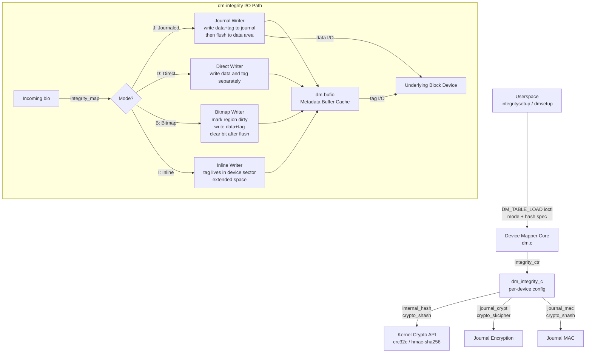
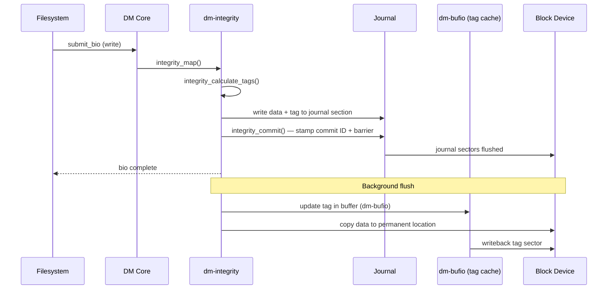

# dm-integrity — Block-Layer Data Integrity Subsystem

> 📘 Plain-language version: [[dm-integrity-explained]]

## Overview

dm-integrity is a [[device-mapper]] target (`drivers/md/dm-integrity.c`) that attaches a per-sector integrity tag to every block written to disk. It solves a specific problem that neither dm-verity nor dm-crypt alone addresses: detecting silent data corruption on a *writable* device while guaranteeing that the data sector and its tag are always atomically consistent, even across a crash. The target is also the mandatory backing store when dm-crypt operates in AEAD mode — dm-crypt generates the per-sector authentication tags and dm-integrity persists them.

## Mental Model

Think of dm-integrity as a **checksum ledger** placed between a filesystem and raw storage. Every 512-byte (or larger) sector on the real device is paired with a small tag — a CRC, an HMAC, or an AEAD authentication code. When data is written, the tag is computed and the pair is committed together via a journal. When data is read, the tag is fetched and the computation is verified; a mismatch returns `-EIO` rather than silently serving corrupted data. The journal's job is to ensure the ledger entry and the data are never left in a half-written state.

## Architecture



The Device Mapper core constructs a `dm_integrity_c` for each device. Every incoming bio passes through `integrity_map()`, which selects a code path based on the configured mode. Integrity tag metadata is buffered via **dm-bufio**; actual tag reads and writes go through that cache rather than directly to disk. When dm-crypt is stacked above dm-integrity, dm-crypt generates the tag and attaches it via `bio_integrity_payload` rather than dm-integrity computing it internally.

---

## Core Components

### [[dm-integrity-device-config]]

**Purpose** — `dm_integrity_c` is the per-device singleton that holds everything dm-integrity needs for the lifetime of a volume: the operating mode, hash algorithm handles, journal parameters, bitmap state, and memory pool references. It is allocated in `integrity_ctr()` (the Device Mapper constructor invoked by `dmsetup create`) and freed only when the device is torn down.

**How it works** — `integrity_ctr()` parses the device mapper table line, which specifies at minimum the backing device, the data offset (number of reserved sectors at the front), the tag size in bytes, and optional keyword arguments. From the tag size and the configured `block_size`, `integrity_ctr()` computes the layout: how many data sectors fit per interleave chunk, how many tag area sectors are required, and what the journal size should be.

If `internal_hash` is specified, `integrity_ctr()` allocates a `crypto_shash` transform (e.g., `crc32c` or `hmac(sha256)`) that will be used on every write to compute the tag and on every read to verify it. If `journal_crypt` or `journal_mac` are specified, additional `crypto_skcipher` and `crypto_shash` transforms are allocated for protecting journal entries themselves — this prevents an attacker from learning sector addresses from unencrypted journal entries.

A `dm_bufio_client` is opened against the tag area of the underlying device. All accesses to the on-disk tag region go through dm-bufio's LRU cache, so hot tag regions (e.g., frequently accessed superblock or metadata for small files) stay in memory and only cold regions flush to disk.

**Key struct**: `struct dm_integrity_c` (`drivers/md/dm-integrity.c`)
- `dev` — the underlying block device handle
- `start` — offset in sectors to the dm-integrity data (after reserved sectors)
- `tag_size` — bytes per sector tag
- `sector_size` — logical sector size (default 512)
- `sectors_per_block` — `block_size / sector_size`
- `mode` — operating mode: `'D'`, `'J'`, `'B'`, `'I'`, or `'R'`
- `internal_hash_alg` — name of the hash/HMAC algorithm
- `journal_sections` — count of journal sections
- `provided_data_sectors` — total usable data sectors (read from superblock)
- `bufio` — `dm_bufio_client *` for the tag region
- `commit_ids` — per-journal-section commit ID tracking

**Key functions**:
- `integrity_ctr()` — constructor; parses table line, opens crypto, initialises bufio
- `integrity_dtr()` — destructor; flushes journal, closes bufio, frees crypto handles
- `integrity_superblock_ctr()` — reads or writes the on-disk superblock

**Config & flags** — `CONFIG_DM_INTEGRITY` enables the target. The `--integrity` flag to `integritysetup format` selects the hash algorithm.

---

### [[dm-integrity-on-disk-layout]]

**Purpose** — The on-disk format defines exactly where the superblock, journal, and interleaved tag/data regions live. Every parameter that affects layout is either derived from the superblock on an existing device or set during initial formatting — this immutability ensures the tag for any sector can be located with simple arithmetic.

**How it works** — After any user-specified reserved sectors at offset zero, the layout is fixed:

```
[reserved sectors] [superblock: 4 KiB] [journal sections] [data+tag interleaved]
```

The **superblock** (4 KiB, sector 0 of the dm-integrity area) contains:
- Magic string `"integrt\0"` identifying a formatted device
- Format version
- `log2(interleave_sectors)` — used to compute layout at load time
- Integrity tag size in bytes
- Number of journal sections
- `provided_data_sectors` — total usable data sectors for the DM target size

The **journal** follows the superblock. Each journal section contains a metadata area (4 KiB) and a data area. The metadata area holds entries with: logical sector number (where the data should ultimately be written), the last 8 bytes of the data sector (to fit in one journal entry with the sector number and tag), and the integrity tag. Every 512-byte sector of the journal ends with an 8-byte **commit ID** — a monotonically increasing value per section. After committing a section, every journal sector is stamped with the commit ID. On replay, a section is only considered valid if all its sectors carry the same commit ID; a partially-written section (mismatched IDs) is silently skipped.

The **data+tag interleave** consists of alternating runs: one tag area (holding tags for the following chunk of data sectors) followed by the data sector chunk itself. The size of each chunk is `interleave_sectors`, always a power of two. The log₂ value stored in the superblock means the offset of any sector's tag can be found with a shift and add — no additional metadata is needed.

**Key formula** — For a given logical sector `s`:
- Chunk index: `s >> log2_interleave`
- Offset within chunk: `s & (interleave_sectors - 1)`
- Tag offset: `journal_end + chunk_index * (tag_area_sectors + interleave_sectors) + (offset * tag_size / 512)`

**Key functions**:
- `get_data_sector()` — converts a logical sector to the physical sector on the underlying device
- `integrity_sector_tag_area()` — locates the tag area buffer for a given sector
- `integrity_journal_section_tag_area()` — locates tags within a journal section

**Config & flags** — `interleave_sectors` (default 32768) and `block_size` set at format time and stored in the superblock. They cannot be changed without reformatting.

---

### [[dm-integrity-journal]]

**Purpose** — The journal provides the atomicity guarantee: either a sector's data and tag are both updated, or neither is. Without it, a crash between the data write and the tag write could leave the device with a valid sector paired with a stale tag, which would appear as data corruption on the next read.

**How it works** — When a bio arrives in journaled mode (`'J'`), `integrity_map()` does not immediately write to the data area. Instead, it writes the data and tag into a journal section. The journal section is committed (all sectors stamped with the current commit ID) with a barrier write. Only after the journal commit succeeds is the data copied to its permanent location in the interleaved data area and the tag copied to the tag area via dm-bufio.

Journal sections are used in round-robin order. A `journal_watermark` parameter (default 50%) controls when the journal flush is triggered: once the journal is `journal_watermark`% full, the background committer starts moving committed entries to the data area. A `commit_time` parameter (default 250 ms) causes the journal to be flushed periodically even if the watermark is not reached, bounding the window of potential data loss.

Each journal section's metadata entry is: `[u64 logical_sector] [u8 last_8_bytes_of_data] [u8[tag_size] integrity_tag]`. The "last 8 bytes of data" trick is needed because the sector data cannot all fit in the metadata area — only the last 8 bytes are replayed from the metadata entry, while the rest of the sector data is stored in the journal section's data area.

On mount after a crash, `integrity_journal_replay()` scans all journal sections. For each section, it checks that all commit IDs match; valid sections are replayed (data and tag written to the permanent areas). This replay happens before the device is made available to I/O.

**Key struct**: `struct journal_entry` (within `dm-integrity.c`)
- `u64 logical_sector` — destination sector (lower bits encode the tag size)
- `u8 last_bytes[8]` — last 8 bytes of the data sector
- `u8 tag[tag_size]` — integrity tag for this sector

**Key functions**:
- `integrity_commit()` — stamps all sectors of a section with the commit ID and issues a barrier write
- `integrity_journal_replay()` — replays valid journal sections at device startup
- `integrity_flush_data()` — copies committed journal entries to the permanent data area

**Config & flags** — `journal_sectors` (formatting-only, sets journal size), `journal_watermark`, `commit_time`. `journal_crypt` encrypts journal entries so sector addresses are not revealed in plaintext; `journal_mac` adds an HMAC over the sector number in each journal entry, preventing an attacker from relocating journal entries to different sectors.

---

### [[dm-integrity-bitmap-mode]]

**Purpose** — Bitmap mode (`'B'`) offers a faster alternative to journaling for workloads where crash consistency is less critical than write throughput. Instead of doubling every write (once to the journal, once to the final location), the driver marks regions dirty in a bitmap, writes data and tag directly, then clears the bitmap entry after the write completes.

**How it works** — The bitmap tracks dirty regions at a configurable granularity. When a write arrives, the bit covering the destination region is set to `1` before the write is submitted. After the write and an associated `fsync` completes, the bit is cleared. If the system crashes while a bit is `1`, the corresponding region is flagged as potentially inconsistent. On recovery, dm-integrity schedules a **recalculation pass** over all regions with dirty bits: it reads the sector data, recomputes the tag, and writes the fresh tag. This is safe because bitmap mode is only supported with `internal_hash` — the tag is always derived deterministically from the data, so recalculation can always recover a correct tag.

Because the bitmap does not provide atomicity (the data and tag may be momentarily inconsistent), bitmap mode is unsuitable when an external tag source (dm-crypt's AEAD) supplies the tags — there is no way to recalculate those tags without the AEAD key and the original plaintext, which is inaccessible during recovery.

The `bitmap_flush_interval` parameter (in milliseconds, default 10000) controls how often the bitmap state is flushed to disk. Until flushed, a crash can miss the dirty mark and fail to recalculate a corrupted region. Setting this very low provides safety at the cost of extra metadata writes.

**Key functions**:
- `integrity_bitmap_flush()` — writes the in-memory bitmap to its on-disk location
- `integrity_recalc()` — background worker that reads data, recomputes tag, and writes it
- `integrity_bitmap_dirty()` — marks a region dirty before a write

**Config & flags** — `bitmap_flush_interval` (milliseconds). Bitmap mode implies `internal_hash`. Cannot be used with AEAD (dm-crypt) tags.

---

### [[dm-integrity-tag-management]]

**Purpose** — The tag management layer is responsible for computing, storing, retrieving, and verifying integrity tags regardless of whether the backing algorithm is a CRC, an HMAC, or an externally provided AEAD tag from dm-crypt. It abstracts the difference so the I/O path can be written without caring where tags come from.

**How it works** — On a **write**, the code path depends on whether `internal_hash` is configured:
- With `internal_hash`: `integrity_calculate_tags()` computes `crypto_shash_digest()` over each sector's data and stores the result in the pending journal entry or in the dm-bufio tag buffer.
- Without `internal_hash`: tags arrive via `bio_integrity_payload` attached to the bio by dm-crypt. `dm_integrity_get_extra_data()` extracts the tag bytes from the bip and stores them with the sector.

On a **read**, the symmetric path applies:
- With `internal_hash`: after data is read from the underlying device, `integrity_verify_tags()` recomputes the hash and compares it to the stored tag; a mismatch sets the bio's error to `-EILSEQ`.
- Without `internal_hash`: dm-crypt receives the bio with the tag already attached via `bio_integrity_payload`, and its `crypto_aead_decrypt()` performs the verification. A tag failure from AEAD causes `-EIO` to propagate.

Tag storage in the dm-bufio cache means that frequently accessed tag sectors stay in memory. The LRU eviction policy naturally hot-caches tags for frequently written sectors (e.g., the filesystem journal). Cold tag regions are fetched on demand, which adds a latency spike on the first write to a cold sector after the cache is warm.

**Key struct**: `struct bio_integrity_payload` (`include/linux/bio.h`)
- `bip_vec` — scatterlist of pages holding the tag data
- `bip_sector` — starting sector for the tags in this payload
- `bip_vcnt` / `bip_max_vcnt` — vector count and capacity

**Key functions**:
- `integrity_calculate_tags()` — computes internal-hash tags for all sectors in a bio
- `integrity_verify_tags()` — verifies internal-hash tags on read; returns error on mismatch
- `dm_integrity_get_extra_data()` — extracts tag bytes from `bio_integrity_payload`
- `bio_integrity_alloc()` / `bio_integrity_add_page()` — block layer API for allocating and populating bip

**Config & flags** — `internal_hash` selects the algorithm. If absent, external tags from dm-crypt's AEAD are expected. `fix_padding` aligns tags to their natural size boundary within the tag area.

---

### [[dm-integrity-recalculation]]

**Purpose** — Recalculation is the background process that initialises or repairs the tag store for an entire volume. It is needed when a device is first formatted (tags do not yet exist), when bitmap mode recovers after a crash, or when a volume's hash algorithm is changed.

**How it works** — The superblock stores a `recalc_sector` field indicating up to which sector the recalculation has been completed. At load time, if `recalc_sector` is less than `provided_data_sectors`, the `integrity_recalc_work` workqueue item is scheduled. The background worker reads one batch of sectors, computes their tags, writes the tags, then advances `recalc_sector` and flushes the superblock. If the machine crashes mid-recalculation, the next mount resumes from the last committed `recalc_sector`.

During recalculation, the device is available for I/O. Sectors ahead of `recalc_sector` have fresh tags; sectors behind it may have stale tags (pre-formatted). The I/O path checks whether the bio's sector range has been recalculated and either verifies (if done) or skips verification (if not yet reached).

Security note: recalculation with HMAC keys is **disabled by default**. If an attacker can reset `recalc_sector` to zero, the kernel would re-sign all data with the HMAC key, effectively endorsing tampered data. The `recalculate_key` option must be explicitly passed to permit this.

**Key functions**:
- `integrity_recalc_work()` — workqueue handler; reads sectors, writes tags, advances recalc pointer
- `integrity_recalc_inline_work()` — variant for inline mode
- `integrity_commit_superblock()` — persists updated `recalc_sector` to disk

**Config & flags** — `recalculate` option at table creation time. `recalculate_key` permits HMAC re-signing. `allow_discards` enables TRIM support for internal-hash devices (since discarded sectors have known zero content, their tags can be set to the hash of zeros rather than requiring separate recalc).

---

## How Components Interact

### Write path (journaled mode with internal hash)

A filesystem calls `submit_bio()` for a dirty page. Device Mapper calls `integrity_map()`. The function looks up the destination sectors, calls `integrity_calculate_tags()` to compute CRC or HMAC tags, and constructs journal entries with data+tag in the current journal section. When the section fills or `commit_time` elapses, `integrity_commit()` stamps all section sectors with the commit ID and issues a barrier write. After the commit, a background flush worker calls `integrity_flush_data()` to copy journal entries to the permanent data area (via dm-bufio for tag sectors, direct bio for data sectors). The original write bio completes only after the journal commit succeeds.



### Read path with verification

A filesystem reads a sector. `integrity_map()` submits the read to the underlying device. On completion, if `internal_hash` is configured, `integrity_verify_tags()` re-derives the expected tag and compares it to the stored tag fetched from the dm-bufio cache. A mismatch triggers `-EILSEQ` / `-EIO`. If the bio came from dm-crypt (AEAD), the tag was already attached to the bio via `bio_integrity_payload` and dm-crypt's AEAD completion handler performs verification independently.

### dm-crypt + dm-integrity AEAD stack

When dm-crypt operates with `capi:gcm(aes)-random` and dm-integrity is the backing device:
1. dm-crypt's `crypt_convert()` calls `crypto_aead_encrypt()` per sector.
2. The resulting authentication tag is attached via `bio_integrity_alloc()` + `bio_integrity_add_page()`.
3. The bio reaches dm-integrity which stores the tag in the journal (J mode) or tag area (D/B mode) and forwards data to the real device.
4. On read, dm-integrity fetches the stored tag and attaches it to the bio via `bio_integrity_payload`.
5. dm-crypt's `crypt_endio()` calls `crypto_aead_decrypt()` with the attached tag; if the tag fails, `-EIO` propagates to the filesystem.

---

## Where It Fits in the Kernel

- **↑ Userspace**: `integritysetup format|create` (from `cryptsetup` package) formats and activates dm-integrity volumes. `dmsetup` can also create targets directly.
- **→ [[device-mapper]]**: dm-integrity is a DM target plugin registered via `struct target_type`. The DM core routes all bios through `integrity_map()` and calls `integrity_ctr()` / `integrity_dtr()` on setup/teardown.
- **→ [[dm-crypt]]**: When stacked below dm-crypt with AEAD, dm-integrity stores per-sector authentication tags that dm-crypt generates. Neither subsystem coordinates directly — tags flow via `bio_integrity_payload` through the standard block layer integrity API.
- **→ [[kernel-crypto-api]]**: `crypto_alloc_shash()` allocates the internal hash transform; `crypto_alloc_skcipher()` for journal encryption. Algorithm selection (e.g., `crc32c`, `hmac(sha256)`) delegates to the Crypto API's algorithm registry.
- **→ [[dm-bufio]]**: All tag sector I/O goes through dm-bufio, which provides an LRU buffer cache over the tag area. This is the same dm-bufio used by dm-verity and dm-thin-pool.
- **← Filesystems**: ext4, XFS, Btrfs submit plain bios. They receive silent data protection or `-EIO` on corruption — no filesystem-level awareness needed.
- **↓ Block layer**: dm-integrity submits bios to the underlying block device. The `bio_integrity_payload` API is part of the block layer's standard integrity framework (`Documentation/block/data-integrity.rst`).

---

## Design Decisions & Tradeoffs

**Journaling overhead vs. atomicity**: Journaling mode (`'J'`) halves write throughput because each sector is written twice — once to the journal, once to the permanent location. This is the same cost as any journaled filesystem's data journal. The alternative (direct mode `'D'`) skips journaling but leaves the device vulnerable to data/tag mismatches after a crash. Direct mode is appropriate only when the upper layer (e.g., dm-crypt AEAD) can tolerate and detect such mismatches independently, or when crash consistency is not required.

**Bitmap mode as middle ground**: Bitmap mode (`'B'`) avoids the doubling cost but defers correction to a background recalculation pass after a crash. The key insight is that with `internal_hash`, tags are deterministically recomputable from data — so a post-crash recalculation can always recover consistency. This makes bitmap mode safe only for internal-hash workloads, not for externally-supplied AEAD tags (which are not recomputable without the decryption key and plaintext).

**Per-sector tags vs. filesystem-level checksums**: Storing integrity at the block layer means the filesystem is unaware of the mechanism. Any filesystem gains silent corruption detection without modification. The cost is that the tag area overhead is proportional to total device capacity — a 4-byte CRC per 512-byte sector adds ~0.8% overhead; a 32-byte HMAC-SHA256 tag adds ~6.3%. Filesystems like btrfs that have built-in checksumming may offer a better performance/overhead ratio by checksum-protecting only actual data blocks, not padding or free space.

**Journal MAC against relocation attacks**: Without `journal_mac`, an attacker with write access to the disk could swap journal entries between sectors, causing data to be written to wrong locations after replay. The journal MAC computes an HMAC over the sector number for each journal entry, making relocation detectable. This is especially important in the dm-crypt+dm-integrity AEAD stack where the threat model explicitly includes active attackers.

**Inline mode for hardware profiles**: The `'I'` (inline) mode (added in kernel 6.11) targets storage devices that expose extended sector sizes — e.g., 520-byte or 4136-byte physical sectors — where the hardware already provides space after each logical sector. dm-integrity can store its tag in that extended space without any overhead on the data area. This is the ideal deployment when hardware supports it, since tag access has zero amplification cost.

---

## How It Has Evolved

- **4.12 (2017)**: dm-integrity introduced by Milan Broz. Initial modes: `'D'` (direct) and `'J'` (journaled). Enabled the dm-crypt AEAD authenticated encryption use case.
- **4.18 (2018)**: `bitmap_flush_interval` and bitmap mode (`'B'`) added, providing a write-performance-optimised path for internal-hash devices.
- **5.2 (2019)**: `allow_discards` option for TRIM support.
- **5.7 (2020)**: `recalculate` option for background tag initialisation; `recalculate_key` for HMAC volumes (opt-in).
- **5.9 (2020)**: `fix_padding` for correct tag alignment in mixed tag-size scenarios.
- **5.13 (2021)**: `integrity_recalc` improvements — better interaction with ongoing I/O during recalculation passes.
- **6.11 (2024)**: Inline mode (`'I'`) for hardware with extended sector profiles (non-power-of-2 physical sector sizes).

---

## Recent Development Activity

- **Inline mode maturation**: The `'I'` mode is seeing active testing and integration with storage hardware that exposes T10 DIF / PI (Protection Information) extended sectors.
- **Performance work**: Reducing dm-bufio cache misses in the tag area is an ongoing concern — hot tag regions benefit from a larger `buffer_sectors` value, and patches periodically arrive to tune the defaults.
- **dm-integrity + dm-raid**: Stacking dm-integrity below dm-raid (for per-replica integrity) is an area of active experimentation; ensuring journal replay interacts correctly with RAID reconstruction is non-trivial.

---

## Further Reading

1. [dm-integrity — The Linux Kernel documentation](https://www.kernel.org/doc/html/latest/admin-guide/device-mapper/dm-integrity.html) — authoritative parameter reference
2. [dm-integrity: integrity protection device-mapper target — LWN (2012)](https://lwn.net/Articles/517381/) — original design rationale
3. [dm-integrity documentation v4.12 — LWN](https://lwn.net/Articles/721738/) — first-release documentation
4. [Block layer data integrity — kernel.org](https://docs.kernel.org/block/data-integrity.html) — the `bio_integrity_payload` API underpinning tag transport
5. [integritysetup(8) man page](https://man7.org/linux/man-pages/man8/integritysetup.8.html) — userspace tool reference

## LKML Highlights

- **2017 (Milan Broz)**: Original dm-integrity introduction — design rationale for journaling atomicity, format layout choices, and AEAD integration via `bio_integrity_payload`. Established the pattern of dm-crypt sitting above dm-integrity rather than merging the two targets.
- **2018 (Mikulas Patocka)**: Bitmap mode patch — made the case that for self-describing internal-hash volumes, the post-crash recalculation guarantee makes journaling unnecessary, halving write overhead for resilient workloads.
- **2024 (Mikulas Patocka)**: Inline mode introduction — exploits hardware-extended sector layouts to store tags with zero data-area overhead; the patch thread debated how to handle non-power-of-2 sector sizes in the layout arithmetic.
