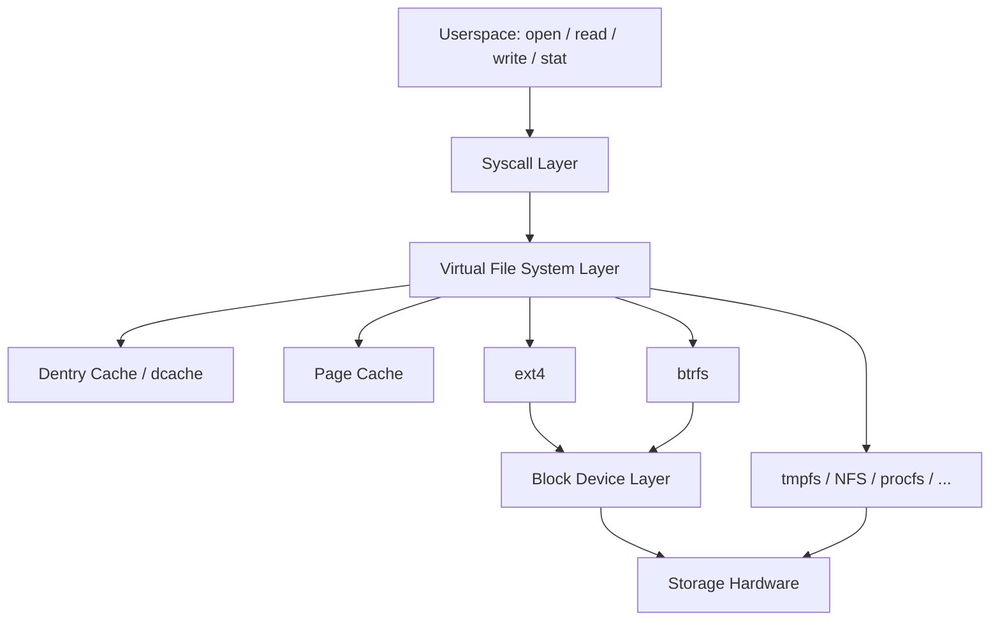
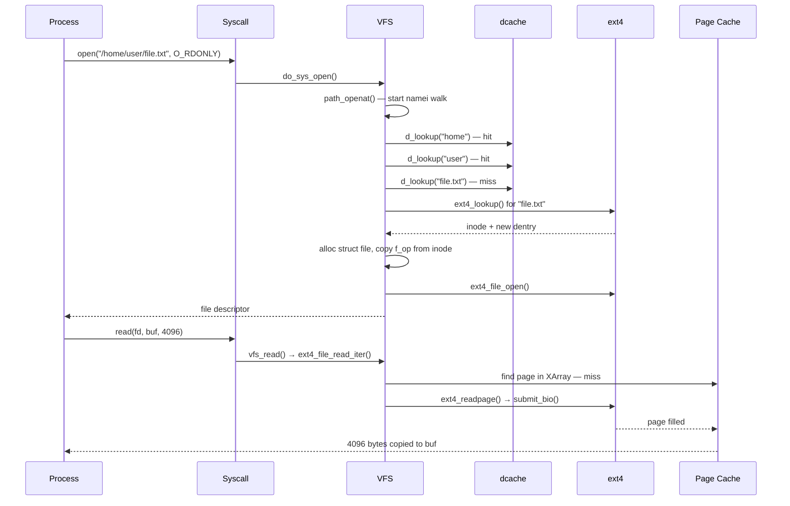

# Linux Filesystem Subsystem (VFS)

## Related Notes

> **See also**: [[vfs]] (VFS internals deep-dive: dcache, namei, mount API), [[nfs]] (Network File System client & server), [[btrfs]] (B-tree filesystem).

## Overview

The Virtual File System (VFS) is the software layer in the kernel that provides a unified filesystem interface to userspace programs. It abstracts over dozens of concrete filesystem implementations — ext4, btrfs, tmpfs, NFS, procfs, and more — presenting them all through the same set of system calls (`open`, `read`, `write`, `stat`, `unlink`, etc.). Without VFS, every filesystem would need to speak directly to userspace, and the kernel would need to know at call time which filesystem was being used.

## Mental Model

Think of VFS as an **object-oriented plugin framework**, written in C. It defines four core abstract objects — superblock, inode, dentry, and file — and for each one it specifies a table of operations (a vtable, in C++ terms). A concrete filesystem like ext4 registers itself with VFS and provides its own implementations of those operations. When a process calls `open("/mnt/ext4/foo")`, VFS drives the whole sequence, delegating to ext4's implementations wherever filesystem-specific knowledge is needed.

The result is that userspace programs are completely oblivious to which filesystem they are talking to — they just call POSIX syscalls and VFS routes everything appropriately.

## Architecture

**Reading the diagram**: every filesystem call from userspace enters the syscall layer and is dispatched into VFS. VFS consults the dentry cache to translate the path component by component. Once it has an inode, it may serve the request from the page cache (for reads/writes) or delegate to the concrete filesystem's operation table for anything storage-specific. The concrete filesystem then talks to the block device layer.

---

## Core Components

### [[Superblock]]

**Purpose** — A superblock represents one *mounted* instance of a filesystem. It is the anchor for everything: mount options, the root dentry, dirty inode lists, and the filesystem's own metadata. When you run `mount -t ext4 /dev/sda1 /mnt`, a superblock object is created for that mount.

**How it works** — The VFS calls the filesystem's `mount()` callback (from `struct file_system_type`), which reads the on-disk superblock, allocates a `struct super_block`, fills it with data, attaches the root dentry, and returns it. The filesystem also provides a `struct super_operations` table that VFS calls when it needs to allocate inodes (`alloc_inode`), write them back (`write_inode`), sync dirty data (`sync_fs`), or tear down the mount (`put_super`).

Most superblock methods can block safely — VFS calls them without holding any locks — which matters for network filesystems that may need to wait on I/O.

**Key struct**: `struct super_block` (`include/linux/fs.h`)
- `s_op` — pointer to `struct super_operations` (the vtable)
- `s_root` — the root dentry of this mount
- `s_inodes` — list of all inodes belonging to this superblock
- `s_dirty` — list of dirty inodes awaiting writeback
- `s_flags` — mount flags (read-only, no-exec, etc.)

**Key functions**:
- `register_filesystem()` — called by a filesystem module to announce itself to VFS
- `mount_bdev()` / `mount_nodev()` / `mount_single()` — generic helpers for the `mount()` callback
- `kill_anon_super()` / `kill_block_super()` — generic `kill_sb` helpers

---

### [[Inode]]

**Purpose** — An inode is the kernel's representation of a *filesystem object*: a regular file, directory, symlink, device node, FIFO, or socket. It holds everything about the object *except* its name and location in the directory tree (those live in the dentry).

**How it works** — Inodes for on-disk filesystems are cached copies of on-disk metadata. When VFS needs an inode, it calls the parent directory's `lookup()` method, which reads the on-disk inode into a fresh `struct inode`. Subsequent lookups for the same object find the cached copy. Hard links are implemented by multiple dentries pointing at one inode — the inode has a reference count (`i_nlink`) and is freed only when the count reaches zero *and* no process has it open.

The filesystem supplies a `struct inode_operations` table covering operations on the inode itself: creating children (`create`, `mkdir`, `mknod`), resolving symlinks (`get_link`), checking permissions (`permission`), and reading/setting attributes (`getattr`, `setattr`). For data I/O, the inode also embeds an `address_space` object pointing at `struct address_space_operations`, which controls the page cache.

**Key struct**: `struct inode` (`include/linux/fs.h`)
- `i_op` — pointer to `struct inode_operations`
- `i_fop` — pointer to `struct file_operations` (used when a file descriptor is opened on this inode)
- `i_mapping` — pointer to `struct address_space` (page cache anchor)
- `i_ino` — inode number
- `i_nlink` — hard link count
- `i_size` — file size in bytes
- `i_mode` — file type and permission bits

**Key functions**:
- `new_inode()` / `insert_inode_hash()` — allocate and register a new inode
- `iget_locked()` — look up or create an inode by number
- `mark_inode_dirty()` — schedule inode writeback
- `iput()` — drop a reference; triggers eviction if the count reaches zero

---

### [[Dentry]] and the Dentry Cache (dcache)

**Purpose** — A dentry (directory entry) maps one pathname component to its inode. The dentry cache is a kernel-wide in-memory view of the entire path namespace. Its job is to make repeated pathname lookups fast — without it, every `open("/usr/bin/python")` would call into the filesystem three or more times.

**How it works** — Dentries live entirely in RAM; they are never written to disk. When VFS walks `/usr/bin/python`, it splits the path into components (`usr`, `bin`, `python`) and looks each one up in the dcache hash table. On a hit it gets the dentry (and through it the inode) instantly. On a miss it calls `lookup()` on the parent directory inode and then adds the resulting dentry to the cache.

Dentries can be *positive* (point to a live inode) or *negative* (record that a name does not exist — preventing repeated failed lookups). They are reference-counted via `dget`/`dput`. When the count drops to zero the dentry becomes "unused" and may be reclaimed by the LRU shrinker.

The dcache is also the implementation substrate for the entire mount namespace: each `vfsmount` attaches to a dentry (the mountpoint), and path resolution traverses `vfsmount` boundaries transparently.

**Key struct**: `struct dentry` (`include/linux/dcache.h`)
- `d_op` — pointer to `struct dentry_operations`
- `d_inode` — the inode this dentry points to (NULL for negative dentries)
- `d_parent` — parent dentry
- `d_name` — the pathname component as a `qstr`
- `d_lockref` — combined spinlock + reference count
- `d_subdirs` / `d_child` — tree links connecting parent to children

**Key functions**:
- `d_lookup()` — hash-table search for a named child under a given parent
- `d_add()` / `d_instantiate()` — attach an inode to a dentry after `lookup()`
- `dget()` / `dput()` — reference counting
- `d_splice_alias()` — handle hard-linked directories (used by NFS etc.)

---

### [[File Object]]

**Purpose** — A `struct file` is the per-open-file-descriptor kernel object. It connects the process's file descriptor table to the underlying inode and provides the state needed for that particular open: current position, open flags, any per-open private data.

**How it works** — When a process calls `open()`, VFS allocates a `struct file`, fills in a pointer to the dentry (which carries the inode), copies the `i_fop` file operations table from the inode, and calls the filesystem's `open()` method. The file descriptor the process receives is an index into the process's `struct fdtable` that maps to this `struct file`.

The `struct file_operations` vtable is the richest in VFS, covering everything from byte I/O (`read`, `write`, `read_iter`, `write_iter`) to memory mapping (`mmap`), locking (`lock`), polling (`poll`), device control (`unlocked_ioctl`), and zero-copy movement (`splice_read`, `splice_write`). Most regular-file I/O goes through the `read_iter`/`write_iter` path, which is also the path that io_uring drives.

**Key struct**: `struct file` (`include/linux/fs.h`)
- `f_op` — pointer to `struct file_operations`
- `f_path` — combined `vfsmount` + `dentry` identifying the file
- `f_inode` — fast pointer to the inode (cached from `f_path`)
- `f_pos` — current file position
- `f_flags` — open flags (`O_RDONLY`, `O_NONBLOCK`, etc.)
- `private_data` — filesystem-specific per-open state

**Key functions**:
- `filp_open()` — kernel-internal "open a path" returning a `struct file *`
- `fget()` / `fput()` — reference counting on open file objects
- `vfs_read()` / `vfs_write()` — generic read/write dispatchers

---

### [[Address Space]] (Page Cache Integration)

**Purpose** — The address space object glues a file's data to the page cache. It tracks which pages belong to a file, manages dirty/writeback state, and exposes the I/O operations the page reclaim and writeback infrastructure calls.

**How it works** — Every inode that stores data has an embedded `struct address_space`. Pages (now: *folios*) in the page cache are stored in an XArray (`i_pages`) keyed by page-frame index within the file. When the kernel reads a file, `read_iter` checks whether the required folios are already in the XArray; on a miss it calls `read_folio()` (or, for prefetch, `readahead()`) to populate them from storage.

Dirty folios are tagged in the XArray and later written back by **per-BDI writeback workers** (`struct bdi_writeback`, `wb_workfn()`) through `writepages()`. `pdflush` was removed in Linux 3.2; the current model creates one writeback worker per backing device so that a stalled hard disk cannot block writeback for SSDs on other devices. The `direct_IO` path (invoked for `O_DIRECT` opens) bypasses the cache entirely, going straight from userspace buffers to the block layer.

**Folio transition** — Since Linux 5.16+, `struct page` is being systematically replaced by `struct folio` throughout the page-cache and `address_space_operations`. A folio is a power-of-two-aligned contiguous group of pages, eliminating ambiguity between "base page" and "compound page." Filesystems that support large folios call `mapping_set_large_folios()` during inode setup; the page cache then opportunistically allocates multi-page folios on read/write for improved I/O and reduced per-page overhead.

**Key struct**: `struct address_space` (`include/linux/fs.h`)
- `a_ops` — pointer to `struct address_space_operations`
- `host` — back-pointer to the owning inode
- `i_pages` — XArray holding cached folios (replaces the old radix tree)
- `nrpages` — total number of resident base pages
- `writeback_index` — where the next writeback pass starts

**Key functions** (in `address_space_operations` — current API):
- `read_folio(file, folio)` — bring one folio from storage into cache (replaces old `readpage`)
- `readahead(ractl)` — populate a window of consecutive folios for prefetch
- `dirty_folio(mapping, folio)` — mark a folio dirty; called on first write to a cached folio
- `writepages(mapping, wbc)` — flush a range of dirty folios to storage
- `write_begin(file, mapping, pos, len, pagep)` — prepare a folio for buffered write
- `write_end(file, mapping, pos, len, copied, page)` — finalise after write
- `direct_IO(kiocb, iter)` — bypass page cache for `O_DIRECT`
- `migrate_folio` — relocate folios during memory compaction

---

### [[Writeback Infrastructure]] (BDI / `fs-writeback`)

**Purpose** — The writeback infrastructure asynchronously flushes dirty pages from the page cache to storage. It decouples the latency of a `write()` call (which only dirties cache) from the latency of disk I/O. Without it, every write would block until the device confirmed the data.

**How it works** — When a folio is dirtied, `__mark_inode_dirty()` places the inode on the owning backing device's (`struct backing_dev_info`, BDI) dirty inode list. The BDI owns one or more `struct bdi_writeback` objects (one per cgroup for cgroup-aware writeback). Each `bdi_writeback` has a dedicated kernel worker thread whose main loop is `wb_workfn()`.

`wb_workfn()` continuously calls `wb_do_writeback()` until the work list is empty. `wb_do_writeback()` processes work items of type `struct wb_writeback_work`, each specifying: a superblock to flush, a sync mode (`WB_SYNC_NONE` or `WB_SYNC_ALL`), a number of pages to write, an age threshold (write folios older than N jiffies), and whether this is a `sync(2)` call.

**Writeback triggers**:
- **Periodic** (kupdated-style): the worker wakes up every `dirty_writeback_interval` (default 5 s) and writes back folios older than `dirty_expire_interval` (default 30 s).
- **Ratio-based throttling**: `balance_dirty_pages()` is called inside the buffered write path. If dirty pages exceed `dirty_ratio` (default 20% of memory) the calling process is throttled; if they exceed `dirty_background_ratio` (default 10%), writeback workers are woken.
- **`fsync(2)` / `sync(2)`**: calls `filemap_write_and_wait_range()` or `sync_inodes_sb()`, which drive `WB_SYNC_ALL` writeback — waiting for every dirty page to reach stable storage.
- **Memory pressure**: `kswapd` and direct reclaim can invoke `writepage()` on individual folios as a last resort.

**pdflush was removed in Linux 3.2.** The old global thread pool (2–8 `pdflush` threads shared by all devices) caused inter-device contention: a slow spinning disk could starve an SSD of writeback threads. Per-BDI workers solve this — each physical device has its own threads and its own dirty inode queue, so one device's latency cannot affect another's.

**Cgroup writeback** (Linux 4.2+) — each memory cgroup that is associated with a block cgroup gets its own `bdi_writeback` so that writeback I/O is attributed and throttled per cgroup.

**Key struct**: `struct backing_dev_info` (`include/linux/backing-dev.h`)
- `wb` — the default `bdi_writeback` for this device
- `wb_list` — list of per-cgroup `bdi_writeback` objects
- `capabilities` — `BDI_CAP_WRITEBACK`, `BDI_CAP_SYNCHRONOUS_IO`, etc.

**Key struct**: `struct bdi_writeback` (`include/linux/backing-dev-defs.h`)
- `b_dirty` — list of dirty inodes awaiting writeback
- `b_io` — inodes currently being written back
- `b_more_io` — inodes deferred due to congestion
- `dwork` — the `delayed_work` that schedules `wb_workfn`

**Key struct**: `struct writeback_control` (`include/linux/writeback.h`)
- `sync_mode` — `WB_SYNC_NONE` (skip locked) or `WB_SYNC_ALL` (wait)
- `nr_to_write` — page budget for this pass
- `range_start` / `range_end` — file offset range for `fsync`
- `for_kupdate` / `for_background` — hint to filesystems on urgency

**Key functions**:
- `wb_workfn()` — the writeback worker thread loop (`fs/fs-writeback.c`)
- `writeback_single_inode()` — write one inode's dirty pages
- `balance_dirty_pages()` — called in the write path to throttle producers
- `filemap_write_and_wait_range()` — wait for all writes in a range (used by `fsync`)

**Config & flags** — `vm.dirty_ratio`, `vm.dirty_background_ratio`, `vm.dirty_writeback_centisecs`, `vm.dirty_expire_centisecs` in `/proc/sys/vm/`.

---

### [[fsnotify]] (Filesystem Notification Framework)

**Purpose** — fsnotify is the generic in-kernel framework for notifying userspace about filesystem events (file created, deleted, modified, accessed, attribute changed, etc.). It is the common substrate on which `inotify`, `fanotify`, and `dnotify` are all built.

**How it works** — The VFS layer calls lightweight fsnotify hook functions at strategic points (`fsnotify_create()`, `fsnotify_modify()`, `fsnotify_unlink()`, etc., defined in `include/linux/fsnotify.h`). These hooks are no-ops unless at least one notification group has registered interest in the object. When a group is registered, the hook calls `fsnotify()`, which iterates through all registered groups and invokes each group's `handle_inode_event()` or `handle_path_event()` callback.

**Notification consumers**:
- **inotify** — per-inode watches; each `inotify_add_watch()` call registers a mark on an inode. Events are delivered as `inotify_event` structs via a file-descriptor queue.
- **fanotify** — more powerful; can watch entire mount points or directory trees. Supports **permission events** (`FAN_ACCESS_PERM`, `FAN_OPEN_PERM`): when a process tries to access a file, fanotify puts the process on hold until the listening daemon writes an allow/deny response to the fanotify fd. Used by anti-virus scanners and file integrity monitors.
- **dnotify** (legacy) — per-directory signals via `fcntl(F_NOTIFY)`; largely superseded by inotify.

**Mark system** — Each watched object (inode, vfsmount, superblock) can have **fsnotify marks** (`struct fsnotify_mark`) attached by one or more notification groups. The mark stores which event mask the group cares about. VFS hooks first check whether any mark exists before calling into the full fsnotify machinery — ensuring zero overhead when no watchers are registered.

**Key struct**: `struct fsnotify_group` — represents one inotify or fanotify instance (created by `inotify_init()` or `fanotify_init()`).
**Key struct**: `struct fsnotify_mark` — a watcher registration on a specific inode, vfsmount, or superblock.
**Key struct**: `struct fsnotify_event` — one queued event (event type, path, inode info).

**Key functions**:
- `fsnotify_create()` / `fsnotify_unlink()` / `fsnotify_modify()` — VFS-layer hooks (inline, `include/linux/fsnotify.h`)
- `fsnotify()` — the core dispatch function (`fs/notify/fsnotify.c`)
- `inotify_add_watch()` / `inotify_rm_watch()` — inotify watch management
- `fanotify_mark()` — fanotify mount/directory/filesystem mark API

**Config** — `CONFIG_FSNOTIFY` (implicit with inotify or fanotify), `CONFIG_INOTIFY_USER`, `CONFIG_FANOTIFY`, `CONFIG_FANOTIFY_ACCESS_PERMISSIONS`.

---

### [[Path Lookup]] (namei)

**Purpose** — Path lookup is the mechanism that translates a pathname string (`/usr/bin/python`) into a dentry+vfsmount pair. Everything from `open()` to `stat()` to `unlink()` goes through it. Nicknamed "namei" after the traditional Unix function name — `namei` meaning "name to inode."

**How it works** — The kernel splits the path at `/` boundaries and walks each component. The walk state is held in a `struct nameidata`. For each component, VFS calls `d_lookup` in the dcache; on a miss, it calls the parent directory's `lookup()` method and caches the result.

The implementation runs two concurrent algorithms:

1. **RCU-walk** — the fast, lock-free path. Holds `rcu_read_lock()` for the entire traversal; validates dentries and mount points using sequence locks (`d_seq`, `mount_lock`) instead of taking spinlocks or incrementing reference counts. It "leaves no footprint" on common cache-hot paths and is the norm for well-cached paths.

2. **REF-walk** — the slow, reference-counted path. Increments dentry reference counts (`d_lockref`) and acquires `i_rwsem` on directories when needed. Used when RCU-walk detects a consistency issue (a dentry being renamed, a mount point changing, or a symlink that requires sleeping) and calls `unlazy_walk()` to transition.

Symlinks are resolved using a per-lookup stack (limited to 40 levels by `MAXSYMLINKS`). Mount-point traversal is transparent: when the lookup reaches a dentry that is a mountpoint, it follows the `vfsmount` chain to reach the root dentry of the mounted filesystem.

**Key struct**: `struct nameidata` (`fs/namei.c` — internal)
- `path` — current dentry + vfsmount
- `root` — cached filesystem root for the lookup
- `last` / `last_type` — the next component to process
- `seq` / `m_seq` — sequence numbers for RCU-walk validation

---

## How Components Interact

### Scenario 1: `open("/home/user/file.txt", O_RDONLY)`

### Scenario 2: A filesystem is mounted (`mount -t ext4 /dev/sda1 /mnt`)

1. The `mount(2)` syscall reaches `do_mount()` in VFS.
2. VFS looks up `/dev/sda1` (block device) and `/mnt` (mountpoint dentry) via path lookup.
3. VFS calls ext4's `mount()` function (`mount_bdev`), which reads the on-disk superblock, allocates `struct super_block`, builds the root inode and root dentry, and returns it.
4. VFS allocates a `vfsmount` and links it: the mountpoint dentry (`/mnt`) gains a child `vfsmount` pointing at the ext4 root dentry.
5. From now on, path lookups reaching `/mnt` are automatically redirected into the ext4 tree.

### Scenario 3: Dirty folio writeback under memory pressure

1. A process writes to a cached folio; `dirty_folio()` tags it `PAGECACHE_TAG_DIRTY` in the XArray and calls `__mark_inode_dirty()` to enqueue the inode on the BDI's dirty list.
2. Periodically (and under memory pressure), `wb_workfn()` runs on the per-BDI writeback worker thread. It calls `writeback_sb_inodes()`, which iterates the dirty inode list.
3. For each dirty inode, `writeback_single_inode()` calls `address_space_operations.writepages()` (e.g., `ext4_writepages()`), which builds a `struct bio` covering the dirty extent and submits it to the block layer.
4. On I/O completion, the folio's `PG_dirty` and `PG_writeback` flags are cleared; the inode is moved off the dirty list.
5. If writeback cannot keep up (e.g., the device is slow), the kernel calls `balance_dirty_pages()` inside the write path to throttle the writing process, preventing runaway dirty memory.

---

## Where It Fits in the Kernel

- **↑ Userspace**: The primary VFS entry points are syscalls: `open`, `read`, `write`, `stat`, `lstat`, `lseek`, `close`, `fsync`, `ioctl`, `mmap`, `rename`, `link`, `unlink`, `mkdir`, `rmdir`, `mount`, `umount2`. The C library wraps these as POSIX functions.
- **→ Memory Management (mm)**: VFS delegates page-cache I/O to mm via `struct address_space`. The page cache is logically part of mm; VFS is its primary customer. `mmap()` calls cross back and forth between VFS and mm's virtual memory area (VMA) machinery.
- **→ Block Layer**: Concrete disk filesystems (ext4, btrfs, xfs) submit `struct bio` requests to the block layer. VFS itself never touches block I/O directly.
- **→ Network Stack**: Network filesystems (NFS, CIFS, 9P) replace the block-layer path with RPC calls over sockets.
- **← Security (LSM)**: The Linux Security Module framework hooks into VFS at permission checks (`inode_permission`, `file_open`, etc.), allowing SELinux, AppArmor, etc. to intercept and audit filesystem access.
- **← Process Management**: `struct task_struct` holds `struct fs_struct` (root and current working directory dentries) and `struct files_struct` (open file descriptor table). Every `chdir`, `chroot`, or `open` updates these.
- **↓ Hardware**: VFS is above all hardware abstractions. It reaches hardware only through concrete filesystem implementations that talk to block devices or network interfaces.

---

## Design Decisions & Tradeoffs

**Uniform object model over direct dispatch** — VFS models all filesystem objects as four generic types (superblock, inode, dentry, file), each with an operations table. The tradeoff is indirection overhead on every filesystem call, but the payoff is that adding a new filesystem is self-contained: implement the operation tables, call `register_filesystem`, done. Pseudo-filesystems like `procfs` and `sysfs` exploit this by never touching a block device at all.

**Dentry cache as the path namespace** — Instead of doing filesystem lookups on every path component, VFS maintains a global in-memory tree of dentries. This means repeated access to the same path is essentially free (a hash-table lookup), but the dcache consumes memory proportional to the number of distinct paths ever accessed. The LRU shrinker reclaims unused dentries under pressure, which can cause lookup latency spikes on memory-constrained systems.

**RCU-walk for path lookup** — Introduced around Linux 2.6.38, RCU-walk was a significant redesign of `namei`. The old approach took spinlocks and incremented reference counts on every dentry. RCU-walk instead uses sequence locks to validate dentry consistency without writing anything, dropping to REF-walk only on failure. The result is dramatically better scalability on multi-core systems for common "file read" workloads where paths are cached and stable.

**Separation of inode from dentry** — The name-to-object binding (dentry) is separate from the object itself (inode). This cleanly handles hard links (many dentries, one inode) and makes rename atomic from the VFS perspective: only the dentry's parent pointer is updated, not the inode.

**Filesystem context API (mount API overhaul)** — Linux 5.1 replaced the old `mount(2)` interface's opaque string options with a structured filesystem context (`struct fs_context`). Filesystems now parse and validate mount options at context creation time, before any data is written — catching errors early. This also enabled `fsopen()` / `fsconfig()` / `fsmount()` syscalls for container-friendly, privilege-separated mounting.

---

## How It Has Evolved

- **Early Linux (before 2.0)**: VFS was a thin shim over ext and minix. The four-object model was modeled on Sun's VFS from SVR4, imported when Linux gained NFS support.
- **Linux 2.4**: The dentry cache became central; inode caching was formalized. The `address_space` abstraction was introduced to separate page-cache management from inode semantics.
- **Linux 2.6**: Massive correctness improvements. Inode locking (`i_sem`) was converted to a read-write semaphore (`i_rwsem`). The `splice()` / `sendfile()` zero-copy paths were added.
- **Linux 2.6.38 (2011)**: RCU-walk path lookup introduced, removing the biggest scalability bottleneck in VFS on multi-core machines.
- **Linux 3.x**: Pathname lookup and dcache locking were progressively refined. The `d_lockref` combining spinlock + refcount was added to reduce false sharing.
- **Linux 5.1 (2019)**: New mount API (`fsopen`/`fsconfig`/`fsmount`) replacing the legacy opaque-string `mount(2)` interface, together with the filesystem context (`struct fs_context`) that propagates mount options cleanly.
- **Linux 5.12 (2021)**: Idmapped mounts introduced, allowing a filesystem mounted under one UID/GID namespace to be exposed to a container with remapped IDs — without the filesystem knowing.
- **Linux 6.12 (2024)**: FUSE gained idmapped mount support; the groundwork for FUSE-over-io_uring (allowing ring-based FUSE message delivery) was laid.
- **Linux 6.15 (2025)**: `open_tree_attr()` syscall added; detached mounts and nested idmapped mounts now supported. VFS mount namespace API continues to expand for container use cases.

---

## Recent Development Activity

- **FUSE + io_uring**: Work is underway to deliver FUSE requests through io_uring rather than `/dev/fuse` read/write, eliminating the context-switch overhead that makes user-space filesystems slow. The design documentation is in `Documentation/filesystems/fuse-io-uring.rst`.
- **Inode reference counting rework**: A major patch series (Josef Bacik, 50+ patches, 2025) is reworking inode reference counting to reduce lock contention and make the lifecycle cleaner across network filesystems.
- **Idmapped mount expansion**: More filesystems (OverlayFS, FUSE, eventually ext4) are being converted to support `FS_ALLOW_IDMAP`, required for proper rootless-container workflows.
- **User-space filesystems without FUSE penalty**: Darrick Wong's work explores running ext4 logic in unprivileged user space (via the new `fsopen`/kernel handoff) as a path toward safer, faster user-space filesystem implementations without the FUSE round-trip cost.
- **Mount namespace evolution**: Christian Brauner (VFS maintainer) continues refining the mount API toward a model where containers can manage their own mount namespaces without any privileged kernel calls.

---

## Further Reading

1. **[Overview of the Linux Virtual File System — kernel.org](https://www.kernel.org/doc/html/latest/filesystems/vfs.html)** — the authoritative reference for all VFS objects and operation tables (current, includes folio API).
2. **[Introduction to Pathname Lookup — kernel.org](https://www.kernel.org/doc/html/latest/filesystems/path-lookup.html)** — deep dive into RCU-walk, REF-walk, `nameidata`, and symlink handling.
3. **[Flushing out pdflush — LWN.net (2009)](https://lwn.net/Articles/326552/)** — explains why pdflush was replaced by per-BDI writeback workers and how `bdi_writeback` works.
4. **[Page folios — LWN.net (2021)](https://lwn.net/Articles/840593/)** — Matthew Wilcox's introduction to `struct folio` and why it replaces `struct page` in the page cache.
5. **[fsnotify, dnotify, and inotify — LWN.net (2009)](https://lwn.net/Articles/311350/)** — explains the fsnotify framework and the inotify/dnotify consumers built on it.
6. **[The fanotify API — LWN.net (2010)](https://lwn.net/Articles/339399/)** — introduction to fanotify's permission event model.
7. **[Creating Linux virtual filesystems — LWN.net (2003)](https://lwn.net/Articles/57369/)** — accessible introduction to writing a minimal VFS-backed filesystem.
8. **[VFS: Introduce filesystem context — LWN.net (2019)](https://lwn.net/Articles/780267/)** — covers the new mount API and `struct fs_context`.
9. **[The future of the page cache — LWN.net](https://lwn.net/Articles/712467/)** — explains the address space / page cache design and where it was heading.
10. **[FUSE-over-io-uring — kernel.org](https://docs.kernel.org/next/filesystems/fuse-io-uring.html)** — design doc for FUSE's io_uring integration.
11. **[Idmapped mounts — kernel.org](https://docs.kernel.org/filesystems/idmappings.html)** — full explanation of ID mapping semantics.

---

## LKML Highlights

- **`cover.1756222464.git.josef@toxicpanda.com`** — "fs: rework inode reference counting" (Josef Bacik, 2025, 54-patch series). A deep restructuring of inode refcounting to reduce lock contention, particularly for network filesystems where inodes can be shared across mount points. Signals active churn in the VFS core lifecycle code.
- **`20260329163337.637393-1-cristian.marussi@arm.com`** — "Introduce SCMI Telemetry FS support" (2026). Shows the VFS plugin model still being used for new pseudo-filesystems that expose firmware/hardware telemetry as files — the four-object abstraction continues to be the integration point for novel kernel subsystems.
- **`20251001133653.978885-6-sashal@kernel.org`** — "fs: Add 'initramfs_options' to set initramfs mount options" (backport, 2025). Illustrates how the new filesystem context API propagates to early-boot paths — mount option handling now flows through structured contexts all the way to initramfs.
