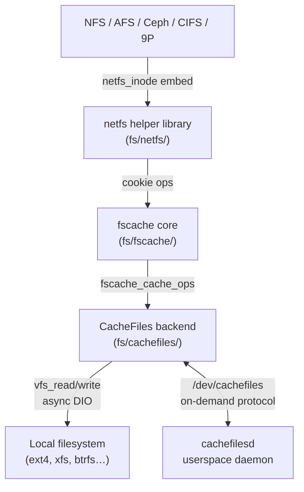
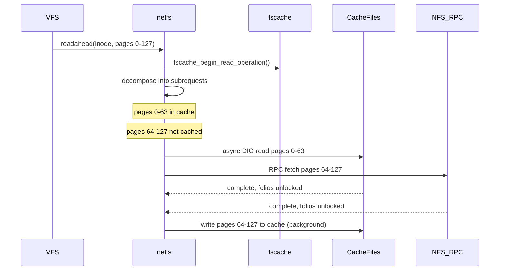

# fscache Subsystem

> 📘 Plain-language version: [[fscache-explained]]

## Overview

fscache is the kernel's general-purpose local caching layer for network filesystems. Rather than each network filesystem implementing its own disk cache, fscache provides a shared intermediary that routes I/O between network filesystems (NFS, AFS, Ceph, CIFS, 9P) and pluggable cache backends (primarily CacheFiles). It allows slow remote storage to be cached transparently on fast local disk, serving data in chunks on demand rather than preloading entire files, so files larger than the cache or collective open-file sets larger than available space all work correctly.

## Mental Model

Think of fscache as a **forwarding switchboard** sitting between callers and storage. Each network filesystem checks in a file at the switchboard (acquires a cookie). When the filesystem needs a page, it asks the switchboard; if the switchboard has a cached copy it hands it back directly, otherwise it signals "miss" and the filesystem fetches from the network while simultaneously feeding the page back through the switchboard for next time. The switchboard itself never cares what the data means—it only knows keys, sizes, and validity tokens.

## Architecture

Data flows top-to-bottom on a read miss: the netfs layer decomposes a read into subrequests, fscache checks whether each range is cached, routes hits to CacheFiles via async DIO, and fills misses from the network—all in parallel.

---

## Core Components

### [[fscache-cookie-subsystem]]

**Purpose** — The cookie subsystem is the identity layer of fscache. Every object participating in the cache—the cache itself, a logical collection of files (volume), or an individual cached file—is represented by a cookie. Cookies are the handles that network filesystems exchange with fscache; the actual cache storage is hidden behind them.

**How it works** — There are three cookie levels, each building on the one above:

A *cache cookie* (`struct fscache_cache`) represents a registered backend. When CacheFiles registers via `fscache_acquire_cache()`, fscache allocates a cache cookie and adds it to a global list. It is mostly infrastructure—its primary role is to anchor the operations table (`struct fscache_cache_ops`) that fscache calls into the backend.

A *volume cookie* (`struct fscache_volume`) groups the cached files for one logical container—typically one superblock mount. The network filesystem calls `fscache_acquire_volume()` with a printable string key that encodes distinguishing information (server address, export path, etc.). fscache hashes this key, looks up or creates a matching volume in the cache, and returns an opaque pointer. Volume cookies hold a `key` string (max 254 bytes, no `/`) and a `coherency[]` blob used to detect stale cache entries on remount.

A *data file cookie* (`struct fscache_cookie`) represents one file's cached content. The filesystem calls `fscache_acquire_cookie()` with the parent volume, a binary key (inode number, etc.), coherency data, and the initial file size. fscache stores these in the cookie—it no longer calls back into the filesystem to retrieve them, eliminating lifecycle coupling that plagued the old design.

The lifecycle of a data cookie has four phases:
1. **Acquired** — `fscache_acquire_cookie()` returns a cookie in QUIESCENT state; no backend resources are allocated yet.
2. **In-use** — `fscache_use_cookie()` transitions the cookie to ACTIVE, causing the backend's `lookup_cookie()` callback to run, which allocates or locates the on-disk object. An internal `n_active` counter tracks how many file descriptors hold the cookie live.
3. **Unused** — `fscache_unuse_cookie()` decrements `n_active`; at zero the backend object can be retired. The caller passes updated size and auxiliary data at this point.
4. **Relinquished** — `fscache_relinquish_cookie()` permanently removes the cookie; if `retire=true` the backend discards its on-disk object.

Invalidation (`fscache_invalidate()`) is handled non-disruptively: fscache increments an `inval_counter` in the cookie, causing in-flight I/O to see a version mismatch and fail gracefully, then the backend uses a VFS tmpfile approach to create a fresh backing file without waiting for old I/O to drain.

**Key struct**: `struct fscache_cookie` (`include/linux/fscache.h`)
- `volume` — parent volume cookie
- `cache_priv` — backend's opaque per-object state
- `flags` — `FSCACHE_COOKIE_NO_DATA_TO_READ`, `FSCACHE_COOKIE_HAVE_DATA`, `FSCACHE_COOKIE_RETIRED`, `FSCACHE_COOKIE_NEEDS_UPDATE`
- `n_active` — reference count of active users
- `inval_counter` — incremented on invalidation; I/O operations check this to detect stale ops
- `object_size` — tracks the authoritative file size
- `key` / `key_len` — binary index key (unique within volume)

**Key functions**:
- `fscache_acquire_volume()` — creates or looks up a volume cookie
- `fscache_acquire_cookie()` — creates a data cookie and associates it with a volume
- `fscache_use_cookie()` — marks the cookie active; triggers backend lookup
- `fscache_unuse_cookie()` — releases active usage, updating size and coherency data
- `fscache_invalidate()` — bumps `inval_counter` to abort in-flight I/O and prepare for a fresh backing object
- `fscache_relinquish_cookie()` — permanently removes the cookie

**Config & flags**:
- `CONFIG_FSCACHE` — enables the fscache core
- `CONFIG_FSCACHE_STATS` — exposes `/proc/fs/fscache/stats` with counters for cookie allocation, I/O, space events, and LRU evictions
- `/sys/module/netfs/parameters/debug` — bitmask enabling runtime debug tracing of cookie and I/O paths

---

### [[netfs-helper-library]]

**Purpose** — Network filesystems share a large amount of identical VM/VFS plumbing: implementing `readpage`, `readahead`, `write_begin`/`write_end`, and direct I/O correctly—especially when a local cache is involved—is error-prone and duplicated. The netfs helper library (`fs/netfs/`) absorbs this boilerplate, letting filesystems plug in only the transport-specific RPC callbacks.

**How it works** — The library organises all I/O around three hierarchical objects:

A *request* (`struct netfs_request`) tracks one complete user-visible I/O operation (a `readahead`, a `read_iter`, or a `write_iter` call). It holds the inode, the byte range, references to the folio set, and aggregate state.

A *stream* (`struct netfs_stream`) within a request is a non-overlapping sequence of subrequests headed for the same destination. A buffered read has one stream; a cached write has two streams simultaneously—one for the network server, one for CacheFiles—each independently tiled to match its destination's alignment constraints.

A *subrequest* (`struct netfs_subrequest`) is the fundamental unit: a single RPC call or a single cache I/O. The library calls the filesystem's `->issue_read()` or the cache backend's read/write path for each subrequest, then stitches results together. Folios unlock progressively as subrequests complete rather than waiting for the entire request to finish.

On the **read path**: `netfs_readahead()` or `netfs_read_folio()` creates a request, iterates the requested range, and for each region checks the cache cookie's content map. Cached ranges become cache subrequests dispatched to CacheFiles; uncached ranges become RPC subrequests dispatched to the filesystem. Both kinds run in parallel. As subrequests complete, their folios are marked uptodate and unlocked. If an RPC subrequest fills a range that was a cache miss, netfslib simultaneously writes the data to the cache in the background.

On the **write path**: `netfs_perform_write()` locks folios, calls the filesystem's `->begin_write()`, then issues subrequests to both the server stream and the cache stream. The two streams can have different tile sizes—the server might want 1 MB chunks while CacheFiles aligns to its block size—and the library handles the mismatched tiling transparently.

Filesystems embed a `struct netfs_inode` inside their inode wrapper (beside the VFS `struct inode`), which holds the operation callbacks (`struct netfs_request_ops`), the cache cookie pointer, and per-inode caching state. The library uses `container_of()` to locate `netfs_inode` from any VFS inode pointer.

**Key struct**: `struct netfs_inode` (`include/linux/netfs.h`)
- `inode` — the VFS inode (must be first for `container_of`)
- `ops` — pointer to `struct netfs_request_ops` (filesystem callbacks)
- `cache` — the `fscache_cookie` for this inode, or NULL if uncached
- `zero_point` — byte offset beyond which the file reads as zeros (used for sparse regions)
- `flags` — `NETFS_ICTX_ODIRECT`, `NETFS_ICTX_UNBUFFERED`, `NETFS_ICTX_WRITETHROUGH`

**Key struct**: `struct netfs_request` (`include/linux/netfs.h`)
- `inode` — inode being serviced
- `start` / `len` — byte range of the overall operation
- `origin` — `NETFS_READAHEAD`, `NETFS_READ_FOR_WRITE`, `NETFS_WRITE_TO_SERVER`, etc.
- `streams[]` — array of streams (server stream, cache stream)
- `error` — aggregate error from all subrequests

**Key functions**:
- `netfs_readahead()` — VFS `readahead` handler; creates a request and fires subrequests
- `netfs_read_folio()` — VFS `read_folio` handler for single folio reads
- `netfs_perform_write()` — buffered write path; issues parallel server + cache streams
- `netfs_begin_read()` — internal helper that decomposes a range into subrequests

**Config & flags**:
- `CONFIG_NETFS_SUPPORT` — the netfs helper library; selected automatically by filesystems that use it
- `NETFS_ICTX_WRITETHROUGH` — per-inode flag forcing synchronous cache writeback (set when `O_SYNC` is used)
- `NETFS_FOLIO_COPY_TO_CACHE` — folio marker indicating the folio should be written only to the cache during writeback, not to the server

---

### [[cachefiles-backend]]

**Purpose** — CacheFiles is the production cache backend that implements fscache's backend API by storing cached data as regular files on an already-mounted local filesystem (ext4, xfs, btrfs, etc.). It reuses the local filesystem's block allocator, journalling, and crash recovery rather than inventing its own, keeping the implementation small.

**How it works** — CacheFiles creates two directories under a configurable root:
- `cache/` — active cached objects
- `graveyard/` — retired or culled objects awaiting deletion by the daemon

Each cached volume maps to a directory tree inside `cache/`; each cached file maps to one regular file. The filename encodes the object's cache key: short printable keys are stored directly; keys with problematic characters (including `/` and NUL) are base-64 encoded. Keys exceeding `NAME_MAX` are split across nested directories using `+`-prefixed intermediate dirs.

Every cache file carries an xattr (`user.CacheFiles.cache`) holding the object type ID and the netfs's coherency data (the `aux[]` blob from the cookie). On lookup, CacheFiles reads this xattr and compares the stored coherency data against what the filesystem reports for the current file; a mismatch marks the object stale and triggers replacement.

**I/O path**: CacheFiles performs all I/O using async direct I/O (`kiocb` with `IOCB_DIRECT`) rather than snooping the page cache. This was the central change in the 5.17 rewrite—the old mechanism "snooped" the backing file's page cache and copied pages, which was memory-inefficient and hard to synchronise. Direct I/O means cache reads and writes go straight to disk without polluting the local file's page cache with a second copy of the data.

**On-demand mode** (CONFIG_CACHEFILES_ONDEMAND): When this mode is enabled, the kernel and the userspace daemon communicate via `/dev/cachefiles` using a request-reply protocol. On a cache miss the kernel sends a `OPEN` or `READ` message containing the volume key, cookie key, and byte range; the daemon fetches the data from the network and populates the cache file through an anonymous fd, then ACKs. This mode allows userspace to implement prefetching or alternative data sources. The `struct cachefiles_msg` is the wire format, with `opcode` selecting `OPEN`, `READ`, or `CLOSE`.

**Space management**: CacheFiles maintains three pairs of thresholds (block and file counts):
- `brun`/`frun` — culling stops when free space exceeds both
- `bcull`/`fcull` — culling starts when free space falls below either
- `bstop`/`fstop` — all allocation halts until space recovers above these

The daemon (`cachefilesd`) handles culling: it scans the graveyard and cache directories, builds a LRU list by access time, and unlinks objects from oldest to newest until thresholds are satisfied. The kernel module itself only moves objects to the graveyard; the daemon does the actual deletion, keeping complex namespace operations out of the kernel.

**Security**: CacheFiles temporarily overrides the process security context (subjective credentials) when creating or accessing cache files, while leaving the objective credentials (visible in `/proc`) unchanged. Cache files are labelled `cachefiles_var_t` in SELinux; the daemon operates as `cachefilesd_t` with a narrow permission set (stat, scan, delete—no read/write).

**Key struct**: `struct fscache_cache_ops` (`include/linux/fscache-cache.h`)
- `lookup_cookie()` — allocates or finds the on-disk object for a data cookie
- `withdraw_cookie()` — decommissions a cookie cleanly
- `invalidate_cookie()` — replaces a stale cache object (typically using a tmpfile)
- `resize_cookie()` — adjusts backing file size on truncate
- `begin_operation()` — sets up an I/O operation, populating kiocb state

**Key functions** (CacheFiles internal):
- `cachefiles_open_file()` — opens the backing file for a cookie, creating it if absent
- `cachefiles_read()` — issues async DIO read from the backing file
- `cachefiles_write()` — issues async DIO write to the backing file
- `cachefiles_check_auxdata()` — validates stored coherency xattr against cookie's aux data

**Config & flags**:
- `CONFIG_CACHEFILES` — the CacheFiles backend module
- `CONFIG_CACHEFILES_DEBUG` — enables debug assertions
- `CONFIG_CACHEFILES_ONDEMAND` — enables the on-demand user-daemon protocol via `/dev/cachefiles`
- `/proc/fs/cachefiles` — runtime statistics (culls, reads, writes, errors)

---

## How Components Interact

### Scenario 1: Mounting an NFS Share with Caching

1. NFS mounts a remote export. During superblock setup it calls `fscache_acquire_volume()` with a key encoding the server address and export path — the **cookie subsystem** returns a volume cookie.
2. When NFS opens a file and creates an inode, it calls `fscache_acquire_cookie()` on the volume, getting a data cookie. It stores this in the embedded `netfs_inode.cache` field.
3. A `fscache_use_cookie()` call makes the cookie active; the **CacheFiles backend**'s `lookup_cookie()` opens (or creates) the backing file on the local filesystem.

### Scenario 2: Readahead on a Cached File

4. netfslib issues two parallel subrequests. Both run concurrently. Folios unlock as each subrequest completes rather than waiting for both.
5. The background cache write for the missed pages (`netfs_write_to_cache()`) runs asynchronously; the application is not blocked.

### Scenario 3: Stale Cache Detection on Remount

When NFS remounts after the server has changed a file, the file's generation number or size changes. The netfs calls `fscache_invalidate()`, which bumps the cookie's `inval_counter`. Any in-flight cache I/O checking `inval_counter` sees a mismatch and returns an error. CacheFiles creates a new tmpfile as the backing store, making the old content invisible, and marks the cookie for a fresh lookup.

---

## Where It Fits in the Kernel

- **↑ Userspace**: applications call standard `read()`/`mmap()` on network files; the cache is completely transparent
- **→ [[vfs]]**: fscache and netfslib work through the standard `address_space_operations` interface — `read_folio`, `readahead`, `writepages`; no special syscalls
- **→ [[block]]**: CacheFiles uses async DIO through the VFS to reach the local block device; it doesn't bypass the local filesystem
- **← [[network-filesystems]]**: NFS, AFS, Ceph, CIFS, 9P embed `netfs_inode` and register cookies; they provide `netfs_request_ops` callbacks for their RPC layer
- **→ [[mm]]**: netfslib manipulates folios directly (locking, marking uptodate, unlocking) and integrates with the folio/page-cache infrastructure
- **→ [[security]]**: CacheFiles uses credential switching and SELinux type transitions to isolate cache file access from the caching process's normal security context
- **↓ Hardware**: ultimately, cached data lands on local block storage via the local filesystem; the fscache/netfs layers are entirely above block I/O

---

## Design Decisions & Tradeoffs

**Chunk-on-demand rather than whole-file preloading**: The original motivation for fscache (2003–2006) was NFS on slow WAN links where round-trip times dominate. Preloading entire files before allowing access would make large files unusable over the cache. The design serves only the requested range, so slow first-access latency is accepted in exchange for correct behaviour at any file size.

**No pointers from fscache back into network filesystems (post-5.17)**: The original architecture had callbacks from fscache into the netfs for coherency checks, key serialisation, and I/O completion. This created complex lifecycle coupling — the netfs could not safely unload while fscache held references, and tearing down a cookie required waiting for all in-flight callbacks. The 5.17 rewrite eliminated all back-pointers: fscache now stores the key, size, and coherency data directly in the cookie. This required duplicating some data but eliminated an entire class of use-after-free bugs.

**Async DIO instead of page-cache snooping**: The pre-5.17 CacheFiles read path read data from the backing file into the backing file's page cache, then copied pages to the netfs's page cache. This doubled memory usage for cached data and required complex page-locking coordination. Switching to async DIO (`kiocb` + `IOCB_DIRECT`) reads directly into the netfs's folios, halving memory pressure and removing the copy.

**Culling in userspace (cachefilesd)**: Moving objects to a graveyard directory and letting a daemon perform actual deletion was chosen to keep complex namespace manipulation out of the kernel and to allow sophisticated cache policies (LRU, priority tiers) to be implemented in userspace without kernel changes. The tradeoff is that if cachefilesd dies, graveyard objects accumulate until it restarts.

**On-demand CacheFiles mode for container/FUSE caches**: Added in 6.1, this mode was motivated by Kata Containers and similar environments where the "local" filesystem is itself a network store. The kernel cannot directly populate the cache; instead it signals userspace which ranges to fetch. This adds IPC round-trip latency on cache miss but enables deployment scenarios the original kernel-only model could not support.

---

## How It Has Evolved

| Period | State | Key change |
|---|---|---|
| 2003–2006 | FS-Cache v1 | Original design by David Howells; page-cache snooping; complex callback API between fscache and netfs |
| 2009 | Merged in 2.6.30 | First upstream merge after years of out-of-tree development; CacheFiles became the primary backend |
| 2012–2019 | Incremental fixes | NFS, AFS, Ceph, CIFS added support; API largely unchanged; known issues with object state machine complexity |
| 5.12 (2021) | netfs helper library | `fs/netfs/` introduced as a separate module; `netfs_readpage` / `netfs_readahead` helpers appear |
| 5.17 (2022) | **Major rewrite** | −13,000 / +7,200 lines; object state machine removed; async DIO replaces page-cache snooping; cookie back-pointers eliminated; volume/data two-level hierarchy replaces multi-level index |
| 6.1 (2022) | On-demand mode | `CONFIG_CACHEFILES_ONDEMAND` added; `/dev/cachefiles` request-reply protocol for container caching |
| 6.x (ongoing) | netfs stream model | I/O requests decomposed into parallel streams (server + cache); `netfs_request`/`netfs_subrequest`/`netfs_stream` triple introduced; folio-based I/O replaces page-based |

---

## Recent Development Activity

- David Howells continues active development on the netfs read/write performance: reducing work-item overhead during subrequest collection, improving parallelism for large sequential reads, and porting CIFS/SMB to the new API.
- Work is ongoing to move cache culling fully into the kernel (eliminating the cachefilesd daemon requirement for basic operation).
- Better content tracking (replacing reliance on backing filesystem xattrs for presence detection) is discussed but not yet merged.
- erofs (read-only compressed filesystem) is being integrated with netfslib for overlay use cases.

---

## Further Reading

1. [fscache: Modernisation (LWN, 2020)](https://lwn.net/Articles/837939/) — explains the motivation and design of the 5.17 rewrite
2. [fscache, cachefiles: Rewrite (LWN, 2021)](https://lwn.net/Articles/877058/) — deep dive on the architectural simplifications
3. [Justifying FS-Cache (LWN, 2009)](https://lwn.net/Articles/312708/) — history of the original design and why it took years to merge
4. [kernel.org: General Filesystem Caching](https://www.kernel.org/doc/html/latest/filesystems/caching/fscache.html) — authoritative user-facing API docs
5. [kernel.org: Network Filesystem Services Library](https://www.kernel.org/doc/html/latest/filesystems/netfs_library.html) — netfslib architecture and API
6. [kernel.org: CacheFiles](https://www.kernel.org/doc/html/latest/filesystems/caching/cachefiles.html) — CacheFiles daemon protocol and on-disk format
7. [FS-Cache: A Network Filesystem Caching Facility (PDF)](https://people.redhat.com/dhowells/fscache/FS-Cache.pdf) — original design document by David Howells

---

## LKML Highlights

- **RFC 00/76 fscache: Modernisation** (`160588477334.3465195.3608963255682568730.stgit@warthog.procyon.org.uk`) — The 76-patch series proposing the 5.17 rewrite; the cover letter describes the core problems with the old API and the rationale for removing all back-pointers.
- **Re: GIT PULL fscache I/O API modernisation** (`860729.1613348577@warthog.procyon.org.uk`) — Linus's acceptance thread for the netfs helper library; discussion covers whether the helper should be a separate module or folded into each filesystem.
- **PATCH v3 00/10 fscache: Replace and remove old I/O API** (`163363935000.1980952.15279841414072653108.stgit@warthog.procyon.org.uk`) — Final cleanup removing the deprecated old API entirely; shows the transition strategy for NFS and other filesystems still on the old path.
