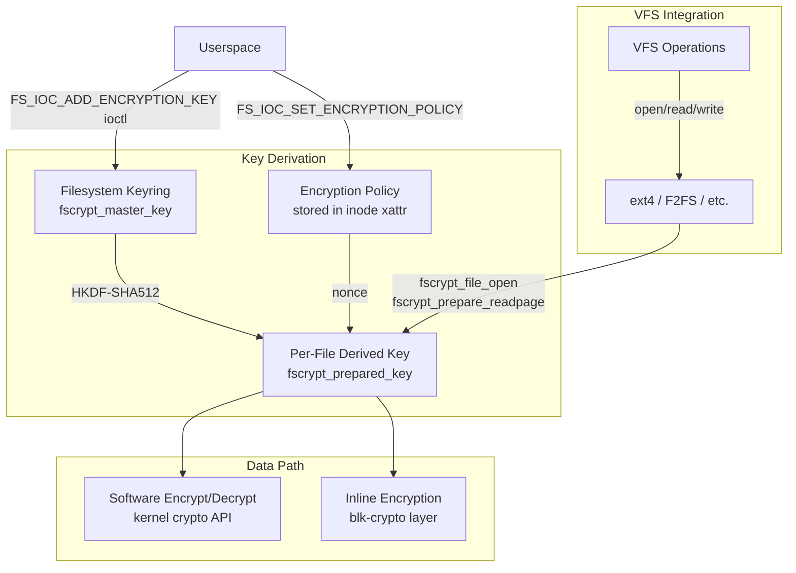
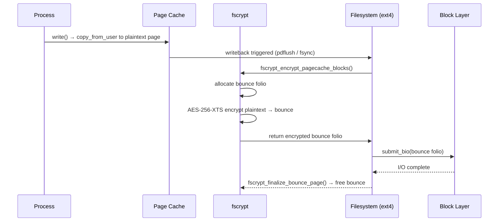

# fscrypt — Filesystem-Level Encryption Subsystem

> 📘 Plain-language version: [[fscrypt-explained]]

## Overview

fscrypt is a kernel library (`fs/crypto/`) that provides transparent, per-file encryption for supported filesystems. Unlike block-level encryption (dm-crypt) or stacked filesystems (eCryptfs), fscrypt operates inside the filesystem itself, enabling per-directory encryption policies where different directories can use different keys and unencrypted files can coexist on the same volume. It protects file contents and filenames against offline attacks while leaving filesystem metadata (sizes, timestamps, xattrs) in plaintext to preserve filesystem integrity tooling.

Supported filesystems: **ext4**, **F2FS**, **UBIFS**, **CephFS**, and **Btrfs** (per-extent encryption in progress).

## Mental Model

Think of fscrypt as a **key-derivation tree rooted at a master key**. A user unlocks a directory by supplying a master key to the kernel. The kernel never uses that key directly for encryption — instead, each encrypted inode stores a randomly-generated 16-byte *nonce* in an xattr, and the kernel derives a unique per-file subkey by running `HKDF-SHA512(master_key, nonce, context)`. Contents are then encrypted with AES-256-XTS (or another configured cipher) using that per-file key. Locking a directory means evicting those derived subkeys from memory; the ciphertexts remain on disk, readable only after the master key is re-added.

## Architecture

Data flows from the VFS layer down through filesystem-specific code, which calls fscrypt hooks at the moment pages are read into or written out of the page cache. Key lookup is keyed by (filesystem superblock, key specifier) and cached in `fscrypt_info` attached to each inode.

---

## Core Components

### [[fscrypt-policy]]

**Purpose** — The encryption policy is the persistent specification of *which* cipher suite and *which* master key protect a directory tree. It is set once (via ioctl) and never changes for the lifetime of that directory.

**How it works** — When a user calls `FS_IOC_SET_ENCRYPTION_POLICY` on an empty directory, the kernel validates the requested policy, then calls `fscrypt_ioctl_set_policy()` which writes an `fscrypt_context` xattr to the directory inode. All files and subdirectories subsequently created inherit this policy automatically — the filesystem's `create()` and `mkdir()` VFS callbacks call `fscrypt_inherit_context()` which reads the parent's context and writes the same policy (with a new random nonce) to the child.

Two policy versions exist. **v1** (legacy) identifies the master key by an 8-byte human-chosen *descriptor* and uses AES-128-ECB as its KDF — a design later shown to be vulnerable to electromagnetic side-channel attacks (Unterluggauer & Mangard, 2016). **v2** (current) identifies the master key by a 16-byte *identifier* derived as a cryptographic hash of the key material, uses HKDF-SHA512 for derivation, and adds a verification mechanism so the kernel rejects wrong-key lookups deterministically.

**Key struct**: `struct fscrypt_policy_v2` (`include/uapi/linux/fscrypt.h`)
- `version` — must be `FSCRYPT_POLICY_V2` (2)
- `contents_encryption_mode` — e.g. `FSCRYPT_MODE_AES_256_XTS`
- `filenames_encryption_mode` — e.g. `FSCRYPT_MODE_AES_256_CTS`
- `flags` — `FSCRYPT_POLICY_FLAG_DIRECT_KEY`, `_IV_INO_LBLK_64`, `_IV_INO_LBLK_32`
- `log2_data_unit_size` — 0 means filesystem block size (v2 only)
- `master_key_identifier[16]` — cryptographic hash of master key

**Key struct**: `struct fscrypt_context_v2` (`fs/crypto/fscrypt_private.h`)
- `version`, `contents_encryption_mode`, `filenames_encryption_mode`, `flags`
- `log2_data_unit_size`
- `master_key_identifier[16]`
- `nonce[FSCRYPT_FILE_NONCE_SIZE]` — 16-byte random value unique to this inode

**Key functions**:
- `fscrypt_ioctl_set_policy()` — validates and stores a policy on a directory
- `fscrypt_ioctl_get_policy_ex()` — retrieves the v1 or v2 policy from an inode
- `fscrypt_inherit_context()` — copies parent policy to newly created child, generating a fresh nonce
- `fscrypt_policy_to_key_spec()` — converts a policy's identifier/descriptor into a key lookup token

**Config & flags**:
- `CONFIG_FS_ENCRYPTION=y` — enables the entire fscrypt subsystem
- `FSCRYPT_POLICY_FLAG_IV_INO_LBLK_64/32` — hardware-oriented IV schemes (see inline encryption below)
- `FSCRYPT_POLICY_FLAG_DIRECT_KEY` — bypasses per-file KDF for Adiantum, uses nonce directly in IV

---

### [[fscrypt-key-management]]

**Purpose** — Master keys must be securely stored, derived from, and removed without leaking raw key material to userspace or across security boundaries. The key management component owns the lifecycle from `FS_IOC_ADD_ENCRYPTION_KEY` through eviction.

**How it works** — Keys are stored in a **filesystem-level keyring** (`s_master_keys`) attached to each superblock, not in the process keyring. This was a deliberate change from the v1 design, where keys were stored in process-subscribed keyrings (`@s`/`@u`). The old model created a visibility problem: `sudo` or another privileged helper would add a key under its UID, but the key would not be visible to the original user. The filesystem keyring is superblock-scoped and visible to all processes on that filesystem regardless of UID.

When `FS_IOC_ADD_ENCRYPTION_KEY` is called, `fscrypt_add_key_to_keyring()` checks whether a key with that identifier already exists in `s_master_keys`. If it does and the caller is not root, it verifies ownership and increments a per-UID reference count. If not, it allocates a `fscrypt_master_key`, copies the raw key bytes into kernel memory, runs HKDF-SHA512 to derive a *key hash* for future verification, and inserts the key into the superblock's keyring.

When `FS_IOC_REMOVE_ENCRYPTION_KEY` is called, the kernel first decrements the per-UID reference count. Once the count reaches zero, it marks the key as being removed and calls `fscrypt_evict_inodes()` which walks all inodes on the filesystem and calls `fscrypt_drop_inode()` for any whose key is being removed. If inodes are still in use (open file descriptors), the key enters a **partially-removed** state reported by `FS_IOC_GET_ENCRYPTION_KEY_STATUS`. A background task retries eviction until the inode count drops to zero.

**Key struct**: `struct fscrypt_master_key` (`fs/crypto/keyring.c`)
- `mk_spec` — `fscrypt_key_specifier` (descriptor or identifier)
- `mk_secret` — raw key bytes (wiped on removal)
- `mk_users` — per-UID user count (prevents premature removal)
- `mk_decrypted_inodes` — list of inodes currently using this key
- `mk_serial_number` — monotonically increasing, used to detect stale prepared keys
- `mk_present` — atomic flag; cleared when removal begins

**Key struct**: `struct fscrypt_prepared_key` (`fs/crypto/fscrypt_private.h`)
- `tfm` — software crypto transform handle (NULL if using inline encryption)
- `blk_key` — opaque blk-crypto key (NULL if using software path)

**Key functions**:
- `fscrypt_ioctl_add_key()` — adds a master key to the filesystem keyring
- `fscrypt_ioctl_remove_key()` — initiates removal, evicts inodes, may leave partially-removed state
- `fscrypt_ioctl_get_key_status()` — returns `ABSENT`, `PRESENT`, or `INCOMPLETELY_REMOVED`
- `fscrypt_get_master_key()` — looks up the master key for an inode during open
- `fscrypt_derive_key()` — runs HKDF-SHA512 to produce a per-file derived key
- `fscrypt_prepare_key()` — allocates and initialises a `fscrypt_prepared_key` from derived bytes

**Config & flags**:
- `FSCRYPT_KEY_SPEC_TYPE_IDENTIFIER` (v2) vs `FSCRYPT_KEY_SPEC_TYPE_DESCRIPTOR` (v1)
- `FSCRYPT_ADD_KEY_FLAG_HW_WRAPPED` — key is hardware-wrapped (never raw in kernel memory)

---

### [[fscrypt-inode-info]]

**Purpose** — Every open encrypted inode needs fast access to its derived key and cipher transform. The `fscrypt_info` structure is this per-inode encryption context, allocated lazily on first access and attached to the inode.

**How it works** — The first operation on an encrypted inode (typically `open()`) calls `fscrypt_file_open()`, which calls `fscrypt_get_encryption_info()`. This function reads the `fscrypt_context` xattr from disk, looks up the corresponding master key in `s_master_keys`, runs the KDF to produce the per-file derived key, initialises a `fscrypt_prepared_key` (either a software `crypto_skcipher` or a `blk_key` for hardware), and stores the result in `inode->i_crypt_info` (cast as `fscrypt_info`).

For directories, an additional filenames key is derived — one for the directory's filenames, shared across all dentries in the directory. For inodes using `DIRECT_KEY` policy, no per-file derivation occurs; the master key material flows directly into the IV.

Key verification (v2 only): after deriving the per-file key, `fscrypt_verify_key()` recomputes the key hash and compares it against the stored value in `mk_hash`. This detects a wrong master key being added — the kernel returns `ENOKEY` rather than silently producing garbage decryption.

**Key struct**: `struct fscrypt_info` (`fs/crypto/fscrypt_private.h`)
- `ci_policy` — `fscrypt_policy_union`: which policy governs this inode
- `ci_enc_key` — `fscrypt_prepared_key`: the ready-to-use symmetric key
- `ci_master_key` — pointer back to `fscrypt_master_key` (keeps it alive)
- `ci_direct_key` — for `DIRECT_KEY` policies, cached directly-used key
- `ci_data_unit_bits` — log2 of the data unit size
- `ci_inode_hash` — stable hash of inode number (for `IV_INO_LBLK_32`)

**Key functions**:
- `fscrypt_file_open()` — entry point called by filesystem `open()`, ensures `ci` is prepared
- `fscrypt_get_encryption_info()` — allocates and populates `fscrypt_info` for an inode
- `fscrypt_free_inode()` — called on inode eviction, wipes derived key material and drops master key reference
- `fscrypt_drop_inode()` — asks the VFS to evict an inode when its master key is removed

---

### [[fscrypt-contents-encryption]]

**Purpose** — Transparently encrypt and decrypt file data as it moves between the page cache and storage, without the filesystem needing to understand the cipher details.

**How it works** — fscrypt intercepts data at the **page cache** boundary, not the block device boundary. This is the key distinction from dm-crypt: the page cache holds plaintext, and encryption/decryption happens as data moves to/from disk.

**Read path**: The filesystem reads ciphertext pages from disk into the page cache. Before handing those pages to userspace, it calls `fscrypt_decrypt_pagecache_blocks()`, which iterates over each data unit in the page, computes the IV (from the data unit index within the file, optionally combined with the inode number), and calls the `crypto_skcipher` transform to decrypt in-place while the folio lock is held. For inline encryption, the decryption is done by hardware during the bio submission itself — the kernel attaches a `blk_crypto_key` to the bio via `fscrypt_set_bio_crypt_ctx()` and the hardware handles the rest.

**Write path**: Encrypting in-place would corrupt the page cache (which must remain plaintext for future reads). Instead, `fscrypt_encrypt_pagecache_blocks()` allocates a temporary bounce folio, copies and encrypts the data there, then submits the bounce folio for writeback. The original plaintext page remains in cache. For inline encryption, the hardware encrypts during DMA to storage without a bounce folio.

**IV construction** is mode-dependent:
- Standard: IV = `(file_data_unit_index << 0)` — simple 64-bit counter per file
- `IV_INO_LBLK_64`: IV = `(inode_number << 32) | data_unit_index` — enables hardware-shared key across files
- `IV_INO_LBLK_32`: IV = `SipHash(inode_number) + data_unit_index` — 32-bit IVs for eMMC v5.2 constraints
- `DIRECT_KEY`: IV includes the 16-byte file nonce — no per-file key derivation needed

**Key struct**: `struct fscrypt_encrypt_bio_ctx` (internal, bio lifecycle)
- Carries the `fscrypt_info` reference and bounce page list through async I/O completion

**Key functions**:
- `fscrypt_encrypt_pagecache_blocks()` — encrypts page cache data into bounce pages for writeback
- `fscrypt_decrypt_pagecache_blocks()` — decrypts ciphertext in-place after a page read
- `fscrypt_encrypt_block_inplace()` — for UBIFS variable-size data units
- `fscrypt_decrypt_block_inplace()` — counterpart for UBIFS
- `fscrypt_set_bio_crypt_ctx()` — attaches inline encryption context to a bio
- `fscrypt_zeroout_range()` — encrypts zeroes for hole-punching (file hole initialisation)

**Config & flags**:
- `CONFIG_FS_ENCRYPTION_INLINE_CRYPT` — enables blk-crypto integration
- `-o inlinecrypt` mount option — activates inline encryption for the filesystem instance
- `log2_data_unit_size` (v2 policy) — controls sub-block encryption granularity

---

### [[fscrypt-filenames-encryption]]

**Purpose** — Encrypt directory entry names to prevent an attacker reading raw filesystem data from learning file structure even when file contents are protected.

**How it works** — When the filesystem needs to create or look up a directory entry, it calls `fscrypt_encrypt_symlink()` or `fscrypt_fname_encrypt()`. These derive a **filenames key** for the directory (separate from the contents key — using a different HKDF context label) and encrypt the full filename in one pass using AES-256-CBC-CTS or AES-256-HCTR2 (for modes supporting arbitrary-length messages).

Unlike contents encryption, filenames use the **same IV for all names within a directory** (the IV is all-zeros or incorporates the inode number, but not the individual filename). This is intentional: using per-filename IVs would require storing them somewhere, increasing xattr overhead. The trade-off is that two identical filenames in the same directory produce identical ciphertexts — but because filenames are encrypted atomically (not in block-sized chunks), this is acceptable.

**Padding** is applied to obscure filename lengths: names shorter than 16 bytes are NUL-padded to 16; longer names get additional NUL-padding to the next 4, 8, 16, or 32-byte boundary as configured in the policy's `flags`. This defeats length-analysis attacks.

**Long filenames** that would exceed filesystem limits after Base64url encoding (which expands binary ciphertext by ~4/3) are handled with a **strong hash** approach: the ciphertext is hashed, the hash prefix is stored as the on-disk dentry name, and the full ciphertext is stored in a separate xattr. A `fscrypt_nokey_name` struct on the stack carries both for the duration of a lookup.

When a directory's key is unavailable, fscrypt returns **no-key names** — the Base64url-encoded ciphertext — so userspace can still list directory contents (as opaque names) and pass them back to kernel operations that only require name identity, not meaning.

**Key struct**: `struct fscrypt_str` (`include/linux/fscrypt.h`)
- `name` — pointer to the (en/de)crypted name buffer
- `len` — current length

**Key struct**: `struct fscrypt_nokey_name` (`fs/crypto/fname.c`)
- `dirhash[2]` — directory hash for no-key lookups
- `bytes[149]` — Base64url-encoded ciphertext of the real name

**Key functions**:
- `fscrypt_fname_encrypt()` — encrypts a filename with the directory's filenames key
- `fscrypt_fname_decrypt()` — decrypts a ciphertext dentry name
- `fscrypt_setup_filename()` — called by filesystems during lookup; handles both keyed and no-key cases
- `fscrypt_free_filename()` — frees any allocated buffers from `fscrypt_setup_filename()`
- `fscrypt_match_name()` — compare a dentry name against an encrypted target during directory search

**Config & flags**:
- `FSCRYPT_POLICY_FLAGS_PAD_*` — pad filenames to 4/8/16/32-byte boundaries
- `FSCRYPT_MODE_AES_256_HCTR2` — length-preserving filenames cipher (no padding needed)

---

### [[fscrypt-inline-encryption]]

**Purpose** — Offload encryption and decryption to dedicated hardware engines in storage controllers, reducing CPU overhead and enabling features like hardware-wrapped keys that never exist as plaintext in DRAM.

**How it works** — When a filesystem is mounted with `-o inlinecrypt` and `CONFIG_FS_ENCRYPTION_INLINE_CRYPT=y`, fscrypt uses the **blk-crypto** layer (`block/blk-crypto*.c`) instead of the kernel crypto API. Instead of encrypting data in software before submitting I/O, fscrypt attaches a `blk_crypto_key` and an IV to each `struct bio` via `fscrypt_set_bio_crypt_ctx()`. The block layer passes these alongside the data to the device driver, which programs the hardware ICE (Inline Crypto Engine) to encrypt/decrypt during DMA.

When hardware lacks support for the required algorithm or IV width, the block layer transparently falls back to `blk-crypto-fallback` — a software reimplementation that encrypts bounce pages in a workqueue before submission — so filesystems can always enable `-o inlinecrypt` without worrying about hardware capabilities.

**DUN (Data Unit Number) continuity** is a critical constraint: ext4 and F2FS must ensure that the BIOs they submit for inline encryption have *contiguous* DUNs. A BIO covering data units 5–10 must have DUNs 5, 6, 7, 8, 9, 10 in order. If a filesystem would need to split such a BIO (e.g., because of a hole), it must submit separate BIOs instead.

**Hardware-wrapped keys** extend inline encryption further: the raw master key material never resides in DRAM at all. The hardware exports a *wrapped key* blob at provisioning time; the kernel passes this blob through to the ICE, which internally unwraps it in a secure enclave. For filename encryption and other non-content uses, fscrypt derives a *software secret* from the wrapped key using a special hardware operation (`BLK_CRYPTO_KEY_TYPE_HW_WRAPPED`), keeping content and non-content key material isolated.

**Key struct**: `struct blk_crypto_key` (`include/linux/blk-crypto.h`)
- `crypto_cfg` — algorithm, key size, data unit size
- `raw[BLK_CRYPTO_MAX_KEY_SIZE]` — raw or wrapped key bytes
- `hash` — for hardware key deduplication

**Key functions**:
- `fscrypt_set_bio_crypt_ctx()` — attaches (key, IV) to a bio for inline encryption
- `fscrypt_get_mergeable_bio_crypt_ctx()` — checks if a new request can be merged with an existing bio
- `fscrypt_inode_uses_inline_crypto()` — tests whether an inode is configured for hardware path
- `blk_crypto_init_key()` — initialises a `blk_crypto_key` from raw bytes

**Config & flags**:
- `CONFIG_FS_ENCRYPTION_INLINE_CRYPT` — compile-time enablement
- `-o inlinecrypt` — per-mount activation
- `SB_INLINECRYPT` — superblock flag set on inlinecrypt mounts
- `CONFIG_BLK_INLINE_ENCRYPTION_FALLBACK` — software fallback for missing hardware support
- `FSCRYPT_ADD_KEY_FLAG_HW_WRAPPED` — signals hardware-wrapped key to `FS_IOC_ADD_ENCRYPTION_KEY`

---

## How Components Interact

### Opening an encrypted file

1. Process calls `open("/encrypted/dir/file")`. The VFS resolves the path, calling the filesystem's `lookup()` which reaches `fscrypt_setup_filename()` to decrypt directory entry names during traversal.
2. On finding the target inode, the filesystem's `open()` calls `fscrypt_file_open()`.
3. `fscrypt_file_open()` calls `fscrypt_get_encryption_info()`, which reads the `fscrypt_context` xattr, extracts the key identifier, and calls `fscrypt_get_master_key()` to find the key in `s_master_keys`.
4. If the master key is present, `fscrypt_derive_key()` runs HKDF-SHA512 with the inode's nonce and allocates a `fscrypt_prepared_key`. For inline encryption, a `blk_crypto_key` is also initialised.
5. The resulting `fscrypt_info` is atomically stored into `inode->i_crypt_info`. Future opens reuse it.
6. Reads subsequently call `fscrypt_decrypt_pagecache_blocks()` (software) or attach a `blk_crypto_key` to the bio (hardware).

### Removing a key while files are open

1. Process calls `FS_IOC_REMOVE_ENCRYPTION_KEY`. `fscrypt_ioctl_remove_key()` decrements the per-UID reference count.
2. If count reaches zero, the key is marked `!mk_present` and `fscrypt_evict_inodes()` walks `mk_decrypted_inodes`.
3. For each inode in the list, `fscrypt_drop_inode()` returns 1 to the VFS, triggering eviction.
4. Inodes with active file descriptors cannot be evicted; `FS_IOC_GET_ENCRYPTION_KEY_STATUS` returns `INCOMPLETELY_REMOVED`.
5. A periodic workqueue retry (`fscrypt_retryable_eviction_work`) keeps attempting eviction until all references drop. Only then is the master key's `mk_secret` zeroed and freed.

### Writing to an encrypted file (software path)

---

## Where It Fits in the Kernel

- **↑ Userspace**: Three ioctl families on the directory fd — `FS_IOC_SET/GET_ENCRYPTION_POLICY`, `FS_IOC_ADD/REMOVE/GET_ENCRYPTION_KEY`, and `FS_IOC_GET_ENCRYPTION_NONCE`. No new syscalls were added; all operations piggyback on `ioctl(2)`.
- **→ [[keyring-and-credentials|Kernel Keyring]]**: The filesystem-level keyring (`s_master_keys`) is implemented using the kernel keyring subsystem. v1 policies also read from the session keyring via `fscrypt_get_v1_key()`.
- **→ [[kernel-crypto-api|Kernel Crypto API]]**: Software encryption goes through `crypto_alloc_skcipher()` / `crypto_skcipher_encrypt()`. HKDF-SHA512 uses `crypto_shash` for HMAC-SHA512 internally.
- **→ [[block-layer|Block Layer / blk-crypto]]**: Inline encryption attaches `blk_crypto_key` to `struct bio`; the block layer routes these to hardware or the blk-crypto-fallback.
- **← Filesystems**: ext4, F2FS, UBIFS, CephFS, Btrfs call into fscrypt at inode creation, open, read, write, and directory lookup. The integration surface is ~15 fscrypt hooks; filesystems opt in via `sb->s_cop = &fscrypt_operations`.
- **↓ Hardware**: UFS/eMMC inline crypto engines (Qualcomm ICE, Mediatek) handle the actual AES-XTS transform on the storage controller.

---

## Design Decisions & Tradeoffs

**Per-file keys via KDF, not wrapping** — Instead of generating a random per-file key and wrapping it with the master key (requiring a full key blob per file in an xattr), fscrypt derives each per-file key deterministically from the master key and a 16-byte per-inode nonce. This reduces the xattr from ~40 bytes (wrapped AES-256 key) to 16 bytes (nonce), materially reducing the probability of inline inode storage failures in ext4. The tradeoff is that a compromised master key implies compromise of all derived keys.

**No authenticated encryption** — fscrypt uses unauthenticated ciphers (AES-XTS, Adiantum, HCTR2). Adding authentication (e.g., AES-GCM) would require storing a per-block authentication tag, increasing metadata overhead and complicating the block layer interface. The design relies on the filesystem's own checksumming (Btrfs, ext4 journal checksums) to detect corruption rather than per-block MACs.

**Plaintext metadata** — Filesystem metadata (inode tables, extent trees, bitmaps) is not encrypted. This is intentional: encrypting metadata would require mounting the filesystem to run fsck, making offline repair impossible if the key is unavailable. The threat model is offline physical access — an attacker with the raw disk image learns file sizes and timestamps, but not file contents or names.

**Filesystem-level keyring (v2)** — The shift from process-subscribed keyrings to a superblock-scoped keyring solved the multi-user key visibility problem. The old model required all processes needing access to run under the key owner's UID, creating problems for FUSE helpers, backup daemons, and sudo escalation. The new model makes keys visible to all processes on the filesystem.

**v1 legacy support** — v1 policies remain supported indefinitely because removing them would break existing encrypted ext4/F2FS volumes deployed on Android devices. The Android ecosystem was an early adopter, and the installed base of v1-encrypted devices is enormous.

---

## How It Has Evolved

| Kernel | Change |
|--------|--------|
| 4.1 | Initial fscrypt in ext4, as `ext4_encryption` |
| 4.2 | Generalised to `fs/crypto/`, F2FS support added |
| 4.8 | Adiantum cipher support added |
| 5.0 | UBIFS integration via non-page I/O model |
| 5.4 | v2 encryption policies: HKDF-SHA512, filesystem-level keyring |
| 5.7 | Key status ioctl, partial-removal detection |
| 5.9 | Inline encryption (blk-crypto) integration |
| 5.13 | Hardware-wrapped key support for inline encryption |
| 5.17 | Casefolding + encryption co-support (ext4, F2FS) |
| 6.6 | CephFS support |
| 6.7+ | Btrfs per-extent encryption (in progress) |
| 6.8+ | `log2_data_unit_size` for sub-block encryption granularity |

---

## Recent Development Activity

- **Btrfs per-extent encryption**: Meta's patch series to extend fscrypt with per-extent key semantics for Btrfs is the largest active development area. It requires new `fscrypt_extent_context` xattrs and a changed key lookup path from inode-based to extent-based. Status: under active review.
- **dirlock**: A userspace tool being developed to lock/unlock encrypted directories using the filesystem keyring ioctls, simplifying the user experience for encrypted home directories (as an alternative to PAM integration).
- **Sub-block data units**: `log2_data_unit_size` in v2 policies allowing encryption granularity smaller than filesystem block size — useful for Btrfs compressed extents and UBIFS variable-size data.
- **Hardware-wrapped keys expansion**: Extending support to more SoCs and standardising the wrapped-key interface across vendor ICE implementations.

---

## Further Reading

1. [fscrypt kernel documentation](https://www.kernel.org/doc/html/latest/filesystems/fscrypt.html) — the authoritative reference; covers the full API
2. [fscrypt v2 policies and filesystem keyring (LWN)](https://lwn.net/Articles/737274/) — explains the v1 shortcomings and v2 design rationale
3. [fscrypt key management improvements (LWN)](https://lwn.net/Articles/795378/) — key verification, secure removal, partial-removal state
4. [Inline encryption support (LWN)](https://lwn.net/Articles/824841/) — blk-crypto integration, DUN continuity requirements
5. [Per-extent encrypted keys for Btrfs (LWN)](https://lwn.net/Articles/918893/) — next frontier in fscrypt evolution
6. [UBIFS file encryption (LWN)](https://lwn.net/Articles/704261/) — how a non-block filesystem adapted to fscrypt's page model

## LKML Highlights

- **v2 policy introduction** (`20190720215625.136948-1-ebiggers@kernel.org`): Introduced HKDF-SHA512 and the filesystem-level keyring, replacing the ad-hoc AES-128-ECB KDF and session keyring model. Debate centred on whether a new ioctl API was justified vs. extending the existing keyring syscalls.
- **Inline encryption** (`20200717014540.59122-1-satyat@google.com`): Added `blk_crypto_key` attachment to bios. Key debate was whether fscrypt should own the blk-crypto key lifecycle or whether the block layer should, ultimately landing on fscrypt ownership with block layer hosting.
- **Per-extent encryption for Btrfs** (`20230925211346.4159537-1-sweettea-kernel@dorminy.me`): Ongoing series to redesign fscrypt's inode-centric key model into an extent-centric one, enabling Btrfs snapshot-friendly key rotation. Main review concern: complexity of the key derivation path change and its interaction with the existing filesystem keyring.
