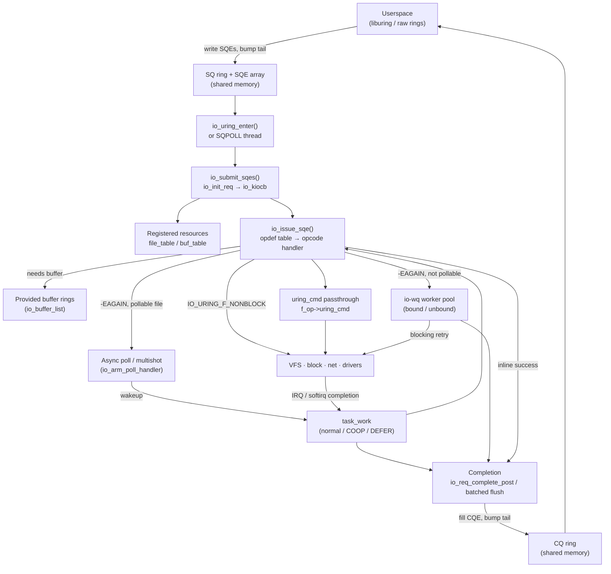
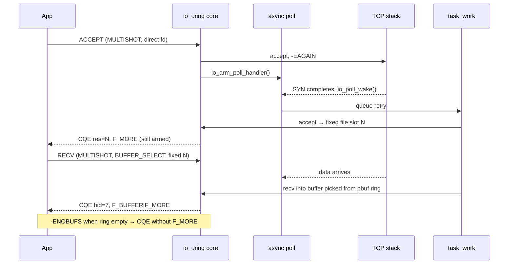

# io_uring Subsystem

## Overview

io_uring is the kernel's general-purpose asynchronous system-call interface. A process creates a ring with `io_uring_setup(2)`, describes operations as 64-byte submission queue entries (SQEs) in shared memory, and reads results back as completion queue entries (CQEs) from a second shared ring. What began in 5.1 (2019) as a faster replacement for Linux AIO has grown into a parallel syscall surface: well over 50 opcodes covering file, socket, filesystem-metadata, futex, process-wait and driver-specific ("passthrough") operations, plus zero-copy send and receive, kernel-managed buffer pools, and—since 7.1—BPF-driven event loops. The subsystem lives in its own top-level `io_uring/` directory.

## Mental Model

io_uring is a **dispatcher sitting in front of the whole kernel**. Userspace drops work orders into a mailbox (the SQ ring); the dispatcher first tries to do each job on the spot without ever blocking (the *inline non-blocking attempt*). If a job would block, the dispatcher picks the cheapest way to wait for it: park it on the file's wait queue and retry when it's ready (*async poll*), hand it to a helper thread that is allowed to sleep (*io-wq*), or let the device complete it and post the result via *task_work*. Everything else in the subsystem—registered resources, provided buffers, SQPOLL, multishot, zero-copy—exists to make one of those four paths cheaper.

## Architecture

Read the diagram from the top: submissions always enter through `io_submit_sqes()` (driven by `io_uring_enter()` or the SQPOLL thread), become `struct io_kiocb` requests, and are issued once with `IO_URING_F_NONBLOCK`. The branches below `io_issue_sqe()` are the fallbacks for operations that cannot complete immediately. Note that `task_work` feeds back into both issue (retry after a poll wakeup) and completion (post the CQE in the submitter's context)—it is the glue that returns work to the owning task.

---

## Core Components

### [[io-uring-internals|Rings and the request lifecycle]]

**Purpose** — The shared SQ/CQ rings are the interface itself: they let userspace submit and reap without a syscall per operation, and they let completions arrive in any order.

**How it works** — `io_uring_setup()` allocates a `struct io_ring_ctx`, the per-ring anchor, and three memory regions (SQ ring header with its index array, the SQE array, and the CQ ring). Userspace maps them, writes SQEs, and advances the SQ tail with a release store. `io_submit_sqes()` walks from head to tail; for each entry `io_init_req()` allocates an `io_kiocb`, copies the opcode and flags, resolves the file (or looks it up in the fixed-file table), and snapshots credentials. Each opcode is described by an entry in `io_issue_defs[]` (`io_uring/opdef.c`), whose `.prep` validates the SQE and whose `.issue` performs the work; flags on the def (`needs_file`, `pollin`/`pollout`, `buffer_select`, `iopoll`, `unbound_nonreg_file`) tell the core which fallback paths the opcode supports. Links (`IOSQE_IO_LINK`, `IOSQE_IO_HARDLINK`), drains (`IOSQE_IO_DRAIN`) and linked timeouts are handled in the core rather than per opcode. The full walk-through already lives in the concept note [[io-uring-internals]].

**Key struct**: `struct io_ring_ctx` (`include/linux/io_uring_types.h`)
- `rings`, `sq_sqes` — the shared ring header and SQE array
- `submit_state` — per-submission batch state, including the completion list `compl_reqs`
- `uring_lock` — serialises submission and registration (skipped in some SINGLE_ISSUER paths)
- `file_table`, `buf_table` — registered resources
- `io_bl_xa` — xarray of provided-buffer groups
- `cq_overflow_list` — CQEs that did not fit in the CQ ring

**Key functions**:
- `io_uring_setup()` / `io_uring_create()` — ring creation
- `io_submit_sqes()` → `io_submit_sqe()` → `io_queue_sqe()` → `io_issue_sqe()` — the submission spine
- `io_req_complete_post()`, `io_submit_flush_completions()` — single and batched CQE posting

**Config & flags** — `CONFIG_IO_URING`; sysctls `kernel.io_uring_disabled` (0 = allowed, 1 = only members of `kernel.io_uring_group`, 2 = disabled, 6.6+). Setup flags `IORING_SETUP_CQSIZE`, `IORING_SETUP_SQE128`/`CQE32` (big entries for passthrough), `IORING_SETUP_NO_MMAP` (user-provided ring memory), `IORING_SETUP_NO_SQARRAY` (drop the SQ index indirection).

---

### [[io-wq]]

**Purpose** — Some operations simply must block (buffered writes that take `i_rwsem`, `fsync`, many `openat` paths, anything on a file that does not honour `IOCB_NOWAIT`). io-wq is the per-task pool of kernel threads that performs those blocking retries so the submitter never sleeps.

**How it works** — When an inline attempt returns `-EAGAIN` and the file cannot be polled, `io_queue_iowq()` hands the request's embedded `struct io_wq_work` to `io_wq_enqueue()`. Work is split into two accounting classes, **bound** (regular files and block devices—finite latency, capped by a limit derived from ring size and CPU count) and **unbound** (sockets, pipes, anything that may wait indefinitely—capped by `RLIMIT_NPROC`), so that a pile of stuck network requests cannot starve disk I/O of workers. Buffered writes to the same inode are *hashed*: `io_wq_hash_work()` tags them with the inode, and only one worker processes a given hash chain at a time, which avoids a thundering herd of workers all queueing on the same `i_rwsem`. Since 5.12 workers are not kthreads but *io threads* created with `create_io_thread()` from the submitting task (flag `PF_IO_WORKER`); they share the submitter's `mm`, files and credentials, which removed an entire class of bugs where kthreads had to borrow those resources by hand. Idle workers exit after a timeout; new workers are spawned via task_work in the owning task when all current workers are busy.

**Key struct**: `struct io_wq` (`io_uring/io-wq.c`)
- `acct[IO_WQ_ACCT_NR]` — bound and unbound `io_wq_acct`, each with `max_workers`, `nr_workers` and a work list
- `hash` — shared `io_wq_hash` for serialising hashed work
- `task` — the task that owns the pool

**Key functions**:
- `io_wq_enqueue()` — queue work, waking or creating a worker
- `io_wq_worker()` — worker main loop; calls `io_wq_submit_work()` → `io_issue_sqe()` without `IO_URING_F_NONBLOCK`
- `io_wq_cancel_cb()` — cancellation of queued or running work

**Config & flags** — `IOSQE_ASYNC` forces io-wq immediately; `IORING_REGISTER_IOWQ_MAX_WORKERS` caps bound/unbound counts; `IORING_REGISTER_IOWQ_AFF` sets worker CPU affinity; `IORING_SETUP_ATTACH_WQ` shares a pool between rings.

---

### [[sqpoll]]

**Purpose** — Even a batched `io_uring_enter()` is a syscall. SQPOLL dedicates a kernel thread to watching the SQ ring so that steady-state submission costs nothing but a memory write.

**How it works** — With `IORING_SETUP_SQPOLL`, setup creates (or, with `IORING_SETUP_ATTACH_WQ`, joins) a `struct io_sq_data` and an io thread running `io_sq_thread()`. The thread loops over every ring attached to it, calling `__io_sq_thread()` → `io_submit_sqes()`, reaping IOPOLL completions, and running pending task_work. When no work arrives for `sq_thread_idle` milliseconds it sets `IORING_SQ_NEED_WAKEUP` in the shared SQ flags and sleeps; userspace must then call `io_uring_enter(IORING_ENTER_SQ_WAKEUP)` once. The thread runs with the creator's credentials and `mm`, which is why it has been unprivileged since 5.11—it can do nothing the creating process could not.

**Key struct**: `struct io_sq_data` (`io_uring/sqpoll.h`)
- `ctx_list` — rings served by this thread
- `thread`, `sq_cpu` — the io thread and its pinned CPU
- `sq_thread_idle` — idle timeout before sleeping

**Key functions**:
- `io_sq_offload_create()` — creates/attaches the SQPOLL thread at setup
- `io_sq_thread()` — main polling loop

**Config & flags** — `IORING_SETUP_SQPOLL`, `IORING_SETUP_SQ_AFF` + `sq_thread_cpu`, `sq_thread_idle`; SQ flags `IORING_SQ_NEED_WAKEUP`, `IORING_SQ_CQ_OVERFLOW`; enter flags `IORING_ENTER_SQ_WAKEUP`, `IORING_ENTER_SQ_WAIT`.

---

### [[io-uring-task-work]]

**Purpose** — Many completions are detected in the wrong context: an IRQ handler, a softirq, a wait-queue callback. io_uring needs to finish them in the submitting task (to touch its memory, its files, and the ring without heavy locking). task_work is the mechanism that bounces that work back to the owning task.

**How it works** — `io_req_task_work_add()` queues the request on a lock-free list and notifies the task. In the default mode the notification is `TWA_SIGNAL`, which may IPI the task and forces it out of userspace—expensive and disruptive for busy servers. `IORING_SETUP_COOP_TASKRUN` (5.19) downgrades that to `TWA_SIGNAL_NO_IPI`, letting the work run at the next natural kernel entry, and `IORING_SETUP_TASKRUN_FLAG` sets `IORING_SQ_TASKRUN` so userspace knows to enter. `IORING_SETUP_DEFER_TASKRUN` (6.1, requires `IORING_SETUP_SINGLE_ISSUER`) goes further: completions are appended to the ring's own `work_llist` and run *only* when the task calls `io_uring_enter(IORING_ENTER_GETEVENTS)`. That gives the application full control over when completion processing interrupts it and lets the core batch hundreds of completions under one CQ lock.

**Key struct**: `struct io_uring_task` (`include/linux/io_uring_types.h`) — per-task io_uring state (`task_list`, the `io_wq` pointer, registered ring fds, inflight counters).

**Key functions**:
- `io_req_task_work_add()` — queue a request for task context
- `tctx_task_work()` — run normal task_work; `__io_run_local_work()` — run DEFER_TASKRUN work
- `io_submit_flush_completions()` — post a batch of CQEs at once

**Config & flags** — `IORING_SETUP_COOP_TASKRUN`, `IORING_SETUP_TASKRUN_FLAG`, `IORING_SETUP_SINGLE_ISSUER`, `IORING_SETUP_DEFER_TASKRUN`.

---

### [[registered-resources]]

**Purpose** — Every normal I/O pays for an `fdget()`/`fdput()` atomic pair and, for user buffers, a `get_user_pages()` walk. Registering files and buffers up front pays those costs once.

**How it works** — `io_uring_register(IORING_REGISTER_FILES)` takes a reference on each `struct file` and stores it in `ctx->file_table`; SQEs then pass `IOSQE_FIXED_FILE` and an index instead of an fd. "Direct descriptors" (5.15+) let `openat`, `accept` and `socket` install the new file straight into the table without ever creating a normal fd. `IORING_REGISTER_BUFFERS` pins pages with `pin_user_pages_fast()` (`FOLL_PIN`) and records them as a `bio_vec` array in an `io_mapped_ubuf`; `READ_FIXED`/`WRITE_FIXED` (and fixed-buffer send/recv/uring_cmd) import that bvec directly. Each slot is an `io_rsrc_node` with its own refcount, so a slot can be updated or unregistered while old requests still hold the previous node. Since 6.15 drivers such as ublk can register a *kernel* bvec into a slot (`io_buffer_register_bvec()`), which is how ublk achieves zero-copy.

**Key struct**: `struct io_mapped_ubuf` (`io_uring/rsrc.h`)
- `ubuf`, `len` — user virtual range covered
- `nr_bvecs`, `bvec[]` — pinned pages as bio_vecs
- `folio_shift` — lets huge-page registrations be iterated as large segments (6.12)

**Key functions**:
- `io_sqe_files_register()`, `io_sqe_buffers_register()` — registration
- `io_rsrc_node_lookup()` — slot lookup at issue time
- `io_import_reg_buf()` — build an `iov_iter` from a registered buffer

**Config & flags** — `IORING_REGISTER_FILES`/`_UPDATE2`, `IORING_REGISTER_BUFFERS2`, `IORING_RSRC_REGISTER_SPARSE`, `IORING_FILE_INDEX_ALLOC`, `IORING_REGISTER_RING_FDS` + `IORING_ENTER_REGISTERED_RING`, `IORING_REGISTER_CLONE_BUFFERS` (6.12). Pinned memory is charged against `RLIMIT_MEMLOCK`.

---

### [[provided-buffer-rings]]

**Purpose** — For a server with 10,000 idle sockets, pre-assigning a receive buffer to each pending recv wastes memory. Provided buffers let the kernel pick a buffer from a shared pool only when data actually arrives.

**How it works** — The application registers a buffer group with `IORING_REGISTER_PBUF_RING` (5.19): a single-producer/single-consumer ring of `struct io_uring_buf {addr, len, bid}` entries that userspace fills and the kernel consumes. An SQE with `IOSQE_BUFFER_SELECT` and a `buf_group` defers buffer choice to completion time; `io_buffer_select()` takes the next entry from the group's `io_buffer_list`, and the CQE reports the chosen buffer id in `cqe->flags >> IORING_CQE_BUFFER_SHIFT` with `IORING_CQE_F_BUFFER` set. If the ring is empty the request fails with `-ENOBUFS` (terminating a multishot). Refinements: `IOU_PBUF_RING_MMAP` (kernel-allocated ring), bundles (`IORING_RECVSEND_BUNDLE`, one CQE spanning several buffers) and `IOU_PBUF_RING_INC` (6.12, a large buffer consumed incrementally across completions). The older `IORING_OP_PROVIDE_BUFFERS` (5.7) list-based scheme remains for compatibility.

**Key struct**: `struct io_buffer_list` (`io_uring/kbuf.h`)
- `buf_ring` — mapped `struct io_uring_buf_ring`
- `bgid`, `head`, `mask` — group id and kernel-side consumer state
- `flags` — `IOBL_BUF_RING`, `IOBL_INC`

**Key functions**:
- `io_buffer_select()` / `io_buffers_select()` — pick one or a bundle of buffers
- `io_kbuf_recycle()` — return an unused buffer on retry
- `io_register_pbuf_ring()` — registration

**Config & flags** — `IOSQE_BUFFER_SELECT`, `IORING_REGISTER_PBUF_RING`, `IORING_REGISTER_PBUF_STATUS`, `IOU_PBUF_RING_MMAP`, `IOU_PBUF_RING_INC`, `IORING_RECVSEND_BUNDLE`.

---

### [[io-uring-async-poll-and-multishot]]

**Purpose** — Punting a socket read to an io-wq thread that then sleeps in `recv()` would recreate thread-per-connection. For pollable files io_uring instead waits on the file's own wait queue, and multishot extends that so one SQE can keep producing completions.

**How it works** — If a non-blocking attempt on a pollable file returns `-EAGAIN`, `io_arm_poll_handler()` attaches an internal poll (`struct async_poll`) to the file's wait queue via `vfs_poll()`. When the socket becomes readable, `io_poll_wake()` runs in the waker's context, claims the request via the atomic `poll_refs`, and queues task_work; `io_poll_task_func()` then retries the issue in the submitter's context. A *multishot* request (`REQ_F_APOLL_MULTISHOT`) does not disarm after success: it posts a CQE with `IORING_CQE_F_MORE` and immediately re-arms, until an error, `-ENOBUFS`, EOF, or cancellation posts a final CQE without `F_MORE`. The same machinery powers `IORING_OP_POLL_ADD` with `IORING_POLL_ADD_MULTI`, multishot accept (5.19), multishot recv (6.0), multishot read (6.7) and multishot timeouts (6.4). Cancellation looks requests up in hashed tables keyed by `user_data` or fd.

**Key struct**: `struct io_poll` (`io_uring/poll.h`) — `file`, wait-queue `head`, requested `events`, and the embedded `wait_queue_entry`.

**Key functions**:
- `io_arm_poll_handler()` — arm internal poll after `-EAGAIN`
- `io_poll_wake()` — wait-queue callback
- `io_poll_task_func()` — task_work retry/complete

**Config & flags** — `IORING_POLL_ADD_MULTI`, `IORING_ACCEPT_MULTISHOT`, `IORING_RECV_MULTISHOT`, `IORING_TIMEOUT_MULTISHOT`, CQE flag `IORING_CQE_F_MORE`.

---

### [[uring-cmd-passthrough]]

**Purpose** — Generic opcodes cannot express every driver's native command set. `IORING_OP_URING_CMD` gives any file a way to accept its own commands through io_uring, with the ring's batching and async completion.

**How it works** — A file implements `file_operations->uring_cmd(struct io_uring_cmd *, unsigned issue_flags)`. The SQE carries a `cmd_op` and an inline command payload (up to 80 bytes with `IORING_SETUP_SQE128`); the driver either completes inline or returns `-EIOCBQUEUED` and later calls `io_uring_cmd_done()`, usually from task context via `io_uring_cmd_complete_in_task()`. The first user (5.19) was NVMe passthrough on the `/dev/ngXnY` generic character devices; since then ublk (the userspace block driver, 6.0), socket commands (`SOCKET_URING_OP_*`, 6.7), FUSE-over-io_uring (6.14), btrfs encoded reads and block-device discard have followed. LSM hook `security_uring_cmd()` (6.0) exists because passthrough bypasses the normal permission checks of the generic paths.

**Key struct**: `struct io_uring_cmd` (`include/linux/io_uring/cmd.h`) — `file`, `sqe`, `cmd_op`, `flags`, and a small `pdu` area for driver-private state.

**Key functions**:
- `io_uring_cmd()` — issue handler calling `f_op->uring_cmd`
- `io_uring_cmd_done()` — post completion (with optional big-CQE payload)
- `io_uring_cmd_import_fixed()` — use a registered buffer from a command

**Config & flags** — `IORING_SETUP_SQE128`, `IORING_SETUP_CQE32`, `IORING_URING_CMD_FIXED`, `IORING_SETUP_IOPOLL` (polled passthrough via `f_op->uring_cmd_iopoll`).

---

### [[io-uring-zero-copy-networking]]

**Purpose** — At 100–400 Gbit/s, the `memcpy` between socket buffers and user memory dominates CPU cost. io_uring offers zero-copy transmit and (with capable NICs) zero-copy receive while keeping the kernel TCP stack in charge.

**How it works** — `IORING_OP_SEND_ZC` (6.0) and `SENDMSG_ZC` (6.1) pin the user pages and attach them to skbs; the first CQE (with `IORING_CQE_F_MORE`) reports bytes queued, and a second *notification* CQE (`IORING_CQE_F_NOTIF`) arrives when the network stack releases the pages and the buffer may be reused. Notifications are `io_notif` requests wrapping a `struct ubuf_info`. Zero-copy receive (zcrx, 6.15) binds an io_uring *interface queue* (`io_zcrx_ifq`) to one hardware RX queue with header/data split and flow steering; payloads are DMA'd into a user-registered area exposed to the page pool as `net_iov`s through a memory provider, `IORING_OP_RECV_ZC` posts 32-byte CQEs pointing at offsets in that area, and userspace returns consumed chunks through a refill ring.

**Key struct**: `struct io_zcrx_ifq` (`io_uring/zcrx.h`) — bound netdev and queue id, the registered `io_zcrx_area`, and the refill ring.

**Key functions**:
- `io_send_zc()` / `io_sendmsg_zc()` — zero-copy transmit
- `io_register_zcrx_ifq()` — bind an ifq to a hardware queue
- `io_recvzc()` — zero-copy receive issue

**Config & flags** — `IORING_SEND_ZC_REPORT_USAGE`, `IORING_REGISTER_ZCRX_IFQ`, `IORING_OP_RECV_ZC`; zcrx requires `IORING_SETUP_SINGLE_ISSUER`, `IORING_SETUP_DEFER_TASKRUN` and 32-byte CQEs.

---

## How Components Interact

**Scenario 1 — A buffered `read` that misses the page cache**

1. Userspace writes an `IORING_OP_READ` SQE and calls `io_uring_enter(to_submit=1)`.
2. `io_submit_sqes()` builds the `io_kiocb`; `io_issue_sqe(IO_URING_F_NONBLOCK)` calls `io_read()` with `IOCB_NOWAIT`.
3. The page is not cached. On filesystems that support async buffered reads (5.9+), `io_read()` sets `IOCB_WAITQ`, so `filemap_read()` starts readahead and, instead of sleeping on the folio lock, registers a `wait_page_queue` callback and returns `-EIOCBQUEUED`.
4. When the block I/O completes, the folio unlock fires the callback (`io_async_buf_func()`), which queues **task_work**.
5. Next time the task enters the kernel (or immediately, if it is waiting in `GETEVENTS`), the task_work retries the read, which now hits the cache, and the CQE is posted in a batch. io-wq was never involved. On a filesystem without async buffered reads, step 3 would instead punt to an **io-wq** bound worker.

**Scenario 2 — A TCP server with multishot accept and recv**

Here **registered resources** (direct descriptors) avoid ever creating a normal fd, **async poll** avoids io-wq threads, **provided buffer rings** avoid per-socket buffers, and **task_work** (ideally `DEFER_TASKRUN`) batches completions.

**Scenario 3 — NVMe passthrough with IOPOLL**

With `IORING_SETUP_IOPOLL | SQE128 | CQE32`, an `IORING_OP_URING_CMD` SQE reaches `nvme_ns_chr_uring_cmd()` via **uring_cmd**, which submits a raw NVMe command on a polled queue. There is no interrupt: `io_uring_enter(GETEVENTS)` (or the **SQPOLL** thread) calls `io_do_iopoll()`, which spins on the driver's `uring_cmd_iopoll` until the command completes, then posts the 32-byte CQE carrying the NVMe result.

## Where It Fits in the Kernel

- **↑ Userspace**: three syscalls—`io_uring_setup(2)`, `io_uring_enter(2)`, `io_uring_register(2)`—plus shared-memory rings. liburing is the reference library; language runtimes (Tokio's tokio-uring, glommio, Go and Java projects) and databases (RocksDB, ScyllaDB, TigerBeetle) build on it.
- **→ [[vfs]]**: file opcodes call the same `->read_iter`/`->write_iter`, `do_filp_open()`, `vfs_statx()` paths as syscalls; io_uring relies on `IOCB_NOWAIT`/`FMODE_NOWAIT` support in filesystems to avoid io-wq punts.
- **→ [[block]]**: O_DIRECT and passthrough I/O become bios or raw requests; polled completion uses the block layer's `iopoll` hooks.
- **→ [[net]]**: socket opcodes call `sock_sendmsg()`/`sock_recvmsg()`; zero-copy send uses `ubuf_info`, zcrx uses page-pool memory providers ([[page-pool]]).
- **→ mm**: registered buffers use [[get-user-pages-and-pinning]]; rings are mapped with `remap_pfn_range`-style or user-provided memory.
- **→ [[bpf]]**: since 7.1 a BPF struct_ops program can drive the event loop; BPF can also be attached via cgroup/LSM hooks that io_uring invokes.
- **← [[security]]**: LSM hooks `security_uring_override_creds()`, `security_uring_sqpoll()`, `security_uring_cmd()` let SELinux/Smack police io_uring; [[seccomp-bpf]] cannot see individual operations.
- **← Drivers**: NVMe, ublk ([[ublk]]), [[fuse]] and sockets implement `->uring_cmd` to accept io_uring-native commands.

## Design Decisions & Tradeoffs

**Try non-blocking first, then fall back.** Every request is first issued with `IO_URING_F_NONBLOCK`. This makes the common cached/ready case as cheap as a syscall-less function call, but it means every opcode must correctly handle `-EAGAIN` and be safe to re-issue—a major source of subtle bugs (partial reads/writes, state that must survive a retry, which is why many opcodes keep async state in `req->async_data`).

**Poll before punt.** Early io_uring (5.1–5.6) sent every blocking socket op to a worker thread, which scaled no better than thread-per-connection. The async-poll path (5.7) and later multishot turned io_uring into a true readiness-and-completion engine for networking. The cost is complexity: `poll_refs` ownership, double-poll for files with two wait queues, and cancellation races have been a steady source of CVEs.

**A syscall surface outside seccomp.** Because operations are dispatched from ring memory, seccomp filters see only `io_uring_enter()`. io_uring accepted this and offered its own controls—`IORING_REGISTER_RESTRICTIONS` (5.10, per ring), `kernel.io_uring_disabled` (6.6), LSM hooks, and a proposed task-level restriction mechanism (2026). Many sandboxes (Android, ChromeOS, Docker's default profile, Google's production fleet) still disable io_uring entirely, citing its CVE history.

**io threads instead of kthreads (5.12).** Workers originally were kthreads that temporarily adopted the submitter's `mm`, files and creds; every missed resource was a potential privilege bug. Making them real threads of the submitting process (`PF_IO_WORKER`) closed that class of bugs at the cost of workers appearing in the process's thread list.

**Completion in the submitter's context.** task_work-based completion keeps ring updates single-threaded and cache-local, but default `TWA_SIGNAL` delivery interrupts the application. The layered COOP_TASKRUN → DEFER_TASKRUN design lets applications trade latency for throughput explicitly rather than having one global policy.

**Generality over purity.** Rather than a narrow AIO replacement, io_uring grew to absorb futexes, `waitid`, `epoll_wait`, `bind`/`listen`, and driver passthrough. This lets applications run their entire event loop through one ring, but makes io_uring one of the largest and most security-sensitive syscall surfaces in the kernel.

## How It Has Evolved

- **5.1 (2019)** — merged: read/write (vectored and fixed), fsync, poll, NOP; io-wq arrives in 5.3 to replace generic workqueues.
- **5.4–5.6** — timeouts, linked requests, accept/connect, cancellation, and a burst of file opcodes (openat, close, statx, splice…).
- **5.7** — async poll for pollable files; `IORING_OP_PROVIDE_BUFFERS`.
- **5.10–5.11** — `IORING_REGISTER_RESTRICTIONS`; SQPOLL no longer privileged.
- **5.12** — io-wq and SQPOLL threads become `PF_IO_WORKER` io threads.
- **5.15** — direct descriptors (`openat`/`accept` into the fixed table).
- **5.19** — `IORING_OP_URING_CMD` + NVMe passthrough, SQE128/CQE32, provided buffer rings, multishot accept, COOP_TASKRUN; code moves from `fs/io_uring.c` to top-level `io_uring/` (split into per-feature files in 6.0).
- **6.0–6.1** — ublk, multishot recv, zero-copy send, `DEFER_TASKRUN` + `SINGLE_ISSUER`.
- **6.6–6.7** — `kernel.io_uring_disabled`; futex and `waitid` opcodes, multishot read, socket uring_cmds.
- **6.10–6.12** — recv/send bundles, bind/listen, incremental buffer rings, buffer cloning, huge-page coalescing, block discard.
- **6.13–6.16** — ring resizing and memory regions, FUSE-over-io_uring (6.14), zero-copy receive, epoll-wait opcode, vectored and kernel-bvec registered buffers for ublk zero-copy (6.15), zcrx improvements.
- **7.1 (2026)** — BPF struct_ops programs can replace the `io_uring_enter()` event loop.

## Recent Development Activity

- **Thread-identity handoff (RFC, Sep 2026)** — Jens Axboe proposes that when an inline-issued request is about to block, the scheduler swaps identities between the submitting thread and an io worker, so worker overhead is paid only when blocking actually happens. Early benchmarks show large wins for operations like tmpfs `fsync`; reviewers are cautious about the many conditions (ptrace, RT scheduling, futex ownership, shadow stacks) under which a swap must be refused.
- **Task-level restrictions** — `IORING_REGISTER_RESTRICTIONS_TASK` (Axboe, v5 early 2026) would apply inherited, immutable opcode/flag restrictions to every ring a task creates, giving container runtimes a seccomp-like control without banning io_uring outright.
- **BPF and io_uring** — Pavel Begunkov's BPF-controlled event loop landed for 7.1; Ming Lei's complementary `IORING_OP_BPF` (per-request BPF operations, aimed at ublk zero-copy and parity computation) continues to be discussed.
- **SINGLE_ISSUER lock elision** — Caleb Sander Mateos' series skips `uring_lock` on the issue and task_work paths when only one task can submit.
- **zcrx expansion** — ifq sharing across rings (David Wei), more drivers (mlx5, gve alongside bnxt), and DMA-buf areas for device memory.

## Further Reading

1. [Ringing in a new asynchronous I/O API — LWN (2019)](https://lwn.net/Articles/776703/) — the original design and why AIO was not enough.
2. [Redesigned workqueues for io_uring — LWN (2019)](https://lwn.net/Articles/803070/) — io-wq's rationale.
3. [The rapid growth of io_uring — LWN (2020)](https://lwn.net/Articles/810414/)
4. [An io_uring-based user-space block driver — LWN (2022)](https://lwn.net/Articles/904198/) — ublk and uring_cmd in practice.
5. [BPF comes to io_uring at last — LWN (2026)](https://lwn.net/Articles/1062286/)
6. [Task-level io_uring restrictions — LWN (2026)](https://lwn.net/Articles/1054225/)
7. [Thread-identity switcheroo for io_uring — LWN (2026)](https://lwn.net/SubscriberLink/1094303/50affb2e7bd3e698/)
8. [io_uring zero copy Rx — kernel.org](https://www.kernel.org/doc/html/latest/networking/iou-zcrx.html)
9. [kernel-internals.org io_uring series](https://kernel-internals.org/io-uring/)
10. [liburing wiki — What's new in 6.11 and 6.12](https://github.com/axboe/liburing/wiki/What's-new-with-io_uring-in-6.11-and-6.12)

## LKML Highlights

> lore.kernel.org could not be reached from this run (the lkml tool failed TLS verification and lore disallows automated web fetches), so these are taken from LWN's mirrors of the postings.

- **`<20220830125013.570060-1-dylany@fb.com>`** — Dylan Yudaken's "defer task work to when it is needed" (v4, Aug 2022). It argues that task_work interrupting a running task (e.g. a large recv memcpy landing in the middle of a send) hurts server latency, and introduces `DEFER_TASKRUN`, tied to `SINGLE_ISSUER` so the waiting and submitting task are guaranteed to be the same.
- **`<20241016185252.3746190-1-dw@davidwei.uk>`** — David Wei / Pavel Begunkov's zero-copy RX v6 (Oct 2024). It builds on the page-pool memory-provider abstraction shared with devmem TCP, adds a refill queue and copy fallback, and reports roughly 41% higher throughput than epoll at 200 Gbit/s. Merged in 6.15.
- **`<20251104162123.1086035-1-ming.lei@redhat.com>`** — Ming Lei's `IORING_OP_BPF` (Nov 2025). It proposes per-request BPF operations (buffer registration, memcpy between request buffers, ublk parity), and it sits alongside Begunkov's struct_ops event loop in the "BPF and io_uring, two different ways" debate.
