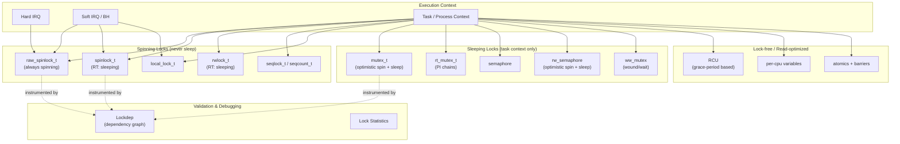

# Locking Subsystem

## Overview

The locking subsystem provides all synchronization primitives used throughout the Linux kernel to prevent data corruption when multiple CPUs simultaneously access shared data structures. It encompasses everything from low-level atomic operations and spinning locks — which never sleep — to sleeping locks like mutexes and semaphores, plus higher-level mechanisms like RCU that allow lock-free reads. The subsystem also includes the Lockdep runtime validator, which detects potential deadlocks before they manifest in production.

## Mental Model

Think of the locking subsystem as a **tiered concurrency toolkit organized by execution context**. Each primitive lives at a specific tier in the kernel's execution hierarchy: hardware interrupts sit at the top (can preempt everything), then softirqs, then kernel threads, then user context. The golden rule is that a lock from a lower tier cannot be held while calling into a higher tier — you cannot sleep inside a spinlock, and you cannot safely acquire a sleeping lock from interrupt context. Choose the primitive that matches the tier of the slowest context that must ever hold it.

## Architecture

Control flows top-down: an interrupt can always preempt task context. The fundamental constraint is that any path that can reach a sleeping lock must itself be sleepable. Lockdep instruments every acquisition at compile time, building a dependency graph that flags cycles and invalid cross-context usage at the first occurrence.

---

## Core Components

### [[spinlock-and-raw-spinlock]]

**Purpose** — Provide mutual exclusion in contexts where sleeping is forbidden: interrupt handlers, softirqs, and any code that must guarantee bounded latency without yielding the CPU. A spinning lock holds the CPU busy-waiting rather than entering a scheduler queue.

**How it works** — At its core a spinlock wraps a 32-bit `qspinlock` structure implementing the **queued spinlock (qspinlock)** algorithm, introduced in Linux 3.15 to replace the earlier ticket lock. The qspinlock packs three fields into one 32-bit word: an 8-bit locked byte, a 1-bit pending flag, and a 16-bit tail encoding (CPU id × 4 + context index). This last field points into each CPU's array of four `mcs_spinlock` nodes — one per execution level (task, softirq, hardirq, NMI).

When CPU A acquires an uncontended lock, it performs a single `cmpxchg` on the locked byte and proceeds. When CPU B arrives and finds the lock held, instead of spinning on the main lock word (which would cause every waiting CPU's cache line to bounce across the interconnect), it sets the pending bit (if only one waiter) or atomically appends its own `mcs_spinlock` node to the queue tail and spins locally on `node->locked`. When CPU A releases the lock it signals only the node at the head of the queue, not a shared cache line — eliminating the "thundering herd" cache coherency storm that plague ticket locks at scale.

`raw_spinlock_t` is guaranteed to be a qspinlock on every kernel configuration, including `PREEMPT_RT`. `spinlock_t` maps to `raw_spinlock_t` on non-RT kernels; on `PREEMPT_RT` it becomes an `rt_mutex`-backed spinning lock that can sleep, which is why code that truly cannot sleep (low-level interrupt handlers, clocksource drivers) must use `raw_spinlock_t` explicitly.

Acquisition disables preemption — on non-RT kernels it also optionally disables interrupts via `spin_lock_irqsave()`. Disabling preemption prevents the holding task from being scheduled out while the lock is held, closing the window for priority inversion. On a uniprocessor build (`!SMP`), spinning locks compile down to preemption toggling alone because there is only one CPU and no actual concurrent execution.

**Key struct**: `qspinlock` (`include/asm-generic/qspinlock_types.h`)
- `atomic_t val` — the packed 32-bit field: `[tail:16][pending:1][locked:8]`

`mcs_spinlock` (`kernel/locking/mcs_spinlock.h`):
- `struct mcs_spinlock *next` — next waiter in the queue
- `int locked` — 0 = waiting, 1 = acquired; CPU spins on this field
- `int count` — nesting depth within this CPU's per-level slot

**Key functions**:
- `queued_spin_lock()` — fast path: attempts `cmpxchg` on locked byte
- `queued_spin_lock_slowpath()` — slow path: pending bit or full MCS queue
- `spin_lock()` / `spin_unlock()` — public API; compile to `raw_spin_lock` on non-RT
- `spin_lock_irqsave(lock, flags)` / `spin_unlock_irqrestore(lock, flags)` — IRQ-safe pair; saves and restores the `flags` EFLAGS word

**Config & flags**:
- `CONFIG_QUEUED_SPINLOCKS` — enables qspinlock (default on SMP x86; architecture may override)
- `CONFIG_PREEMPT_RT` — makes `spinlock_t` an rt_mutex-backed lock
- `CONFIG_DEBUG_SPINLOCK` — adds assertions for double-lock and unlock-without-lock

---

### [[mutex]]

**Purpose** — Provide sleeping mutual exclusion for long critical sections in task context. Unlike spinlocks, a thread that cannot acquire a mutex is descheduled and woken only when the lock becomes available, making mutexes efficient for latency-tolerant paths where contention is possible.

**How it works** — `struct mutex` centers on an `atomic_long_t owner` that encodes both the owning task pointer (low bits aligned, so the pointer is always word-aligned) and three flag bits packed into the low bits:

- Bit 0 (`MUTEX_FLAG_WAITERS`): a waiter is sleeping in the wait queue
- Bit 1 (`MUTEX_FLAG_HANDOFF`): the unlock path should hand the lock directly to the top waiter
- Bit 2 (`MUTEX_FLAG_PICKUP`): the top waiter has been selected and is about to pick up the lock

Acquisition proceeds along three paths. On the **fast path**, `mutex_lock()` attempts a single `cmpxchg` that sets `owner` from zero to `current | 0`. If the lock is uncontended, this is the entire critical path — a single atomic operation. On the **mid path** (optimistic spinning), if the lock is held but the owner is actively running on another CPU, the acquirer spins on the owner field using an MCS-like `osq_lock` (optimistic spinning queue) rather than going to sleep. The rationale is that if the owner is running right now, the lock will likely be released very soon, and a brief spin avoids a costly sleep/wake cycle. The spinner exits the OSQ and falls through to the slow path if the owner gets preempted, or if the waiter itself needs to reschedule. On the **slow path**, the task appends itself to the wait queue `mutex->wait_list` and calls `schedule()` with state `TASK_UNINTERRUPTIBLE`. When the previous owner calls `mutex_unlock()`, it inspects the flag bits: if `MUTEX_FLAG_HANDOFF` is set it performs a direct handoff to the first waiter (setting the owner field to point at that task before waking it), avoiding the case where the woken task races with a new uncontended acquirer.

`rt_mutex` extends this design with **priority inheritance (PI)**. When task A holds an rt_mutex and high-priority task B blocks on it, the kernel boosts A's priority to B's to prevent priority inversion. PI chains can span multiple locks — if A is itself blocked on another lock held by C, the boost propagates to C as well.

`ww_mutex` (wound/wait mutex) solves deadlock for multiple-lock acquisition in graphics and GPU drivers, where the set of locks needed is determined dynamically. Acquirers use a `ww_acquire_ctx` that carries a globally ordered "stamp"; if a lock is already held by a context with a newer stamp, that context is "wounded" (forced to back off and retry), guaranteeing progress.

**Key struct**: `struct mutex` (`include/linux/mutex.h`)
- `atomic_long_t owner` — task pointer + flags (WAITERS, HANDOFF, PICKUP)
- `raw_spinlock_t wait_lock` — guards the wait list
- `struct list_head wait_list` — queue of sleeping waiters
- `struct optimistic_spin_queue osq` — MCS queue for optimistic spinners

**Key functions**:
- `mutex_lock()` / `mutex_unlock()` — primary API
- `mutex_lock_interruptible()` — returns `-EINTR` if a signal arrives while sleeping
- `mutex_trylock()` — non-blocking; returns 0 on failure
- `mutex_lock_killable()` — like interruptible but only for `SIGKILL`

**Config & flags**:
- `CONFIG_MUTEX_SPIN_ON_OWNER` — enables optimistic spinning mid-path (default y on SMP)
- `CONFIG_DEBUG_MUTEXES` — adds owner tracking and BUG on rule violations
- `CONFIG_PREEMPT_RT` — replaces many spinlock_t internals with rt_mutex chains

---

### [[rwsem-reader-writer-semaphore]]

**Purpose** — Allow multiple concurrent readers to share a resource while serializing writers, boosting throughput for read-heavy workloads like VFS path lookup, address-space operations, and memory-map management.

**How it works** — `rw_semaphore` stores its state in a single `atomic_long_t count`, using bit fields:

- Bits 0: `RWSEM_WRITER_LOCKED` — a writer holds the lock
- Bit 1: `RWSEM_FLAG_WAITERS` — waiting readers or writers
- Bit 2: `RWSEM_FLAG_HANDOFF` — next waiter will get direct handoff
- Bits 8–62: reader count (each reader adds `RWSEM_READER_BIAS`)

A reader acquires by atomically adding `RWSEM_READER_BIAS` and checking that neither `WRITER_LOCKED` nor a writer waiter is present; if so, it proceeds. Multiple readers can be in the critical section simultaneously.

A writer acquires by setting the `RWSEM_WRITER_LOCKED` bit with a `cmpxchg`. If readers or another writer hold the lock, the writer queues itself on the wait list. The `rw_semaphore` supports **optimistic spinning** for both readers and writers: if the current owner is actively running on another CPU, the waiter spins using an OSQ (same MCS-based mechanism as mutex) rather than sleeping. Reader optimistic spinning was added in Linux 4.13 (2017); the full rwsem rearchitecture in Linux 5.2 (2019) unified the x86 and generic implementations and introduced the handoff mechanism to prevent writer starvation under sustained reader pressure.

When a writer releases the lock, it wakes the first writer waiter if one exists, or wakes all contiguous reader waiters at the head of the queue.

**Key struct**: `struct rw_semaphore` (`include/linux/rwsem.h`)
- `atomic_long_t count` — packed state word
- `atomic_long_t owner` — task pointer + reader/writer flag + RWSEM_READER_OWNED
- `struct optimistic_spin_queue osq` — OSQ for writers (and readers on some arches)
- `raw_spinlock_t wait_lock` — protects `wait_list`
- `struct list_head wait_list` — queue of sleeping waiters

**Key functions**:
- `down_read()` / `up_read()` — read-side lock/unlock
- `down_write()` / `up_write()` — write-side lock/unlock
- `down_read_trylock()` / `down_write_trylock()` — non-blocking variants
- `downgrade_write()` — atomically convert a write lock to a read lock

**Config & flags**:
- `CONFIG_PREEMPT_RT` — rwlock_t (the spinning variant) becomes sleeping on RT
- `RWSEM_SPIN_ON_OWNER` — optimistic spinning enabled implicitly when `MUTEX_SPIN_ON_OWNER` is set

---

### [[seqlocks-and-memory-barriers]]

**Purpose** — Provide lockless reads with retry semantics for small, frequently-read data that is rarely written. The classic use case is the kernel's timekeeper (`jiffies`, `xtime`, `tk_core`) where reads must be fast and reads vastly outnumber writes.

**How it works** — A sequence counter `seqcount_t` is a single unsigned integer that obeys a strict protocol: writers increment it to odd before modifying data, perform the modification, then increment again to even. Readers capture the counter before and after reading the data; if the two values are equal and even, the read is consistent. If they differ or are odd, the read raced with a write and must retry.

`seqlock_t` combines `seqcount_t` with an embedded spinlock that serializes concurrent writers — `seqcount_t` alone only prevents read corruption, it does not prevent two writers racing with each other.

Linux 5.10 introduced typed variants `seqcount_LOCKNAME_t` (e.g., `seqcount_spinlock_t`, `seqcount_mutex_t`) that annotate the lock used for writer serialization, enabling Lockdep to validate seqcount usage against its associated lock. A separate variant, `seqcount_latch_t`, maintains two complete copies of the data; a writer alternates which copy it updates, ensuring a reader can always find at least one consistent copy — useful when reads must proceed even in NMI context.

**Key struct**: `seqlock_t` (`include/linux/seqlock.h`)
- `struct seqcount_spinlock_t seqcount` — the counter (odd = write in progress)
- `spinlock_t lock` — writer serialization

**Key functions**:
- `write_seqlock()` / `write_sequnlock()` — writer acquire/release (increments counter, acquires spinlock)
- `read_seqbegin()` — returns current sequence number to reader
- `read_seqretry(lock, start)` — returns true if `start` is stale (retry required)
- `read_seqcount_begin()` / `read_seqcount_retry()` — raw counter variants without spinlock

**Config & flags**:
- No distinct Kconfig; enabled with the rest of the locking subsystem
- `CONFIG_DEBUG_LOCK_ALLOC` — enables Lockdep instrumentation for seqlocks

---

### [[local-lock]]

**Purpose** — Replace raw preemption/interrupt disabling when protecting per-CPU data, providing explicit, named critical sections that Lockdep can instrument and that PREEMPT_RT can convert to proper per-CPU sleeping spinlocks.

**How it works** — A `local_lock_t` is declared once per per-CPU variable it guards (often using `DEFINE_PER_CPU(local_lock_t, foo_lock)`) and initialized with `local_lock_init()`. On non-RT kernels, `local_lock()` maps to `preempt_disable()` and `local_lock_irq()` maps to `local_irq_disable()` — there is no actual lock object acquired. On PREEMPT_RT kernels, `local_lock()` acquires a per-CPU `spinlock_t` (which on RT is itself an rt_mutex), allowing RT to preempt the holder if a higher-priority task needs the CPU while still preventing concurrent access from other contexts on the same CPU.

The key semantic difference from plain `preempt_disable()`: a local_lock is scoped, named, and visible to Lockdep. This means Lockdep can detect if code incorrectly nests a sleeping lock inside a local_lock critical section, or if two different local_locks are acquired in inconsistent orders.

**Key struct**: `local_lock_t` (`include/linux/local_lock_internal.h`)
- On non-RT: an empty struct or a lockdep_map
- On RT: a per-CPU `spinlock_t`

**Key functions**:
- `local_lock(lock)` / `local_unlock(lock)` — disable preemption (RT: acquire per-CPU spinlock)
- `local_lock_irq(lock)` / `local_unlock_irq(lock)` — disable interrupts + preemption
- `local_lock_irqsave(lock, flags)` / `local_unlock_irqrestore(lock, flags)` — save/restore flags variant

**Config & flags**:
- `CONFIG_PREEMPT_RT` — changes local_lock from a preemption guard to a per-CPU sleeping lock
- `CONFIG_DEBUG_LOCK_ALLOC` — activates Lockdep instrumentation

---

### [[lockdep]]

**Purpose** — Detect potential deadlocks and lock ordering violations at runtime by tracking lock acquisition sequences and building a dependency graph, reporting the first occurrence of a dangerous pattern rather than waiting for an actual deadlock.

**How it works** — At boot, every lock class (not each individual lock instance, but the *type* it belongs to) is registered in a global hash table. Each lock operation is instrumented by Lockdep's `__lock_acquire()` / `__lock_release()` hooks. When task T acquires lock B while already holding lock A, Lockdep records the dependency edge A→B. It then traverses the dependency graph checking for cycles: if a path B→…→A already exists, a circular dependency is reported immediately via `WARN`/`BUG` with a full held-lock trace, even if no actual deadlock has yet occurred on any CPU.

Beyond cycles, Lockdep enforces **IRQ-safety rules**: if lock A is ever acquired in a hard-IRQ handler (making it "hardirq-safe") and lock B is ever acquired with IRQs enabled (making it "hardirq-unsafe"), then holding A while acquiring B would deadlock if an interrupt arrived. Lockdep flags this cross-dependency the first time it sees B acquired after A, regardless of whether IRQs are actually enabled at that moment.

Each lock class tracks a bitmask of **usage states** encoding which IRQ contexts it has been used in. The character codes printed in splats (`-`, `+`, `.`, `!`) encode these states: `-` means the lock was acquired in that context with the state enabled, `+` means acquired with the state disabled, etc.

Lockdep also tracks **lock chains** — sequences of locks held simultaneously — using a 64-bit hash. When a chain is validated for the first time, the result is cached so subsequent acquisitions of the same chain skip the graph traversal, keeping overhead manageable.

**Key struct**: `struct lock_class` (`include/linux/lockdep_types.h`)
- `struct hlist_node hash_entry` — bucket in the class hash table
- `struct list_head locks_after`, `locks_before` — dependency edges
- `unsigned long usage_mask` — bitmask of IRQ-context usage states
- `const char *name` — human-readable name (typically the variable name)

**Key functions**:
- `lockdep_init_map()` — registers a lock with its class key
- `lock_acquire()` / `lock_release()` — core hooks called by all lock primitives
- `lockdep_assert_held(lock)` — asserts the current task holds `lock`
- `print_deadlock_bug()` — formats the Lockdep splat for a detected cycle

**Config & flags**:
- `CONFIG_PROVE_LOCKING` — enables Lockdep (implies `CONFIG_DEBUG_LOCK_ALLOC`)
- `CONFIG_LOCK_STAT` — adds per-class contention statistics
- `CONFIG_DEBUG_LOCK_ALLOC` — validates that locks are freed properly
- `/proc/lockdep` — current lock classes; `/proc/lockdep_stats` — usage counts

---

### [[futex-internals]]

**Purpose** — Implement fast userspace mutexes by keeping contention in userspace for the uncontended case (one atomic operation, no syscall) and falling back to the kernel only when blocking is actually needed.

**How it works** — A futex is a 32-bit integer in user memory. The uncontended path is entirely in userspace: the pthreads library does a `cmpxchg` on the futex word; if it succeeds, the mutex is held without ever entering the kernel.

When contention occurs, the library calls `futex(FUTEX_WAIT, uaddr, expected, timeout)`. The kernel finds or creates a `futex_q` structure for the futex address, hashes it into the global `futex_hash_bucket` array (indexed by a combination of `mm` pointer and page-aligned address for private futexes, or by physical page frame number for shared futexes), appends the waiter, and blocks. When another task calls `futex(FUTEX_WAKE, uaddr, count)`, the kernel walks the hash bucket, wakes up to `count` waiters, and returns to userspace.

**Priority Inheritance (PI) futexes** track the owning thread in the futex word's upper bits. When a high-priority waiter blocks, the kernel walks the ownership chain and raises the priority of each owner via `rt_mutex` boosting. The kernel maintains a `robust_list` per-thread that allows cleanup of PI futexes held by a dying thread.

`futex_waitv()` (Linux 5.16) allows a single syscall to wait on multiple futex words, enabling games and runtimes to wait on any of N condition variables without a dedicated waiter thread.

**Key struct**: `struct futex_q` (`kernel/futex/futex.h`)
- `struct plist_node list` — position in the hash bucket's priority-ordered list
- `struct task_struct *task` — blocking task
- `union futex_key key` — identifies the futex (private: {mm, address}, shared: {inode, pgoff})
- `struct futex_pi_state *pi_state` — PI state; non-NULL for PI futexes

**Key functions**:
- `do_futex()` — main dispatch; decodes the `op` field and calls the appropriate handler
- `futex_wait()` — FUTEX_WAIT: hash, check value, enqueue, schedule
- `futex_wake()` — FUTEX_WAKE: hash, dequeue waiters, wake them
- `futex_lock_pi()` / `futex_unlock_pi()` — PI futex acquire/release with rt_mutex
- `futex_waitv()` — multi-futex wait (Linux 5.16+)

**Config & flags**:
- `CONFIG_FUTEX` — enables futex support (required by virtually all userspace)
- `CONFIG_FUTEX_PI` — enables priority-inheritance futex operations

---

## How Components Interact

### Scenario 1: VFS path lookup (read-heavy)

A process calls `open("path", ...)`. The VFS resolves the path one component at a time in `link_path_walk()`. Each directory's `d_lock` is a `spinlock_t` (short, CPU-local). The mount namespace `mnt_count` and `mnt_id_lock` use `seqlock`-style counting for lockless reads. The underlying `inode` is protected by `i_rwsem` (an `rw_semaphore`) — multiple concurrent `stat()` calls share the read lock. Only a `chmod()` or `rename()` needs the write side. Lockdep instruments every acquisition, logging the chain `[d_lock → i_rwsem]` and verifying it is consistently ordered across all callers.

### Scenario 2: Task sleeping on a mutex

Task A holds `my_mutex`. Task B calls `mutex_lock(&my_mutex)`. The fast path `cmpxchg` fails. If A is currently running on another CPU, B enters the optimistic spinning path via `osq_lock()`, spinning on its local OSQ node. If A's quantum expires and it is preempted, B detects `owner_on_cpu()` is false, exits the OSQ, and falls to the slow path: B appends a `mutex_waiter` to `my_mutex.wait_list`, sets `MUTEX_FLAG_WAITERS` in the owner field, and calls `schedule()`. When A calls `mutex_unlock()`, it sees `MUTEX_FLAG_WAITERS`, clears the owner, and wakes the first waiter in `wait_list`. B resumes and re-acquires on the fast path.

### Scenario 3: Interrupt and spinlock

A driver's bottom-half handler (`softirq`) holds `dev->rx_lock` (a `spinlock_t`). The driver's interrupt handler also needs `rx_lock`. If the interrupt fires while the softirq holds the lock on the same CPU, a deadlock occurs. The driver must therefore use `spin_lock_bh()` / `spin_unlock_bh()` in non-interrupt context (disabling softirqs) and `spin_lock_irqsave()` in interrupt context. Lockdep detects the mismatch if the driver fails to do so: it sees `rx_lock` used in hardirq context (marking it hardirq-safe) and flags any future acquisition with IRQs enabled (hardirq-unsafe) as a potential deadlock.

---

## Where It Fits in the Kernel

- **↑ Userspace**: futexes (`futex(2)`, `futex_waitv(2)`) are the direct userspace interface; pthread mutexes, condition variables, and reader-writer locks all bottom out here. `sem_wait(3)` uses semaphores on top of futexes.
- **→ Scheduler**: `mutex_lock()` and `rwsem` slow paths call `schedule()` to yield the CPU and `wake_up_process()` to resume. Priority inheritance via `rt_mutex` raises and lowers task priorities through `sched_setpriority_nocheck()`.
- **→ Memory Management**: RCU grace periods depend on the scheduler's notion of quiescent states (see `rcu-read-copy-update`). Per-CPU variables eliminate the need for locks by sharding data across CPUs, directly reducing pressure on the scheduler.
- **← VFS / Filesystems**: `inode->i_rwsem`, `dentry->d_lock`, `super_block->s_umount` are all locking subsystem primitives; VFS is the largest consumer of `rw_semaphore`.
- **← Networking**: socket-level locks, routing table RCU read-side critical sections, netfilter hook list RCU.
- **↓ Hardware**: `raw_spinlock_t` and atomic operations compile to architecture-specific instructions (`LOCK CMPXCHG` on x86, `LDXR`/`STXR` on arm64). Memory barriers (`smp_mb()`, `smp_rmb()`, `smp_wmb()`) map to hardware fence instructions.

---

## Design Decisions & Tradeoffs

**Queued spinlocks over ticket locks (Linux 3.15)** — Ticket spinlocks suffer from O(N) cache-line bouncing: when the lock is released, every waiting CPU sees the store and wakes simultaneously. Queued spinlocks (based on MCS) limit wakeups to one CPU per release. The tradeoff is a slightly larger lock structure (32 bits vs. 32 bits with packed fields — practically the same) and more complex code.

**Optimistic spinning in mutex and rwsem** — Adding a mid-path busy-wait to sleeping locks sounds paradoxical but reduces average latency for typical lock hold times (microseconds). The observation: if the owner is running on another CPU and holds the lock for under ~10µs, sleeping and waking incurs more overhead than spinning. The OSQ prevents the spinners from wasting cache bandwidth: each CPU spins on its own local `mcs_spinlock.locked` field.

**Separate `raw_spinlock_t` vs. `spinlock_t`** — PREEMPT_RT converts `spinlock_t` into a sleeping lock so that RT tasks can preempt lock holders and maintain bounded latency. Code that genuinely cannot sleep (low-level timekeeping, clocksource, arch-specific boot code) must use `raw_spinlock_t`, which is exempt from RT conversion. This split was introduced in the RT patchset and merged into mainline to allow gradual RT adoption without breaking non-sleeping assumptions.

**Lockdep tracks classes, not instances** — Tracking every individual lock instance would require O(N) memory where N is the number of locks in a running system (millions of inodes each with their own `i_rwsem`). By assigning all locks of the same type to one class, Lockdep uses O(number of unique lock types) memory instead — typically under 10,000 classes.

**futex hash bucket size** — The global hash table `futex_queues[]` has 256 buckets on small systems, scaling to 4096 on NUMA systems. Larger is better for contention but wastes memory. This is one area flagged in ongoing work to improve futex scalability.

---

## How It Has Evolved

| Era | Change | Motivation |
|-----|--------|-----------|
| 2.4→2.6 | BKL (Big Kernel Lock) removal begins | BKL serialized the entire kernel; fine-grained locking enabled SMP scaling |
| 2.6.18 (2006) | Lockdep introduced (Ingo Molnar) | Production deadlocks were hard to reproduce; Lockdep catches them at first occurrence |
| 2.6.25 (2008) | `futex` PI and robust futex support | POSIX requires priority inheritance and cleanup on thread death |
| 3.0 (2011) | Mutex optimistic spinning | Mutex contention dominated latency in syscall-heavy workloads |
| 3.15 (2014) | Queued spinlocks (qspinlocks) | Ticket locks caused cache storms on >8-core machines |
| 4.0 (2015) | `local_lock` from RT tree | RT patching required named per-CPU critical sections; merged for lockdep visibility |
| 4.13 (2017) | rwsem reader optimistic spinning | VFS workloads showed rwsem contention under reader pressure |
| 5.2 (2019) | rwsem rearchitecture (Waiman Long) | Unified x86/generic impl; added HANDOFF flag to prevent writer starvation |
| 5.16 (2022) | `futex_waitv()` syscall | Games and runtimes needed efficient wait-on-multiple-futexes without extra threads |
| 6.x (ongoing) | NUMA-aware qspinlocks | Cross-NUMA cache traffic from lock handoff causes latency spikes on large servers |

---

## Recent Development Activity

- **NUMA-aware qspinlocks**: Peter Zijlstra and Waiman Long are actively prototyping a hierarchical queued spinlock that routes wakeups to the same NUMA node as the previous holder, reducing cross-node cache traffic on large NUMA machines (LWN.net/Articles/1049585).
- **Futex scalability**: The 256-bucket hash table is a bottleneck on workloads with thousands of threads; proposals to use per-page or per-mm bucket tables are circulating.
- **PREEMPT_RT mainlining**: The RT patchset continues to land in mainline chunks, with each chunk requiring audit of `raw_spinlock_t` vs. `spinlock_t` usage across subsystems.
- **Lockdep class limits**: The 8,191 class default is occasionally hit by large modular systems; proposals to make it tunable or use dynamic allocation are under discussion.

---

## Further Reading

1. [LWN: MCS locks and qspinlocks](https://lwn.net/Articles/590243/) — the definitive explanation of the qspinlock design
2. [LWN: Local locks in the kernel](https://lwn.net/Articles/828477/) — motivation and PREEMPT_RT semantics
3. [LWN: rwsem rearchitecture part 2](https://lwn.net/Articles/788946/) — 2019 handoff mechanism and writer starvation fix
4. [kernel.org: Lock types and their rules](https://www.kernel.org/doc/html/latest/locking/locktypes.html) — authoritative PREEMPT_RT compatibility matrix
5. [kernel.org: Mutex design](https://www.kernel.org/doc/html/latest/locking/mutex-design.html) — three-path acquisition and MCS optimistic spinning
6. [kernel.org: Lockdep design](https://www.kernel.org/doc/html/latest/locking/lockdep-design.html) — dependency graph, usage states, recursive vs. non-recursive readers
7. [kernel.org: Seqlock documentation](https://www.kernel.org/doc/html/latest/locking/seqlock.html) — typed variants and latch counters
8. [LWN: Rethinking the futex API](https://lwn.net/Articles/823513/) — context and motivation for futex2 work
9. [kernel.org: Unreliable Guide to Locking](https://static.lwn.net/kerneldoc/kernel-hacking/locking.html) — classic practical guide

---

## LKML Highlights

- **Queued spinlock introduction** (`lkml.kernel.org`, 2014) — Peter Zijlstra and Waiman Long's qspinlock series replaced ticket locks with the MCS-based implementation, motivated by cache-line storm measurements on 16+ core machines showing 116% throughput loss on disk-bound VFS benchmarks.
- **rwsem HANDOFF patch** (2019, Waiman Long) — Introduced `RWSEM_FLAG_HANDOFF` to prevent indefinite writer starvation under sustained reader load, prompted by reports from production database workloads where write-heavy paths were delayed for seconds.
- **futex_waitv() addition** (2021–2022) — André Almeida's series adding `FUTEX_WAITV` / `futex_waitv()` went through many review cycles focused on the ABI (variable-size futexes, 64-bit support, NUMA hints) before landing in 5.16 as a minimal but extensible interface.
