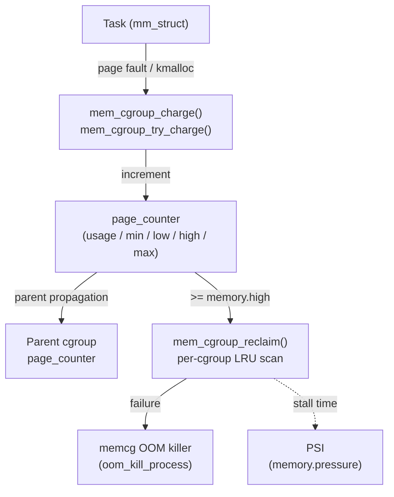

# memcg (Memory Control Group) Subsystem

## Overview

memcg (memory cgroup, `mm/memcontrol.c`) extends the Linux memory manager with per-group accounting and enforcement. It tracks every page of anonymous memory, file cache, swap, and kernel memory used by a group of processes, enforces configurable limits, and enables per-cgroup reclaim that isolates memory pressure between containers or jobs on the same machine. Without memcg, a single runaway process could page out the entire system's file cache; with memcg, its pressure is contained to its own cgroup's LRU lists.

## Mental Model

Think of memcg as **separate sub-budgets** within the system's total memory. Each cgroup gets its own spending account (`page_counter`). Every page allocation charges the account; every free credits it. If an account is over-budget (`memory.high`), the kernel tries to reclaim from that cgroup's own LRU lists first — not from the whole system. If the account hits its hard ceiling (`memory.max`) and reclaim fails, only that cgroup's OOM killer fires, not the system-wide one.

## Architecture

---

## Core Components

### [[mem-cgroup-accounting]]

**Purpose** — Track every page of memory attributed to a cgroup so that limits can be enforced accurately.

**How it works** — Every `struct page` (and folio) carries a pointer to its owning `mem_cgroup` via the `memcg` field (stored in `struct page.memcg_data`). When a page is allocated:

1. `mem_cgroup_try_charge(page, mm, gfp_mask)` identifies the target cgroup from `mm->owner->memcg`.
2. It calls `page_counter_try_charge(&memcg->memory, nr_pages, &mem_over_limit)` which atomically increments the counter and checks all ancestors up the hierarchy.
3. If any ancestor's `max` is exceeded, reclaim is triggered for that ancestor. If reclaim fails, OOM is invoked.

When a page is freed, `mem_cgroup_uncharge(page)` calls `page_counter_uncharge()` for the cgroup and all ancestors.

**Key struct**: `struct mem_cgroup` (`include/linux/memcontrol.h`)
- `memory` — `page_counter` for anonymous + file + kernel pages
- `swap` (v2) / `memsw` (v1) — swap accounting counter
- `kmem` — kernel memory counter (slab, socket buffers, etc.)
- `vmstats` — per-cgroup VM statistics (page faults, reclaimed pages, etc.)
- `thresholds` — eventfd notification thresholds
- `oom_group` — if set, kill the whole cgroup on OOM (v4.19+)

**Key struct**: `struct page_counter` (`include/linux/page_counter.h`)
- `usage` — `atomic_long_t` current charged pages
- `min` / `low` / `high` / `max` — enforcement thresholds in pages
- `parent` — pointer to parent counter for hierarchical propagation

**Key functions**:
- `mem_cgroup_try_charge()` — charge a page to its cgroup
- `mem_cgroup_uncharge()` — uncharge a page
- `page_counter_try_charge()` — increment counter and check limit

---

### [[per-cgroup-lru]]

**Purpose** — Give each cgroup its own LRU lists so that reclaim under memory pressure targets the over-limit cgroup's pages, not random system-wide pages.

**How it works** — Each `mem_cgroup` has a `mem_cgroup_per_node` per NUMA node, which holds active/inactive anon and file LRU lists. Pages are added to their owning cgroup's LRU at fault time and moved between active/inactive lists by per-cgroup page aging.

When `memory.high` is exceeded, `mem_cgroup_handle_over_high()` calls `try_to_free_mem_cgroup_pages()` → `do_try_to_free_pages()` scoped to the cgroup's LRU lists. This is the same reclaim code as the global reclaim path (`kswapd`) but restricted to one cgroup's pages.

**Hierarchical reclaim**: if a cgroup hits a limit set on an ancestor, the reclaim walks the hierarchy starting from the over-limit ancestor and scans pages from all descendants' LRU lists proportionally. This avoids one descendant starving others when the parent limit is hit.

**Config & flags**: `memory.swappiness` (per-cgroup, cgroup v1 only) — overrides `/proc/sys/vm/swappiness` for this cgroup's reclaim path; `0` prevents anonymous page swap-out entirely.

---

### [[cgroup-v2-memory-limits]]

**Purpose** — Provide a four-level protection/limit model with cleaner semantics than cgroup v1's `limit_in_bytes`/`soft_limit_in_bytes` pair.

**How it works** — cgroup v2 exposes four memory interface files per cgroup, enforced in order from softest to hardest:

| File | Semantics | Kernel action on breach |
|---|---|---|
| `memory.min` | Hard guarantee: pages below `min` are never reclaimed under global pressure | The global reclaim path skips this cgroup's pages if usage < `min` |
| `memory.low` | Soft protection: reclaim is proportionally dampened below `low` | `calculate_normal_threshold()` reduces scan pressure proportionally |
| `memory.high` | Soft ceiling: triggers aggressive within-cgroup reclaim; tasks are throttled | `mem_cgroup_handle_over_high()` called on each memory allocation |
| `memory.max` | Hard ceiling: triggers OOM kill if reclaim fails | `mem_cgroup_oom()` → `oom_kill_process()` |

The effective limit at any cgroup is `min(self.max, parent.max, grandparent.max, ...)` — hierarchy is enforced by `page_counter`'s parent chain.

`memory.high` throttling works by sleeping faulting tasks in proportion to how much they've exceeded `high`. This creates **backpressure on the allocating task** rather than global reclaim pressure, which is critical for container isolation.

**Config & flags**: `memory.oom.group` — when set, the OOM killer kills all tasks in the cgroup (not just one). Used in container runtimes so container workloads fail cleanly rather than leaving orphaned processes.

---

### [[memory-pressure-psi]]

**Purpose** — Provide a quantitative measure of memory pressure for autoscaling and memory management decisions, without requiring polled counter reads.

**How it works** — PSI (Pressure Stall Information, `kernel/sched/psi.c`) tracks the fraction of time tasks are stalled waiting for memory (unable to make progress). It produces `some` (at least one task stalled) and `full` (all non-idle tasks stalled) metrics, averaged over 10s/60s/300s windows.

Per-cgroup PSI data is exposed at `memory.pressure`. Container orchestrators (Kubernetes, systemd) use PSI to detect memory pressure before OOM occurs and proactively scale up or evict workloads.

`memory.events` exposes event counters: `low`, `high`, `max`, `oom`, `oom_kill` — useful for monitoring how often a cgroup hits each threshold.

---

## How Components Interact

**Scenario — container hits memory.high**

1. Container task faults in a new anonymous page.
2. `mem_cgroup_try_charge()` increments `memory.usage` past `memory.high`.
3. `mem_cgroup_handle_over_high()` is called; it invokes `try_to_free_mem_cgroup_pages()` targeting this cgroup's LRU.
4. If reclaim succeeds, the charge completes and the task continues.
5. If reclaim fails and `memory.max` is breached, `mem_cgroup_oom()` fires; with `memory.oom.group`, all tasks in the cgroup receive SIGKILL.
6. PSI records stall time for every task that blocked during steps 3–5; `memory.pressure` is updated.

---

## Where It Fits in the Kernel

- **↑ Userspace**: `cgroupfs` at `/sys/fs/cgroup/`; container runtimes (Docker, containerd, systemd) write limits; `memory.pressure` is polled via `poll()`/`epoll()` for event-driven pressure notification.
- **→ [[page-reclaim]]**: memcg scopes the reclaim path to per-cgroup LRU lists; `kswapd` is aware of memcg and can reclaim from specific cgroups under hierarchical pressure.
- **→ [[swap]]**: swap accounting is tracked separately (`memory.swap.max`); cgroup v2 allows limiting swap independently of RAM.
- **→ [[writeback-infrastructure]]**: cgwb (cgroup-aware writeback) ensures dirty pages are written back from the cgroup that dirtied them, preventing one cgroup's dirty pages from consuming another's write bandwidth.
- **→ OOM killer**: memcg OOM is scoped: `oom_kill_process()` is called with a cgroup selector, killing only processes within the offending cgroup.
- **← Slab allocator**: kernel memory accounting (kmem) charges slab allocations to the allocating task's cgroup via `memcg_kmem_charge()`.

## Design Decisions & Tradeoffs

**Per-cgroup LRU vs. global LRU with memcg tags**: the alternative to per-cgroup LRU lists would be a single global LRU with per-page cgroup tags, scanning the global list and skipping pages from non-target cgroups. This was simpler but caused large O(all-pages) scan cost to reclaim a small cgroup. Per-cgroup LRUs make reclaim O(cgroup-size) at the cost of more complex LRU management code.

**Charge at fault, not at allocation**: charging a page when it is first faulted (mapped) rather than when the physical page is allocated avoids counting pages the process will never actually touch. The tradeoff: a process can allocate a large buffer (mmap) and not be charged until it touches each page, potentially hitting the limit at an unexpected moment.

**`memory.high` with throttling vs. hard enforcement**: v1's `memory.limit_in_bytes` caused OOM immediately on breach. v2's `memory.high` throttles rather than kills, giving applications a chance to shed memory gracefully. The throttle scales with overage — small overages cause small delays; large overages cause proportionally larger delays up to full stall.

**PSI over watermark polling**: before PSI, the typical approach was polling `memory.usage_in_bytes` against a watermark. PSI directly measures what matters (task stall time) rather than a proxy metric, enabling more accurate and responsive autoscaling.

## How It Has Evolved

- **2.6.25 (2008)**: Initial memcg merged (anonymous page accounting, `memory.limit_in_bytes`).
- **2.6.29 (2009)**: File cache accounting added.
- **2.6.32 (2009)**: Hierarchical accounting and reclaim (`memory.use_hierarchy`).
- **3.8 (2013)**: Kernel memory accounting (kmem) merged.
- **4.5 (2016)**: cgroup v2 unified hierarchy non-experimental; v2 memory controller with `memory.min`/`low`/`high`/`max`.
- **4.19 (2018)**: PSI merged; `memory.oom.group`.
- **5.x**: `memory.reclaim` (force reclaim from a cgroup); continuous improvements to cgwb and PSI.

## Recent Development Activity

- **`memory.reclaim`**: explicit reclaim interface allowing userspace to trigger reclaim in a cgroup without triggering OOM.
- Ongoing work on improving accuracy of kernel memory accounting, especially for network socket buffers and BPF maps.

## Further Reading

1. **LWN — "Documentation/cgroups/memory.txt"** (2011): https://lwn.net/Articles/432224/ — Comprehensive design doc.
2. **LWN — "Hierarchical reclaim for memory cgroups"** (2012): https://lwn.net/Articles/516535/
3. **LWN — "Teaching the OOM killer about control groups"** (2018): https://lwn.net/Articles/761118/
4. **LWN — "mm: introduce memory.min"** (2018): https://lwn.net/Articles/752423/
5. **kernel-internals.org — memcg**: https://kernel-internals.org/mm/memcg/
6. **cgroup v2 docs**: https://docs.kernel.org/admin-guide/cgroup-v2.html

## LKML Highlights

- **Initial memcg merge** (Balbir Singh, 2008): extensive debate on performance overhead of per-page cgroup accounting; measurements showed ~3% overhead which was accepted as the cost of isolation.
- **Hierarchical reclaim** (Michal Hocko et al., 2012): redesign of the reclaim path to honour ancestor limits correctly; previous implementation had cases where child cgroups could exceed parent limits.
- **memory.oom.group** (Roman Gushchin, 2018): motivated by container runtimes needing clean container teardown on OOM rather than random single-process kills.
