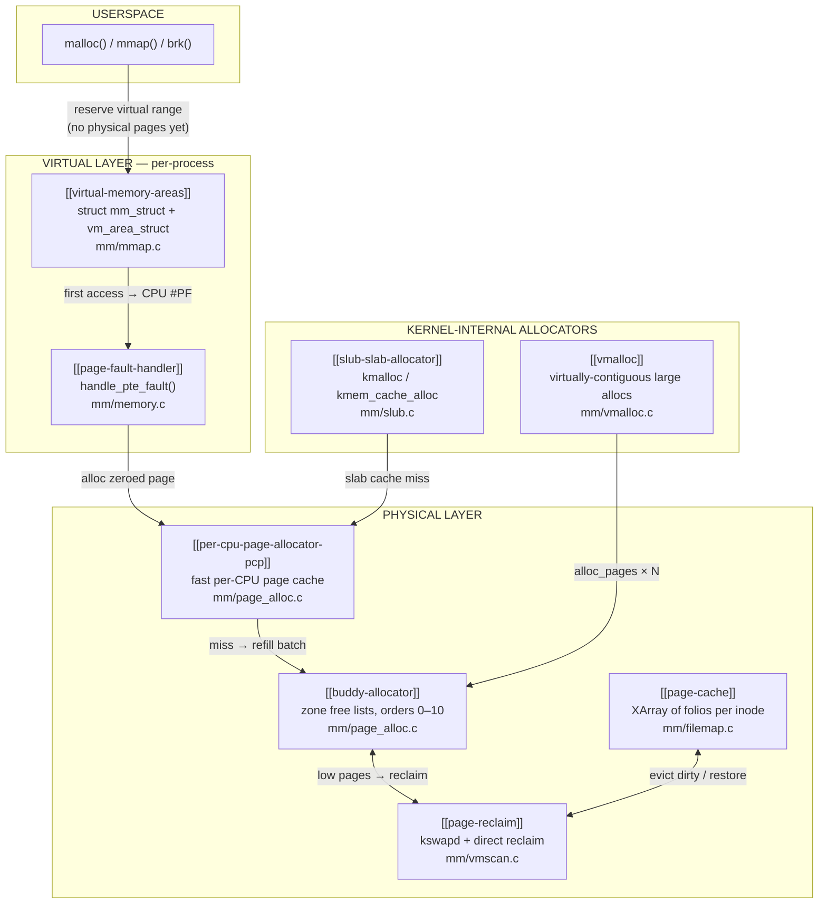

# mm — Core Components

## Overview

The `mm` subsystem is Linux's memory management layer — the part of the kernel responsible for every interaction between software and physical RAM. It provides the illusion of private, unlimited address spaces to processes while safely sharing finite physical memory among all workloads on the machine. Without it, processes would collide in memory, large programs couldn't run on small machines, and the kernel itself would have no safe way to allocate its own internal data structures.

## Mental Model

Think of physical RAM as a finite parking garage. The `mm` subsystem is the parking management system: it hands each driver a map (virtual address space) showing an unlimited number of spaces. It doesn't actually assign a physical space until the driver tries to park — at that moment it finds a real spot, updates the map to point to it, and the driver never knew there was a delay. When the garage fills up, an attendant (kswapd) quietly shuffles cars to overflow lots (swap) to make room. The key insight: promising space is free; allocating real space is deferred until absolutely necessary.

## Architecture



All paths through the virtual layer eventually reach the buddy allocator — the single source of truth for physical pages. The PCP layer caches hot pages per-CPU to avoid taking the zone lock on every allocation. SLUB and vmalloc are kernel-side shortcuts: SLUB for sub-page byte allocations, vmalloc for large virtually-contiguous allocations. The page cache and reclaim system form a feedback loop: the cache absorbs file data, reclaim drains it under pressure.

## Core Components

### [[virtual-memory-areas]] — The Address Space Ledger

A Virtual Memory Area (VMA) is the kernel's record of a promise: "this range of virtual addresses exists and has these properties." When a process calls `malloc()` or `mmap()`, the kernel doesn't touch physical memory — it creates or extends a VMA in the process's `mm_struct`. VMAs encode what backing a region has (anonymous heap, file mapping, device memory), its permissions, and its fault-handling operations. Together they form a complete description of the process's virtual world, stored in a maple tree for O(log n) range lookups with RCU-safe concurrent reads.

### [[page-fault-handler]] — Where Promises Become Pages

The page fault handler is the bridge between virtual and physical. Every first touch of a mapped-but-unbacked address fires a CPU exception; the handler catches it at `handle_pte_fault()`, decides what kind of fault it is (new anonymous page, file data needed, copy-on-write, swap restore), obtains the right physical page, writes a page table entry, and resumes the faulting instruction. From the process's perspective, nothing happened — it just reads its memory as usual.

### [[buddy-allocator]] — Physical Page Bookkeeper

The buddy allocator owns all physical RAM and manages it in power-of-two blocks (orders 0–10, corresponding to 4 KB–4 MB). When a block is freed, it merges with its "buddy" into a larger block recursively — self-healing coalescing that prevents permanent fragmentation. To further reduce fragmentation, pages are grouped by **migration type** (unmovable kernel data, movable user pages, reclaimable caches), so compaction can relocate the movable pages to assemble large contiguous free regions.

### [[per-cpu-page-allocator-pcp]] — Lock-Free Fast Path

The buddy allocator uses a per-zone lock that would become a bottleneck on many-core systems. The PCP layer sits in front of it: each CPU maintains a small local list of pre-allocated pages per zone. Most order-0 allocations (anonymous page faults, SLUB cache refills) are served from these per-CPU lists with no lock, no contention. Lists drain back to the buddy allocator in batches, amortising the zone-lock cost. Since v6.6, the high-water mark auto-tunes to the observed drain rate.

### [[slub-slab-allocator]] — Sub-Page Byte Allocator

The kernel needs bytes, not whole pages. SLUB carves buddy pages into typed caches of fixed-size objects, one cache per object type (`struct dentry`, `struct inode`, `sk_buff`, …). A per-CPU freelist within each cache makes the hot path a single compare-and-swap — no locks. On miss, the CPU falls back to per-node partial-slab lists, and only on total exhaustion does it request a new page from the buddy allocator. SLUB is the default allocator since v2.6.22 (2007) and the only remaining slab implementation since v6.8.

### [[vmalloc]] — Large Virtually-Contiguous Allocations

When kmalloc cannot satisfy a large request due to physical fragmentation, `vmalloc()` maps non-contiguous physical pages into a contiguous virtual range in the kernel's vmalloc address space. It trades physical contiguity (and the TLB efficiency that comes with it) for the ability to satisfy large allocations regardless of fragmentation. Used primarily for loadable modules, large driver buffers, and anything that cannot fit in a single high-order buddy allocation.

### [[page-cache]] — The File Data Buffer

Every block of file data that the kernel reads from storage lands in the page cache, indexed by inode and byte offset in an XArray of `struct folio`. Subsequent reads find the data in RAM rather than re-reading from disk. Writes update cached pages and mark them dirty; writeback threads flush them to disk in the background. The page cache is why a freshly-read file feels instant on the second read.

### [[page-reclaim]] — Keeping Free Pages Available

Free pages don't appear by accident — the reclaim system manufactures them. The `kswapd` daemon (one per NUMA node) runs continuously, scanning LRU lists and evicting cold pages before any allocation has to wait. Clean file pages are dropped immediately (re-readable from disk); dirty pages are written back first; anonymous pages go to swap. If kswapd falls behind, allocating processes enter direct reclaim themselves — a synchronous latency hit. If that still fails, the OOM killer terminates the highest-scoring process.

---

## Key Data Structures

**`struct mm_struct`** (`include/linux/mm_types.h`) — the complete virtual address space of one process.
- `pgd` — pointer to the top-level page table (PGD); the CPU's MMU starts here on every memory access
- `mm_mt` — maple tree holding all VMAs, indexed by virtual address range
- `mmap_lock` — rwsem protecting VMA modifications; increasingly bypassed by per-VMA locks
- `total_vm` / `locked_vm` / `pinned_vm` — page-count statistics used by OOM scoring and resource limits
- `start_brk` / `brk` — current heap boundaries; `brk()` syscall moves `brk`

**`struct vm_area_struct`** (`include/linux/mm_types.h`) — one contiguous VMA in a process's address space.
- `vm_start` / `vm_end` — [start, end) virtual address range
- `vm_flags` — `VM_READ`, `VM_WRITE`, `VM_EXEC`, `VM_SHARED`, `VM_GROWSDOWN` (stack), `VM_PFNMAP` (device), etc.
- `vm_ops` — function table dispatching fault, open, close, and mremap operations to the right backend
- `vm_file` — for file-backed VMAs: the backing file; NULL for anonymous VMAs
- `vm_lock` — per-VMA seqlock enabling lock-free fault handling without `mmap_lock` (v6.4+)

**`struct pglist_data`** (`include/linux/mmzone.h`) — one NUMA node's memory descriptor.
- `node_zones[]` — array of `struct zone` (DMA, DMA32, NORMAL, MOVABLE)
- `node_zonelists[]` — fallback zone ordering for NUMA-aware allocation
- `kswapd` — the per-node background reclaim thread
- `kswapd_wait` — waitqueue where allocators wake kswapd when pages run low

**`struct zone`** (`include/linux/mmzone.h`) — one contiguous memory zone within a node.
- `free_area[MAX_PAGE_ORDER+1]` — per-order free lists, each split by migration type
- `_watermark[NR_WMARK]` — min/low/high thresholds governing reclaim
- `pageset` — per-CPU page cache (PCP) for this zone
- `lruvec` — LRU list state (or MGLRU generation lists in v6.1+)

**`struct page` / `struct folio`** (`include/linux/mm_types.h`) — per-physical-page metadata.
- `flags` — `PG_locked`, `PG_dirty`, `PG_uptodate`, `PG_lru`, `PG_active`, `PG_referenced`, `PG_writeback`
- `_refcount` — how many references hold the page; zero means it can be freed
- `_mapcount` — how many page table entries map this page; used by the reverse-map system
- `mapping` — for file pages: `address_space` pointer; for anonymous: `anon_vma` pointer (tagged)
- `index` — page offset within the file or vma for reverse mapping
- `order` (folio only) — the compound order of this folio, eliminating the need to guess from compound bits

**`struct kmem_cache`** (`include/linux/slub_def.h`) — one SLUB typed cache.
- `cpu_slab` — per-CPU pointer to the current active slab (fast path)
- `size` / `object_size` — allocated object size (with alignment) vs. user-visible size
- `flags` — `SLAB_HWCACHE_ALIGN`, `SLAB_POISON`, `SLAB_RED_ZONE`, `SLAB_ACCOUNT`, etc.
- `node[MAX_NUMNODES]` — per-node partial slab lists (slow path)
- `oo` — packed order + objects-per-slab encoding for optimal slab sizing

**`struct address_space`** (`include/linux/fs.h`) — page cache state for one file (inode).
- `i_pages` — XArray of `struct folio *`, indexed by page offset within the file
- `host` — back-pointer to the owning inode
- `a_ops` — operations table: `readpage`, `writepage`, `readahead`, etc.
- `nrpages` / `nrexceptional` — cached page count and swap/error entry count

---

## Key Functions / Entry Points

### Allocation path (user anonymous memory)

**`do_mmap()`** (`mm/mmap.c`) — called by `mmap()` syscall; creates or extends a VMA; no physical allocation occurs.

**`handle_mm_fault()`** (`mm/memory.c`) — top-level fault entry from the architecture page-fault handler; locks the VMA (per-VMA lock or mmap_lock), then calls `handle_pte_fault()`.

**`handle_pte_fault()`** (`mm/memory.c`) — examines the PTE state and dispatches to:
- `do_anonymous_page()` — allocates a zeroed page for the first write to heap/stack
- `do_fault()` → `do_read_fault()` / `do_cow_fault()` — file-backed demand load or COW copy
- `do_swap_page()` — restores a page from swap
- `do_wp_page()` — copy-on-write: clone or reuse on a write to a shared page

**`alloc_pages()` / `__alloc_pages()`** (`mm/page_alloc.c`) — core page allocator; checks PCP first, falls back to buddy free lists, invokes reclaim slow path if needed.

### Kernel allocation path

**`kmalloc(size, gfp)`** (`mm/slub.c`) — routes to the appropriate size-class `kmem_cache`; fast path is a single per-CPU freelist pointer swap via `cmpxchg`.

**`kmem_cache_alloc(cache, gfp)`** (`mm/slub.c`) — allocates from a named typed cache; same per-CPU fast path.

**`vmalloc(size)`** (`mm/vmalloc.c`) — finds free range in vmalloc space via RB-tree, calls `alloc_pages()` for each page, maps them contiguously into kernel VA space.

### Reclaim path

**`kswapd()`** (`mm/vmscan.c`) — per-node daemon; sleeps on `pgdat->kswapd_wait`; wakes when free pages fall below the low watermark; calls `balance_pgdat()` → `kswapd_shrink_node()`.

**`try_to_free_pages()`** (`mm/vmscan.c`) — direct reclaim entry point; called by the allocator slow path when kswapd has not kept up; blocks until enough pages are freed or OOM is declared.

**`shrink_lruvec()`** (`mm/vmscan.c`) — scans one set of LRU lists (or MGLRU generation lists), isolates cold pages, and passes them to `shrink_page_list()` for reclaim or writeback.

---

## Important Flags & Config Options

### GFP Flags (Get Free Pages)

| Flag | When to use | What it allows |
|------|-------------|----------------|
| `GFP_KERNEL` | Normal kernel allocations | Can sleep; direct reclaim allowed |
| `GFP_ATOMIC` | Interrupt / spinlock context | Cannot sleep; uses memory reserves |
| `GFP_NOWAIT` | Non-blocking, not in interrupt | No reclaim, no sleep; fail fast |
| `GFP_USER` | User-facing pages | Directly kernel-accessible; non-movable |
| `GFP_HIGHUSER_MOVABLE` | Anon/file user pages | Kernel access optional; movable (compactable) |
| `GFP_DMA` / `GFP_DMA32` | Driver DMA buffers | Must come from DMA-accessible zone |
| `__GFP_ZERO` | Any | Zero-fill pages before returning |
| `__GFP_NOFAIL` | Critical must-succeed paths | Retry indefinitely; never return NULL |
| `__GFP_MOVABLE` | Any | Hint to use MOVABLE migratetype |

### VMA Flags (`vm_flags`)

| Flag | Effect |
|------|--------|
| `VM_READ` / `VM_WRITE` / `VM_EXEC` | Page protection; reflected in PTEs |
| `VM_SHARED` | Changes are visible to other mappings of the same file |
| `VM_GROWSDOWN` | Stack VMA; grows toward lower addresses on fault |
| `VM_LOCKED` | Pages are `mlock()`ed; never swapped out |
| `VM_PFNMAP` | Maps raw PFNs (e.g. device MMIO); no struct page |
| `VM_DONTCOPY` | Not inherited across `fork()` |

### Key Kconfig Symbols

| Symbol | Effect |
|--------|--------|
| `CONFIG_SLUB` | Enable SLUB (default since v2.6.22) |
| `CONFIG_SLUB_DEBUG` | Red-zoning, poisoning, and tracking for SLUB |
| `CONFIG_TRANSPARENT_HUGEPAGE` | Enable THP; runtime `always`/`madvise`/`never` |
| `CONFIG_NUMA` | Multi-node NUMA support and per-node allocators |
| `CONFIG_COMPACTION` | Memory compaction (required for THP) |
| `CONFIG_MEMCG` | Per-cgroup memory accounting and limits |
| `CONFIG_SWAP` | Enable swap; without it, anonymous pages cannot be reclaimed |
| `CONFIG_ZSWAP` | Compressed in-memory swap cache before hitting swap device |
| `CONFIG_KFENCE` | Sampling-based memory error detector safe for production use |
| `CONFIG_DAMON` | Data Access MONitoring; enables proactive/policy-driven reclaim |

### Key sysctl knobs (`/proc/sys/vm/`)

| Knob | Effect |
|------|--------|
| `vm.min_free_kbytes` | Sets the minimum watermark; raises low/high proportionally |
| `vm.swappiness` | 0–200; higher = prefer swapping anonymous pages over dropping file cache |
| `vm.dirty_ratio` / `vm.dirty_background_ratio` | Max dirty page % before sync/async writeback kicks in |
| `vm.overcommit_memory` | 0 = heuristic, 1 = always allow, 2 = strict |
| `vm.vfs_cache_pressure` | Pressure on dentry/inode caches relative to page cache |
| `vm.compaction_proactiveness` | 0–100; how aggressively kcompactd runs without allocation pressure |

---

## How Components Interact

### Scenario 1 — A process calls `malloc(1 MB)`

```
malloc(1 MB)
  └─► glibc: check thread-local free list → miss
        └─► mmap(MAP_ANON|MAP_PRIVATE) syscall
              └─► do_mmap() → creates one VMA covering 1 MB
                    └─► returns virtual address; zero physical pages allocated

*(ptr) = 42;   ← first write to the mapping
  └─► CPU raises #PF (no PTE)
        └─► handle_pte_fault() → do_anonymous_page()
              ├─► alloc_zeroed_user_highpage_movable()
              │     └─► PCP list for this CPU/zone → hit → return page
              └─► set_pte_at(): write PTE, flush TLB entry
                    └─► resume faulting instruction; process sees its write
```

Physical memory is consumed only at the first write. Reading before writing maps the shared zero page — no allocation at all.

### Scenario 2 — The kernel calls `kmalloc(200, GFP_KERNEL)`

```
kmalloc(200, GFP_KERNEL)
  └─► resolves to kmalloc-256 size class (next power of two ≥ 200)
        └─► kmem_cache_alloc(kmalloc-256, GFP_KERNEL)
              └─► per-CPU freelist: cmpxchg(freelist, obj, next) → hit → return
                    (miss) → __slab_alloc():
                      ├─► try per-node partial slab list (lock)
                      └─► (empty) → alloc new slab page via alloc_pages()
                            └─► PCP → buddy → (if needed) reclaim
```

### Scenario 3 — Memory pressure triggers reclaim

```
free pages fall below low watermark
  └─► wake_up(pgdat->kswapd_wait)
        └─► kswapd() → balance_pgdat() → shrink_lruvec()
              ├─► scan MGLRU oldest generation
              │     ├─► clean file folio → remove from page cache, free page
              │     ├─► dirty file folio → submit writeback, keep on LRU
              │     └─► anonymous folio → add_to_swap(), write to swap device
              └─► free pages rise above high watermark → kswapd sleeps

(kswapd falls behind; allocation hits min watermark)
  └─► allocating process enters try_to_free_pages() [direct reclaim]
        └─► (still no pages) → out_of_memory() → oom_kill_process()
```

---

## Where It Fits in the Kernel

- **↑ Userspace**: `mmap()`, `munmap()`, `brk()`, `mprotect()`, `mlock()`, `mincore()`, `madvise()` all land directly in mm. Every process exists because mm allocated an `mm_struct` for it.
- **→ VFS**: mm asks the VFS to populate page-cache folios when a file-backed fault misses the cache; the VFS calls back through `a_ops->readpage()`.
- **← Drivers/DMA**: drivers request physically contiguous pages via `alloc_pages(GFP_DMA)` or the CMA API; mm guarantees contiguity or fails cleanly.
- **→ Scheduler**: heavy direct reclaim causes processes to sleep, which the scheduler must handle; NUMA balancing migrations interact with scheduler placement decisions.
- **← cgroups**: `memcg` hooks intercept every page allocation and reclaim decision to enforce per-cgroup limits; mm calls `mem_cgroup_charge()` and `mem_cgroup_uncharge()` on every folio transition.
- **↓ Hardware MMU**: mm writes and invalidates page tables that the CPU's MMU reads on every memory access; TLB flush IPIs (`flush_tlb_mm()`) keep remote CPUs' caches consistent after mapping changes.
- **↓ Storage / swap**: reclaim writes dirty pages via the block layer; `do_swap_page()` reads them back.

---

## Design Decisions & Tradeoffs

**Demand paging over eager allocation.** Virtual addresses are issued immediately and cheaply (just a VMA record); physical pages arrive only on first access via page fault. This makes `fork()` nearly free via copy-on-write, makes `malloc()` instant, and enables memory overcommit (most reserved memory is never touched). The cost is a fault on first access — acceptable because modern CPUs handle minor faults in microseconds.

**Power-of-two block sizes in the buddy allocator.** The 1965 buddy algorithm enables O(1) buddy identification (a single XOR) and O(log n) coalescing, at the cost of internal fragmentation (a 3-page request wastes 1 page in an order-2 block). The alternative — arbitrary-size blocks — would eliminate internal fragmentation but require a full search to find a buddy, wrecking allocation latency. The internal waste is acceptable; the latency guarantee is not negotiable.

**Migration types to fight fragmentation.** Before migration types, a single immovable kernel page trapped inside a free region blocked large allocations permanently, causing OOM even with abundant total free memory. Grouping pages by mobility lets compaction relocate movable pages and expose the region. The cost is increased complexity in the allocator and some wasted effort when fallback between groups occurs.

**SLUB over SLAB.** SLAB was the original typed-object cache allocator. SLUB replaced it in 2007 not because it was faster (the difference was marginal) but because the code was dramatically simpler. Simple code is easier to audit, extend with security hardening (freelist XOR, poison bytes, KFENCE), and maintain across NUMA topologies. SLOB (the minimal embedded allocator) was removed in v6.4 and SLAB itself in v6.8, leaving SLUB as the single implementation.

**Two-tier reclaim (kswapd + direct) over a reserved free pool.** A simple design would reserve a fixed fraction of RAM and never use it. Linux instead manufactures free pages on demand via kswapd, leaving nearly all memory available as page cache. The cost is that heavy allocation pressure can force processes into direct reclaim, adding latency; the benefit is dramatically higher effective memory utilisation under normal workloads.

---

## How It Has Evolved

| Version | Change | Driver |
|---------|--------|--------|
| v2.5/2.6 (2002) | Per-CPU page lists (PCP) | Zone lock contention on early SMP systems |
| v2.6.22 (2007) | SLUB becomes default allocator | SLAB too complex; SLUB simpler and easier to harden |
| v2.6.35 (2010) | Memory compaction + kcompactd | THP and high-order allocs failing on fragmented systems |
| v3.5 (2012) | CMA (Contiguous Memory Allocator) | Device drivers needed large contiguous DMA buffers at runtime |
| v4.20 (2019) | XArray replaces radix tree in page cache | Cleaner API; enables lockless page-cache lookups |
| v5.16 (2022) | `struct folio` begins replacing `struct page` | Compound-page misuse causing silent correctness bugs |
| v6.1 (2022) | Multi-Gen LRU (MGLRU) | Two-list LRU thrashed under streaming; MGLRU's generations are more accurate |
| v6.1 (2022) | Maple tree replaces VMA red-black tree + linked list | Dual structure error-prone; maple tree is RCU-safe and cache-friendlier |
| v6.4 (2023) | Per-VMA locks | `mmap_lock` serialised all page faults in a process; per-VMA locks allow parallel fault handling |
| v6.4 (2023) | SLOB removed | SLUB efficient enough even on embedded; code simplification |
| v6.6 (2023) | PCP high-water auto-tuning | Static batch sizes inefficient on 200+ CPU systems |
| v6.8 (2024) | SLAB removed; SLUB sole allocator | Final cleanup after SLUB proved sufficient in all environments |
| v6.8 (2024) | THP for file-backed mappings | THP benefits (reduced TLB pressure) historically limited to anonymous memory |

---

## Recent Development Activity

**Folio migration** is the dominant long-running project: converting every mm code path from raw `struct page` to `struct folio`. Most core paths are done; peripheral drivers, filesystems, and arch code remain.

**Large anonymous folios** (2 MB anonymous pages without THP PMD-level promotion) are being stabilised. The goal is reduced page-table overhead for large heap allocations without the fragmentation risk of full THP.

**Memory tiering** (CXL slow memory, PMEM, zswap as a tier): the existing watermark/LRU model treats all RAM as equivalent. New work extends reclaim to prefer evicting to slow tiers before swap, managed via `DAMOS` (DAMON-based Operation Schemes).

**Per-VMA lock coverage** continues expanding to cover more fault types that still fall back to `mmap_lock` under edge cases.

---

## Further Reading

1. [LWN — Per-VMA locks](https://lwn.net/Articles/919547/) — the design and motivation for replacing mmap_lock in the fault path
2. [LWN — How to get rid of mmap_sem](https://lwn.net/Articles/787629/) — years of failed attempts before per-VMA locks worked; essential context
3. [LWN — Introducing the Maple Tree](https://lwn.net/Articles/892724/) — why a new data structure was needed for VMAs
4. [LWN — Memory Folios](https://lwn.net/Articles/851299/) — the folio abstraction: the bug class it eliminates and how it was designed
5. [LWN — docs/mm: add VMA locks documentation](https://lwn.net/Articles/997398/) — authoritative writeup of the per-VMA lock protocol
6. [kernel-internals.org/mm/overview/](https://kernel-internals.org/mm/overview/) — design rationale and the 30-year story of Linux mm
7. [kernel-internals.org/mm/life-of-malloc/](https://kernel-internals.org/mm/life-of-malloc/) — end-to-end trace of malloc through every mm layer
8. [kernel.org — Memory Allocation Guide](https://static.lwn.net/kerneldoc/core-api/memory-allocation.html) — when to use which allocator; GFP flag reference
9. [kernel-internals.org/mm/reclaim/](https://kernel-internals.org/mm/reclaim/) — kswapd, watermarks, LRU, MGLRU, and OOM

---

## LKML Highlights

- **[PATCH v3: docs/mm: add VMA locks documentation](https://lore.kernel.org/all/20241114205402.859737-1-lorenzo.stoakes@oracle.com/) (Lorenzo Stoakes, Oracle, Nov 2024)** — The review debate makes explicit *why* the seqlock-per-VMA design was chosen over alternatives (RCU-only, per-range locks), and what invariants must hold across `fork()` and `munmap()`. Essential reading for understanding the locking model.

- **[RFC: mm: multi-gen LRU: working set extensions](https://lore.kernel.org/all/CAJj2-QFg_7msfB+k2hv2jx13HCJ_-EBhqbuHwLjOVUhZvTN38w@mail.gmail.com/) (Yuanchu Xie / Google, Jan 2023)** — Discussion of extending MGLRU to track working-set *size* in addition to recency; illustrates how the generational model was intentionally designed to be extensible, and how Google production workload data drives mm development.

- **[Re: per-CPU pageblock buddy allocator](https://lore.kernel.org/all/20260403194526.477775-3-hannes@cmpxchg.org/) (Johannes Weiner, Meta, Apr 2026)** — RFC proposing a per-CPU pageblock allocator as a deeper integration of the PCP and buddy layers; shows how the boundary between these two components is still being reconsidered as core counts grow.
