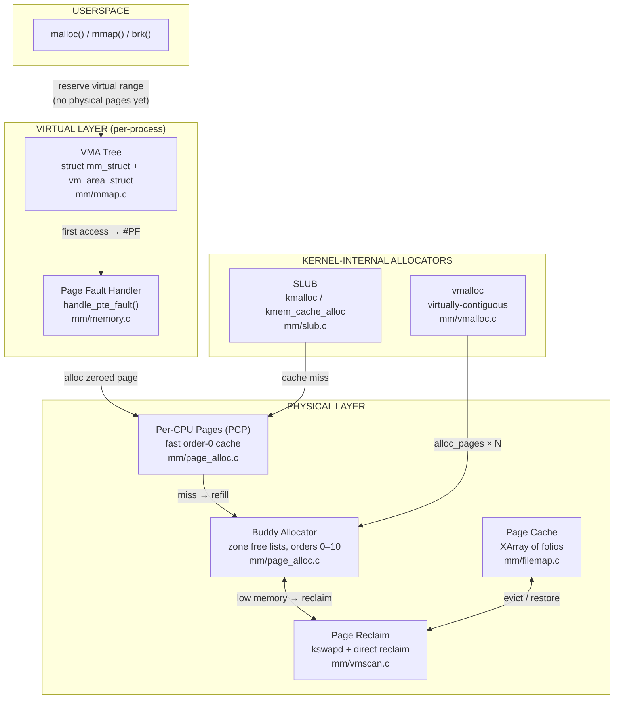

# mm — Core Components

## Overview

The `mm` subsystem is Linux's answer to a fundamental problem: many programs need memory, but there is only one physical RAM. It creates the illusion that each process owns a vast, private address space while transparently sharing finite physical pages among all processes running on the machine. Without it, processes would collide in memory, large programs couldn't run on small machines, and the kernel itself would have no safe way to allocate internal data structures.

## Mental Model

Think of physical RAM as a city's parking lots, and virtual memory as a map that gives every driver their own private version of the city. The `mm` subsystem is the city planner: it issues maps freely (virtual addresses are cheap), builds roads and parking structures as needed (physical pages on demand), and quietly shuffles cars around at night to free up space (reclaim). Drivers never know their car was moved — from their perspective, it's always where they left it.

This lazy, on-demand approach is the single most important idea in the whole subsystem. Memory is not given to you when you ask for it; it is given to you the first time you actually park.

## Architecture



At the top, userspace asks for address space — a promise, not memory. In the middle, the VMA tree records that promise, and the page fault handler converts it into reality the first time the address is touched. At the bottom, the buddy allocator holds all physical pages and hands them out on demand; the PCP layer caches hot pages near each CPU to avoid lock contention; the page cache buffers file data; and reclaim works continuously in the background to keep free pages available.

## Core Components

### Virtual Memory Areas — the Address Space Ledger

When a program calls `malloc()` or `mmap()`, the kernel doesn't allocate a single physical byte. It creates or extends a **VMA** — a record saying "this range of virtual addresses exists and has these permissions". VMAs are the kernel's promise to the process: if you access this range, I will back it up. They live in a **maple tree** on `mm_struct`, an RCU-safe B-tree optimised for range queries. The maple tree replaced the old red-black tree + linked list pair in v6.1 because the dual-structure design was error-prone, slow to cache, and couldn't support lockless reads — prerequisites for the per-VMA locking work that followed.

### The Page Fault Handler — Turning Promises into Pages

The page fault handler is where the kernel's promises become physical reality. Every first access to a virtual address that has no backing page fires a CPU exception, which the kernel catches at `handle_pte_fault()`. From there, the kernel asks: is this anonymous memory being touched for the first time? Is it a copy-on-write page that needs cloning? Is it file-backed data that needs reading from the page cache? Each scenario has its own path, but all end the same way: a physical page is found, a page table entry is written, and the CPU retries the instruction as if nothing happened. The user process never knows.

### The Buddy Allocator — Physical Page Bookkeeper

The buddy allocator owns all physical RAM and manages it in power-of-two blocks called *orders* (order 0 = 4 KB, order 10 = 4 MB). Its core insight, from a 1965 algorithm, is that two adjacent same-size blocks are "buddies" — when both are free, they can merge upward. This self-healing coalescing prevents permanent fragmentation, which would otherwise leave the system unable to satisfy large allocations even when enough total free memory exists. To further protect against fragmentation, the allocator groups pages by **migration type**: immovable kernel structures, movable user pages, and reclaimable caches live in separate free lists. This makes it possible for compaction to relocate the movable pages and assemble large contiguous blocks without touching kernel data.

### Per-CPU Pages — The Cache in Front of the Lock

The buddy allocator is protected by a per-zone lock, which would become a bottleneck on any system with more than a handful of CPUs. The PCP layer sits in front of it: each CPU keeps a small local list of pre-allocated pages. Most allocations — the order-0 anonymous page faults and slab cache refills that constitute the vast majority of kernel allocation traffic — are served from these per-CPU lists with no lock at all. The per-CPU lists drain back to the buddy allocator in batches, amortising the cost of taking the zone lock. Since v6.6, the high-water mark for each list tunes itself dynamically based on how often drains are needed.

### SLUB — The Kernel's Internal Allocator

User programs think in bytes; the kernel also needs bytes, not whole pages. The SLUB allocator carves buddy pages into typed caches of fixed-size objects. A `struct dentry` is always ~192 bytes; a `struct task_struct` is always a few kilobytes. SLUB creates a dedicated cache per type (`kmem_cache`), so a freed dentry goes straight back into the dentry pool — no fragmentation, no searching. Within each cache, each CPU has a "current slab" page and a lockless freelist accessed via a single compare-and-swap, making the common allocation path as fast as a pointer chase. SLUB replaced the original SLAB allocator as the default in 2007 specifically because simpler code was easier to reason about under the growing demands of NUMA, multi-core, and memory safety tooling.

### The Page Cache — Avoiding Disk at All Costs

Disk is thousands of times slower than RAM. The page cache is the kernel's strategy for hiding this fact: every block of file data that has ever been read is kept in memory, indexed by inode and offset in an XArray of `struct folio`. The next read finds it instantly; writes update it in memory and defer the trip to disk. The folio abstraction (replacing raw `struct page` in v5.16+) knows its own compound order, which means a 2 MB chunk of a file can be represented as one folio rather than 512 independent pages — dramatically reducing the bookkeeping overhead for large file workloads.

### Page Reclaim — Keeping the Bucket from Overflowing

Free pages are not an accident; they are actively manufactured by the reclaim system. A kernel thread called `kswapd` (one per NUMA node) runs continuously in the background, scanning LRU lists for cold pages and freeing them before anyone needs to wait. It wakes up when free pages fall below the *low* watermark and sleeps when they recover to the *high* watermark. If memory pressure outpaces `kswapd`, allocating processes are forced to reclaim pages themselves before their allocation can proceed — the "direct reclaim" path, a latency hit of last resort before the OOM killer.

## How Components Interact

### Scenario 1 — A Process Calls `malloc(100)`

```
malloc(100)
  └─► glibc checks thread-local free list → hit → returns immediately
        (miss) → brk() or mmap() syscall
              └─► kernel creates/extends a VMA (no physical work)
                    └─► returns virtual address to glibc → returned to caller
                          ... no page allocated yet ...

*(ptr) = 0;  ← first write
  └─► CPU raises page fault (#PF)
        └─► handle_pte_fault() → do_anonymous_page()
              ├─► read fault? → map shared zero page (free, no copy)
              └─► write fault? → alloc_zeroed_page() from PCP
                    └─► PCP hit → return page, install PTE, resume
                          (PCP miss) → refill from buddy allocator
```

The key insight: from `malloc()` to the moment of first write, zero physical pages are consumed.

### Scenario 2 — A Process Reads a File

```
read(fd, buf, len)
  └─► generic_file_read_iter()
        └─► find folio in page cache (XArray lookup by inode + offset)
              ├─► hit → copy to userspace directly (no I/O)
              └─► miss → readahead: alloc folio from buddy, submit I/O
                    └─► folio lands in page cache, copy to userspace
                          ... later, if memory is tight ...
                          └─► reclaim drops clean folio (re-readable from disk)
```

The page cache acts as a transparent absorber between the filesystem and RAM. Most reads in a running system never touch storage at all.

### Scenario 3 — The System Runs Low on Memory

```
Allocation fails watermark check
  └─► wake kswapd
        └─► scan LRU (MGLRU: evict oldest generation)
              ├─► clean file page → drop immediately
              ├─► dirty file page → write back, then drop
              └─► anonymous page → write to swap, then drop
                    └─► free pages rise above low watermark → kswapd sleeps

(if kswapd can't keep up)
  └─► allocating process enters direct reclaim
        └─► (if still no pages) → OOM killer scores all processes → SIGKILL
```

## Where It Fits in the Kernel

**Upward to userspace:** The mm subsystem is the sole provider of virtual address spaces. Every process exists only because `mm` created an `mm_struct` for it. System calls like `mmap`, `mprotect`, `brk`, `munmap`, and `mincore` are all mm operations. The `/proc/<pid>/maps` interface exposes the VMA tree directly.

**Sideways to the VFS:** The page cache sits at the intersection of mm and VFS. When the filesystem reads a file, it allocates folios from mm and registers them in an `address_space` owned by the inode. When a process page-faults on a file mapping, the fault handler calls into the VFS to populate the page cache.

**Sideways to the scheduler:** Heavy memory pressure causes processes to sleep in direct reclaim, which the scheduler must account for. NUMA balancing interacts with the scheduler's placement decisions — migrating pages is only useful if the process also runs near them.

**Downward to hardware:** The mm subsystem writes page tables that the CPU's MMU reads on every memory access. It manages TLB flushes when mappings change. On NUMA hardware, it reads ACPI SRAT/SLIT tables to understand node distances and constructs zonelists accordingly.

## Design Decisions & Tradeoffs

**Demand paging over eager allocation.** Linux never allocates physical pages until they are touched. This costs a page fault on first access but enables overcommit, makes `fork()` nearly free (copy-on-write), and means a process that allocates a 1 GB buffer but only touches 100 MB consumes only 100 MB of RAM. The alternative — allocating eagerly — would be simpler but would make the system far less responsive to actual workload patterns.

**Virtual address spaces as a first-class abstraction.** Each process sees a private address space. The kernel could have used a flat physical memory model (as some embedded RTOSes do), but isolation between processes and between user and kernel space would have been impossible without significant hardware assistance. The VMA-based model maps cleanly onto modern MMU hardware.

**Separating migration types in the buddy allocator.** Before migration types were introduced, a single immovable page trapped inside a free region could prevent that region from being reclaimed for high-order allocations, causing OOM failures even with plenty of total free memory. Grouping unmovable pages together means they contaminate only their own region — movable pages can always be compacted away.

**Two-tier reclaim (background + synchronous) rather than reserving a fixed free pool.** A fixed reserve is simple but wastes memory proportional to peak allocation rate. Linux instead tries to predict demand and maintain a buffer dynamically via `kswapd`. The cost is complexity; the benefit is that nearly all free memory can be used as page cache.

**Folio over raw page.** The `struct page` API had accumulated decades of implicit assumptions that every compound page was exactly 4 KB. Code that received a compound (multi-page) page and treated it as order-0 was technically wrong but happened to work — until it didn't. `struct folio` enforces the compound size at the type level, making a whole class of subtle bugs impossible. The cost is an ongoing, years-long migration across the entire subsystem.

## How It Has Evolved

| Era | Change | Driver |
|-----|--------|--------|
| v2.5/2.6 (2002–2003) | Per-CPU page lists (PCP) | SMP systems exposed zone lock as a bottleneck |
| v2.6.35 (2010) | Memory compaction + kcompactd | THP and high-order allocations failing on fragmented systems |
| v3.5 (2012) | CMA (Contiguous Memory Allocator) | Device drivers needing large contiguous DMA buffers |
| v5.16 (2022) | `struct folio` begins replacing `struct page` | Type-safety: silent compound-page misuse caused subtle bugs |
| v6.1 (2022) | Multi-Gen LRU (MGLRU) | Two-list LRU thrashed under streaming workloads; MGLRU's generational model is more accurate |
| v6.1 (2022) | Maple tree replaces VMA red-black tree | Dual red-black + linked-list structure was error-prone; maple tree is RCU-safe and cache-friendlier |
| v6.4–6.6 (2023) | Per-VMA locks | `mmap_lock` contention at < 0.1% CPU on busy systems after per-VMA locks; previously a significant bottleneck for multi-threaded workloads |
| v6.6 (2023) | PCP high-water auto-tuning | Static batch sizes performed poorly on very large (200+ CPU) systems |
| v6.8 (2024) | THP for file-backed mappings | THP benefits (reduced TLB pressure) had been anonymous-only since introduction |

## Recent Development Activity

**Folio migration across the subsystem** is the dominant long-term project: virtually every mm file still has code that handles raw `struct page` alongside folios. The transition is intentionally incremental to avoid destabilising the kernel.

**Large anonymous folios** (multi-page anonymous memory units) are being extended: v6.8 enabled 2 MB anonymous folios, and work continues to make the promotion/demotion logic reliable across more workloads and architectures.

**Memory tiering** (CXL memory, PMEM, slow DRAM tiers) is driving new reclaim policies. The existing watermark/LRU model assumes all memory is equivalent; tiered systems need the reclaim path to prefer evicting to slow tiers before evicting to swap.

**Per-VMA lock coverage** is still expanding: the v6.6 work extended coverage to swap faults and userfaultfd, but some paths still fall back to the mmap_lock under certain conditions.

## Further Reading

1. [LWN — Per-VMA locks](https://lwn.net/Articles/919547/) — The design and motivation for replacing mmap_lock in the fault path
2. [LWN — How to get rid of mmap_sem](https://lwn.net/Articles/787629/) — Historical context: years of attempts before per-VMA locks succeeded
3. [LWN — Introducing the Maple Tree](https://lwn.net/Articles/892724/) — Why a new data structure was needed for VMAs
4. [LWN — Memory Folios](https://lwn.net/Articles/851299/) — The folio abstraction: the problem it solves and how it was designed
5. [LWN — docs/mm: add VMA locks documentation](https://lwn.net/Articles/997398/) — Authoritative writeup of the per-VMA lock protocol
6. [kernel-internals.org/mm/overview/](https://kernel-internals.org/mm/overview/) — Design rationale and the 30-year story of Linux mm
7. [kernel-internals.org/mm/life-of-malloc/](https://kernel-internals.org/mm/life-of-malloc/) — End-to-end trace of malloc through every layer
8. [kernel-internals.org/mm/page-allocator/](https://kernel-internals.org/mm/page-allocator/) — Buddy system design, migration types, and evolution
9. [kernel-internals.org/mm/reclaim/](https://kernel-internals.org/mm/reclaim/) — kswapd, watermarks, LRU, MGLRU, OOM
10. [Linux kernel docs — Memory Allocation Guide](https://static.lwn.net/kerneldoc/core-api/memory-allocation.html) — When to use kmalloc vs vmalloc vs kvmalloc

## LKML Highlights

- **[Per-VMA lock documentation (Lorenzo Stoakes, Oracle, Nov 2024)](https://lore.kernel.org/all/20241114205402.859737-1-lorenzo.stoakes@oracle.com/)** — The cover letter and review discussion make explicit *why* the seqlock-per-VMA design was chosen over alternatives (RCU-only, per-range locks), and what invariants must hold for correctness; a window into how complex locking changes are reasoned about in mm.

- **[MGLRU working set extensions (RFC, Yuanchu Xie / Google, Jan 2023)](https://lore.kernel.org/all/CAJj2-QFg_7msfB+k2hv2jx13HCJ_-EBhqbuHwLjOVUhZvTN38w@mail.gmail.com/)** — Debate over extending MGLRU to track not just recency but working-set size; illustrates how Yu Zhao's generational design intentionally left room for future extensions and how Google's production data shapes mm development.

- **[Swap Abstraction / Native Zswap (LSF/MM/BPF topic, Yosry Ahmed, Mar 2023)](https://lore.kernel.org/all/CAJD7tkZc3GhRUFFeWZBGBVGLY965uw743w+N+aAh+wC0eyHSUg@mail.gmail.com/)** — Summit discussion on abstracting the swap layer so zswap (compressed in-memory swap) can be a first-class citizen rather than a shim; shows how reclaim's dependence on the swap infrastructure is being refactored.
