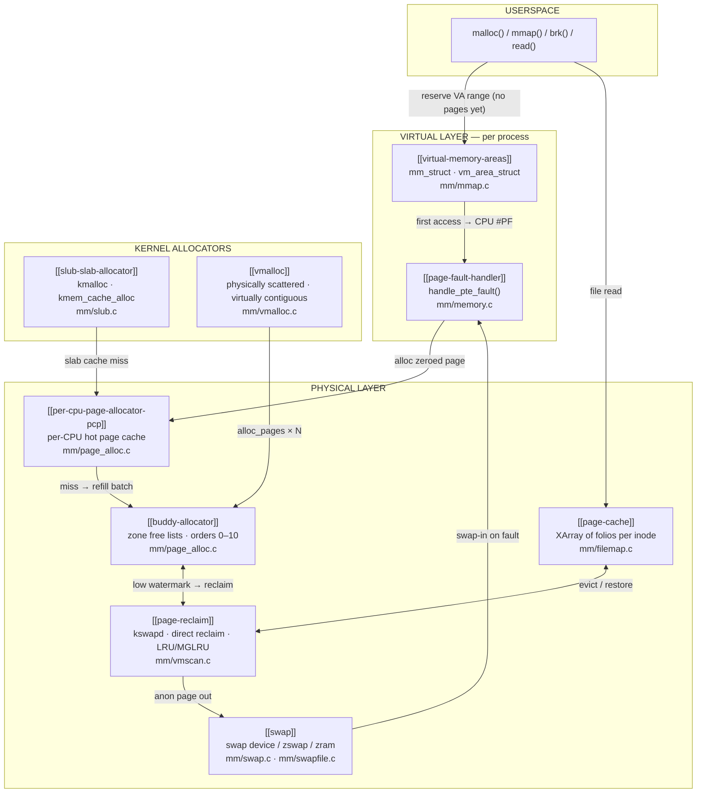

# mm Subsystem

> 📘 Plain-language version: [[mm-explained]]

## Overview

The `mm` subsystem is the part of the Linux kernel responsible for every interaction between software and physical RAM. It solves three interlocked problems: giving each process the illusion of a private, unlimited address space; safely sharing the finite physical memory among all those illusions; and manufacturing free pages fast enough that no allocation ever has to wait for a disk write. It lives almost entirely in `mm/` and `include/linux/mm*.h`, and is maintained by Andrew Morton (`akpm@linux-foundation.org`) on the `linux-mm@kvack.org` mailing list.

## Mental Model

Think of physical RAM as a parking garage with a fixed number of spaces. The mm subsystem is the garage management system: it issues each driver a *map* that shows an unlimited lot (virtual address space), but only assigns a real parking space the moment the driver actually tries to park (demand paging via page fault). When the garage fills up, an attendant (kswapd) quietly moves cold cars to a nearby overflow lot (swap), freeing spaces without the drivers noticing. The deeper principle: *promising space is free; allocating real space is deferred until unavoidable*.

## Architecture



All allocation paths converge at the buddy allocator — the single source of physical pages. Above it, the PCP layer removes per-CPU contention. To the left, SLUB and vmalloc are shortcuts for kernel-internal use. To the right, the page cache and reclaim system absorb file I/O and keep the garage from ever completely filling up.

---

## Core Components

### [[buddy-allocator]] — Physical Page Bookkeeper

**Purpose.** The buddy allocator owns all physical RAM and is the sole authority on which pages are free. Without it, the kernel would have no way to find available physical pages, guarantee physically-contiguous allocations for DMA, or prevent two allocations from sharing a page.

**How it works.** Memory is organised into power-of-two *orders* (0 = 4 KB, 10 = 4 MB) within per-NUMA-node *zones* (DMA, DMA32, NORMAL, MOVABLE). Each zone holds a `free_area` array: one entry per order, each containing a list of free blocks — but crucially, each list is split further by *migration type*.

Migration types are the buddy allocator's answer to fragmentation. Every page is tagged as UNMOVABLE (kernel structures that cannot be relocated), MOVABLE (user pages that compaction can migrate), RECLAIMABLE (page-cache folios that can be dropped), or one of three reserved types (HIGHATOMIC for interrupt-context reserves, CMA, ISOLATE). Grouping pages this way means a single immovable kernel page cannot permanently block a region from being coalesced into a large free block — only its own migration-type neighbourhood is affected.

**Allocation:** `__alloc_pages()` calls `get_page_from_freelist()`, which walks the zonelist looking for a zone whose free pages are above the requested watermark. Inside the zone, `rmqueue()` pops a block from the requested order's free list. If empty, `__rmqueue_smallest()` splits a higher-order block: it takes the next available block, puts one half on the next-lower free list, and returns the other. This cascades downward until the right order is reached. If the entire fast path fails, `__alloc_pages_slowpath()` wakes kswapd, tries compaction, and eventually enters direct reclaim.

**Free:** `__free_one_page()` adds the freed block to its order's list, then computes the buddy address with a single XOR (`buddy_pfn = pfn ^ (1 << order)`). If the buddy is also free and the same migration type, both are removed and merged into a higher-order block; the process repeats upward.

**Watermarks** prevent the system from running completely dry. Three thresholds per zone — min, low, high — govern when background reclaim starts (low), when allocating processes must help (min), and when the system is healthy (high). The HIGHATOMIC reserve sits below min, available only to `GFP_ATOMIC` callers.

**Key struct.**
```c
// include/linux/mmzone.h
struct zone {
    unsigned long _watermark[NR_WMARK]; // min/low/high thresholds in pages
    struct free_area free_area[MAX_PAGE_ORDER + 1]; // per-order free lists
    struct per_cpu_pages __percpu *per_cpu_pageset; // PCP cache
    struct pglist_data *zone_pgdat; // owning NUMA node
    unsigned long managed_pages;    // total pages under buddy control
};

struct free_area {
    struct list_head free_list[MIGRATE_TYPES]; // one list per migratetype
    unsigned long    nr_free;                  // total free blocks at this order
};
```

**Key functions.**
- `__alloc_pages(gfp, order, nid, nodemask)` — universal entry point; everything calls this
- `get_page_from_freelist()` — fast path: check watermarks, call `rmqueue()`
- `rmqueue()` — dequeue from PCP (order 0–3) or `__rmqueue()` for the free lists
- `__free_one_page()` — free + merge loop
- `__alloc_pages_slowpath()` — reclaim, compact, OOM

**Config & flags.**

| | |
|-|-|
| `GFP_KERNEL` | Normal alloc; can sleep and reclaim |
| `GFP_ATOMIC` | Interrupt context; draws from HIGHATOMIC reserve |
| `__GFP_MOVABLE` | Place in MOVABLE migratetype; compaction can later reclaim |
| `__GFP_ZERO` | Zero-fill before returning |
| `__GFP_NOFAIL` | Loop forever; never return NULL |
| `CONFIG_COMPACTION` | Enable kcompactd and direct compaction |
| `vm.min_free_kbytes` | Sets min watermark; raises low/high proportionally |
| `vm.compaction_proactiveness` | 0–100; proactive kcompactd aggressiveness |

---

### [[per-cpu-page-allocator-pcp]] — Lock-Free Hot Page Cache

**Purpose.** The buddy allocator's zone lock would become a hard bottleneck on any system with more than a handful of CPUs. The PCP layer gives each CPU a private stock of pre-allocated pages per zone, letting order-0 allocations — the vast majority of all allocs — complete without touching a shared lock.

**How it works.** Each CPU maintains a `per_cpu_pages` structure for each zone. It holds a list of pages (and since v4.9, lists for orders 0–`PAGE_ALLOC_COSTLY_ORDER`) and a `high` watermark. When `rmqueue()` is called for a small order, it calls `rmqueue_pcplist()`: if the CPU's list is non-empty, pop a page and return — no lock, no atomic. When the list runs empty, `refill_pcp_lists()` acquires the zone lock once and replenishes a full `batch` worth of pages. When the list exceeds `high`, `free_pcppages_bulk()` drains the excess back to the buddy free lists in one lock acquisition.

Since v6.6, `high` is not a fixed compile-time constant but auto-tunes: the kernel measures drain frequency and adjusts `high` so drains happen infrequently but the CPU doesn't hoard too many pages off the free lists. On 224-CPU Sapphire Rapids this yielded a 5% kernel-build speedup and 7% netperf improvement.

Under memory pressure, `drain_all_pages()` forces every CPU to flush its PCP lists back to the buddy allocator, surfacing all cached pages to reclaim.

**Key struct.**
```c
// include/linux/mmzone.h
struct per_cpu_pages {
    spinlock_t lock;
    int        count;                        // current pages on list
    int        high;                         // drain threshold (auto-tuned v6.6)
    int        batch;                        // refill/drain batch size
    short      free_factor;                  // batch scaling hint
    struct list_head lists[NR_PCP_LISTS];    // per-order, per-migratetype lists
};
```

**Key functions.**
- `rmqueue_pcplist()` — pop from per-CPU list; core fast path
- `refill_pcp_lists()` — batch-fill from buddy under zone lock
- `free_unref_page()` — return page to PCP on free
- `drain_all_pages(zone)` — flush all CPUs' lists back to buddy

**Config & flags.**

| | |
|-|-|
| `CONFIG_PCP_BATCH_SCALE_MAX` | Cap PCP batch scaling (useful on latency-sensitive embedded builds) |
| `vm.percpu_pagelist_high_fraction` | Legacy static high-water fraction (superseded by auto-tuning in v6.6) |

---

### [[slub-slab-allocator]] — Kernel Byte-Level Allocator

**Purpose.** The kernel needs to allocate objects measured in bytes, not pages. A raw 4 KB page to hold a 192-byte `struct dentry` wastes 95% of the space. SLUB creates typed caches that carve pages into fixed-size slots, eliminating that waste while making allocation as fast as a pointer swap.

**How it works.** Each object type has a `kmem_cache` (created with `kmem_cache_create()`). Within that cache, each CPU holds a pointer to a "current slab" — an ordinary buddy page carved into a freelist of same-size objects. Allocation is a single `cmpxchg` on the per-CPU `freelist` pointer: grab the first free object, swing the pointer to the next. No lock, no IPI.

When the per-CPU slab runs out, `__slab_alloc()` looks for a partial slab on the per-node `kmem_cache_node` list (one lock acquisition). If that too is empty, it calls `alloc_slab_page()` → `alloc_pages()` to obtain a fresh buddy page, initialises it as a new slab, and continues. The reverse happens on free: if the freed object's slab is still the current slab for this CPU, just prepend it to the freelist. Otherwise, hand back to `__slab_free()` which may return the slab to the partial list or all the way back to the buddy allocator if the slab is now completely empty.

For generic allocations, `kmalloc()` routes to a set of pre-created power-of-two caches (`kmalloc-8`, `kmalloc-16`, … `kmalloc-8192`). A 100-byte request uses `kmalloc-128`, wasting 28 bytes — acceptable compared to a full page.

`kvmalloc(size, gfp)` tries `kmalloc()` first, then falls back to `vmalloc()` if the size is too large or physically-contiguous memory is unavailable — a safe choice when the caller doesn't know the typical size in advance.

SLUB replaced SLAB in 2007 specifically because the code was simpler, making it easier to add security hardening: freelist pointer XOR, freelist randomisation, red-zone bytes, poisoning, and KFENCE (sampling-based production-safe detector) are all built on top of the simpler foundation. SLAB was removed entirely in v6.8; SLOB in v6.4.

**Key struct.**
```c
// include/linux/slub_def.h
struct kmem_cache {
    struct kmem_cache_cpu __percpu *cpu_slab; // per-CPU fast path state
    unsigned int  size;        // allocation size (with alignment padding)
    unsigned int  object_size; // user-visible object size
    slab_flags_t  flags;       // SLAB_HWCACHE_ALIGN, SLAB_POISON, SLAB_ACCOUNT…
    unsigned int  offset;      // freelist pointer offset within object
    struct kmem_cache_order_objects oo; // packed (order, objects-per-slab)
    struct kmem_cache_node *node[MAX_NUMNODES]; // per-node partial list
};

struct kmem_cache_cpu {
    void        **freelist; // pointer to first free object (XOR-hardened if CONFIG_SLAB_FREELIST_HARDENED)
    unsigned long tid;      // transaction ID: prevents ABA race on preemption
    struct slab  *slab;     // current active slab for this CPU
};
```

**Key functions.**
- `kmem_cache_alloc(cache, gfp)` — typed allocation; fast path is one `cmpxchg`
- `kmalloc(size, gfp)` — size-class routing to the right `kmalloc-N` cache
- `kvmalloc(size, gfp)` — try kmalloc, fall back to vmalloc
- `kmem_cache_create(name, size, align, flags, ctor)` — create a new typed cache
- `__slab_alloc()` — slow path: partial list, new page, retry
- `kmem_cache_free(cache, obj)` / `kfree(obj)` — return to per-CPU freelist

**Config & flags.**

| | |
|-|-|
| `CONFIG_SLUB` | SLUB enabled (default since v2.6.22, only option since v6.8) |
| `CONFIG_SLUB_DEBUG` | Red-zone, poisoning, and per-object tracking |
| `CONFIG_SLAB_FREELIST_HARDENED` | XOR freelist pointers with a per-cache secret |
| `CONFIG_SLAB_FREELIST_RANDOM` | Randomise initial freelist order per slab |
| `CONFIG_KFENCE` | Sampling-based UAF/OOB detector safe for production |
| `SLAB_ACCOUNT` | Charge objects to `kmem` cgroup (needed for `CONFIG_MEMCG`) |
| `init_on_alloc=1` / `init_on_free=1` | Zero memory on alloc or free (boot param) |

---

### [[vmalloc]] — Large Virtually-Contiguous Allocator

**Purpose.** `kmalloc()` can only satisfy requests for physically-contiguous memory, which becomes impossible under fragmentation once requests exceed a few pages. `vmalloc()` maps physically non-contiguous pages into a contiguous virtual address range, enabling large allocations regardless of physical fragmentation — at the cost of one extra TLB entry per page.

**How it works.** The kernel reserves a dedicated `vmalloc` region in its virtual address space (architecture-dependent, typically many gigabytes on 64-bit). When `vmalloc(size)` is called, the allocator:

1. Finds a free virtual range of the right size in a red-black tree of `vmap_area` records — O(log n) lookup, replacing the original O(n) linear scan introduced in v2.6.28.
2. Calls `alloc_page(GFP_KERNEL)` once per required page — these pages may be scattered across all of physical RAM.
3. Maps all allocated pages into the kernel page tables as a contiguous virtual range using `map_kernel_range()`.
4. Returns the virtual address of the first page.

Freeing is the reverse, plus a TLB invalidation across all CPUs. Because this IPI is expensive, vmalloc batches TLB invalidations: freed ranges accumulate in a "lazy free" list and are invalidated together in a single IPI storm — lazy TLB flushing, also introduced in v2.6.28.

Each vmalloc region ends with an unmapped *guard page*: a buffer-overflow that crosses into it triggers an immediate page fault rather than silently corrupting adjacent allocations.

vmalloc is used by loadable kernel modules (the text and data of the `.ko` file), large driver buffers, `ioremap()` for MMIO regions, and `copy_from_user()` for large kernel buffers. It is intentionally avoided in hot paths because the extra TLB entries it creates add pressure on TLB-limited workloads.

**Key struct.**
```c
// mm/vmalloc.c
struct vmap_area {
    unsigned long va_start;     // start of virtual range
    unsigned long va_end;       // end of virtual range
    struct rb_node rb_node;     // position in global RB-tree
    struct list_head list;      // in chronological free list for lazy flush
    unsigned long vm_flags;     // VM_ALLOC, VM_MAP, VM_IOREMAP, …
    struct vm_struct *vm;       // back-pointer to vm_struct (if allocated)
};

struct vm_struct {
    struct vm_struct *next;
    void             *addr;     // virtual address
    unsigned long     size;     // allocation size + guard page
    unsigned long     flags;
    struct page     **pages;    // array of backing pages
    unsigned int      nr_pages;
};
```

**Key functions.**
- `vmalloc(size)` — standard virtually-contiguous kernel allocation
- `vzalloc(size)` — vmalloc + zero-fill
- `vmap(pages, count, flags, prot)` — map an existing pages array into vmalloc space
- `vfree(addr)` — unmap and free pages; TLB flush is lazy-batched
- `__vmalloc_node(size, align, gfp, node)` — internal entry; NUMA-aware

**Config & flags.**

| | |
|-|-|
| `CONFIG_MODULES` | Module loading is the primary consumer of vmalloc |
| `vm.max_map_count` | Limits total VMA mappings per process, not vmalloc directly |
| `VMALLOC_START` / `VMALLOC_END` | Architecture-defined vmalloc address window |

---

### [[virtual-memory-areas]] — Process Address Space

**Purpose.** Each process needs a private view of memory — its own stack, heap, code, mapped files, and shared libraries — all at different addresses, with different permissions, and none colliding with another process's layout. VMAs provide this: they are the kernel's record of what virtual address ranges exist for a process and what each one means.

**How it works.** Every process has an `mm_struct`, which holds a *maple tree* of `vm_area_struct` records indexed by virtual address range. A VMA says: "addresses [vm_start, vm_end) exist, have these permissions (`vm_flags`), are backed by this source (`vm_file` or anonymous), and should be handled by these fault operations (`vm_ops`)."

When a process calls `mmap()`, `do_mmap()` finds a suitable free gap in the maple tree, allocates a VMA, and inserts it — no physical memory is touched. When `munmap()` removes a range, the VMA(s) covering it are split or deleted, and any page-table entries mapping those addresses are cleared.

The maple tree replaced the old augmented red-black tree + doubly-linked list in v6.1. The dual structure required keeping two representations in sync, was fragile under concurrent access, and couldn't support lockless reads. The maple tree (a B-tree variant) achieves the same O(log n) range queries in a single structure that is RCU-safe — readers can traverse it holding only RCU rather than the `mmap_lock`.

The `mmap_lock` (an rwsem on `mm_struct`) has historically protected all VMA modifications. On multi-threaded workloads with high page-fault rates, many threads queued behind this single rwsem, creating a significant bottleneck. **Per-VMA locks** (v6.4) added an seqlock to each `vm_area_struct`. The common fault path now calls `lock_vma_under_rcu()` first — if the VMA is stable, the fault proceeds under just the VMA lock, with no `mmap_lock` involved at all. The `mmap_lock` is still needed for structural changes (splitting, merging, inserting, deleting VMAs), but page faults on different VMAs now proceed in parallel.

**Key struct.**
```c
// include/linux/mm_types.h
struct mm_struct {
    struct maple_tree mm_mt;        // VMA tree (replaces rb_root + vma_list in v6.1)
    pgd_t            *pgd;          // top-level page table; CPU MMU starts here
    struct rw_semaphore mmap_lock;  // structural VMA lock
    unsigned long    start_code, end_code;   // .text segment boundaries
    unsigned long    start_data, end_data;   // .data/.bss boundaries
    unsigned long    start_brk, brk;         // heap boundaries
    unsigned long    start_stack;            // stack start
    unsigned long    total_vm;      // total mapped pages (all VMAs)
    unsigned long    locked_vm;     // mlock()ed pages
    unsigned long    pinned_vm;     // pages pinned for DMA etc.
    struct file      *exe_file;     // the executable backing this mm
};

struct vm_area_struct {
    unsigned long  vm_start, vm_end; // [start, end) virtual range
    vm_flags_t     vm_flags;         // VM_READ, VM_WRITE, VM_EXEC, VM_SHARED, …
    struct file   *vm_file;          // backing file; NULL for anonymous
    const struct vm_operations_struct *vm_ops; // fault, open, close, mremap
    unsigned long  vm_pgoff;         // offset into vm_file (in pages)
    struct vm_userfaultfd_ctx vm_userfaultfd_ctx; // userfaultfd state
    // Per-VMA lock (v6.4+):
    struct vm_lock *vm_lock;         // seqlock protecting this VMA
    int             vm_lock_seq;     // sequence counter
};
```

**Key functions.**
- `do_mmap()` → `mmap_region()` — create a new VMA; called by `mmap()` syscall
- `find_vma(mm, addr)` — maple tree lookup; returns VMA covering addr or the next one above
- `do_vmi_align_munmap()` — remove a VMA range; splits at boundaries
- `lock_vma_under_rcu(mm, addr)` — try per-VMA read lock without mmap_lock (v6.4+)
- `vma_merge()` — try to extend an adjacent VMA rather than creating a new one

**Config & flags.**

| | |
|-|-|
| `VM_READ` / `VM_WRITE` / `VM_EXEC` | Page protection reflected in PTEs |
| `VM_SHARED` | Changes visible across all mappings of this file |
| `VM_GROWSDOWN` | Stack region; grows downward on `expand_stack()` |
| `VM_LOCKED` | `mlock()`ed; pages never swapped out |
| `VM_PFNMAP` | Raw PFN mapping (MMIO, device memory); no `struct page` backing |
| `CONFIG_USERFAULTFD` | Enable userfaultfd for userspace-controlled fault handling |

---

### [[page-fault-handler]] — Promise-to-Pages Bridge

**Purpose.** Every VMA is a promise; the page fault handler is where promises are redeemed. When a CPU encounters a virtual address with no valid PTE, it raises an exception. The fault handler determines what kind of fault it is — first access, copy-on-write, swap restore, file demand-load — obtains the right physical page, installs a PTE, and resumes the faulting instruction transparently.

**How it works.** On x86, exception #14 lands at `exc_page_fault()`, which reads the fault address from `CR2` and the error code from the CPU, then calls `do_user_addr_fault()`. This function finds the covering VMA (via `lock_vma_under_rcu()` first, falling back to `mmap_lock` if needed), checks that the access matches the VMA's permissions, and calls `handle_mm_fault()` → `handle_pte_fault()`.

`handle_pte_fault()` is the central decision tree:

- **No PTE, anonymous VMA (first read):** map the *shared zero page* — a single read-only physical page that all processes share for unwritten anonymous memory. No allocation, no I/O.
- **No PTE, anonymous VMA (first write):** `do_anonymous_page()` calls `alloc_zeroed_user_highpage_movable()` → PCP → buddy, allocates a fresh zeroed page, and installs a writable PTE.
- **No PTE, file-backed VMA:** `do_fault()` dispatches to `do_read_fault()`, which calls `filemap_fault()` to load the page from the page cache (or disk if a cache miss).
- **Present but read-only PTE, write access:** `do_wp_page()` — copy-on-write. If the page's `_mapcount` is 1 (this is the only mapping), flip the PTE to writable in-place (`wp_page_reuse()`). Otherwise, `wp_page_copy()` allocates a new page, copies content, and replaces the PTE.
- **Swapped-out PTE:** `do_swap_page()` reads the swap entry from the PTE, allocates a fresh page, reads the data from the swap device, and restores the PTE.
- **Huge PMD:** `do_huge_pmd_anonymous_page()` allocates a 2 MB THP block in one shot.

**Key struct.**
```c
// include/linux/mm_types.h — fault return codes
#define VM_FAULT_OOM    0x0001  // allocation failed; OOM killer may be invoked
#define VM_FAULT_SIGBUS 0x0002  // invalid access; deliver SIGBUS
#define VM_FAULT_MAJOR  0x0004  // fault required I/O (major fault)
#define VM_FAULT_RETRY  0x0400  // re-try with mmap_lock after dropping VMA lock
#define VM_FAULT_COMPLETED 0x1000 // fault handled with PTE already installed
```

**Key functions.**
- `handle_mm_fault(vma, addr, flags, regs)` — top-level entry from arch fault handler
- `handle_pte_fault(vmf)` — dispatches to the right fault type handler
- `do_anonymous_page(vmf)` — first-write anonymous fault; PCP/buddy allocation
- `do_wp_page(vmf)` — copy-on-write; reuse or copy
- `do_swap_page(vmf)` — swap-in; reads from swap device
- `do_fault(vmf)` — file-backed fault; calls into VFS/page cache

**Config & flags.**

| | |
|-|-|
| `VM_FAULT_RETRY` | Fault handler returns this to release VMA lock and retry under mmap_lock |
| `FAULT_FLAG_WRITE` | Fault was a write; drives COW vs. read-map decisions |
| `FAULT_FLAG_ALLOW_RETRY` | Caller allows retry (most do) |
| `CONFIG_TRANSPARENT_HUGEPAGE` | Enables `do_huge_pmd_anonymous_page()` fast path |

---

### [[page-cache]] — File Data Buffer

**Purpose.** Storage is thousands of times slower than RAM. The page cache keeps recently read file data in memory so that repeated reads (and reads of the same data by different processes) are served entirely from RAM. It is also where all write buffering happens: writes hit the cache first and are flushed to storage asynchronously by writeback threads.

**How it works.** Every file is represented in the kernel by an inode, and every inode carries an `address_space`. This `address_space` holds an XArray (`i_pages`) mapping byte offsets within the file to `struct folio` objects — each folio representing one or more contiguous pages of file data cached in RAM.

When a process calls `read()`, `generic_file_read_iter()` → `filemap_read()` looks up the folio at the requested offset in the XArray. On a *cache hit*, it copies the data to userspace directly — no I/O. On a *cache miss*, it allocates a new folio, adds it to the XArray, submits an I/O request via `aops->readpage()` (or the readahead path), waits for completion, and then copies to userspace.

*Readahead* (`mm/readahead.c`) detects sequential access patterns and prefetches additional pages before they are needed, hiding I/O latency. The `file_ra_state` per-file structure tracks the window size and adjusts it based on whether predictions were correct.

Writes (via `write()` or a writable `mmap`) update the cached folio and mark it *dirty*. Background writeback threads (`writeback/N`) periodically flush dirty folios to storage, driven by `vm.dirty_background_ratio` (background threshold) and `vm.dirty_ratio` (synchronous throttle threshold).

`struct folio` replaced `struct page` as the page-cache unit in v5.16. A folio knows its own compound order — a 2 MB file folio can be represented as one `struct folio` rather than 512 individual `struct page` entries. This matters because every page-cache operation (LRU accounting, writeback, reclaim, page table mapping) previously had to loop over all 512 pages independently, and the loop logic was riddled with implicit assumptions that each page was order-0.

**Key struct.**
```c
// include/linux/fs.h
struct address_space {
    struct inode          *host;      // owning inode
    struct xarray          i_pages;   // folios indexed by page offset
    struct rw_semaphore    i_mmap_rwsem;
    unsigned long          nrpages;   // number of cached pages
    unsigned long          nrexceptional; // swap/error entries count
    const struct address_space_operations *a_ops; // readpage, writepage, …
    unsigned long          flags;     // AS_EIO, AS_ENOSPC error flags
    gfp_t                  gfp_mask;  // GFP flags for new folio allocations
};
```

**Key functions.**
- `filemap_read()` — core read path; XArray lookup → cache hit/miss → readahead
- `filemap_fault()` — called by fault handler for file-backed VMAs
- `add_to_page_cache_lru()` — insert a new folio into the XArray and LRU
- `page_cache_async_ra()` — readahead path; batches I/O for sequential access
- `balance_dirty_pages_ratelimited()` — throttle writers when dirty ratio exceeded
- `wbc_attach_and_unlock_inode()` — writeback control; submits dirty folios to storage

**Config & flags.**

| | |
|-|-|
| `vm.dirty_ratio` | Max dirty pages (%) before synchronous write throttling |
| `vm.dirty_background_ratio` | Dirty page % that triggers async background writeback |
| `vm.dirty_expire_centisecs` | Max age (centiseconds) before dirty pages must be written back |
| `vm.vfs_cache_pressure` | How aggressively to reclaim dentry/inode caches vs. page cache |

---

### [[page-reclaim]] — Free Page Manufacturing

**Purpose.** Free pages don't accumulate by accident — they must be actively manufactured. The reclaim subsystem's job is to ensure that the buddy allocator always has pages to hand out, by evicting cold pages from the page cache, writing back dirty pages, and swapping out anonymous pages before any allocator has to wait.

**How it works.** The system is driven by per-zone *watermarks*. When free pages in a zone fall below the **low** watermark, the zone's `kswapd` daemon wakes up. kswapd calls `balance_pgdat()` which loops over the node's zones calling `kswapd_shrink_node()` → `shrink_lruvec()` until the zone rises back above the **high** watermark.

`shrink_lruvec()` scans LRU lists (or, since v6.1, MGLRU generation lists — see below) to find cold pages. For each cold page, the decision tree is:

- **Clean file folio:** drop immediately — it can be re-read from disk if needed again.
- **Dirty file folio:** submit for writeback, move to inactive list, retry later.
- **Anonymous folio (swap enabled):** call `add_to_swap()` to write to a swap slot, then free the physical page. The PTE is updated to a swap entry so `do_swap_page()` can restore it on next access.
- **Anonymous folio (no swap):** cannot reclaim; only OOM killing helps.
- **Slab pages:** registered `shrinker` callbacks (dentry cache, inode cache, etc.) are invoked to release slab objects.

If kswapd cannot keep up and an allocation drops below the **min** watermark, the allocating process itself enters `try_to_free_pages()` — *direct reclaim*. This is synchronous: the allocation blocks until enough pages are freed or the system declares OOM.

**Multi-Gen LRU (MGLRU, v6.1).** The classic two-list LRU (active/inactive) had a well-known weakness: a process reading a large file sequentially flooded the inactive list with pages that pushed the process's own hot pages toward eviction. MGLRU replaces the binary hot/cold split with *generations* — time-banded buckets. Pages get a generation number when they are first faulted in. Periodically, the kernel *ages* the generations: recently-accessed pages are promoted to newer generations; untouched pages remain in older ones. Eviction always takes the oldest generation. This provides finer-grained age information, making eviction decisions more accurate and reducing thrashing under streaming workloads.

**OOM killer.** When all reclaim paths fail and a process needs memory it cannot get, `out_of_memory()` scores every process: RSS + swap usage, adjusted by `oom_score_adj` (−1000 to +1000, settable by userspace). The highest-scoring process receives `SIGKILL`. With cgroup `memory.oom.group`, the entire cgroup is killed rather than a single process.

**Key struct.**
```c
// include/linux/mmzone.h
struct lruvec {
    struct list_head         lists[NR_LRU_LISTS]; // classic: inactive_anon, active_anon, etc.
    struct zone_reclaim_stat reclaim_stat;
    // MGLRU (v6.1+):
    struct lru_gen_folio     lrugen;         // per-generation folio lists
    struct lru_gen_mm_list   mm_list;        // mm_structs for aging
};
```

**Key functions.**
- `kswapd()` (`mm/vmscan.c`) — per-node daemon; main reclaim loop
- `balance_pgdat()` — reclaim until all zones are above high watermark
- `try_to_free_pages()` — direct reclaim entry; called from allocator slow path
- `shrink_lruvec()` — scan LRU/MGLRU lists and reclaim cold pages
- `out_of_memory()` — last resort; calls `oom_kill_process()`

**Config & flags.**

| | |
|-|-|
| `vm.swappiness` | 0–200; higher = prefer swapping anonymous pages; 0 = avoid swap entirely |
| `vm.min_free_kbytes` | Sets the minimum watermark controlling when kswapd wakes |
| `CONFIG_SWAP` | Enable swap; without it, anonymous pages are unreclaim­able |
| `CONFIG_ZSWAP` | Compressed in-memory swap cache before hitting swap device |
| `CONFIG_DAMON` | Data Access MONitoring; enables policy-driven proactive reclaim |
| `oom_score_adj` | Per-process OOM weight; −1000 = never kill, +1000 = kill first |

---

### [[swap]] — Memory Extension to Storage

**Purpose.** When anonymous pages cannot be reclaimed (they have no file backing), they would otherwise pin physical memory forever. Swap solves this by writing anonymous pages to a block device or file, freeing the physical frame for reuse, and restoring the page transparently on next access.

**How it works.** Swap operates through two paths. **Swap-out:** reclaim selects an anonymous folio, calls `add_to_swap()` to allocate a slot in a `swap_info_struct`, writes the page to the slot via `swap_writepage()`, and updates the PTE to a *swap entry* — a special non-present PTE value encoding `(swap_type, offset)`. The physical frame is then freed to the buddy allocator. **Swap-in:** when the process accesses the swapped address, the fault handler detects the swap PTE and calls `do_swap_page()`, which allocates a fresh frame, reads the data back via `swap_readpage()`, updates the PTE to a normal mapping, and resumes execution.

A *swap cache* bridges the two paths: during swap-out, the folio is kept in the swap cache until the write completes; during swap-in, if a folio is already in the swap cache (perhaps because another process is also accessing it), the write can be avoided entirely.

Multiple swap devices can be configured with different priorities. Higher-priority devices are used first; equal-priority devices are striped round-robin for throughput.

**zswap** (v3.11+) adds a compressed in-memory tier before the actual swap device. Outgoing pages are compressed and stored in a memory pool; if the pool fills, only then do pages reach the block device. This dramatically reduces swap I/O on workloads with compressible anonymous data.

**Key struct.**
```c
// include/linux/swap.h
union swp_entry_t {
    unsigned long val; // encodes type (5 bits) + offset (PAGE_SHIFT bits)
};

struct swap_info_struct {
    unsigned long  flags;        // SWP_USED, SWP_WRITEOK, …
    int            prio;         // priority (higher = preferred)
    unsigned char *swap_map;     // per-slot reference count array
    unsigned long  max;          // total slots
    unsigned long  inuse_pages;  // currently used slots
    struct file   *swap_file;    // backing file or block device
};
```

**Key functions.**
- `add_to_swap(folio)` — allocate slot; mark folio for write-out
- `do_swap_page(vmf)` — swap-in on fault; reads from device into new frame
- `swap_writepage(page, wbc)` — submit swap-out I/O
- `swp_entry_to_page(entry)` — look up a folio in the swap cache by swap entry

**Config & flags.**

| | |
|-|-|
| `CONFIG_SWAP` | Enable swap support |
| `CONFIG_ZSWAP` | Compressed in-memory swap cache |
| `vm.swappiness` | Tune balance between anonymous swap and file-cache eviction |
| `vm.page-cluster` | Pages to read ahead on swap-in (default 3 = 8 pages) |

---

### [[transparent-huge-pages]] — Automatic 2 MB Pages

**Purpose.** Modern workloads with large working sets suffer from TLB pressure: a 1 GB heap mapped with 4 KB pages requires 262,144 TLB entries, causing constant TLB misses and expensive page table walks. Transparent Huge Pages (THP) promotes groups of 4 KB pages to 2 MB PMD-level mappings automatically, reducing TLB entries 512× for the same region — without requiring any application changes.

**How it works.** THP operates through two promotion paths. **Fault-time (synchronous):** when `do_huge_pmd_anonymous_page()` is called during a page fault, the kernel attempts to allocate a naturally-aligned 2 MB block from the buddy allocator in one shot. If successful, the entire 2 MB region is backed by a single compound folio and mapped with one PMD entry. If the buddy allocator can't satisfy the order-9 request (due to fragmentation), the fault falls back to a normal 4 KB page. **khugepaged (asynchronous):** a daemon continuously scans process VMAs for regions of 512 contiguous 4 KB pages that could be collapsed into a 2 MB THP. When it finds such a region, it allocates a 2 MB block, copies the content in, updates the PMD, and frees the 512 original pages.

Splitting happens on partial frees: if `munmap()` or a COW fault covers only part of a THP, `split_huge_page()` breaks the compound folio back into 512 individual pages and individual PTEs.

THP for file-backed mappings arrived in v6.8: page-cache folios can now be 2 MB, reducing TLB pressure for databases and JVMs that mmap large files.

**Key functions.**
- `do_huge_pmd_anonymous_page()` — fault-time THP allocation attempt
- `khugepaged_collapse_huge_page()` — async collapse by the khugepaged daemon
- `split_huge_page(page)` — break a THP back into order-0 pages

**Config & flags.**

| | |
|-|-|
| `CONFIG_TRANSPARENT_HUGEPAGE` | Enable THP support |
| `/sys/kernel/mm/transparent_hugepage/enabled` | `always` / `madvise` / `never` |
| `/sys/kernel/mm/transparent_hugepage/defrag` | `always` / `defer` / `madvise` / `never` |
| `MADV_HUGEPAGE` / `MADV_NOHUGEPAGE` | Per-region THP opt-in / opt-out |
| `CONFIG_COMPACTION` | Required for THP; compaction creates contiguous free blocks |

---

## How Components Interact

### Scenario 1 — A process calls `malloc(100)`

```
malloc(100)
  └─► glibc thread-local cache → miss
        └─► sbrk()/mmap(MAP_ANON) → kernel do_mmap() → VMA created; zero pages
              └─► returns virtual address

*(ptr) = 42;    ← first write
  └─► CPU #PF → handle_pte_fault() → do_anonymous_page()
        └─► alloc_zeroed_user_highpage_movable()
              └─► PCP list → hit → return page
                    (miss) → buddy alloc → (if needed) → direct reclaim
              └─► set_pte_at(): write PTE; resume instruction
```

Physical memory is consumed only at the first write. A read before write maps the shared zero page — no allocation at all.

### Scenario 2 — A process reads a file for the first time

```
read(fd, buf, 4096)
  └─► generic_file_read_iter() → filemap_read()
        └─► XArray lookup at offset 0 → miss
              └─► alloc folio (buddy) → add to XArray
                    └─► aops->readpage(): submit I/O, wait
                          └─► copy folio to userspace → return

(same read again)
  └─► XArray lookup → hit → copy directly from folio → return (no I/O)
```

### Scenario 3 — Memory pressure triggers reclaim

```
free pages fall below low watermark
  └─► wake kswapd
        └─► shrink_lruvec(): scan MGLRU oldest generation
              ├─► clean file folio → drop from XArray → free to buddy
              ├─► dirty file folio → submit writeback → keep on LRU
              └─► anon folio → add_to_swap() → write to swap device → free to buddy

(kswapd falls behind; allocation hits min watermark)
  └─► allocating process: try_to_free_pages() [direct reclaim]
        └─► (still nothing) → out_of_memory() → oom_kill_process()
```

---

## Where It Fits in the Kernel

- **↑ Userspace:** `mmap()`, `munmap()`, `mprotect()`, `brk()`, `mlock()`, `madvise()`, `mincore()` all land directly in mm. Every process exists because mm allocated an `mm_struct` for it. `/proc/<pid>/maps`, `/proc/meminfo`, and `/proc/vmstat` expose mm's internal accounting.
- **→ VFS:** mm asks the VFS to populate page-cache folios on file-backed faults; the VFS calls back through `address_space_operations::readpage`. Writeback flows the other way: mm's writeback threads call `aops->writepage`.
- **← Drivers / DMA:** drivers request physically contiguous pages via `alloc_pages(GFP_DMA)` or the CMA API; mm either guarantees contiguity or fails cleanly. `ioremap()` goes through vmalloc to map device MMIO.
- **→ Scheduler:** heavy direct reclaim causes processes to sleep, which the scheduler must handle. NUMA auto-balancing migrates pages based on access locality, interacting with scheduler CPU placement decisions.
- **← cgroups (memcg):** `mem_cgroup_charge()` and `mem_cgroup_uncharge()` are called on every folio allocation and reclaim, enforcing per-cgroup memory limits and per-cgroup OOM.
- **↓ Hardware MMU:** mm writes and invalidates page tables that the CPU's MMU reads on every memory access. TLB flush IPIs keep remote CPUs' caches consistent after mapping changes.
- **↓ Storage / block layer:** reclaim writes dirty folios and swap pages via the block layer; swap-in reads them back.

---

## Design Decisions & Tradeoffs

**Demand paging over eager allocation.** Virtual addresses are issued immediately (just a VMA); physical pages arrive only on first access via page fault. This makes `fork()` cheap (copy-on-write), `malloc()` instant, and overcommit possible. Cost: one fault on first access.

**Power-of-two blocks in the buddy allocator.** O(1) buddy identification (one XOR), O(log n) coalescing, at the cost of up to 50% internal fragmentation on oddly-sized requests. The alternative — arbitrary-size free lists — would eliminate internal waste but destroy allocation latency guarantees.

**Migration types to combat fragmentation.** Before migration types (v2.6.24), a single immovable kernel page could permanently block high-order allocations in its region, causing OOM even with abundant free memory. Migration types segment the allocation space so compaction can always move movable pages away.

**SLUB over SLAB.** SLUB replaced SLAB not for performance (the difference was marginal) but for simplicity: one implementation is easier to audit, harden, and maintain. SLOB was removed in v6.4; SLAB in v6.8.

**Two-tier reclaim (background + direct).** A fixed reserved free pool would be simple but wastes memory proportional to peak demand. kswapd dynamically manufactures free pages on demand, leaving nearly all memory available as cache. Cost: direct reclaim adds latency when kswapd falls behind.

**Folio over struct page.** `struct page` accumulated three decades of implicit assumptions that every compound page was order-0. Code receiving compound pages and treating them as order-0 was technically wrong but happened to work — until it didn't. `struct folio` enforces the compound size at the type level. Cost: an ongoing, years-long migration.

---

## How It Has Evolved

| Version | Change | Driver |
|---------|--------|--------|
| v2.5/2.6 (2002) | Per-CPU page lists (PCP) | SMP systems saturated zone lock |
| v2.6.22 (2007) | SLUB becomes default slab allocator | SLAB too complex; SLUB simpler and more hackable |
| v2.6.24 (2008) | Migration types | THP planning; compaction prerequisites |
| v2.6.35 (2010) | Memory compaction + kcompactd | THP/high-order alloc failures on fragmented systems |
| v4.20 (2019) | XArray replaces radix tree in page cache | Cleaner API; enables lockless lookups |
| v5.16 (2022) | `struct folio` begins replacing `struct page` | Compound-page type safety; bugs from silent order assumptions |
| v6.1 (2022) | Multi-Gen LRU (MGLRU) | Two-list LRU thrashed under streaming; generational model more accurate |
| v6.1 (2022) | Maple tree replaces VMA red-black tree + linked list | Dual-structure error-prone; maple tree is RCU-safe and cache-friendlier |
| v6.4 (2023) | Per-VMA locks | mmap_lock contention on multi-threaded page-fault workloads |
| v6.4 (2023) | SLOB removed | SLUB efficient enough everywhere; code simplification |
| v6.6 (2023) | PCP high-water auto-tuning | Static batches inefficient on 200+ CPU systems |
| v6.8 (2024) | SLAB removed; SLUB sole allocator | Final cleanup after SLUB proved sufficient everywhere |
| v6.8 (2024) | THP for file-backed mappings | THP benefits historically limited to anonymous memory |

---

## Recent Development Activity

**Folio migration** (ongoing): converting peripheral drivers, filesystems, and arch code from `struct page` to `struct folio`. Most core mm paths are done; the long tail continues.

**Large anonymous folios / multi-size THP**: work to stabilise 2 MB (and larger) anonymous folios without requiring full THP. Previously renamed from FLEXIBLE_THP to LARGE_ANON_FOLIO; goal is reduced page-table overhead for large heap allocations without THP's compaction cost.

**Swap subsystem rework**: three competing approaches debated at LSF/MM 2025 to simplify and improve swap effectiveness, including better CXL-tier awareness.

**Memory tiering (CXL)**: management of volatile CXL memory devices as slow-tier DRAM, with reclaim preferring eviction to CXL over swap.

**Per-VMA lock coverage**: some fault types still fall back to `mmap_lock`; ongoing work to extend per-VMA lock coverage to remaining paths.

**Page allocation for address-space isolation**: security work to partition allocations by process/privilege level, limiting cross-address-space physical proximity.

---

## Further Reading

1. [LWN — Per-VMA locks](https://lwn.net/Articles/919547/) — design and motivation for replacing mmap_lock in the fault path
2. [LWN — How to get rid of mmap_sem](https://lwn.net/Articles/787629/) — years of failed attempts before per-VMA locks; essential historical context
3. [LWN — Introducing the Maple Tree](https://lwn.net/Articles/892724/) — why a new VMA data structure was needed
4. [LWN — Memory Folios](https://lwn.net/Articles/851299/) — the bug class folios eliminate and how the abstraction was designed
5. [LWN — Multi-size THP for anonymous memory](https://lwn.net/Articles/954094/) — flexible THP orders and the tradeoffs vs. full 2 MB THP
6. [LWN — docs/mm: add VMA locks documentation](https://lwn.net/Articles/997398/) — authoritative per-VMA lock protocol writeup
7. [kernel-internals.org/mm/overview/](https://kernel-internals.org/mm/overview/) — design rationale and the 30-year story of Linux mm
8. [kernel-internals.org/mm/life-of-malloc/](https://kernel-internals.org/mm/life-of-malloc/) — end-to-end trace of malloc through every mm layer
9. [kernel.org — Memory Allocation Guide](https://static.lwn.net/kerneldoc/core-api/memory-allocation.html) — when to use which allocator; GFP flag reference
10. [LSF/MM/BPF 2025 summary](https://lwn.net/Articles/lsfmmbpf2025/) — current open problems in mm as of 2025

---

## LKML Highlights

- **[PATCH v3: docs/mm: add VMA locks documentation](https://lore.kernel.org/all/20241114205402.859737-1-lorenzo.stoakes@oracle.com/) (Lorenzo Stoakes, Oracle, Nov 2024)** — Review debate makes explicit *why* the seqlock-per-VMA design was chosen over RCU-only alternatives and what invariants must hold across `fork()` and `munmap()`; essential for understanding the modern fault-path locking model.

- **[RFC: mm: multi-gen LRU: working set extensions](https://lore.kernel.org/all/CAJj2-QFg_7msfB+k2hv2jx13HCJ_-EBhqbuHwLjOVUhZvTN38w@mail.gmail.com/) (Yuanchu Xie / Google, Jan 2023)** — Debate on extending MGLRU to track working-set *size* alongside recency; shows how generational design was intentionally left extensible and how Google production data shapes mm development priorities.

- **[RFC: per-CPU pageblock buddy allocator](https://lore.kernel.org/all/20260403194526.477775-3-hannes@cmpxchg.org/) (Johannes Weiner, Meta, Apr 2026)** — Proposes merging PCP and buddy into a per-CPU pageblock allocator; demonstrates that even the most fundamental allocator boundary is still being reconsidered as core counts grow past 200.
