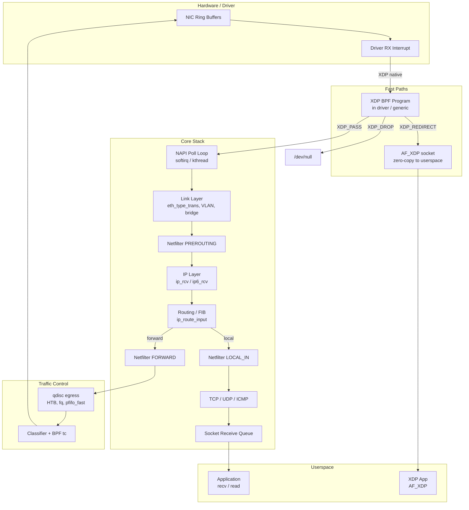
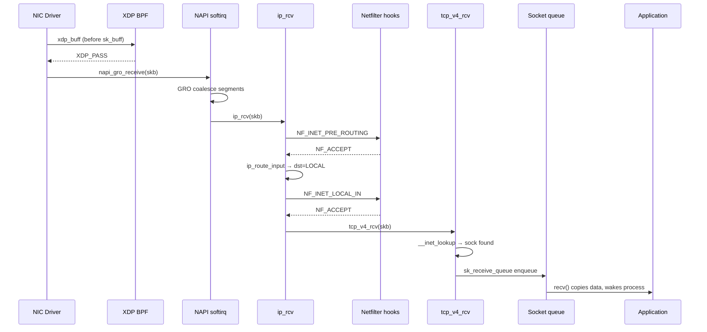

# Linux Networking (net) Subsystem

## Overview

The Linux networking subsystem (`net/`) is the kernel's complete TCP/IP stack — it receives packets from hardware drivers, routes and filters them through protocol layers, and delivers data to userspace socket APIs. It must simultaneously serve low-latency interactive connections, saturate 100 Gb/s links, support containers and VMs with full network isolation, and allow programmable fast paths via eBPF/XDP. No single design point dominates; the stack is a layered compromise between generality, throughput, and latency.

## Mental Model

Think of the networking stack as a **multi-lane highway with toll booths and on-ramps**. Packets arriving from hardware are raw bytes on the fast lane. Each layer of the stack is a toll booth that reads a header, strips it, makes a decision (drop, forward, deliver locally), and passes the payload to the next booth. The socket layer is the on-ramp where userspace processes inject new traffic. The `sk_buff` structure is the car driving through all these booths — it carries both the payload and every routing/state decision accumulated along the way. XDP is a weigh station installed *before* the first booth, where packets that match known bad patterns are discarded at near-zero cost.

## Architecture

Packets enter from the bottom-left (NIC), climb through the stack, and either exit to another NIC (forwarding path) or climb all the way to a socket (local delivery). XDP intercepts packets before `sk_buff` allocation. Traffic control shapes egress just before the NIC driver's transmit ring.

---

## Core Components

### [[sk-buff]]

**Purpose** — Represent a network packet (or fragment of one) as it moves through every layer of the stack. Every layer needs to read headers, prepend/strip its own headers, track routing decisions, and pass the packet on — all without copying the payload. `sk_buff` is the structure that makes this possible in O(1) for most common operations.

**How it works** — An `sk_buff` does not embed packet data; it holds *pointers* into a separately allocated buffer. The buffer has a headroom region (for prepending headers), a data region (current packet content from `skb->data` to `skb->tail`), and a tailroom (for appending). When IP adds its header before passing to Ethernet, it calls `skb_push()` to extend `data` backward into headroom — no copy, just a pointer move. When Ethernet strips its header before handing to IP, `skb_pull()` moves `data` forward.

For large packets that exceed a single contiguous buffer, `skb_shared_info` (stored at `skb->end`) chains additional page fragments (`skb_frag_t`) and a `frag_list` of other `sk_buff`s. This scatter-gather layout is what allows TCP segmentation offload (TSO) to hand the NIC a single logical `sk_buff` representing 64 KB of data; the NIC slices it into MTU-sized frames in hardware.

Reference counting is split: `sk_buff.users` tracks how many code paths hold a reference to the *metadata struct* (so it is not freed while in a hash or queue), while `skb_shared_info.dataref` is a split 16-bit counter — the upper half counts *users who can modify headers*, the lower half counts total users. `skb_clone()` creates a second `sk_buff` that shares the data buffer (increments `dataref`) but has its own writable header area; `skb_copy()` makes a completely independent copy.

Checksum offload is tracked in `skb->ip_summed`. When `CHECKSUM_PARTIAL`, the driver must compute the transport checksum before transmission; when `CHECKSUM_UNNECESSARY`, hardware already verified it on receive, saving a CPU checksum operation on the fast path.

**Key struct**: `struct sk_buff` (`include/linux/skbuff.h`)
- `next` / `prev` — links into queues (socket receive queue, qdisc queue, etc.)
- `dev` — the `net_device` this skb is associated with (changes as it traverses the stack)
- `data` / `head` / `tail` / `end` — the four pointers defining the buffer layout
- `len` — total logical length of the packet (data + all fragments)
- `data_len` — number of bytes in page fragments (so `skb->len - skb->data_len` = bytes in linear buffer)
- `ip_summed` — checksum status: `CHECKSUM_NONE`, `CHECKSUM_UNNECESSARY`, `CHECKSUM_COMPLETE`, `CHECKSUM_PARTIAL`
- `hash` / `l4_hash` — cached flow hash for RSS/RPS steering
- `sk` — owning socket (set when enqueued into socket receive buffer)
- `_skb_refdst` — cached route (`dst_entry`) for forwarding decisions
- `cb[48]` — per-layer private scratch space; each protocol layer stores its own state here without needing wrapper structs

**Key functions**:
- `alloc_skb()` (`net/core/skbuff.c`) — allocates metadata + contiguous buffer; called by drivers on packet receive
- `skb_push()` / `skb_pull()` — move `data` pointer to prepend/strip headers (O(1), no copy)
- `skb_clone()` — shallow copy sharing the data buffer; used by multicast and packet sockets
- `pskb_may_pull()` — ensures `n` bytes are in the linear buffer (may pull from fragments); called before header parsing

**Config & flags**:
- `CONFIG_NET_SKB_RECYCLING` — experimental per-CPU skb pool to avoid allocator pressure on high-pps paths
- `net.core.rmem_default` / `net.core.wmem_default` — default socket buffer sizes (affects how many skbs a socket holds)

---

### [[network-device-and-napi]]

**Purpose** — Abstract every possible network interface (Ethernet, Wi-Fi, virtual, tunnel) behind a single `struct net_device` API, and provide an interrupt-mitigation mechanism (NAPI) that switches the receive path from interrupt-per-packet to batch polling once traffic is high enough to warrant it.

**How it works** — When a NIC receives a packet, it raises a hardware interrupt. The driver's interrupt handler does the minimum: it disables the NIC's receive interrupt, schedules the device's `napi_struct` for polling via `napi_schedule()`, and returns. This transitions control to the softirq context (`NET_RX_SOFTIRQ`), where `net_rx_action()` iterates all scheduled NAPI instances.

For each NAPI instance, the driver's `poll()` callback is called with a `budget` (default 64 packets). The driver dequeues packets from the NIC's RX ring descriptor, allocates `sk_buff`s, fills them with DMA-transferred data, and calls `napi_gro_receive()` (or `netif_receive_skb()`) for each. GRO (Generic Receive Offload) coalesces TCP segments sharing the same flow into fewer, larger `sk_buff`s before handing up to the IP layer, reducing per-packet overhead.

When the driver has consumed `budget` packets without exhausting the ring, it returns `budget` — NAPI reschedules the instance (more work likely). When the ring is empty before consuming the full budget, the driver calls `napi_complete_done()`, which re-enables the hardware interrupt. This ensures the system idles in interrupt mode when quiet (good latency) and batches in poll mode when busy (good throughput).

Since Linux 5.11, drivers can opt into **threaded NAPI** (`dev->threaded = 1`), which runs the poll loop in a dedicated per-interface kernel thread (`napi/eth0-0`) instead of softirq context. This makes NAPI visible to the scheduler, enables CPU affinity pinning, and eliminates latency spikes caused by NAPI stealing CPU from arbitrary processes.

The `struct net_device` exposes a `net_device_ops` table that drivers fill in. The transmit path calls `ndo_start_xmit()` to hand a packet to the driver, which puts it in the TX ring. When the hardware confirms transmission, the driver's TX interrupt calls `dev_kfree_skb_irq()` to release the skb.

**Key struct**: `struct net_device` (`include/linux/netdevice.h`)
- `netdev_ops` — `const struct net_device_ops *`: driver callbacks (`ndo_open`, `ndo_stop`, `ndo_start_xmit`, etc.)
- `features` — bitmask of `NETIF_F_*` offload capabilities (checksum, TSO, GSO, LRO, etc.)
- `gso_max_size` / `gso_max_segs` — limits for generic segmentation offload
- `rx_queue_count` / `num_tx_queues` — multi-queue configuration
- `nd_net` — pointer to the owning network namespace (`struct net`)
- `reg_state` — lifecycle state: `NETREG_UNINITIALIZED` → `NETREG_REGISTERED` → `NETREG_UNREGISTERING` → `NETREG_UNREGISTERED`

**Key struct**: `struct napi_struct` (`include/linux/netdevice.h`)
- `poll` — driver's poll callback; takes `budget` arg, returns number of packets processed
- `state` — `NAPI_STATE_SCHED`, `NAPI_STATE_DISABLE`, `NAPI_STATE_THREADED`, etc.
- `poll_list` — links into the per-CPU softirq poll list

**Key functions**:
- `napi_schedule()` — marks NAPI as scheduled and raises `NET_RX_SOFTIRQ`; called from interrupt handler
- `napi_complete_done()` — called when ring is drained; re-enables hardware interrupt
- `napi_gro_receive()` (`net/core/gro.c`) — submits a packet to GRO; may hold it temporarily to coalesce with the next packet
- `netif_receive_skb()` — bypasses GRO; delivers directly into the protocol stack
- `dev_queue_xmit()` (`net/core/dev.c`) — top-level transmit; runs the qdisc and eventually calls `ndo_start_xmit()`

**Config & flags**:
- `CONFIG_NET_RX_BUSY_POLL` — enables busy-poll mode (`SO_BUSY_POLL` socket option); userspace spins calling NAPI poll before blocking, trading CPU for latency
- `dev->napi_threaded` sysfs knob — enable/disable threaded NAPI per device at runtime
- `/proc/sys/net/core/netdev_budget` — NAPI budget per softirq round (default 300 across all devices)
- `/proc/sys/net/core/netdev_budget_usecs` — time limit per softirq round

---

### [[ip-routing]]

**Purpose** — Determine where each packet goes: delivered locally to a socket, forwarded to another host, or discarded as unroutable. This decision must be fast (the forwarding path runs millions of times per second) yet flexible enough to support policy routing, multiple routing tables, and ECMP.

**How it works** — On the receive path, `ip_rcv()` (`net/ipv4/ip_input.c`) validates the IP header and passes the packet through the `NF_INET_PRE_ROUTING` netfilter hook. Then `ip_rcv_finish()` calls `ip_route_input_slow()` to perform a **FIB** (Forwarding Information Base) lookup.

The IPv4 FIB is stored as an **LC-trie** (Level Compressed trie, also called a DynArr or Patricia trie variant), implemented in `net/ipv4/fib_trie.c`. Lookup walks the trie on the destination IP's bits, finding the longest-prefix match in O(log N / log log N) average time. The result is a `struct fib_result`, from which the kernel constructs a `struct rtable` (a specialisation of `struct dst_entry`). The `dst_entry` caches the output device, next-hop gateway, and the `dst_entry->output()` function pointer — for local delivery this points to `ip_local_deliver()`, for forwarding to `ip_forward()`.

`ip_forward()` decrements TTL (dropping if zero), runs the `NF_INET_FORWARD` hook (where firewall FORWARD rules run), and calls `ip_output()` → `ip_finish_output()`, which fragments the packet if it exceeds the output MTU, then hands it to `dev_queue_xmit()`.

**Policy routing** supports up to 255 routing tables (numbered 1–255; table 253 = `RT_TABLE_DEFAULT`, 254 = `RT_TABLE_MAIN`, 255 = `RT_TABLE_LOCAL`). Rules in the FIB rules list (`fib_rules`) are evaluated in order; each rule matches on source address, destination address, incoming interface, or `fwmark`, then selects a table. This enables VPN split routing, VRF isolation, and per-user routing policies.

**ECMP** (Equal Cost Multi-Path): when multiple routes have identical metrics, the kernel hashes the flow (src IP, dst IP, protocol, and optionally L4 ports) to select a next-hop consistently for each flow, distributing load without reordering packets within a flow.

**Key struct**: `struct dst_entry` (`include/net/dst.h`)
- `input` / `output` — function pointers for receive and transmit processing; set during route lookup to avoid repeated conditionals in the fast path
- `dev` — output net device
- `ops` — `dst_ops *`: protocol-specific GC and check functions
- `expires` — cache entry TTL

**Key struct**: `struct rtable` (`include/net/route.h`) — IPv4-specific `dst_entry` extension
- `rt_gateway` — next-hop IPv4 address (0 if directly connected)
- `rt_iif` — incoming interface index
- `rt_flags` — `RTCF_LOCAL`, `RTCF_BROADCAST`, `RTCF_MULTICAST`

**Key functions**:
- `ip_route_input_noref()` (`net/ipv4/route.c`) — main IPv4 route lookup; updates `skb->_skb_refdst`
- `fib_lookup()` (`include/net/ip_fib.h`) — consults the FIB rules and tables; returns `fib_result`
- `ip_forward()` (`net/ipv4/ip_forward.c`) — the forwarding fast path; TTL decrement, fragmentation check, netfilter FORWARD hook

**Config & flags**:
- `CONFIG_IP_MULTIPLE_TABLES` — enables policy routing (required for `ip rule` to work)
- `CONFIG_IP_ROUTE_MULTIPATH` — enables ECMP
- `/proc/sys/net/ipv4/ip_forward` — enable packet forwarding (router mode)
- `/proc/sys/net/ipv4/route/max_size` — route cache limit (deprecated after 3.6; routes no longer cached per-dst in the old sense)

---

### [[tcp-ip-stack]]

**Purpose** — Implement the TCP and UDP transport protocols, providing reliable ordered byte-stream (TCP) and unreliable datagram (UDP) delivery to userspace sockets, including congestion control, flow control, retransmission, and connection state management.

**How it works** — The socket layer exposes `AF_INET` sockets to userspace. Each socket is backed by a `struct sock` (generic), specialised into `struct inet_sock` (adds IP-level fields), then further into `struct tcp_sock` or `struct udp_sock`. The protocol operations table (`struct proto`) is what ties the socket to the transport implementation: `tcp_prot` or `udp_prot`.

**UDP receive path**: After IP delivers to `udp_rcv()`, the kernel hashes (src IP, src port, dst IP, dst port) to find the target socket in the UDP hash table. It appends the `sk_buff` to `sk->sk_receive_queue` and wakes the process. There is no per-flow state machine.

**TCP receive path** is more complex. `tcp_v4_rcv()` looks up the socket via `__inet_lookup()`, which checks the established hash table first (fast path: O(1) for known flows), then the listening socket table (SYN packets). For an established socket, `tcp_rcv_established()` runs the fast path: it updates the receive window, checks the sequence number, ACKs if appropriate, and appends in-order data to `sk->sk_receive_queue`. Out-of-order segments go to `tp->out_of_order_queue`. When the application calls `recv()`, `tcp_recvmsg()` drains `sk_receive_queue`, copying to userspace.

**TCP send path**: `tcp_sendmsg()` copies application data into `sk_buff`s attached to the socket's write queue. `tcp_write_xmit()` dequeues packets respecting the congestion window (`tp->snd_cwnd`) and receiver's advertised window (`tp->snd_wnd`). Segments that fit within both windows are passed to `ip_queue_xmit()`. The retransmission timer fires if ACKs don't arrive; RACK (Recent ACK) and SACK-based reordering logic guide selective retransmission.

**Congestion control** is pluggable: a `struct tcp_congestion_ops` table registers an algorithm (Cubic, BBR, Reno, DCTCP, etc.) that updates `snd_cwnd` in response to ACKs, losses, and ECN signals. The default is Cubic. BBR (Bottleneck Bandwidth and RTT) takes a model-based approach, estimating bandwidth and RTT independently to keep the pipe full without inducing queue buildup.

**Key struct**: `struct tcp_sock` (`include/linux/tcp.h`)
- `snd_una` / `snd_nxt` — oldest unacknowledged byte; next byte to send
- `snd_cwnd` / `snd_wnd` — congestion window and receiver's advertised window (in segments and bytes)
- `rcv_nxt` / `rcv_wup` — next expected receive sequence number; last ACKed window update
- `rx_opt` — parsed TCP options (timestamps, SACK, window scale, MSS)
- `ca_ops` — pointer to the active congestion control algorithm's ops struct
- `out_of_order_queue` — red-black tree of out-of-order segments

**Key functions**:
- `tcp_v4_rcv()` (`net/ipv4/tcp_ipv4.c`) — entry point for all incoming TCP segments; demultiplexes to the correct socket
- `tcp_rcv_established()` (`net/ipv4/tcp_input.c`) — fast-path receive for established connections
- `tcp_write_xmit()` (`net/ipv4/tcp_output.c`) — main send path; checks cwnd/wnd and calls `tcp_transmit_skb()`
- `tcp_ack()` (`net/ipv4/tcp_input.c`) — processes incoming ACKs; updates congestion window via `ca_ops->cong_avoid()`

**Config & flags**:
- `CONFIG_TCP_CONG_CUBIC` / `CONFIG_TCP_CONG_BBR` — compile congestion control algorithms
- `/proc/sys/net/ipv4/tcp_congestion_control` — select active algorithm
- `/proc/sys/net/ipv4/tcp_rmem` / `tcp_wmem` — per-socket buffer size tuples [min, default, max]
- `TCP_NODELAY` socket option — disables Nagle algorithm for low-latency sends

---

### [[traffic-control-qdisc]]

**Purpose** — Shape, schedule, and classify egress packets, allowing administrators to implement rate limiting, priority queuing, and fair scheduling across multiple traffic classes without the kernel needing to know about each application's QoS requirements.

**How it works** — Every `net_device` has an associated **root qdisc** on its egress path. When `dev_queue_xmit()` is called, the packet is handed to `sch_direct_xmit()` which enqueues it into the qdisc's internal structure. The qdisc's `dequeue()` operation then returns the next packet to transmit, in an order determined by the qdisc algorithm.

The default qdisc is `pfifo_fast`: three FIFO bands indexed by the IP TOS/DSCP field. Traffic prioritised as interactive (low TOS) goes in band 0 and is dequeued first. Bulk data goes in band 2 and waits if interactive traffic is present.

**Hierarchical qdiscs** allow nesting: HTB (Hierarchical Token Bucket) is the standard rate-limiting qdisc. An HTB root class has child classes, each with a guaranteed rate (`rate`) and ceiling rate (`ceil`). Token buckets fill at the guaranteed rate; excess tokens allow bursting up to the ceiling. Packets are classified into leaf classes by `tc filter` rules (which can be eBPF programs), and HTB ensures each class gets its guaranteed share.

**fq** (Fair Queue) is the default on modern servers: it provides per-flow isolation using a red-black tree of flows, with pacing (it calls `skb->tstamp = now + pace_delay` and relies on the hrtimer-based qdisc watchdog to hold back early packets). fq eliminates head-of-line blocking between flows and is the recommended default for internet-facing servers.

**tc-bpf**: Since Linux 4.1, eBPF programs can be attached as classifiers (`cls_bpf`) or actions at the tc layer, enabling arbitrary packet modification and policy without kernel module changes. This has largely supplanted complex qdisc hierarchies for software-defined networking use cases.

**Key struct**: `struct Qdisc` (`include/net/sch_generic.h`)
- `ops` — `struct Qdisc_ops *`: `enqueue()`, `dequeue()`, `peek()`, `init()`, `destroy()` callbacks
- `q` — `struct sk_buff_head`: the actual packet queue (for simple qdiscs)
- `qstats` — per-qdisc statistics: drops, requeues, overlimits
- `rate_est` — bandwidth estimator (for traffic rate monitoring)
- `stab` — size table for packet length accounting (handles L2 overhead)

**Key functions**:
- `qdisc_enqueue()` (`include/net/sch_generic.h`) — calls `qdisc->ops->enqueue()`; tail-drops if queue is full
- `qdisc_dequeue_skb()` — calls `qdisc->ops->dequeue()`; returns next skb to transmit
- `tc_modify_qdisc()` (`net/sched/sch_api.c`) — netlink handler for `tc qdisc add/change/del` commands

**Config & flags**:
- `CONFIG_NET_SCHED` — enables traffic control infrastructure
- `CONFIG_NET_SCH_HTB` / `CONFIG_NET_SCH_FQ` / `CONFIG_NET_SCH_CODEL` — individual qdisc modules
- `/proc/sys/net/core/default_qdisc` — default root qdisc for new devices (kernel default: `pfifo_fast`; most distros set `fq_codel` or `fq`)

---

### [[network-namespaces]]

**Purpose** — Provide complete network-stack isolation between groups of processes (containers, VMs, test environments), so each group sees its own set of interfaces, routing tables, firewall rules, socket port spaces, and sysctl parameters — as if running on separate machines.

**How it works** — Every network object that might conflict between tenants is namespaced. The kernel's core namespace struct is `struct net` (`include/net/net_namespace.h`). It holds: a list of `net_device`s assigned to this namespace, per-namespace routing tables (`net->ipv4.fib_main`), per-namespace conntrack tables, per-namespace `sysctl_net_*` variables, and per-namespace socket hash tables for TCP/UDP demultiplexing.

When a new network namespace is created (via `unshare(CLONE_NEWNET)` or `clone(CLONE_NEWNET)`), the kernel calls `setup_net()`, which walks a list of registered `pernet_operations` — each subsystem (IPv4, IPv6, conntrack, ARP, etc.) has registered its own `init()` callback to initialise its per-namespace state. The initial namespace (`init_net`) is statically allocated at boot.

**Physical devices** cannot be assigned to non-initial namespaces (the hardware is global); instead, a `veth` pair (virtual Ethernet) is created, with one end in the container's namespace and the other in the host's. Packets transmitted on one veth are received on the other, bridging the namespace boundary. Alternatively, `macvlan`, `ipvlan`, and `SR-IOV` virtual functions can provide hardware-isolated interfaces.

**Port isolation** is a critical consequence of per-namespace socket hash tables: two containers can both bind `0.0.0.0:80` in their respective namespaces without conflict, because `tcp_v4_rcv()`'s `__inet_lookup()` searches only the tables for the incoming packet's network namespace.

**Key struct**: `struct net` (`include/net/net_namespace.h`)
- `dev_base_head` — list of all `net_device`s in this namespace
- `ipv4.fib_main` / `ipv4.fib_default` — main and default IPv4 routing tables
- `ipv4.sysctl_ip_forward` — per-namespace IP forwarding flag
- `ct.hash` — conntrack hash table (if `CONFIG_NF_CONNTRACK`)
- `ns.inum` — inode number for the `/proc/net/ns/net` bind-mount

**Key functions**:
- `setup_net()` (`net/core/net_namespace.c`) — initialises a new network namespace by calling all registered `pernet_operations->init()` callbacks
- `register_pernet_subsys()` — called by subsystems at init time to register their per-namespace init/exit callbacks
- `dev_change_net_namespace()` (`net/core/dev.c`) — moves a `net_device` from one namespace to another (used by `ip link set dev eth0 netns container`)

**Config & flags**:
- `CONFIG_NET_NS` — enables network namespaces (required for container networking)
- `/proc/sys/net/core/somaxconn` is per-namespace — sockets in different namespaces have independent listen backlog limits

---

### [[xdp-express-data-path]]

**Purpose** — Provide a programmable packet processing hook inside the NIC driver (before `sk_buff` allocation) that executes eBPF programs at near-DPDK throughput (10–50 Mpps), enabling DDoS mitigation, load balancing, and packet steering without the overhead of the full kernel stack.

**How it works** — XDP attaches an eBPF program to a network interface. When the driver receives a packet, before allocating an `sk_buff`, it calls `bpf_prog_run_xdp()` with a lightweight `struct xdp_buff` (stack-allocated, no heap cost). The BPF program reads and optionally modifies raw packet bytes, then returns one of five verdicts:

- `XDP_DROP` — discard immediately; most efficient DDoS mitigation
- `XDP_PASS` — continue normal kernel stack processing (packet gets an `sk_buff`)
- `XDP_TX` — retransmit on the same interface (useful for UDP reflectors)
- `XDP_REDIRECT` — forward to another interface, CPU (via cpumap), or userspace (via devmap/AF_XDP)
- `XDP_ABORTED` — drop with a perf event trace (for debugging)

Three attachment modes exist. **Native XDP** (`XDP_FLAGS_DRV_MODE`) runs the program in the driver's RX path before DMA completion; requires driver support but provides full performance. **Generic XDP** (`XDP_FLAGS_SKB_MODE`) runs after `sk_buff` allocation, works on any driver, but loses the allocation-avoidance benefit. **Hardware offload** (`XDP_FLAGS_HW_MODE`) compiles the BPF to NIC microcode, enabling line-rate processing with zero CPU involvement.

**AF_XDP** is the zero-copy user-space interface built on top of XDP_REDIRECT. The application registers a `UMEM` — a region of its own virtual memory divided into fixed-size frames — with the kernel via `XSK_UMEM__REGISTER`. Four descriptor rings (Fill, Completion, RX, TX) are set up as shared memory between kernel and user. XDP programs that choose to redirect to an AF_XDP socket deliver packets directly into UMEM frames, and the application reads descriptor rings to find the frames with data — no kernel-to-user copy, no `sk_buff` allocation.

**Key struct**: `struct xdp_buff` (`include/net/xdp.h`)
- `data` / `data_end` — pointers to start and end of valid packet data (passed to BPF as `ctx->data`)
- `data_meta` — space before `data` for BPF programs to store per-packet metadata
- `rxq` — `struct xdp_rxq_info *`: receive queue metadata (interface index, queue id, memory model)
- `frame_sz` — total frame size in the underlying buffer (for `XDP_TX` bounds checking)

**Key functions**:
- `bpf_prog_run_xdp()` (`include/linux/filter.h`) — invokes the BPF program with the `xdp_buff`; returns the XDP verdict
- `xdp_do_redirect()` (`net/core/filter.c`) — called when the BPF program returns `XDP_REDIRECT`; handles devmap/cpumap/xskmap redirection
- `xsk_rcv()` (`net/xdp/xsk.c`) — delivers a redirected frame into an AF_XDP socket's receive ring

**Config & flags**:
- `CONFIG_XDP_SOCKETS` — enables AF_XDP support
- `XDP_FLAGS_UPDATE_IF_NOEXIST` — prevents replacing an already-attached XDP program
- `/sys/class/net/<dev>/queues/rx-<n>/xdp_rxq_info` — per-queue XDP metadata
- `libbpf` / `bpf()` syscall with `BPF_XDP` attach type — userspace interface for loading XDP programs

---

## How Components Interact

### Scenario 1: TCP connection receive (established flow)

### Scenario 2: Packet forwarding (router mode)

1. NIC interrupt triggers NAPI; driver calls `napi_gro_receive()`.
2. `ip_rcv()` validates IP header, calls `NF_INET_PRE_ROUTING` (DNAT may rewrite dst).
3. `ip_route_input()` queries the FIB; result is `RTN_UNICAST` with an output device and gateway.
4. `ip_forward()` decrements TTL, calls `NF_INET_FORWARD`.
5. `ip_output()` → `ip_finish_output()` fragments if needed, updates L2 header via ARP neighbour lookup.
6. `dev_queue_xmit()` enqueues into the output device's qdisc (HTB/fq shapes traffic).
7. `ndo_start_xmit()` writes the TX descriptor ring; hardware DMA transmits.

### Scenario 3: XDP-based load balancer

1. Packet arrives; driver invokes `bpf_prog_run_xdp()` before any allocation.
2. BPF program reads dst port from raw bytes, looks up a BPF map (devmap keyed by flow hash).
3. Returns `XDP_REDIRECT` to a devmap entry pointing to the upstream NIC.
4. `xdp_do_redirect()` calls the target device's `ndo_xdp_xmit()` — packet leaves without ever becoming an `sk_buff`.

---

## Where It Fits in the Kernel

- **↑ Userspace**: `socket()`, `bind()`, `connect()`, `send()`, `recv()` syscalls; `setsockopt()` for socket-level tuning; `netlink` for routing and device configuration (`ip` command); `tc` for qdisc management; `bpf()` for XDP/tc programs
- **→ [[netfilter]]**: the IP layer embeds `NF_HOOK()` macros at five fixed points; netfilter registers callbacks there for iptables/nftables/conntrack
- **→ [[bpf]]**: XDP and tc-BPF attach points; `bpf_sk_lookup`, `bpf_sockops`, `bpf_cgroup_sock` allow BPF to intercept socket operations
- **→ [[scheduler]]**: NAPI softirq runs in process context stolen from whatever ran on the CPU; threaded NAPI integrates with the scheduler for priority and affinity control
- **→ [[security]]**: `skb->secmark` is set by netfilter SECMARK target; LSM hooks (`security_sock_rcv_skb`, `security_socket_sendmsg`) enforce MAC policy on socket operations
- **← [[block]]**: no direct dependency; network block protocols (NBD, iSCSI, NVMe-oF) use the networking stack as a transport
- **↓ Hardware**: `net_device_ops` abstracts NIC hardware; DMA maps scatter-gather `sk_buff` fragments into hardware descriptor rings; hardware offloads (TSO, LRO, RSS, checksum) are negotiated via `NETIF_F_*` feature bits

---

## Design Decisions & Tradeoffs

**sk_buff headroom/tailroom over copy-on-modify** — The decision to keep packet headers as a mutable pointer into a shared buffer (with clones for multicast/packet sockets) means most header operations are O(1) pointer arithmetic. The tradeoff is that every layer must be careful about `skb_shared()` and `skb_header_cloned()` before modifying headers, adding cognitive complexity. Occasional `pskb_copy()` calls when a layer must modify a shared skb incur allocation cost.

**NAPI polling over interrupt-per-packet** — Before NAPI (pre-2.4.20), each received packet generated a hardware interrupt, context-switching overhead per packet was enormous at high pps. NAPI's interrupt-on-first-packet + poll batch eliminates this. The tradeoff is added latency under very low traffic (the softirq overhead is small but non-zero) and the need for per-driver NAPI integration.

**Modular congestion control** — TCP congestion control is a compile-time and runtime-switchable module. This allowed BBR and DCTCP to be merged without touching core TCP, and allows per-socket algorithm selection. The tradeoff is the indirection overhead of function pointer dispatch in the hot ACK path, and that administrators need to understand which algorithm is appropriate (Cubic for WAN, BBR for LLM training clusters, DCTCP for datacenter).

**FIB LC-trie over hash tables** — The LC-trie enables O(1) amortised lookup time for the longest-prefix match problem without per-route memory overhead proportional to prefix length. The tradeoff is that route insertion rebuilds trie nodes, which is more expensive than hash table insertion. This is acceptable because routing table updates are rare compared to per-packet lookups.

**XDP before sk_buff allocation** — Early XDP placement means a drop decision avoids all per-packet memory allocation. This is critical for DDoS mitigation where the goal is to absorb millions of spoofed packets with minimal resources. The tradeoff is that XDP programs cannot use the rich `sk_buff` API or access socket state — they see only raw bytes.

---

## How It Has Evolved

| Version | Change |
|---------|--------|
| 2.4 (2001) | NAPI introduced; interrupt coalescing replaced per-packet interrupts |
| 2.6 (2003) | Netfilter/iptables matured; connection tracking merged |
| 2.6.20 (2007) | Generic Segmentation Offload (GSO) and Generic Receive Offload (GRO) added |
| 3.9 (2013) | SO_REUSEPORT enables multiple sockets on same port for load distribution |
| 3.11 (2013) | TCP Fast Open (TFO): send data in SYN, eliminating one RTT for returning clients |
| 4.8 (2016) | XDP merged; native driver hook for BPF-based packet processing |
| 4.14 (2017) | AF_XDP zero-copy socket API introduced |
| 4.19 (2018) | BBR congestion control merged; model-based alternative to loss-based algorithms |
| 5.1 (2019) | Multi-path TCP (MPTCP) initial support |
| 5.11 (2021) | Threaded NAPI: dedicated per-interface kernel threads for polling |
| 5.14 (2021) | BIG TCP: IPv6 GSO/GRO for segments > 64 KB (for 100G+ connections) |
| 6.0 (2022) | BIG TCP extended to IPv4 |
| 6.6 (2023) | Socket timestamping improvements for software-defined timing (PTP over UDP) |

---

## Recent Development Activity

- **MPTCP maturity**: Multi-path TCP is actively developed for mobile offload and datacenter redundancy; subflow management and scheduler improvements are ongoing.
- **TCP RACK/TLP refinements**: Tail Loss Probe and RACK retransmission detection continue to be tuned to reduce tail latency for short-lived flows.
- **io_uring + networking**: `IORING_OP_SEND` / `IORING_OP_RECV` allow zero-syscall networking via io_uring submission rings; significant work on reducing per-operation overhead.
- **BIG TCP**: Extending segment sizes beyond 64 KB for Ethernet requires GSO/GRO co-ordination; active work for IPv4 and IPv6 offload paths.
- **Smart NIC / P4 offload**: `devlink` and `tc flower` infrastructure being extended to describe NIC pipelines; XDP hardware offload expanding to more vendors.
- **Network memory**: Work on `MSG_ZEROCOPY` (zero-copy send, where userspace buffer is DMA-mapped directly) to reduce copy overhead for bulk transfers.

---

## Further Reading

1. [Understanding Linux Network Internals (LWN review)](https://lwn.net/Articles/168894/) — review of the O'Reilly book that remains the most complete reference for the stack internals
2. [NAPI polling in kernel threads (LWN, 2021)](https://lwn.net/Articles/833840/) — design rationale for threaded NAPI and scheduler integration
3. [Accelerating networking with AF_XDP (LWN, 2018)](https://lwn.net/Articles/750845/) — AF_XDP zero-copy design, UMEM layout, and performance numbers
4. [Namespaces in operation, part 7: Network namespaces (LWN, 2013)](https://lwn.net/Articles/580893/) — practical guide to network namespace isolation and veth pairs
5. [New approaches to network fast paths (LWN, 2017)](https://lwn.net/Articles/719850/) — XDP vs DPDK tradeoff analysis
6. [sk_buff: add extension infrastructure (LWN, 2019)](https://lwn.net/Articles/775255/) — scalable per-skb extension mechanism
7. [kernel.org: Scaling in the Linux Networking Stack](https://www.kernel.org/doc/html/latest/networking/scaling.html) — RSS, RPS, RFS, XPS configuration guide
8. [kernel.org: NAPI](https://www.kernel.org/doc/html/latest/networking/napi.html) — official NAPI documentation including threaded NAPI and busy-poll
9. [kernel.org: sk_buff reference](https://www.kernel.org/doc/html/latest/networking/skbuff.html) — checksum offload states and reference counting details

---

## LKML Highlights

- **XDP initial RFC (2016)**: David Miller's and Jesper Brouer's design thread debated whether XDP should run before or after `sk_buff` allocation. Running before allocation won — it was the only way to achieve kernel-DPDK parity for DDoS scenarios. The thread also established the five-verdict model and the three-mode (native/generic/hardware) attachment scheme.
- **BBR congestion control merge (2016)**: Neal Cardwell's submission sparked debate over the modelling assumptions (does BBR actually drain queues?) and fairness with Cubic flows. The consensus was to merge it as an opt-in algorithm, requiring explicit sysctl selection, so it could not regress existing deployments.
- **Threaded NAPI (2021)**: Sebastian Andersen's series that introduced `napi/eth0-0` kernel threads faced pushback about overhead on lightly loaded systems. The compromise was a per-device opt-in via `ethtool --set-channels` or sysfs, defaulting to the traditional softirq model.
