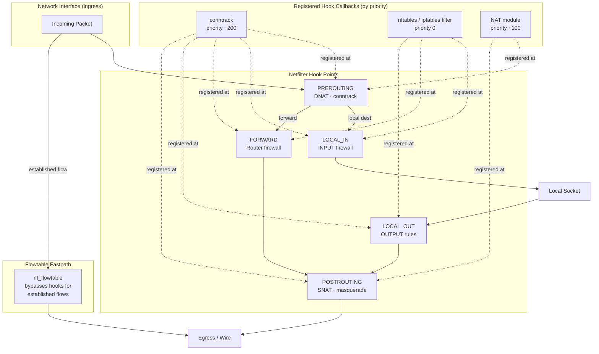
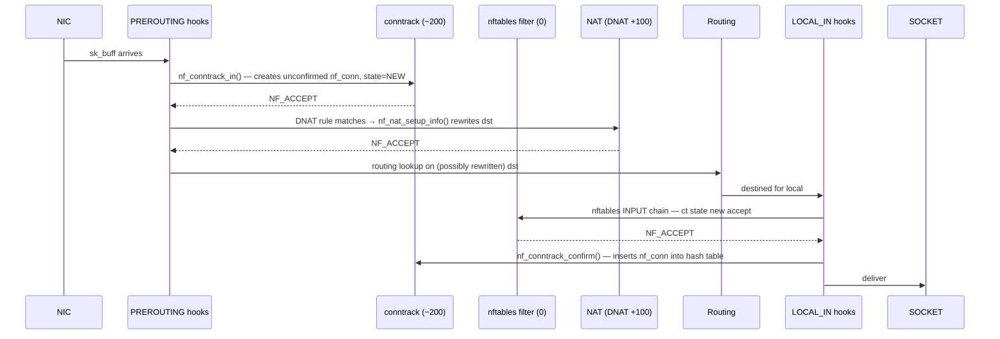

# Netfilter Subsystem

> 📘 Plain-language version: [[netfilter-explained]]

## Related Notes

> **See also**: [[net]] (TCP/IP stack that embeds the hook points), [[bpf]] (BPF programs can attach at XDP and tc, bypassing netfilter entirely), [[security]] (SELinux uses secmark/nfmark via netfilter hooks).

## Overview

Netfilter is the Linux kernel's packet-filtering framework — a set of hooks embedded at five fixed points in the IPv4, IPv6, ARP, and bridge networking paths, plus the modules (iptables, nftables, conntrack, NAT) that register callbacks at those points to inspect and modify packets. The framework itself is deliberately policy-free; it only provides the hook invocation mechanism and the verdict protocol. Every actual firewall rule, NAT translation, or connection-state machine lives in a loadable module that hangs its callbacks off those hooks.

## Mental Model

Think of netfilter as a **security checkpoint system** wired into a highway interchange. The highway is the kernel networking stack; packets flow along it at high speed. At five fixed junctions — before and after routing decisions, and just before delivery to a local socket — the kernel slows every packet and runs it through a queue of registered inspectors (hooks). Each inspector looks at the packet and returns one of a small set of verdicts: let it pass (`NF_ACCEPT`), drop it (`NF_DROP`), hand it to userspace for a decision (`NF_QUEUE`), or steal it for later delivery (`NF_STOLEN`). All inspectors must agree on `NF_ACCEPT` before the packet proceeds. This simple machinery underlies all of Linux's firewalling, NAT, and stateful connection management.

## Architecture



Packets flowing through the network stack hit hook points (shown at top). At each hook point the kernel runs all registered callbacks in priority order — conntrack at −200 runs before filter at 0, which runs before NAT at +100. The flowtable fastpath (bottom) bypasses most of this for already-established flows.

---

## Core Components

### [[netfilter-hook-framework]]

**Purpose** — Provide a generic, protocol-agnostic mechanism for modules to register callbacks at fixed points in the packet path, without the hook consumer needing to know how many other consumers exist or in what order they run.

**How it works** — Any module that wants to intercept packets calls `nf_register_net_hooks()` (or `nf_register_net_hook()` for a single hook), passing an array of `struct nf_hook_ops`. Each `nf_hook_ops` specifies the protocol family (`pf`, e.g. `NFPROTO_IPV4`), the hook number (`hooknum`, one of `NF_INET_PRE_ROUTING` through `NF_INET_POST_ROUTING`), a `priority` integer, and the `hook` callback function pointer.

The kernel stores all registered hooks in `struct nf_hook_entries` arrays, one per hook point per network namespace. On registration, the kernel rebuilds the array sorted by priority, so callbacks always fire in a deterministic order. The actual invocation happens via the `NF_HOOK()` macro, which is called inside the network stack at each hook point:

```c
static inline int NF_HOOK(uint8_t pf, unsigned int hook,
                           struct net *net, struct sock *sk,
                           struct sk_buff *skb, ...)
```

This iterates through `nf_hook_entries`, calling each `hook` function with the current `sk_buff`. If any callback returns `NF_DROP` or `NF_STOLEN`, iteration stops and the verdict is applied. Only if all callbacks return `NF_ACCEPT` does the packet proceed to the next stage of normal processing.

**Key struct**: `struct nf_hook_ops` (`include/linux/netfilter.h`)
- `hook` — callback `nf_hookfn *`: `(void *priv, struct sk_buff *skb, const struct nf_hook_state *state) -> unsigned int`
- `pf` — protocol family (`NFPROTO_IPV4`, `NFPROTO_IPV6`, `NFPROTO_ARP`, etc.)
- `hooknum` — which of the five hook points (`NF_INET_PRE_ROUTING` = 0 … `NF_INET_POST_ROUTING` = 4)
- `priority` — lower numbers run first; conntrack at −200, filter at 0, NAT at +100
- `dev` — if non-NULL, limits callback to a specific net device

**Key functions**:
- `nf_register_net_hooks()` (`net/netfilter/core.c`) — registers a batch of hook ops for a given network namespace; rebuilds the sorted `nf_hook_entries` array
- `nf_unregister_net_hooks()` — removes hooks and rebuilds; uses RCU so removal is safe under concurrent packet processing
- `NF_HOOK()` macro (`include/linux/netfilter.h`) — the actual callsite in the network stack; fast-paths directly to the next stack stage if no hooks are registered

**Config & flags** — No dedicated Kconfig; always compiled when `CONFIG_NETFILTER=y`. Per-hook invocation cost is non-zero even for empty hook points, which is why high-performance paths (XDP, tc BPF) bypass netfilter entirely.

---

### [[iptables]]

**Purpose** — Provide the classic stateless and stateful firewalling interface via tables, chains, and rules matched against packet fields. iptables is the legacy framework that predated nftables; it is still widely deployed.

**How it works** — iptables organises rules into **tables** (filter, nat, mangle, raw, security), each of which operates at specific hook points. Within each table, rules are grouped into **chains** (built-in chains correspond to hook points; user chains are targets from built-in ones). The kernel traverses the chain linearly, testing each rule's match criteria against the packet. The first matching rule's **target** is executed: `ACCEPT`, `DROP`, `RETURN`, `JUMP <chain>`, or an extension target like `DNAT` or `LOG`.

Each table registers itself with the hook framework via `ipt_register_table()`. The userspace `iptables` command updates the in-kernel rule blob atomically by passing the entire new ruleset via `setsockopt(SOX_RAW, IPT_SO_SET_REPLACE)` — the kernel swaps the old blob for the new one under a spinlock. This "full replace" model means that even single-rule changes require rewriting the entire table, which creates a race window on busy systems (another motivation for nftables).

**Key struct**: `struct ipt_entry` (`include/uapi/linux/netfilter_ipv4/ip_tables.h`)
- `ip` — `struct ipt_ip`: source/destination address and mask, in/out interface masks, protocol
- `nfcache` — cached field flags indicating which header fields are referenced
- `target_offset` — byte offset to the target within this entry blob
- `next_offset` — byte offset to the next entry; chains are a flat blob of back-to-back `ipt_entry` records

**Key functions**:
- `ipt_do_table()` (`net/ipv4/netfilter/ip_tables.c`) — the main hook callback; linearly iterates the chain, calls each match extension's `match()`, and on a hit executes the `target()`
- `ipt_register_table()` / `ipt_unregister_table()` — registers a table with the IP hook framework for a given network namespace

**Config & flags**:
- `CONFIG_IP_NF_FILTER` — enables the `filter` table (INPUT/FORWARD/OUTPUT chains)
- `CONFIG_IP_NF_NAT` — enables the `nat` table (DNAT/SNAT/MASQUERADE targets)
- `CONFIG_IP_NF_MANGLE` — enables the `mangle` table (TOS, TTL, MARK targets)
- `CONFIG_IP_NF_RAW` — enables the `raw` table; rules here run before conntrack, so `NOTRACK` can exempt flows

---

### [[nftables]]

**Purpose** — Replace iptables' fragmented, protocol-specific kernel code with a single unified filtering engine based on a small bytecode virtual machine. nftables handles IPv4, IPv6, ARP, and Ethernet bridging from one consistent kernel module (`nf_tables`), eliminating the separate `iptables`/`ip6tables`/`arptables`/`ebtables` codebases.

**How it works** — Instead of hard-coding match logic in kernel modules, nftables compiles rules in userspace into **VM expressions** — sequences of simple opcodes that load packet fields into registers, apply arithmetic or bitwise operations, compare values, look up sets, and finally emit a verdict. The kernel's `nf_tables` module is just a bytecode interpreter; it knows nothing about TCP ports or IP addresses directly — that knowledge is encoded in the expression bytecode.

A **table** groups chains under a single address-family namespace. A **base chain** attaches to a hook point (e.g., PREROUTING at priority −200 for conntrack). A **regular chain** is only reachable via `jump` or `goto` from another chain. Rules within chains are **linear by default**, but the real performance gain comes from **sets**: named collections of elements (IPs, ports, MAC addresses, CIDR prefixes) stored internally as sorted arrays, red-black trees, or hash tables. A single set lookup replaces thousands of individual rule comparisons.

Updates happen atomically: userspace assembles a complete transaction (add/delete/modify operations) and submits it via `nfnetlink`. The kernel applies the entire batch or rejects it whole — no partial state. This eliminates the race window inherent in iptables' full-replace model.

**Key struct**: `struct nft_rule` (`include/net/netfilter/nf_tables.h`)
- `list` — links into the chain's rule list
- `handle` — unique 64-bit identifier for atomic update references
- `dlen` — length of the expression data that follows inline
- `data[]` — byte array of serialised `nft_expr` objects forming the VM program

**Key struct**: `struct nft_set` (`include/net/netfilter/nf_tables.h`)
- `ops` — pointer to backend ops (hash, rbtree, bitmap, pipapo)
- `dtype` / `ktype` — data and key types (determining comparison semantics)
- `size` — current element count
- `timeout` — default element expiry (for timed sets used in rate limiting)

**Key functions**:
- `nft_do_chain()` (`net/netfilter/nf_tables_core.c`) — evaluates each rule's expression list, advancing through registers; the heart of the nftables VM
- `nft_lookup_eval()` — expression that performs a set lookup; updates a register with the verdict or data mapped to the matched key
- `nf_tables_commit()` (`net/netfilter/nf_tables_api.c`) — atomically applies a pending transaction; swaps generation counters so in-flight packets see the old generation until the commit completes

**Config & flags**:
- `CONFIG_NF_TABLES` — enables the nf_tables kernel module
- `CONFIG_NF_TABLES_INET` — adds `inet` family (unified IPv4+IPv6 table)
- `CONFIG_NF_TABLES_NETDEV` — enables the `netdev` family for ingress/egress hooks on specific devices (pre-routing, XDP-adjacent)
- Sets are selected at creation time; `CONFIG_NFT_SET_HASH`, `CONFIG_NFT_SET_RBTREE`, `CONFIG_NFT_SET_PIPAPO` control available backends

---

### [[connection-tracking]]

**Purpose** — Maintain a state table of every active network flow so that firewall rules can make decisions based on connection state (NEW, ESTABLISHED, RELATED, INVALID), and so NAT can automatically apply reverse translations to reply traffic without separate reverse rules.

**How it works** — The conntrack module registers at `NF_INET_PRE_ROUTING` (priority −200) and `NF_INET_LOCAL_OUT` (priority −200), ensuring it runs before any filter or NAT rule. When the first packet of a flow arrives, `nf_conntrack_in()` extracts a **tuple** — source IP, destination IP, source port, destination port, protocol — and looks it up in a per-namespace hash table (`nf_conntrack_hash`). On a miss it allocates a `struct nf_conn` and inserts it as an **unconfirmed** entry (kept in a per-CPU unconfirmed list until the packet is committed to egress by `nf_conntrack_confirm()`). This two-phase approach avoids inserting entries for packets that get dropped by later hook stages.

The `nf_conn` stores **two tuples**: the original direction (client → server) and the reply direction (server → client, pre-computed at creation time). Subsequent packets in either direction are looked up by hashing their tuple — hits return the existing `nf_conn` rather than allocating a new one, and update the entry's timeout. Protocol trackers (registered via `l4proto` structs for TCP, UDP, ICMP, DCCP, SCTP) refine the state machine: TCP tracks SYN/ACK/FIN/RST to update `IPS_ASSURED` and per-connection window state.

For application-layer protocols that embed addresses in their payload (FTP passive mode, SIP), **helpers** parse the payload and create **expectations** — `struct nf_conntrack_expect` entries that pre-match a secondary connection before it arrives, flagging it as RELATED when it does.

**Key struct**: `struct nf_conn` (`include/net/netfilter/nf_conntrack.h`)
- `tuplehash[IP_CT_DIR_ORIGINAL]` / `tuplehash[IP_CT_DIR_REPLY]` — hlist nodes keyed by their respective tuples; the entire conntrack table is a hash of these
- `status` — bitmask of `IPS_*` flags: `IPS_SEEN_REPLY` (bidirectional traffic observed), `IPS_ASSURED` (survives memory pressure GC), `IPS_SRC_NAT` / `IPS_DST_NAT` (rewriting applied), `IPS_CONFIRMED`
- `timeout` — jiffies-based timer for expiry; reset on each matching packet
- `proto` — union of per-protocol state (`tcp`, `udp`, `icmp`, etc.)
- `mark` / `secmark` — 32-bit labels set by MARK/SECMARK targets, matched in rules
- `ext` — flexible array of extensions (NAT info, acct counters, timestamps, labels, zones)

**Key functions**:
- `nf_conntrack_in()` (`net/netfilter/nf_conntrack_core.c`) — hook callback; looks up or creates conntrack entry, attaches it to `skb->_nfct`
- `nf_conntrack_confirm()` — moves entry from unconfirmed list to main hash table at egress; called at `NF_INET_POST_ROUTING`
- `nf_ct_get()` — fast inline to retrieve the `nf_conn *` from a `sk_buff *`
- `nf_conntrack_find_get()` — full hash lookup by tuple with RCU read lock

**Config & flags**:
- `CONFIG_NF_CONNTRACK` — enables the conntrack module
- `/proc/sys/net/netfilter/nf_conntrack_max` — maximum concurrent tracked connections; reaching this causes drops
- `/proc/sys/net/netfilter/nf_conntrack_tcp_timeout_established` — default 432000 s (5 days); tune aggressively on busy servers
- `/proc/sys/net/netfilter/nf_conntrack_buckets` — hash table width; set at module load time (default: total-memory / 16384)
- `CONFIG_NF_CONNTRACK_EVENTS` — enables ctnetlink event delivery; required for conntrackd HA setups

---

### [[netfilter-nat]]

**Purpose** — Rewrite source and/or destination addresses and ports in packet headers, allowing multiple hosts to share a single public IP (SNAT/masquerade) or directing inbound connections to internal servers (DNAT/port forwarding), while ensuring reply traffic is transparently reverse-translated using the conntrack entry.

**How it works** — NAT is not a standalone hook module; it is an extension of conntrack. When a NAT rule (in iptables' `nat` table, or an nftables `nat` statement) first matches a packet, it stores the desired address rewrite in the `nf_conn`'s NAT extension (`nf_nat_l3proto`). The NAT hook callbacks then apply this stored rewrite to every subsequent packet in the same flow, in both directions, by consulting the `nf_conn` rather than re-evaluating rules.

**DNAT** (Destination NAT) runs at `NF_INET_PRE_ROUTING` (priority +100) and `NF_INET_LOCAL_OUT`. It rewrites the destination address/port before the routing decision — so the routing subsystem sees the translated destination and can deliver to the right internal host. **SNAT** runs at `NF_INET_POST_ROUTING`, after routing has chosen the egress interface, rewriting the source address to the interface's public IP.

For the reply path, the NAT module registers a second hook that applies the *inverse* transformation: DNAT at PRE_ROUTING implies a corresponding SNAT on the reply path, and vice versa. This is automatic — the inverse rewrite is computed once when the NAT rule first matches and stored in the `nf_conn`'s reply tuple.

**Key struct**: `struct nf_nat_range2` (`include/uapi/linux/netfilter/nf_nat.h`)
- `flags` — `NF_NAT_RANGE_MAP_IPS`, `NF_NAT_RANGE_PROTO_SPECIFIED`, `NF_NAT_RANGE_PERSISTENT`, etc.
- `min_addr` / `max_addr` — address range for pool-based SNAT (NAT pools)
- `min_proto` / `max_proto` — port range (or ICMP ID range for ICMP)

**Key functions**:
- `nf_nat_setup_info()` (`net/netfilter/nf_nat_core.c`) — stores the NAT range in the `nf_conn` extension and rewrites the reply tuple
- `nf_nat_packet()` — applies the stored rewrite to an actual packet; called from the NAT hook for every packet after the first
- `nf_nat_masquerade_ipv4()` — special-case SNAT that dynamically queries the egress interface's primary address (for masquerade, where the public IP is not static)

**Config & flags**:
- `CONFIG_NF_NAT` — core NAT module (depends on `CONFIG_NF_CONNTRACK`)
- `CONFIG_IP_NF_TARGET_MASQUERADE` — MASQUERADE target for dynamic source IP
- `CONFIG_NF_NAT_FTP` / `CONFIG_NF_NAT_SIP` — NAT helpers for application-layer protocols that embed addresses in payload

---

### [[netfilter-flowtable]]

**Purpose** — Provide a hardware-acceleratable fastpath that bypasses the full netfilter hook stack for established flows, dramatically reducing forwarding latency and CPU overhead for high-throughput traffic.

**How it works** — Once a flow passes through the normal netfilter pipeline and becomes established (conntrack `IPS_ASSURED`), administrator rules can offload it to an `nf_flowtable` via the nftables `flow add @flowtable_name` action. The flowtable stores a lightweight tuple (L2 encapsulation + L3 addresses + L4 ports + ingress interface) in a resizable hash table.

Subsequent packets matching a flowtable entry skip `NF_HOOK()` entirely: the driver (or a pre-routing hook registered by the flowtable module at priority `NF_IP_PRI_CONNTRACK - 1 = −201`) intercepts the packet, looks it up in the flowtable, and if found calls `neigh_xmit()` directly to forward it — bypassing routing, filter chains, and NAT hooks. The NAT state is still applied: the flowtable entry caches the rewrite parameters so that address translation continues correctly on the fastpath.

Hardware offload extends this further: if the NIC driver advertises `ndo_flow_offload`, the kernel can push the flowtable entry into hardware, achieving line-rate forwarding with zero kernel CPU involvement per packet.

**Key struct**: `struct flow_offload` (`include/net/netfilter/nf_flow_table.h`)
- `tuplehash[FLOW_OFFLOAD_DIR_ORIGINAL/REPLY]` — lookup keys for both directions
- `flags` — `FLOW_OFFLOAD_HW`, `FLOW_OFFLOAD_TEARDOWN`, `FLOW_OFFLOAD_DYING`
- `timeout` — entry expiry; refreshed by each matching packet (software path only)
- `nf_ct` pointer — back-reference to the conntrack entry for state synchronisation

**Key functions**:
- `nf_flow_table_offload_add_cb()` (`net/netfilter/nf_flow_table_offload.c`) — queues a hardware offload request to the driver
- `nf_flow_offload_inet_hook()` — the pre-routing hook callback that performs the software fastpath lookup and direct forwarding

**Config & flags**:
- `CONFIG_NF_FLOW_TABLE` — software flowtable support
- `CONFIG_NF_FLOW_TABLE_HW` — hardware offload support (requires driver support)
- `nf_flowtable_tcp_timeout` / `nf_flowtable_udp_timeout` sysctls — idle timeout before entries are migrated back to the normal path

---

## How Components Interact

### Scenario 1: First packet of a new TCP connection (inbound)



### Scenario 2: Second packet in same flow (flowtable fastpath)

After the flow is offloaded to a flowtable, the next packet arriving at the NIC matches the flowtable's pre-routing hook at priority −201 (before conntrack at −200). The hook calls `neigh_xmit()` directly, forwarding without traversing any filter chains or conntrack lookup overhead.

### Scenario 3: FTP PASV — conntrack helper creates expectation

When the FTP helper (registered via `nf_conntrack_helper_register()`) sees the `227 Entering Passive Mode` response packet in conntrack, it parses the embedded IP:port from the payload and calls `nf_ct_expect_alloc()` + `nf_ct_expect_register()`. This inserts an `nf_conntrack_expect` entry that will match the client's subsequent data connection, flagging it as RELATED so firewall RELATED rules accept it automatically.

---

## Where It Fits in the Kernel

- **↑ Userspace**: `iptables`/`nft` commands communicate via raw sockets (`setsockopt`) and `nfnetlink` netlink families; `conntrack` userspace tool reads state via `NFNLGRP_CONNTRACK_*` multicast groups
- **→ [[net]]**: Netfilter hook points are embedded directly into `net/ipv4/ip_input.c`, `ip_forward.c`, `ip_output.c`; the IP stack calls `NF_HOOK()` macros which invoke the netfilter core
- **→ [[bpf]]**: XDP and tc BPF programs run before or alongside netfilter hooks; BPF can bypass netfilter entirely for maximum throughput, or call `bpf_skb_set_tunnel_key()` / `nf_conntrack_find_get()` to interact with conntrack state
- **→ [[security]]**: The LSM subsystem (SELinux) uses `skb->secmark` set by the SECMARK iptables target; secmark values are set at `NF_INET_LOCAL_IN` and checked at socket receive
- **← [[net]]**: Netfilter is a consumer of the network stack's packet path — it does not drive anything upward to userspace independently (except via `NF_QUEUE` to `nfnetlink_queue`)
- **↓ Hardware**: Flow offload pushes flowtable entries into NIC hardware via `ndo_flow_offload`; hardware forwards packets at line rate with zero kernel involvement

---

## Design Decisions & Tradeoffs

**Mechanism vs. policy separation** — Netfilter deliberately contains zero filtering policy. Every rule lives in a loadable module. This means adding new match types (SCTP, DCCP, L2 bridging) requires no changes to the hook core, only a new module. The tradeoff is complexity: five separate table frameworks historically existed (iptables, ip6tables, arptables, ebtables, nftables), each maintained independently.

**Priority-based hook ordering** — Rather than a fixed execution order, hooks are sorted by an integer priority at registration time. This allows conntrack to reliably run before filter (which needs the connection state) and before NAT (which would otherwise confuse tuple lookups). The tradeoff is that module authors must understand the priority space to avoid ordering bugs.

**Two-phase conntrack confirm** — Inserting conntrack entries into the main hash table is deferred until the packet successfully reaches `NF_INET_POST_ROUTING` / `NF_INET_LOCAL_IN`. Packets dropped by filter chains never confirm, avoiding state table pollution. The cost is per-CPU unconfirmed list bookkeeping.

**nftables VM approach** — Moving rule logic into bytecode compiled in userspace means the kernel module needs no protocol-specific knowledge. New address families and match types can be added without kernel changes, just new VM expression modules. Initial concern was interpreter overhead vs. iptables' native C; benchmarks showed the VM actually performed comparably or better, partly because set lookups replace many linear scans.

**Flowtable explicit opt-in** — Rather than automatically offloading all established flows, flowtable offload requires an explicit ruleset action. This keeps the fastpath transparent: administrators see exactly which flows bypass netfilter and can debug them independently.

---

## How It Has Evolved

| Version | Change |
|---------|--------|
| 2.4 (2001) | Original netfilter hooks + iptables replace ipfwadm/ipchains |
| 2.6.14 (2005) | `nf_conntrack` refactored from ipv4-only to generic; IPv6 conntrack added |
| 3.13 (2014) | `nf_tables` (nftables) merged; unified IPv4/IPv6/ARP/bridge in one VM |
| 4.1 (2015) | nftables sets gain `pipapo` algorithm (Piece-wise Independent Optimised Packet Processing) for interval and concatenation lookups |
| 4.16 (2018) | Flowtable infrastructure introduced; software fastpath bypass for forwarding |
| 5.3 (2019) | Hardware flow offload via `ndo_flow_offload`; conntrack can be pushed to NIC |
| 5.13 (2021) | BPF programs can be attached as netfilter base chain hooks (`CONFIG_NETFILTER_BPF_HOOK`) |
| 6.4 (2023) | nftables parallel evaluation for independent chains; improved ruleset scalability |

---

## Recent Development Activity

- **nftables flowtable improvements**: Work on more granular timeout control and better GC for offloaded flows.
- **BPF + netfilter convergence**: The `bpf_nf` infrastructure (since 5.13) allows BPF programs to be loaded as first-class netfilter hooks; ongoing work to expose conntrack map-style lookups from BPF.
- **Conntrack scalability**: Efforts to reduce lock contention in the conntrack hash table for very high connection-rate workloads (millions of connections/second on large servers).
- **iptables deprecation timeline**: Most major distributions default to nftables and ship `iptables-nft` (iptables syntax compiled to nftables VM); the iptables kernel modules remain but are slowly being de-prioritised for new features.

---

## Further Reading

1. [The return of nftables (LWN, 2013)](https://lwn.net/Articles/564095/) — foundational design article explaining the VM approach and motivation
2. [Nftables: a new packet filtering engine (LWN, 2009)](https://lwn.net/Articles/324989/) — earliest public design discussion
3. [Nftables reaches 1.0 (LWN, 2021)](https://lwn.net/Articles/867185/) — marks production readiness and deprecation trajectory for iptables
4. [BPF comes to firewalls (LWN, 2018)](https://lwn.net/Articles/747551/) — how BPF and netfilter coexist and overlap
5. [Connection tracking offload (LWN, 2020)](https://lwn.net/Articles/814061/) — hardware flowtable design and driver interface
6. [nftables Developer Docs](https://wiki.nftables.org/wiki-nftables/index.php/Portal:DeveloperDocs/nftables_internals) — internal VM bytecode and expression reference
7. [kernel.org: Netfilter flowtable](https://docs.kernel.org/networking/nf_flowtable.html) — official flowtable design and configuration guide
8. [kernel.org: nf_conntrack sysctl reference](https://docs.kernel.org/networking/nf_conntrack-sysctl.html) — all conntrack tunables with descriptions

---

## LKML Highlights

- **nf_tables initial submission (2013)**: Pablo Neira Ayuso's cover letter explained the VM approach as solving the "many protocol families, one mechanism" problem that iptables could not address without code duplication. The thread debated whether a VM was necessary or whether a cleaner C API would suffice — the VM won on the grounds of atomic updates and set performance.
- **Conntrack zone RFC (2010)**: `RFC: netfilter: nf_conntrack: add support for "conntrack zones"` — this thread introduced the concept of per-zone conntrack isolation, solving VPN/tunnel scenarios where the same IP tuple could legitimately appear in multiple namespaces. (LWN: https://lwn.net/Articles/370152/)
- **Flowtable introduction (2018)**: The flowtable patchset debate centred on whether opt-in offload was the right model vs. automatic offload for all ASSURED entries; opt-in won because it preserves debuggability and avoids surprising packet-path changes for administrators.
