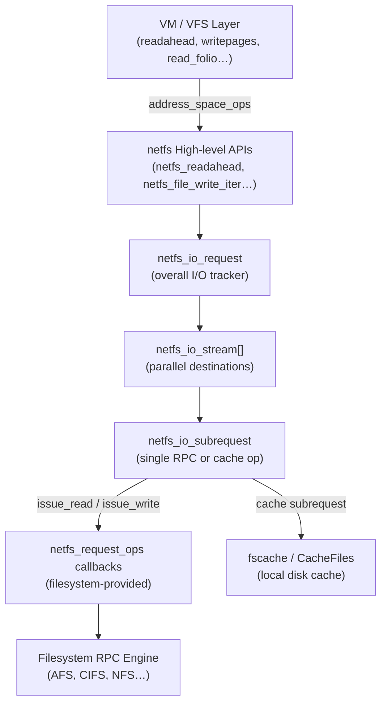

# netfs Subsystem

## Overview

netfs (Network Filesystem Services) is a kernel helper library in `fs/netfs/` that centralises the VM/VFS plumbing common to every network filesystem. Rather than each network filesystem re-implementing buffered reads, readahead, writeback, direct I/O, retry logic, and local caching on its own, netfs provides a single shared implementation that insulates filesystems from VM interface changes, handles folio lifecycle, manages multi-source I/O stitching, and integrates transparently with [[fscache]] for local disk caching. Merged in Linux 5.13 by David Howells, it has progressively absorbed AFS, Ceph, 9P, and CIFS, deleting thousands of lines of duplicated code in the process.

## Mental Model

Think of netfs as a **general-purpose I/O contractor** sitting between the VM (which thinks in terms of folios and address spaces) and a network filesystem's RPC engine (which thinks in terms of wire operations). The filesystem registers a table of callbacks describing how to issue RPCs and negotiate sizes; netfs does everything else — slicing the request into subrequests, interleaving cache hits with network fetches, collecting results, unlocking folios as they complete, and retrying on failure. The filesystem only sees the RPC boundary; netfs owns everything above it.

## Architecture

Control flows down from the VM through the high-level API into the request hierarchy. Each request spawns streams (one for reads, up to two for writes), each stream spawns subrequests for individual RPCs or cache operations. Results flow upward, with netfs collecting completions, unlocking folios progressively, and retrying on failure before surfacing errors to the caller.

---

## Core Components

### [[netfs-io-request-model]]

**Purpose** — The three-level request model (request → stream → subrequest) is the architectural centrepiece of netfs. It exists because a single logical I/O from the VM (e.g., read a 4 MB range) may need to be split across multiple RPCs with different size limits, interleaved with cache reads, and assembled back into a coherent result — none of which the filesystem should have to orchestrate individually.

**How it works** — When the VM asks for a range of data (via readahead or read_folio), netfs allocates a `netfs_io_request` to own the entire operation. The request carries the file reference, total range, origin type (readahead, read_folio, DIO, writeback), and an array of `netfs_io_stream` slots.

For a read, netfs uses a single stream (`io_streams[0]`). As the stream is walked, netfs calls the filesystem's `prepare_read()` callback to negotiate the maximum subrequest size, then calls `issue_read()` for network-destined subrequests or dispatches directly to the fscache read path for cache-destined ones. Each `netfs_io_subrequest` carries a file offset, length, `io_iter` describing the target folios, and a completion counter.

For a write, netfs may use two streams simultaneously: stream 0 targets the server, stream 1 targets the local cache. The streams are independent — their subrequest boundaries need not align — so a folio that is cache-only (marked `NETFS_FOLIO_COPY_TO_CACHE`) appears only in stream 1 while clean folios appear in stream 0. This mixed-stream writeback avoids a separate writeback pass for cache.

Results are collected as subrequests complete. Netfs calls `netfs_read_subreq_progress()` intermediately to unlock folios whose data is already available, reducing read latency for large requests. Once all subrequests finish, if any failed, netfs enters a retry loop: it calls `retry_request()` so the filesystem can adjust state (e.g., re-acquire tokens), then re-prepares and re-issues only the failed subrequests, potentially with different sizing.

**Key struct**: `struct netfs_io_request` (`include/linux/netfs.h`)
- `origin` — `NETFS_READAHEAD`, `NETFS_READ_FOLIO`, `NETFS_DIO_READ`, `NETFS_WRITEBACK`, etc.
- `inode / mapping` — file identity references
- `io_streams[]` — array of parallel stream descriptors (max 2)
- `start / len` — file position and total extent
- `netfs_priv / netfs_priv2` — opaque per-request filesystem data
- `flags` — retry control, abort signals, DIO markers

**Key struct**: `struct netfs_io_subrequest` (`include/linux/netfs.h`)
- `rreq` — back-pointer to parent request
- `start / len` — subrequest's slice within the parent
- `transferred` — bytes processed so far (for partial completions)
- `io_iter` — buffer iterator pointing into the folio/page range
- `stream_nr` — which stream owns this subrequest
- `error` — 0 on success, negative errno on failure
- `flags` — `NETFS_SREQ_MADE_PROGRESS`, `NETFS_SREQ_HIT_EOF`, `NETFS_SREQ_BOUNDARY`

**Key functions**:
- `netfs_readahead()` — VM readahead entry point; builds request, splits into subrequests, dispatches
- `netfs_read_folio()` — single-folio read; same machinery as readahead but for explicit faults
- `netfs_writepages()` — writeback entry point; walks dirty folios, builds multi-stream write requests
- `netfs_read_subreq_terminated()` — called by filesystem/cache on subrequest completion
- `netfs_write_subreq_terminated()` — write-side counterpart; usable directly as `kiocb` completion

**Config & flags** — `CONFIG_NETFS_SUPPORT` (tristate) enables the library. `CONFIG_NETFS_STATS` exports per-operation counters to `/proc/fs/fscache/stats`. `CONFIG_NETFS_DEBUG` enables runtime tracing via `/sys/module/netfs/parameters/debug`.

---

### [[netfs-inode-context]]

**Purpose** — Each file in a network filesystem that uses netfs needs per-inode state: the operation table, a fscache cookie for local caching, the server-side file size, and control flags. Rather than adding fields to `struct inode`, netfs defines `struct netfs_inode` which filesystems embed in their own inode wrapper.

**How it works** — The filesystem's inode allocator (in `->alloc_inode()`) returns a pointer to its wrapper struct. The VFS inode inside the wrapper is the real `struct inode`. When netfs needs per-inode state, it obtains a pointer to `struct netfs_inode` via `netfs_inode(inode)`, a container_of-style accessor that walks from the VFS inode to the embedding struct.

At file open, the filesystem typically calls `fscache_use_cookie()` to signal that the cache cookie is active; at close, `fscache_unuse_cookie()` updates coherency metadata and allows the cookie to be discarded if memory pressure demands it. The `remote_i_size` field tracks the server's notion of file size independently of `i_size`, because for network filesystems the two may diverge during concurrent modifications.

The flags field drives I/O policy:
- `NETFS_ICTX_UNBUFFERED` — bypass the page cache for all I/O; the filesystem guarantees server-side coherency
- `NETFS_ICTX_WRITETHROUGH` — on write, synchronously write through to both cache and server before returning to the caller
- `NETFS_ICTX_SINGLE_NO_UPLOAD` — the file's content is read-only monolithic (e.g., a kernel module in a read-only cache); use the single-blob read path

Netfs also provides a four-class locking model per inode to handle the different concurrency requirements of network filesystems without over-serialising. The classes are:
1. **Buffered reads** — fully concurrent; no locking beyond the page-lock
2. **Buffered writes** — serialize with each other using a per-inode write semaphore, but concurrent with reads
3. **Direct/unbuffered I/O** — fully concurrent with each other; no shared pagecache involvement; server provides ordering
4. **Major operations** (truncate, fallocate) — exclusive; use `i_rwsem` directly

Functions `netfs_start_io_read()`, `netfs_end_io_read()`, `netfs_start_io_write()`, `netfs_end_io_write()`, `netfs_start_io_direct()`, `netfs_end_io_direct()` implement the class transitions. mmap is a fifth pseudo-class: concurrent with everything but acts as a buffer for loopback DIO within the same file.

**Key struct**: `struct netfs_inode` (`include/linux/netfs.h`)
- `inode` — embedded VFS inode (must be first)
- `ops` — pointer to `netfs_request_ops` callback table
- `cache` — `struct fscache_cookie *` for local caching; NULL if caching disabled
- `remote_i_size` — server file size; may differ from `i_size` transiently
- `flags` — `NETFS_ICTX_UNBUFFERED`, `NETFS_ICTX_WRITETHROUGH`, `NETFS_ICTX_SINGLE_NO_UPLOAD`

**Key functions**:
- `netfs_inode(inode)` — accessor from VFS inode to `struct netfs_inode`
- `netfs_start_io_read()` / `netfs_end_io_read()` — class-1 read locking
- `netfs_start_io_write()` / `netfs_end_io_write()` — class-2 write locking
- `netfs_start_io_direct()` / `netfs_end_io_direct()` — class-3 DIO locking
- `netfs_inode_init()` — initialise the `netfs_inode` fields at inode allocation time

**Config & flags** — No separate Kconfig; enabled when `CONFIG_NETFS_SUPPORT` is set by any network filesystem.

---

### [[netfs-read-path]]

**Purpose** — The read path handles all folio population requests from the VM: readahead (speculative prefetch), explicit `read_folio` (on-demand single-folio fetch), and DIO reads. Its job is to decompose a potentially large, multi-source request into subrequests, dispatch them in parallel, and stitch the results back together so the VM sees a contiguous, correctly ordered result.

**How it works** — Both `netfs_readahead()` and `netfs_read_folio()` build a `netfs_io_request` with `origin` set to the appropriate type, then enter the same subrequest loop. Before entering it, they optionally call the filesystem's `expand_readahead()` callback; filesystems like Ceph may round up to a 2 MB stripe boundary to improve cache hit rates or alignment.

The loop walks the request range folio-by-folio. For each folio, netfs first asks the fscache cookie whether a cached copy exists. The cache's `prepare_read()` returns one of four directives: `NETFS_FILL_WITH_ZEROES` (hole in sparse file), `NETFS_READ_FROM_CACHE` (hit), `NETFS_DOWNLOAD_FROM_SERVER` (miss), or `NETFS_INVALID_READ` (cache has an incoherent copy). Contiguous folios with the same directive are coalesced into a single subrequest to minimise RPC count.

For `DOWNLOAD_FROM_SERVER` subrequests, netfs calls the filesystem's `prepare_read()` callback (to apply size limits, e.g. max bytes per RPC) then `issue_read()`. The filesystem performs its RPC asynchronously and calls `netfs_read_subreq_terminated()` on completion. For `READ_FROM_CACHE` subrequests, netfs dispatches to fscache's `netfs_cache_ops.read()` directly.

As subrequests complete, `netfs_read_subreq_progress()` is called with partial progress, unlocking folios whose full data has arrived. This pipelining means the VM can begin accessing early folios while later RPCs are still in flight. Once all subrequests finish, failed cache reads are retried as server downloads — netfs automatically escalates and re-negotiates, so the filesystem never has to handle cache-miss fallback itself.

The DIO read path (`NETFS_DIO_READ`) bypasses the page cache entirely. Netfs maps the user buffer via `get_user_pages()`, builds an iov_iter over the pinned pages, and dispatches subrequests against that iterator. On completion, pages are unpinned and the result returned to the `read_iter` caller.

**Key functions**:
- `netfs_readahead()` — `address_space_ops.readahead` implementation
- `netfs_read_folio()` — `address_space_ops.read_folio` implementation
- `netfs_read_subreq_terminated()` — subrequest completion (called by filesystem RPC)
- `netfs_read_subreq_progress()` — interim progress; enables early folio unlock
- `expand_readahead()` (ops callback) — filesystem hints for readahead rounding
- `prepare_read()` (ops callback) — size negotiation per subrequest
- `issue_read()` (ops callback) — RPC dispatch; must call `netfs_read_subreq_terminated()` when done

**Config & flags** — `NETFS_ICTX_UNBUFFERED` skips readahead expansion and page-cache interaction. `NETFS_SREQ_HIT_EOF` flag on a subrequest signals that data ends before the subrequest length; netfs zero-fills the remainder rather than issuing another RPC.

---

### [[netfs-write-path]]

**Purpose** — The write path handles page-cache writeback and direct writes. It exists because network filesystems have more complex writeback requirements than local filesystems: data may need to go to both a remote server and a local cache, writeback must track resource pinning (e.g., an fscache cookie that must not be discarded mid-writeback), and individual RPCs may have much smaller size limits than the contiguous dirty range.

**How it works** — When the VM calls `netfs_writepages()`, netfs walks the address space's dirty folios via `writeback_iter()`. It categorises each folio: a folio marked `NETFS_FOLIO_COPY_TO_CACHE` (by `fscache_dirty_folio()` at write time) goes only to the cache; an unmarked dirty folio goes to the server (and optionally also to the cache). This categorisation drives the two-stream model.

Netfs builds a `netfs_io_request` with `origin = NETFS_WRITEBACK` and calls the filesystem's `begin_writeback()` callback, which enables stream 0 (server-destined). If a cache cookie is active, netfs enables stream 1 (cache-destined). For each dirty folio, netfs assigns it to the appropriate stream — cache-only folios go to stream 1 only, server folios go to stream 0 (and possibly also to stream 1 if the cache is active and the folio is newly written). The streams tile independently: stream 0 subrequests are sized by `prepare_write()` for the server's RPC limit; stream 1 subrequests are sized by the cache's `prepare_write_subreq()`.

Once subrequests are issued (via `issue_write()` for both server and cache paths), netfs collects completions. If a server write fails, netfs marks the folios `!uptodate` and re-queues them as dirty. If a cache write fails, `invalidate_cache()` is called to keep the cache coherent.

**Resource pinning** is a subtle but critical concern. When a folio is dirtied, netfs must ensure the fscache cookie is not discarded before writeback completes. It sets `I_PINNING_NETFS_WB` on the inode at dirty time to pin the cookie. At writeback start, the pin is transferred to `writeback_control->unpinned_netfs_wb`; the filesystem later calls `netfs_unpin_writeback()` in `->write_inode()` to release it. `netfs_clear_inode_writeback()` handles the case where writeback completes without needing `write_inode()`.

Buffered writes from userspace enter via `netfs_file_write_iter()` (or `netfs_perform_write()` for the pre-locked variant). Netfs calls `write_begin` / `write_end` equivalents internally, marks folios dirty with `netfs_dirty_folio()`, and sets the `NETFS_FOLIO_COPY_TO_CACHE` flag if a cache is active.

**Key functions**:
- `netfs_writepages()` — `address_space_ops.writepages` implementation
- `netfs_dirty_folio()` — `address_space_ops.dirty_folio`; marks for cache copy if active
- `netfs_file_write_iter()` — high-level write syscall handler; auto-selects buffered/DIO
- `netfs_perform_write()` — pre-locked variant of buffered write
- `netfs_unpin_writeback()` — releases the fscache cookie pin after writeback
- `netfs_clear_inode_writeback()` — cleans up when no `write_inode()` is needed
- `begin_writeback()` (ops callback) — filesystem enables server-destined stream
- `prepare_write()` (ops callback) — per-subrequest size negotiation
- `issue_write()` (ops callback) — RPC/cache dispatch; must call `netfs_write_subreq_terminated()`

**Config & flags** — `NETFS_ICTX_WRITETHROUGH` makes `netfs_file_write_iter()` bypass the page cache and write directly to server and cache synchronously. `I_PINNING_NETFS_WB` is an inode state flag (not Kconfig) that prevents fscache cookie teardown during active writeback.

---

### [[netfs-operations-table]]

**Purpose** — `struct netfs_request_ops` is the contract between netfs and a filesystem. It defines the callbacks that netfs invokes at each stage of an I/O operation. By implementing only these callbacks, a filesystem gets full buffered I/O, DIO, readahead, and writeback support with local caching, retries, and folio lifecycle management handled by netfs.

**How it works** — A filesystem defines one static instance of `netfs_request_ops` and stores a pointer to it in `netfs_inode.ops`. Netfs calls these functions at well-defined points in the I/O lifecycle:

**Initialization/cleanup callbacks** run at request allocation and completion:
- `init_request(rreq, file)` — filesystem-specific per-request setup (e.g., acquire authentication tokens)
- `free_request(rreq)` — release filesystem-private data stored in `rreq->netfs_priv`
- `free_subrequest(sreq)` — release filesystem-private data in a subrequest

**Read callbacks** shape and execute the read path:
- `expand_readahead(rreq)` — optionally widen the read window for alignment or caching efficiency; AFS uses this to round to server chunk boundaries
- `prepare_read(sreq, expand)` — limit subrequest size; filesystem checks RPC constraints and returns the maximum length; called before `issue_read()`
- `issue_read(sreq)` — dispatch the actual RPC; the filesystem initiates its async network operation; *must* eventually call `netfs_read_subreq_terminated()`
- `done(rreq)` — called after all folios are unlocked; filesystem can do post-read cleanup

**Write callbacks** shape and execute the write path:
- `begin_writeback(rreq)` — filesystem enables stream 0 and acquires write resources (e.g., dirty byte accounting)
- `prepare_write(sreq, len, fully_written, may_split)` — negotiate write subrequest size; called before `issue_write()`
- `issue_write(sreq)` — dispatch write RPC or cache write; *must* eventually call `netfs_write_subreq_terminated()`
- `retry_request(rreq, stream)` — after a subrequest failure, filesystem may re-acquire tokens or change strategy before netfs retries
- `invalidate_cache(rreq)` — cache write failed; filesystem must invalidate the cache entry to stay coherent

**Metadata callbacks**:
- `update_i_size(inode, new_size)` — filesystem performs its own size update logic instead of the default `i_size_write()`
- `post_modify(inode)` — called after pagecache modification; filesystem can update mtime or version counters

**Key struct**: `struct netfs_request_ops` (`include/linux/netfs.h`)
- `issue_read` — mandatory for read-capable filesystems
- `issue_write` — mandatory for write-capable filesystems
- All other callbacks are optional; netfs provides defaults or skips them

**Config & flags** — No per-callback Kconfig. Which callbacks a filesystem implements determines the feature set netfs activates (e.g., no `begin_writeback()` means no server-destined writes; no `invalidate_cache()` means netfs uses a default no-op).

---

## How Components Interact

### Scenario 1: Buffered read — cache miss then network fetch

1. The VM calls `netfs_readahead()` on a cold file. Netfs allocates a `netfs_io_request` with `origin = NETFS_READAHEAD`.
2. The filesystem's `expand_readahead()` rounds the window to an RPC-aligned boundary.
3. Netfs asks the fscache cookie whether each folio range is cached. On a cold file, all return `NETFS_DOWNLOAD_FROM_SERVER`.
4. Netfs calls `prepare_read()` to learn the maximum subrequest length (e.g., 4 MB for CIFS), then calls `issue_read()`. The filesystem fires off its RPC asynchronously.
5. As RPC data arrives, the filesystem calls `netfs_read_subreq_progress()`. Netfs unlocks completed folios, making data visible to the process while later folios are still downloading.
6. The filesystem calls `netfs_read_subreq_terminated()` on completion. Netfs writes the data into the page cache and schedules a writeback to the local fscache cookie so the next read hits the cache.

### Scenario 2: Writeback with mixed server and cache destinations

1. A process dirtied folios A, B, C. Folios A and B are regular writes (to server + cache); folio C was read from the cache and marked `NETFS_FOLIO_COPY_TO_CACHE` — it should go to cache only.
2. `netfs_writepages()` walks the dirty range, calls `begin_writeback()` to enable stream 0.
3. Folios A and B become stream-0 subrequests (server). Folio C becomes a stream-1 subrequest (cache only).
4. Stream-0 subrequests call `issue_write()`. Stream-1 subrequests invoke the fscache cache ops directly.
5. Both streams complete independently. Netfs clears the dirty bits and calls `netfs_unpin_writeback()` to release the cookie pin.

### Scenario 3: Failed cache read — automatic escalation

1. Netfs issues a `READ_FROM_CACHE` subrequest. The cache layer finds the data incoherent and returns `-ESTALE`.
2. Netfs does not surface this error to the filesystem. It retiles the failed range as a `DOWNLOAD_FROM_SERVER` subrequest, calls `prepare_read()` for the new constraint, and issues the RPC transparently.
3. The filesystem's `issue_read()` runs as if it were a normal cache miss. The result is written into the page cache and also back to fscache to refresh the stale entry.

---

## Where It Fits in the Kernel

- **↑ Userspace**: `read()` / `write()` / `mmap()` syscalls land in `netfs_file_read_iter()` / `netfs_file_write_iter()` / `netfs_page_mkwrite()`. Async I/O via `io_uring` uses the same entry points via `kiocb`.
- **→ [[fscache]]**: netfs calls `fscache_begin_read_operation()`, `fscache_read()`, `fscache_write_to_cache()`, and `fscache_dirty_folio()` to mediate all local cache interactions.
- **→ [[vfs]]**: netfs implements `address_space_operations` (`readahead`, `read_folio`, `writepages`, `dirty_folio`, `invalidate_folio`, `release_folio`) that the VFS calls directly.
- **← [[mm]]**: The page cache (XArray of folios), folio allocation, writeback control, and get_user_pages are all mm facilities that netfs drives.
- **← AFS / CIFS / Ceph / 9P**: These filesystems embed `struct netfs_inode` and provide `netfs_request_ops`; netfs handles all I/O on their behalf.
- **↓ Network**: netfs never touches the network directly. All network I/O goes through the filesystem's `issue_read()` / `issue_write()` callbacks, which dispatch to their respective RPC layers (AFS RxRPC, CIFS SMB2, Ceph RADOS).

---

## Design Decisions & Tradeoffs

**Request → Stream → Subrequest hierarchy** (vs. a flat list of RPCs): The hierarchy decouples the VM's view (a contiguous folio range) from the filesystem's view (variable-size RPCs) and the cache's view (cache-block-aligned chunks). Without the stream layer, mixed server+cache writes would require the filesystem to orchestrate two parallel RPC sequences with different alignment — complexity that belongs in a library, not in each filesystem.

**Embedding `netfs_inode` rather than using a separate slab**: Network filesystems already wrap `struct inode` in a larger struct. Requiring `netfs_inode` to be the direct container of the VFS inode (rather than a pointer-linked sidecar) keeps hot fields in a single cache line and avoids an extra pointer dereference on every I/O path entry.

**Moving from per-subrequest work items to a single collector work item** (Linux 6.13): Early implementations queued a work item per subrequest for result collection, causing thundering-herd wakeups on large reads. A single collector work item processes all completions in sequence, reducing scheduler overhead and cache-line bouncing for the common sequential-read pattern at the cost of slightly more complex state tracking in the collector.

**Buffer redesign from `folio_queue` to `bvecq`** (in-progress, 2026): The original buffered I/O path used a `folio_queue` ring to pass data between the page cache and subrequests. A redesign replaces this with segmented chains of `bio_vec` arrays (`bvecq`), unifying buffered and DIO buffer tracking into a single model that can also send an entire RPC's data to TCP in a single `kernel_sendmsg()` call, eliminating the intermediate copy on the fast path.

**Automatic cache-miss escalation**: When a cache subrequest fails, netfs silently upgrades it to a server fetch rather than returning an error. This is intentional: the local cache is an optimisation, not a data source the filesystem commits to. Filesystems using NFS's `nfs_netfs_readahead()` wrappers benefit from this without knowing the cache exists.

---

## How It Has Evolved

- **v5.13 (2021)**: Initial merge. Read helpers (readahead, read_folio) extracted from AFS. Provided basic subrequest lifecycle and fscache integration.
- **v5.19 / v6.0**: Write helper preparatory work. Writeback infrastructure added to support copy-to-cache writeback path. Approximately 8,000 lines removed across AFS, Ceph, and 9P.
- **v6.3–6.5**: AFS and 9P fully delegated high-level I/O to netfslib. `netfs_perform_write()` introduced as unified buffered-write path replacing `write_begin`/`write_end`.
- **v6.7**: CIFS begins delegating I/O. fscache integrated more tightly — writeback pinning (`I_PINNING_NETFS_WB`) moved from fscache's own tracking into netfs, unifying the model.
- **v6.9**: Writeback reworked to use `->writepages()` for cache copies, retiring the `NETFS_FOLIO_COPY_TO_CACHE` flag approach and eliminating the need for `I_PINNING_FSCACHE_WB` in fscache.
- **v6.13**: Per-subrequest work items replaced by a single collector, fixing sequential-read performance regressions in CIFS and AFS.
- **2026 (in-progress)**: `folio_queue` / `rolling_buffer` replaced by `bvecq` (segmented `bio_vec` chain), unifying buffered and DIO buffer models and enabling zero-copy RPC dispatch.

---

## Recent Development Activity

- **`bvecq` buffer model** (David Howells, 2026): A 26-patch series replacing `folio_queue` with segmented `bio_vec` chains to unify buffered and DIO buffer tracking. The end goal is to be able to hand the entire assembled RPC payload to the network layer as a single `iov_iter`, avoiding intermediate copies.
- **Single-blob object support**: Reads for read-only monolithic objects (e.g., a cached kernel image) now use a dedicated `netfs_read_single()` path that issues a single RPC rather than splitting into subrequests, with `netfs_single_mark_inode_dirty()` / `netfs_writeback_single()` for cache-only writeback.
- **NFS integration** (under discussion): NFS currently has its own I/O engine and does not use netfs. A discussion at LSFMM 2024 explored whether NFS could adopt netfslib; the primary barrier is NFS's existing rsize/wsize negotiation and its use of `nfs_pageio_descriptor` — potential but not yet planned.
- **Content encryption**: The docs note that netfs will eventually acquire client-side encryption via fscrypt, with bounce buffering for RMW cycles. Not yet implemented as of 6.13.

---

## Further Reading

1. [The netfslib helper library — LWN.net (2022)](https://lwn.net/Articles/894589/)
2. [netfs, afs, 9p: Delegate high-level I/O to netfslib — LWN.net (2023)](https://lwn.net/Articles/955944/)
3. [netfs, afs, 9p, cifs: Rework netfs to use ->writepages() — LWN.net (2024)](https://lwn.net/Articles/971770/)
4. [Network Filesystem Services Library — kernel.org docs](https://www.kernel.org/doc/html/latest/filesystems/netfs_library.html)
5. [Network Filesystem Caching API — kernel.org docs](https://docs.kernel.org/next/filesystems/caching/netfs-api.html)
6. [netfs, cifs: Miscellaneous fixes and read/write improvements — LWN.net (2024)](https://lwn.net/Articles/979171/)

---

## LKML Highlights

- **`folio_queue` → `bvecq` redesign** (David Howells, March 2026, `20260326104544.509518-1-dhowells@redhat.com`): A 26-patch series replacing netfs's internal buffer model with segmented `bio_vec` arrays. The thread shows the design rationale — reducing the number of buffering schemes from several to one — and the tradeoff discussion around `kernel_sendmsg()` efficiency vs. increased allocator complexity.
- **Single work-item collector** (David Howells, December 2024, `20241216204124.3752367-1-dhowells@redhat.com`): A 32-patch v5 series fixing a performance regression introduced when CIFS was onboarded. The discussion traces the root cause (per-subrequest work-item overhead for sequential reads) and validates the single-collector design via profiling data from CIFS benchmarks.
- **Writeback via `->writepages()` for cache** (2024, `lwn.net/Articles/971770/`): Moving cache-destined writeback from a bespoke NETFS_FOLIO_COPY_TO_CACHE flag mechanism into the standard `->writepages()` path. The thread debates whether folios should retain explicit cache-copy markers or whether the stream model is sufficient — the stream model won, simplifying folio flags significantly.
