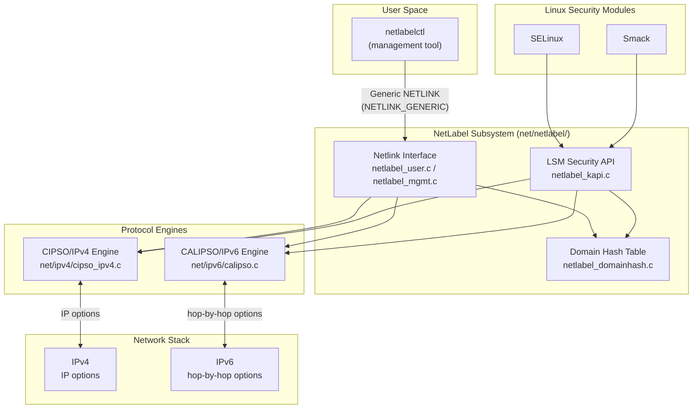
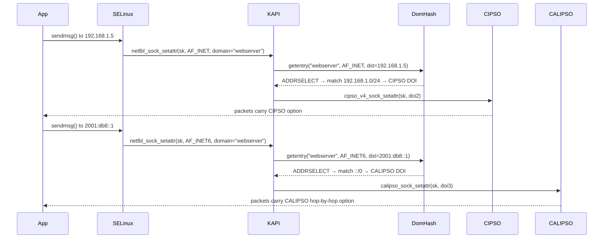

# NetLabel Subsystem

## Overview

NetLabel is a kernel subsystem that enables Linux Security Modules to attach and read security labels on network packets, allowing mandatory access control policies to be enforced across the network boundary. It provides a protocol-agnostic API so that LSMs like SELinux and Smack can label outbound packets (using CIPSO for IPv4 or CALIPSO for IPv6) and decode those labels on inbound packets without being coupled to a specific wire format. Without NetLabel, an LSM operating on one host has no way to communicate the security context of a flow to a peer host that needs it for access control decisions.

## Mental Model

Think of NetLabel as the kernel's "passport office" for network packets. When a process on a trusted system sends data, NetLabel stamps the packets with a security label (the "passport") that encodes the sender's clearance level. When packets arrive at a remote trusted system, NetLabel reads and validates that label before handing the data to the application. The LSM is the policy officer who decides what labels are acceptable; NetLabel is the mechanism that applies and reads the stamps, translating between the LSM's internal notion of a security context and whatever on-the-wire format has been agreed upon between the two endpoints.

## Architecture

NetLabel has a strict layering principle: LSMs call only the LSM Security API (`netlabel_kapi.c`). That layer consults the Domain Hash Table to discover which wire protocol is configured for this traffic, then delegates to the appropriate protocol engine. The protocol engines talk directly to the IP stack. User-space configuration flows through the Netlink interface into the Domain Hash Table.

---

## Core Components

### [[CIPSO/IPv4 Engine]]

**Purpose** — CIPSO (Commercial IP Security Option) is the workhorse of NetLabel: it encodes a security label into an IPv4 IP option field so that every packet leaving a socket carries the sender's security clearance. Without it there is no way to propagate security context over IPv4 to a remote trusted system.

**How it works** — The engine is based on the 1992 IETF CIPSO draft (never ratified as an RFC but the de-facto standard for labeled networking, used by Trusted Solaris and other MLS systems). When an LSM configures a socket's label via the NetLabel API, `cipso_v4_sock_setattr()` attaches a CIPSO IPv4 option to the socket. From that point on, every packet the socket emits carries the option automatically; there is no per-packet work from the LSM.

Inbound, the IPv4 layer validates the CIPSO option on every arriving packet before it reaches the socket layer. If the option is malformed or refers to an unknown DOI the packet is dropped. The LSM retrieves the security attributes by calling the NetLabel API in its `socket_sock_rcv_skb()` LSM hook; the API invokes `cipso_v4_skbuff_getattr()`, which looks up the DOI definition for the packet's DOI number, translates the CIPSO sensitivity level and category bitmap into an MLS/MCS label, and returns a `netlbl_lsm_secattr` structure that the LSM can then convert to its own internal security identifier.

The translation itself is governed by the **Domain of Interpretation (DOI)**. A DOI is a numbered table that maps CIPSO's integer sensitivity levels and category bitmaps to the host LSM's notion of a security level. There are three DOI types:
- **`CIPSO_V4_MAP_TRANS`** (trans): translates numeric levels on the fly using administrator-configured mapping tables — allows different hosts to use different internal numbering.
- **`CIPSO_V4_MAP_PASS`** (pass): no translation; the CIPSO numbers are used directly as MLS levels — both ends must agree on the same numbering scheme.
- **`CIPSO_V4_MAP_LOCAL`** (local): conveys the full LSM binary security label over loopback/localhost; never transmitted off-host.

NetLabel also provides a caching layer (`netlbl_lsm_cache`) that stores already-translated `(network label → LSM secid)` mappings. Once a packet's label is decoded and the result is stored in the cache, subsequent packets with the same CIPSO option bypass both NetLabel's translation logic and the LSM's own context lookup — a significant win for high-throughput trusted connections.

**Key struct**: `struct cipso_v4_doi` (`include/net/cipso_ipv4.h`)
- `doi` — the 32-bit DOI identifier embedded in every CIPSO option; must match between sender and receiver
- `type` — `CIPSO_V4_MAP_TRANS`, `CIPSO_V4_MAP_PASS`, or `CIPSO_V4_MAP_LOCAL`
- `map.std` — for TRANS type: arrays of `lvl_loc[]` (host levels) and `lvl_rem[]` (network levels), plus a category bitmap translation table
- `flags` — validity bits; `CIPSO_V4_DOI_F_V1` marks a valid DOI definition
- `refcount` — reference count; DOI entries are freed only when all sockets using them are closed

**Key functions**:
- `cipso_v4_sock_setattr()` — called by the NetLabel API to attach a CIPSO option to a socket; all subsequent egress packets carry it
- `cipso_v4_skbuff_getattr()` — decodes the CIPSO option from an incoming sk_buff and populates a `netlbl_lsm_secattr`; called during `socket_sock_rcv_skb()`
- `cipso_v4_doi_add()` / `cipso_v4_doi_remove()` — add/remove DOI definitions as configured by `netlabelctl`
- `cipso_v4_cache_add()` — inserts a decoded `(secattr → secid)` mapping into the per-DOI hash cache

**Config & flags**:
- `CONFIG_CIPSO_IPV4` — enables the CIPSO/IPv4 engine; auto-selected when a supporting LSM is built
- `CONFIG_NETLABEL` — the core framework that all engines depend on

---

### [[CALIPSO/IPv6 Engine]]

**Purpose** — CALIPSO (Common Architecture Label IPv6 Security Option, RFC 5570) extends NetLabel's labeled networking to IPv6. It serves the same role as the CIPSO engine but uses an IPv6 hop-by-hop option instead of an IPv4 IP option.

**How it works** — Added in Linux 4.8, CALIPSO encodes security labels in an IPv6 hop-by-hop extension header that every router along the path can inspect. The API surface is identical to the CIPSO engine from the LSM's point of view: the LSM calls `netlbl_sock_setattr()`, the KAPI layer routes the call to `calipso_sock_setattr()`, and from then on egress packets carry the hop-by-hop option. Inbound, `calipso_skbuff_getattr()` is called from the same `socket_sock_rcv_skb()` hook.

CALIPSO also uses a DOI model (governed by RFC 5570). The Linux implementation auto-interprets incoming CALIPSO labels for any DOI it knows about, so an administrator only needs to configure outbound mappings. CALIPSO automatically encodes the sender's effective MLS/MCS label into the hop-by-hop option, making it suitable for environments where the security label maps directly to the network-level label without translation.

**Key struct**: `struct calipso_doi` (`include/net/calipso.h`) — mirrors `cipso_v4_doi` but for IPv6; tracks the DOI number, type, and reference count.

**Key functions**:
- `calipso_sock_setattr()` — attaches a CALIPSO hop-by-hop option to an IPv6 socket
- `calipso_skbuff_getattr()` — extracts the CALIPSO option from an arriving packet and returns a `netlbl_lsm_secattr`
- `calipso_doi_add()` / `calipso_doi_remove()` — manage DOI definitions

**Config & flags**:
- `CONFIG_CALIPSO` — enables CALIPSO/IPv6; requires kernel ≥ 4.8 and `netlabel-tools` ≥ 0.30.0

---

### [[NetLabel Domain Hash Table]]

**Purpose** — The domain hash table is NetLabel's routing table: given a socket's LSM security domain (essentially the application's security context label), it answers the question "which wire protocol should be used for this traffic?" Without it there would be no way to configure per-application or per-destination labeling policies.

**How it works** — When an LSM calls `netlbl_sock_setattr()` it supplies a `netlbl_lsm_secattr` whose `domain` field names the LSM policy domain for this socket. The KAPI looks up that domain string in the hash table via `netlbl_domhsh_getentry()`. Each entry in the table specifies the protocol type to use: `NETLBL_NLTYPE_CIPSO4` (CIPSO/IPv4), `NETLBL_NLTYPE_CALIPSO` (CALIPSO/IPv6), `NETLBL_NLTYPE_UNLABELED` (send with no label), or `NETLBL_NLTYPE_ADDRSELECT` (per-destination selector — see below). There is always a default entry (domain `NULL`) that catches traffic from domains not explicitly configured.

**Address selectors** (added in 2.6.28) allow a single domain entry to hold a list of destination-address/protocol mappings. When a packet is sent, the address selector walks the list and picks the protocol matching the destination address — so a single application domain can use CIPSO for traffic to one subnet, CALIPSO for another, and UNLABELED for everything else. Before address selectors existed, all traffic from a single application had to use the same labeling protocol, which made mixed-network deployments impossible.

**Key struct**: `struct netlbl_dommap` (`net/netlabel/netlabel_domainhash.h`)
- `domain` — the string domain name (NULL for the catch-all default)
- `type` — `NETLBL_NLTYPE_*` constant indicating the chosen protocol
- `def` — a union of `netlbl_domaddr4_map` (IPv4 selector chain) or `netlbl_domaddr6_map` (IPv6) or a direct DOI pointer for simple entries
- `rcu` — RCU head for lockless reads (the table is read far more often than written)

**Key functions**:
- `netlbl_domhsh_getentry()` / `netlbl_domhsh_getentry_af()` — look up a domain entry, optionally filtered by address family; hot path
- `netlbl_domhsh_add()` / `netlbl_domhsh_remove()` — add/remove domain mappings; called from the Netlink management interface

**Config & flags** — no dedicated Kconfig; the table is always compiled in when `CONFIG_NETLABEL` is set.

---

### [[NetLabel Netlink Management Interface]]

**Purpose** — Provides user-space administrators the ability to configure the domain hash table, define DOI mappings, and monitor unlabeled traffic, all through a structured message protocol. Without this interface, NetLabel would be completely static and undeployable.

**How it works** — NetLabel registers a Generic NETLINK family called `NLBL_MGMT` (along with `NLBL_CIPSOV4` and `NLBL_CALIPSO` for protocol-specific configuration). The user-space tool `netlabelctl` uses these families to send commands like `ADD`, `REMOVE`, and `LIST`. On the kernel side, `netlabel_mgmt.c` decodes the Netlink attributes (each command carries an `nlattr` stream) and calls the appropriate domain hash or protocol engine function.

All mutations to the domain hash table are serialized via a spinlock, while readers use RCU to avoid any locking overhead. Audit records are generated for every configuration change, making administrative actions traceable.

**Key functions**:
- `netlbl_mgmt_add()` — handles `NLBL_MGMT_C_ADD`; validates attributes and inserts a domain mapping
- `netlbl_mgmt_remove()` — handles `NLBL_MGMT_C_REMOVE`
- `netlbl_mgmt_listall()` — dumps the entire domain table to user space
- `netlbl_cipsov4_add()` / `netlbl_calipso_add()` — register new DOI definitions

**Config & flags** — requires `CONFIG_NETLABEL`; audit events are emitted only if `CONFIG_AUDIT` is also set.

---

### [[NetLabel LSM Security API]]

**Purpose** — Provides a single, protocol-agnostic interface for LSMs to label outgoing packets and decode incoming ones. It hides the CIPSO/CALIPSO split so that SELinux and Smack can be written once and work correctly regardless of which labeling protocol is deployed.

**How it works** — The API is defined in `include/net/netlabel.h` and implemented in `net/netlabel/netlabel_kapi.c`. The central data type is `netlbl_lsm_secattr`, which travels between the LSM and NetLabel carrying security attributes in a wire-format-neutral representation. It holds an MLS sensitivity level (`attr.mls.lvl`), a category bitmap (`attr.mls.cat`), an LSM-specific security ID (`attr.secid`), and a `flags` bitmask indicating which fields are valid.

**Outbound flow**: The LSM fills a `netlbl_lsm_secattr` with the socket's security context and calls `netlbl_sock_setattr(sk, family, &secattr)`. The KAPI looks up the socket's domain in the domain hash table, selects the correct protocol engine, and calls that engine's `sock_setattr` function. The engine attaches the appropriate IP option (CIPSO or CALIPSO) to the socket's `inet_sock`.

**Inbound flow**: In the LSM's `socket_sock_rcv_skb()` hook, it calls `netlbl_skbuff_getattr(skb, family, &secattr)`. The KAPI checks whether the packet has a CIPSO option (IPv4) or a CALIPSO hop-by-hop option (IPv6), and delegates to the matching engine. If the packet has no label, the KAPI returns the configured default for unlabeled traffic (often `netlbl_unlabel_getattr()`). Either way the LSM gets back a populated `netlbl_lsm_secattr` and translates it to its own internal security ID using its own context mapping functions.

The **label mapping cache** (`netlbl_lsm_cache`) short-circuits this entire path once a label has been seen before. When the KAPI decodes a new label it calls `netlbl_cache_add()` to store the `(skb secattr → LSM secid)` mapping; on subsequent packets with the same label, `netlbl_cache_invalidate()` / the cache lookup bypasses both NetLabel translation and the LSM lookup, improving throughput for established trusted connections.

**Key struct**: `struct netlbl_lsm_secattr` (`include/net/netlabel.h`)
- `flags` — bitmask of `NETLBL_SECATTR_*` constants indicating which fields are valid
- `type` — `NLTYPE_*` constant recording which protocol populated this struct
- `domain` — domain string set by the LSM before calling the outbound API; used for hash table lookup
- `attr.mls.lvl` — MLS sensitivity level (integer)
- `attr.mls.cat` — pointer to a category bitmap (`netlbl_lsm_catmap`)
- `attr.secid` — LSM-internal security ID for fast in-kernel lookups
- `cache` — pointer to a `netlbl_lsm_cache` entry when the cache path is active

**Key functions**:
- `netlbl_sock_setattr()` — label an outgoing socket; entry point for LSM egress policy
- `netlbl_skbuff_getattr()` — decode label from an incoming packet; called from `socket_sock_rcv_skb()`
- `netlbl_sock_getattr()` — retrieve the label already set on a socket (e.g. for audit)
- `netlbl_skbuff_err()` — generate a proper ICMP error when a labeled packet is rejected
- `netlbl_cache_add()` / `netlbl_cache_invalidate()` — manage the label mapping cache
- `netlbl_secattr_init()` / `netlbl_secattr_destroy()` — lifecycle helpers for `netlbl_lsm_secattr`; the `destroy` variant frees the category bitmap and domain string

---

## How Components Interact

### Scenario 1 — Outbound labeled packet (SELinux + CIPSO)

1. A process in SELinux context `s0:c1,c2` opens a TCP socket. SELinux calls `netlbl_sock_setattr(sk, AF_INET, &secattr)` where `secattr` has `domain = "myapp"`, `attr.mls.lvl = 0`, `attr.mls.cat = {c1, c2}`.
2. **KAPI** (`netlabel_kapi.c`) calls `netlbl_domhsh_getentry("myapp", AF_INET)`.
3. **Domain Hash Table** returns an entry of type `NETLBL_NLTYPE_CIPSO4` pointing to DOI #1.
4. **KAPI** calls `cipso_v4_sock_setattr(sk, doi1, &secattr)`.
5. **CIPSO engine** translates the MLS level/category using DOI #1's `TRANS` mapping table and constructs the binary CIPSO IPv4 option, attaching it to `inet_sk(sk)->opt`.
6. All subsequent packets from this socket carry the CIPSO option transparently.

### Scenario 2 — Inbound labeled packet

1. An IPv4 packet arrives carrying a CIPSO option with DOI=1, level=0, category bitmask for c1,c2.
2. The IPv4 layer validates the CIPSO option format; malformed options are dropped here.
3. SELinux's `socket_sock_rcv_skb()` hook calls `netlbl_skbuff_getattr(skb, AF_INET, &secattr)`.
4. **KAPI** identifies the CIPSO option and calls `cipso_v4_skbuff_getattr()`.
5. **CIPSO engine** finds DOI #1, translates the numeric level and category bitmap into MLS attributes, checks the cache — if a hit, returns the cached `secid` directly; otherwise populates `secattr.attr.mls` and returns to KAPI.
6. **KAPI** returns the populated `secattr` to SELinux, which maps MLS attributes to an internal `secid` using `security_netlbl_secattr_to_sid()` and enforces access control.

### Scenario 3 — Address-selector based mixed-protocol deployment

---

## Where It Fits in the Kernel

- **↑ Userspace**: `netlabelctl` (from the `netlabel-tools` package) communicates over Generic NETLINK to configure domain mappings and DOI definitions. No application changes are required — labels are applied transparently at the socket level.
- **→ [[selinux]]**: SELinux calls the NetLabel LSM API to label outgoing sockets and to translate incoming CIPSO/CALIPSO labels into SELinux security contexts (`security_netlbl_secattr_to_sid()`).
- **→ [[smack]]**: Smack uses NetLabel as its primary labeled-networking mechanism; it configures CIPSO labels per-socket and uses `smack_netlabel()` to drive the NetLabel API.
- **← [[net]] (IPv4/IPv6 stack)**: The CIPSO engine registers as an IP option handler; the IPv4 stack calls into `cipso_ipv4.c` for validation of incoming IP options. CALIPSO hooks into the IPv6 hop-by-hop option processing path.
- **→ [[lsm]] framework**: NetLabel registers no LSM hooks of its own; it is a passive library that LSMs call.
- **→ [[audit]]**: Every configuration change (domain add/remove, DOI add/remove) generates an audit record via the kernel audit subsystem.
- **↓ Hardware**: No direct hardware dependency; operates entirely at the software IP layer.

## Design Decisions & Tradeoffs

**Protocol-agnostic LSM API over tight coupling**: The original design goal, stated explicitly in the introductory patch, was that the LSM API must be protocol-independent so multiple LSMs can share the same code base. This was accepted over the simpler alternative of building CIPSO directly into SELinux, at the cost of an indirection layer. The payoff is that Smack (added later) required almost no networking code: it just calls `netlbl_sock_setattr()`.

**In-band labels (CIPSO/CALIPSO) vs. out-of-band (Labeled IPsec/XFRM)**: NetLabel chose in-band labels where the security context travels inside the IP packet itself. Labeled IPsec carries the full SELinux context in an IPsec Security Association, which is richer but requires IKE daemons and key management infrastructure on every host. NetLabel consistently outperforms Labeled IPsec in benchmarks because it has no encryption or key-exchange overhead. The tradeoff is that CIPSO labels are limited to sensitivity levels and category bitmaps — they cannot carry arbitrary security context strings.

**SECMARK vs. NetLabel**: SECMARK labels packets locally using netfilter marks; the mark never leaves the host. NetLabel labels travel with the packet end-to-end, enabling cross-host mandatory access control. SECMARK is simpler to configure but cannot enforce access control on remote hosts; NetLabel requires all participating systems to share a DOI definition but provides genuine peer labeling.

**Address selectors (2.6.28)**: Initially all traffic from a socket used the same protocol, which forced operators to choose a single protocol for each application domain. Address selectors were added to break this constraint; they were controversial because they added complexity (a per-socket address lookup on every connection) but were accepted because mixed IPv4/IPv6 networks made the limitation a deployment blocker.

**`CONFIG_CIPSO_IPV4_CACHE_BUCKETS` / cache sizing**: The label mapping cache is a fixed-size hash table. Sizing it too small causes cache thrashing in environments with many distinct peers; sizing it too large wastes memory in embedded deployments. The kernel defaults are tuned for typical enterprise deployments.

## How It Has Evolved

- **2.6.19 (2006)**: Initial merge. CIPSO/IPv4 engine, SELinux integration, Generic NETLINK management interface. Author: Paul Moore (HP). The initial implementation supported only one CIPSO tag type.
- **2.6.20 (2007)**: Smack integration added. NetLabel demonstrated its protocol-agnostic design by supporting a second LSM with minimal new code.
- **2.6.28 (2008)**: Address selectors added. Administrators can now specify per-destination-address protocol mappings, solving the "single protocol per application" limitation.
- **4.8 (2016)**: CALIPSO/IPv6 (RFC 5570) merged, authored by Huw Davies (CodeWeavers) with review by Paul Moore. This brought NetLabel into the IPv6 era and required corresponding updates to SELinux and Smack.
- **Ongoing**: Paul Moore continues to maintain both `net/netlabel/` and `net/ipv4/cipso_ipv4.c`. Work on LSM stacking (allowing SELinux and Smack to coexist) periodically requires NetLabel changes because stacked LSMs must cooperate on which module drives the labeling decision.

## Recent Development Activity

- **LSM stacking interaction**: As the LSM stacking project (Casey Schaufler) matures, NetLabel must handle the case where multiple LSMs are active simultaneously and each may want to label (or read labels on) the same packet. The 2025–2026 LKML threads around firmware LSM hooks involve Paul Moore commenting on how NetLabel's single-LSM assumption needs adjustment.
- **netlabelctl updates**: The user-space `netlabel-tools` package tracks kernel additions; CALIPSO configuration was added in v0.30.0.

## Further Reading

1. [NetLabel [LWN.net]](https://lwn.net/Articles/185491/) — RFC submission and design rationale
2. [Netlabel: CIPSO labeling for Linux [LWN.net]](https://lwn.net/Articles/204905/) — detailed CIPSO protocol explanation
3. [NetLabel Introduction — kernel.org](https://www.kernel.org/doc/html/latest/netlabel/introduction.html)
4. [NetLabel CIPSO/IPv4 Protocol Engine — kernel.org](https://www.kernel.org/doc/html/latest/netlabel/cipso_ipv4.html)
5. [NetLabel LSM Interface — kernel.org](https://www.kernel.org/doc/html/latest/netlabel/lsm_interface.html)
6. [IPv6 Labeled Networking with CALIPSO — Paul Moore's blog](https://www.paul-moore.com/blog/d/2016/12/calipso_intro.html)
7. [NetLabel Address Selectors — Paul Moore's blog](https://www.paul-moore.com/blog/d/2009/02/netlabel_address_selectors.html)

## LKML Highlights

- **Initial CIPSO implementation (2006)**: Paul Moore's original RFC submission introduced CIPSO/IPv4 and the protocol-agnostic LSM API. The key design debate was whether CIPSO should live inside SELinux or be a shared framework; the latter won and enabled Smack to reuse it with minimal effort. ([LWN coverage](https://lwn.net/Articles/185491/))
- **CALIPSO merge (2016)**: Huw Davies submitted a 19-patch series adding RFC 5570 CALIPSO support. The thread involved significant discussion about how the new `calipso_doi` and `calipso_sock_setattr` paths should integrate with the existing domain hash table without duplicating CIPSO logic. Message-ID: `1455715329-9601-7-git-send-email-huw@codeweavers.com`
