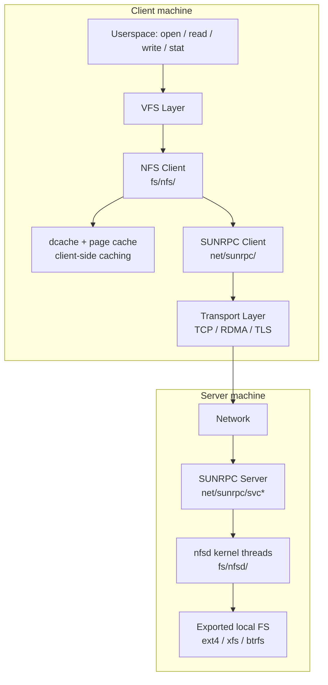
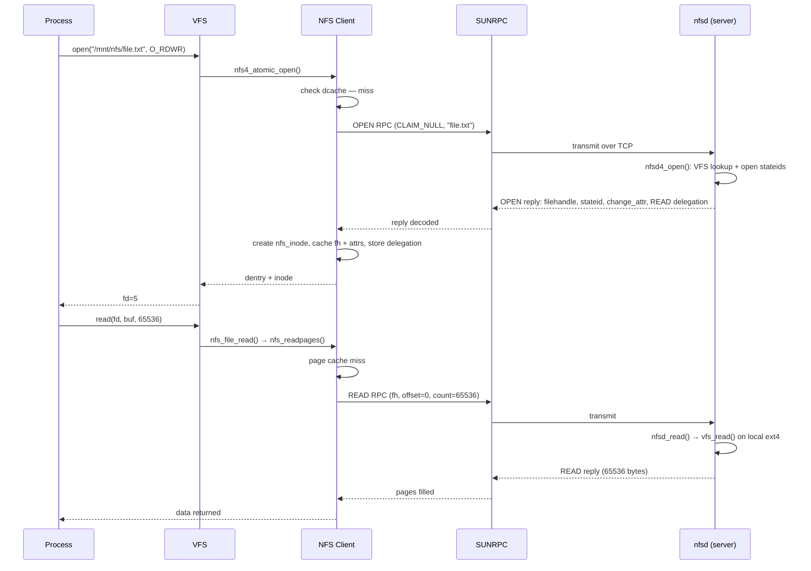

# NFS (Network File System) Subsystem

> 📘 Plain-language version: [[nfs-explained]]

## Related Notes

> **See also**: [[fs]] (VFS layer NFS plugs into), [[vfs]] (dcache, namei, mount namespace internals), [[btrfs]] (a concrete filesystem that NFS can export).

## Overview

NFS is the Linux kernel's implementation of the IETF Network File System protocol suite. It allows a client machine to mount a remote filesystem exported by a server and access it transparently through the normal VFS interface — the same `open`, `read`, `write`, `stat` calls that work on local disks. The kernel contains both a full NFS **client** (`fs/nfs/`) and a full NFS **server** (`fs/nfsd/`), layered above a shared **SUNRPC transport subsystem** (`net/sunrpc/`) that handles connection management, request queuing, authentication, and retransmission.

## Mental Model

Think of NFS as **VFS operations serialized into network packets**. The NFS client is a VFS plugin: it implements the same superblock, inode, dentry, and file operation tables that ext4 or btrfs implement, but instead of issuing block I/O it encodes each operation as an RPC call and sends it over the network. SUNRPC is the courier: it manages connections, enforces concurrency limits (slot tables), handles retries, and authenticates requests. The NFS server is a kernel daemon that sits on the other end, receives those RPC calls, executes them against a local filesystem, and returns results. From the application's perspective, there is no network.

## Architecture

**Reading the diagram**: on the client, VFS delegates to the NFS client module, which serves cache hits from the dcache/page cache and encodes cache misses as RPC calls sent through the SUNRPC transport. On the server, SUNRPC receives the calls, hands them to `nfsd` kernel threads, which execute operations against a locally exported filesystem.

---

## Core Components

### [[SUNRPC]] Transport Layer

**Purpose** — SUNRPC is the generic RPC substrate used by NFS (and also by other kernel subsystems that need kernel-to-kernel or kernel-to-userspace RPC). It handles everything below the NFS protocol level: connection establishment, request multiplexing, authentication (AUTH_SYS, RPCSEC_GSS/Kerberos, AUTH_TLS), retransmission, and the crucial slot-table that limits concurrency.

**How it works** — The core sending path: the NFS client populates a `struct rpc_message` (procedure number, XDR codec pointers, credential), calls `rpc_call_async()` or `rpc_call_sync()`, which allocates a `struct rpc_task` and places it on the transport queue. The task runs through an internal state machine (`tk_action` function pointer): encoding the call, selecting a transport (`struct rpc_xprt`), waiting for a slot in the slot table, transmitting, waiting for the reply, decoding, and completing.

**Transport switch** (`struct rpc_xprt_switch`) — A client can have multiple transports (e.g., multiple TCP connections or a mix of TCP and RDMA connections). The switch selects which `rpc_xprt` to use for each task, enabling load balancing and multipath. NFSv4.1/4.2 use multiple transports (sessions with multiple connections) natively.

**Slot tables** — The key backpressure mechanism. Each connection has a fixed number of slots (default 16, max 128 for TCP); outstanding RPC requests are capped at the slot count. When all slots are in use, new tasks block. This prevents NFS from overwhelming slow servers. Tunable via `/proc/sys/sunrpc/tcp_slot_table_entries`.

**Authentication** — Three flavors:
- `AUTH_SYS` — simple UID/GID in each RPC header; no cryptographic protection; vulnerable to spoofing.
- `RPCSEC_GSS` (RFC 5403) — per-packet signing and optional encryption using Kerberos 5. Context establishment is handled by userspace (`gssproxy`); the kernel handles fast packet-level crypto via `kernel_gss`.
- `AUTH_TLS` (RFC 9289) — TLS channel security negotiated at connect time; encryption only, no per-RPC credentials. Enabled via `xprtsec=tls` mount option (Linux 5.15+).

**Key struct**: `struct rpc_clnt` (`include/linux/sunrpc/clnt.h`)
- `cl_auth` — authentication flavor
- `cl_xprt` — primary transport
- `cl_timeout` — timeout/retry parameters
- `cl_procinfo` — RPC procedure table (XDR encode/decode functions)

**Key struct**: `struct rpc_task` (`include/linux/sunrpc/sched.h`)
- `tk_client` — owning `rpc_clnt`
- `tk_action` — current state-machine step
- `tk_flags` — `RPC_TASK_ASYNC`, `RPC_TASK_CORK`, etc.
- `tk_status` — error/success code

**Key struct**: `struct rpc_xprt` (`include/linux/sunrpc/xprt.h`)
- `ops` — transport operations vtable (TCP, RDMA, local socket)
- `slot` — the slot table
- `state` — connected/disconnected/reconnecting

**Key functions**:
- `rpc_call_sync()` / `rpc_call_async()` — submit an RPC call
- `xprt_transmit()` — encode and write to the socket
- `rpc_schedule_run()` — advance a task through the state machine

---

### [[XDR Encoding]] and NFSv4 Compound Operations

**Purpose** — NFS uses XDR (eXternal Data Representation, RFC 4506) to serialise RPC arguments and results into a portable binary format. This layer is what allows NFS to be interoperable across CPU architectures. NFSv4 compounds multiple operations into a single RPC to amortise round-trip latency.

**How XDR works in Linux** — Each NFS procedure has a pair of XDR codec functions registered in the `rpc_procinfo` table: `p_encode` (marshals the call arguments into an `xdr_stream`) and `p_decode` (unmarshals the reply). All encoding and decoding goes through `struct xdr_stream`, which tracks the current position in an `iovec` chain. Helpers like `xdr_encode_opaque()`, `xdr_encode_string()`, and `xdr_encode_nfstime4()` write typed fields; their decode counterparts read and validate them.

The codec files are:
- `fs/nfs/nfs4xdr.c` — NFSv4 client-side XDR (the largest file in `fs/nfs/`, ~8000 lines)
- `fs/nfsd/nfs4xdr.c` — NFSv4 server-side XDR
- `fs/nfs/nfs3xdr.c` / `fs/nfsd/nfs3xdr.c` — NFSv3 equivalents

**NFSv4 compound operations** — NFSv4's `COMPOUND` RPC packs multiple sub-operations (e.g., `SEQUENCE + PUTFH + OPEN + GETATTR`) into a single call. On the client side, `nfs4_call_sync()` and the async `rpc_call_async()` path build the compound in a per-operation encoder loop. Each sub-operation encoder is registered in the `nfs4_procedures[]` table (`fs/nfs/nfs4proc.c`). The XDR encoder writes a 32-bit operation code followed by the operation arguments; the server processes them left-to-right, stopping at the first error and returning partial results.

This batching is the key performance advantage of NFSv4 over NFSv3: an `open()` that previously required separate `LOOKUP + ACCESS + OPEN` RPCs (3 round trips in NFSv3) becomes a single compound in NFSv4.

**NFSv4.1 session sequence numbers** — NFSv4.1 sessions add a `SEQUENCE` operation as the first sub-operation in every compound. `SEQUENCE` carries the session ID, slot ID, and sequence number, giving the server exactly-once semantics: it can detect retransmissions by checking the sequence number against its replay cache for each slot.

**Key struct**: `struct xdr_stream` (`include/linux/sunrpc/xdr.h`)
- `p` — current write/read position in the buffer
- `end` — end of current page boundary
- `iov` — scatter-gather list

**Key struct**: `struct rpc_procinfo` (`include/linux/sunrpc/xprt.h`)
- `p_proc` — RPC procedure number
- `p_encode` — argument encoder
- `p_decode` — reply decoder

---

### [[NFSv4.1 Sessions]] and Slot Tables

**Purpose** — Sessions (NFSv4.1+) provide per-client, per-slot sequence numbering, enabling the server to detect and deduplicate retransmitted non-idempotent operations (e.g., `RENAME`, `REMOVE`). They also replace the per-transport slot tables of NFSv4.0 with a protocol-level slot table negotiated with the server.

**How it works** — During `EXCHANGE_ID` + `CREATE_SESSION`, the client and server negotiate the number of session slots (`max_slots`). Each slot has a sequence number (`nfs4_slot.seq_nr`) that increments monotonically. The client tracks active slots in `struct nfs4_slot_table` (one per session, one per direction: fore-channel and back-channel).

The fore-channel is client→server; the back-channel is server→client (used for `CB_LAYOUTRECALL`, `CB_RECALL`, `CB_NOTIFY` callbacks). Both channels are multiplexed over the same TCP connection(s).

`nfs4_setup_sequence()` is called before every NFSv4.1 RPC: it allocates a free slot from the slot table, records the slot/sequence in the task's RPC header, and blocks the task if no slot is available. After the reply is received, `nfs41_sequence_done()` processes the `SEQUENCE` reply, updates the slot table, and returns the slot.

**Dynamic slot resizing** — The server can signal slot table changes in the `SEQUENCE` reply (`sr_highest_slotid`, `sr_target_highest_slotid`). The client adjusts `max_slots` on the fly — shrinking under server memory pressure and growing when the server allows more concurrency.

**Key struct**: `struct nfs4_slot_table` (`fs/nfs/nfs4session.h`)
- `slots` — array of `nfs4_slot` structs
- `used_slots` — bitmap of in-use slots
- `max_slots` — current negotiated maximum
- `highest_used_slotid` — for `SEQUENCE` header

**Key struct**: `struct nfs4_slot`
- `seq_nr` — current sequence number
- `seq_nr_highest_sent` — highest sent (for loss detection)

---

### [[NFS LOCALIO]]

**Purpose** — NFS LOCALIO detects when the NFS client and server are co-located on the **same host** and bypasses the TCP/RPC network stack for `READ`, `WRITE`, and `COMMIT` operations. The result is near-local filesystem performance (12× faster for 4K random reads in testing).

**How it works** — At mount time, the client calls a new `UUID_IS_LOCAL` RPC procedure. The client generates a UUID nonce, registers it in shared kernel memory (`nfs_common`), and asks the server whether it can see that nonce. If the server can access the same kernel memory region (possible only if client and server share the same kernel instance), co-location is confirmed. IP address comparison alone is insufficient because containers can have different network namespaces with overlapping addresses.

Once co-location is confirmed, the NFS client stores a reference to the server's in-kernel `nfsd` context. For `READ`/`WRITE`/`COMMIT` operations, the client calls directly into `nfsd`'s local I/O path (`fs/nfsd/localio.c`), which calls `vfs_read()` / `vfs_write()` on the exported filesystem without any XDR encoding, socket I/O, or RPC overhead.

**Security** — LOCALIO is restricted to `AUTH_UNIX` authentication and respects `root_squash` and other standard NFS export options. It only grants access within the server's network namespace.

**Performance** — Without LOCALIO: ~79K IOPS for 4K reads. With LOCALIO: ~979K IOPS — within the range of direct local filesystem I/O.

**Key files**: `fs/nfs/localio.c` (client), `fs/nfsd/localio.c` (server), `fs/nfs_common/nfslocalio.c` (shared UUID infrastructure).

**Config** — `CONFIG_NFS_LOCALIO` (Linux 6.0+). Enabled automatically when both client and server modules are loaded in the same kernel.

---

### [[NFS Client]] (`fs/nfs/`)

**Purpose** — The NFS client is a VFS plugin. It implements `super_operations`, `inode_operations`, `file_operations`, and `address_space_operations`, routing each VFS call into an appropriate NFS RPC call (or serving it from cache).

**How it works** — When the system mounts an NFS share, `nfs_get_tree()` calls `nfs_create_server()` which allocates a `struct nfs_server` (holds the RPC client, server capabilities, mount options) and a `struct nfs_client` (holds the long-lived client identity, shared across mounts to the same server). The root inode is fetched via a `LOOKUP` or `GETATTR` RPC and cached.

For subsequent operations:
- **Reads**: `nfs_readpage()` submits a `READ` RPC; the page lands in the page cache and is reused on subsequent reads.
- **Writes**: By default, buffered writes go to the page cache (marked dirty). The writeback subsystem later calls `nfs_writepages()`, which batches pages into `WRITE` RPCs and then issues `COMMIT` to flush the server's write buffer to stable storage.
- **Attribute caching**: Inodes cache a snapshot of the server's metadata. On each access, the client checks whether the cache is still fresh by comparing the server's `change_attribute` (NFSv4) or `mtime`/`ctime` (NFSv3) against the cached copy.

**Close-to-open consistency** — On `open()`, the client revalidates the inode's cache unconditionally, ensuring that any writes by other clients since the last open are visible. On `close()`, dirty pages are flushed. This "close-to-open" model is the fundamental NFS coherency guarantee.

**Delegation (NFSv4)** — The server can grant a **read delegation**: a promise that no other client has a conflicting open. With a read delegation, the client may cache reads indefinitely without revalidation. A **write delegation** promises exclusive write access, allowing the client to accumulate writes and perform `COMMIT` at close. The server recalls delegations when a conflicting open arrives.

**Key struct**: `struct nfs_client` (`include/linux/nfs_fs_sb.h`)
- `cl_rpcclient` — the SUNRPC `rpc_clnt`
- `cl_clientid` — the NFSv4 client ID (a long-lived identifier registered with the server)
- `cl_state` — NFSv4 state management (open/lock stateids)
- `cl_proto` — NFS version (v3, v4, v4.1, v4.2)

**Key struct**: `struct nfs_server` (`include/linux/nfs_fs_sb.h`)
- `nfs_client` — pointer to the shared client identity
- `client` — the per-server `rpc_clnt`
- `caps` — negotiated server capabilities
- `wsize` / `rsize` — max write/read chunk sizes

**Key struct**: `struct nfs_inode` (`include/linux/nfs_fs.h`)
- `fh` — the NFS file handle identifying this object on the server
- `cache_validity` — bitmap of which cache fields are stale
- `change_attr` — server's change attribute (NFSv4 coherency anchor)
- `layout` — pNFS layout segments (if pNFS is active)

**Key functions**:
- `nfs_getattr()` — fetch inode attributes; may use cache
- `nfs_revalidate_inode()` — unconditionally refresh from server
- `nfs_readpages()` / `nfs_writepages()` — batch read/write RPCs
- `nfs4_open_delegation_recall()` — handle server recall of a delegation

---

### [[pNFS]] (Parallel NFS)

**Purpose** — pNFS (NFSv4.1 and later) separates the **metadata path** (file lookup, open, permissions — still handled by the NFS server via MDS: Metadata Server) from the **data path** (actual I/O). With pNFS, the client can read and write file data **directly to storage devices** or **secondary NFS servers** — bypassing the primary NFS server for bulk I/O entirely.

**How it works** — On `open()`, the client sends a `LAYOUTGET` RPC to the MDS. The MDS returns a **layout segment** (`struct pnfs_layout_segment`, also called `lseg`) that describes where the file's data lives: which storage device, which stripe offsets, which protocol to use. The client caches this layout in `nfsi->layout` (a `struct pnfs_layout_hdr`). For subsequent `READ`/`WRITE` calls, the client checks the layout and, if a matching segment is cached, sends I/O directly to the device using the layout-specific driver — not to the NFS server.

**Layout types** (each has a kernel layout driver module):
- `files` — I/O goes to secondary NFSv4 data servers; original pNFS layout type.
- `flexfiles` — I/O goes to NFSv3 or NFSv4 data servers; more flexible striping.
- `blocks` — I/O goes to block devices (SAN); client mounts block devices directly.
- `objects` — I/O goes to object storage devices (OSD).

**Layout lifecycle** — Layouts are reference-counted. Outstanding `LAYOUTGET`, `LAYOUTRETURN`, and `LAYOUTCOMMIT` RPCs each hold a reference. When the MDS needs to reclaim the layout (e.g., server restart, conflicting access), it sends `CB_LAYOUTRECALL` on the backchannel; the client must drain in-flight I/O and return the layout before continuing.

**Device IDs** — Layouts reference storage devices by opaque device IDs. The client resolves these via `GETDEVICEINFO` and caches them in `struct nfs4_deviceid_cache` (an RCU-protected hash table per client).

**Key struct**: `struct pnfs_layout_hdr` — cached layout segments for an inode; lives in `nfsi->layout`.
**Key struct**: `struct pnfs_layout_segment` — one segment: byte range, layout type, device references.
**Key struct**: `struct pnfs_layoutdriver_type` — layout driver vtable (`read_pagelist`, `write_pagelist`, `commit_pagelist`).

---

### [[NFS Server]] (`fs/nfsd/`)

**Purpose** — The in-kernel NFS server exports local filesystems to NFS clients. It runs as a pool of kernel threads (`nfsd`) that receive RPC calls from the SUNRPC server layer, execute them against locally exported VFS paths, and return results.

**How it works** — `nfsd` threads are managed by `nfsd_svc()`. Each thread calls `svc_recv()` (SUNRPC server) to dequeue an incoming RPC, dispatches it to the appropriate version-specific procedure (`nfsd3_proc_*` or `nfsd4_proc_*`), and calls VFS operations (e.g., `vfs_read()`, `vfs_mkdir()`) on the exported path. The export table (`struct svc_export`, `fs/nfsd/export.c`) maps `(filesystem, inode)` pairs to export settings (allowed clients, export flags).

**NFSv4 state** — NFSv4 introduces server-side state: open state records (`struct nfs4_ol_stateid`) tracking which clients have files open in which modes, byte-range locks (`struct nfs4_lockstateid`), and delegations. The server's state is periodically checkpointed to stable storage to survive restarts. A **grace period** (default 90 seconds) after restart allows clients to reclaim their state.

**File handles** — The server encodes each exported file as an NFS file handle (`struct knfsd_fh`), an opaque byte string that encodes the filesystem ID and inode number. The `export_operations->encode_fh()` / `decode_fh()` callbacks (implemented by each exported filesystem) convert between file handles and dentries.

**Key functions**:
- `nfsd()` — main kernel thread loop
- `nfsd_dispatch()` — route incoming RPC to the correct procedure
- `nfsd_open()` / `nfsd_read()` / `nfsd_write()` — server-side VFS wrappers
- `nfs4_preprocess_stateid_op()` — validate NFSv4 stateids before I/O

---

## How Components Interact

### Scenario 1: NFSv4 `open("/mnt/nfs/file.txt", O_RDWR)`

### Scenario 2: pNFS read with flexfiles layout

1. `OPEN` returns a write delegation to the client.
2. On the first `READ`, client sends `LAYOUTGET` to the MDS.
3. MDS returns a flexfiles layout: file is striped across two NFSv3 data servers, DS1 and DS2.
4. Client resolves device IDs via `GETDEVICEINFO`, caches DS1/DS2 connection info.
5. Client sends `READ` RPCs directly to DS1 and DS2 in parallel, bypassing the MDS.
6. On close, client sends `LAYOUTCOMMIT` to the MDS reporting the highest byte written.

### Scenario 3: NFSv4 state recovery after server reboot

1. Server restarts; all state (stateids, delegations, locks) is lost.
2. Server enters **grace period** (90 seconds by default).
3. Client detects reboot via sequence-number discontinuity or explicit `NFS4ERR_STALE_CLIENTID`.
4. Client calls `nfs4_recover_expired_lease()`: re-establishes client ID, re-opens all open files, reclaims locks and delegations.
5. Server exits grace period; any state not reclaimed is discarded.

---

## Where It Fits in the Kernel

- **↑ Userspace**: NFS is accessed via the standard POSIX filesystem syscalls. Mount happens via `mount(2)` (or the new `fsopen`/`fsmount` API) with filesystem type `nfs` or `nfs4`.
- **→ VFS**: The NFS client is a VFS plugin; it implements the full set of VFS operation tables. VFS drives the client; the client drives SUNRPC.
- **→ SUNRPC**: All NFS wire protocol encoding/decoding and transport management is delegated to the `net/sunrpc/` subsystem. NFS cannot function without SUNRPC.
- **→ Page Cache / MM**: NFS I/O is page-cache-based (unless `O_DIRECT`). NFS page-cache pages are indistinguishable from local filesystem pages from mm's perspective.
- **← Network Stack**: SUNRPC transports use TCP, UDP (deprecated), RDMA (`xprtrdma`), or local Unix sockets (`xprt_local`). The network stack drives SUNRPC's receive path.
- **← Security (GSS/TLS)**: `RPCSEC_GSS` hooks into `net/sunrpc/auth_gss/`; `AUTH_TLS` hooks into the TLS socket layer.
- **← Exported filesystems**: The NFS server (`nfsd`) calls VFS operations on the exported local filesystem. Any VFS-exportable filesystem (`EXPORT_OP_*` flags) can be served over NFS.

---

## Design Decisions & Tradeoffs

**Stateless protocol (NFSv3) → stateful protocol (NFSv4)** — NFSv3 is stateless: each RPC is self-contained. This makes servers simple and crash-proof, but prevents byte-range locking, delegations, and strong cache coherency. NFSv4 added per-client state at the cost of a complex recovery protocol after server restarts. The grace period is a visible artifact of this tradeoff.

**Client-side attribute caching** — NFS caches file attributes (size, mtime, permissions) for a configurable TTL (`acregmin`/`acregmax`). This dramatically reduces GETATTR traffic but means the client can see stale data for up to 60 seconds. The `change_attribute` (NFSv4) is a monotonically increasing 64-bit counter that is a stronger staleness signal than mtime alone, but still requires the client to poll the server.

**Close-to-open consistency** — Rather than coherent caching (as in AFS), NFS guarantees only that a file opened after another client's close will see all previous writes. This is a deliberately weak model that avoids global cache invalidation traffic, but it means concurrent access from multiple clients without application-level coordination is unsafe.

**SUNRPC slot tables** — Capping outstanding RPCs per connection prevents slow servers from being overwhelmed but also caps client throughput. The 16-slot default is conservative; high-throughput workloads benefit from larger tables (`tcp_slot_table_entries=128`).

**pNFS data/control plane separation** — Moving bulk I/O off the MDS (metadata server) solves the "metadata server is the bottleneck" problem at the cost of considerable protocol complexity: layout lifecycle, device ID resolution, LAYOUTCOMMIT, and a whole new recovery path. Most production NFS deployments still use NFSv4 without pNFS because the complexity outweighs the benefit except at very large scales.

---

## How It Has Evolved

- **NFS v2 (Linux 1.x)**: Initial implementation; UDP only; read-only-safe.
- **NFS v3 (RFC 1813, late 1990s)**: Larger reads/writes; better error semantics; still stateless.
- **Linux 2.4**: NFSv3 client and server stabilized; `nfsd` moved to kernel threads from user-space daemons.
- **NFSv4 (RFC 3530, 2003)**: Stateful protocol, compound RPCs, mandatory Kerberos support, byte-range locking. Linux client in 2.6.0.
- **Linux 2.6.31**: ext4 gained `change_attribute` support, enabling full NFSv4 compliance for ext4 exports.
- **NFSv4.1 (RFC 5661, 2010)**: Sessions, multiple connections per client, pNFS. Linux support in 2.6.37.
- **Linux 3.11**: XFS gained `change_attribute` support.
- **NFSv4.2 (RFC 7862, 2016)**: Sparse files, server-side copy (`COPY`), `READ_PLUS`, `SEEK`. Linux support in 4.9.
- **Linux 5.3 (2019)**: NFS re-export support (serving NFS-mounted filesystems over NFS).
- **Linux 5.15 (2021)**: `AUTH_TLS` (RPC-with-TLS) client support merged (Chuck Lever).
- **Linux 6.0 (2022)**: NFS LOCALIO: when client and server are on the same machine, I/O bypasses the network entirely.
- **Linux 6.7 (2024)**: Server-side copy-offload improvements; RDMA transport hardening.

---

## Recent Development Activity

- **NFS over QUIC**: Active IETF draft work and prototype patches from Chuck Lever exploring QUIC as an NFS transport, which would provide built-in TLS, multiplexing, and connection migration.
- **LOCALIO expansion**: Extending the local I/O fast path to cover more operation types (currently only covers data reads/writes; metadata still goes through RPC).
- **pNFS flexfiles stability**: Ongoing fixes to the flexfiles layout driver for edge cases in error recovery and layout recall.
- **NFSv4 state refactoring**: Periodic cleanups of the NFSv4 open/lock state machine to fix rare recovery bugs after server failover.
- **Multi-path TCP for NFS**: Experimental use of MPTCP as the TCP transport to get network redundancy and bandwidth aggregation without changing the NFS/RPC layer.

---

## Further Reading

1. **[NFS: the new millennium — LWN.net (2022)](https://lwn.net/Articles/898262/)** — in-depth overview of NFSv4.1/4.2 features, pNFS, and the direction of NFS development.
2. **[Reference counting in pNFS — kernel.org](https://www.kernel.org/doc/html/v5.10/filesystems/nfs/pnfs.html)** — explains pNFS layout segment lifecycle and reference counting in the kernel client.
3. **[Prototype implementation of RPC-with-TLS — LWN.net (2021)](https://lwn.net/Articles/891742/)** — technical walkthrough of `AUTH_TLS` changes to SUNRPC and the NFS client mount API.
4. **[NFSD support for multiple RPC/RDMA chunks — LWN.net](https://lwn.net/Articles/835406/)** — covers the RDMA transport (`xprtrdma`) and its integration with the SUNRPC layer.
5. **[LSFMM: NFS status — LWN.net (2013)](https://lwn.net/Articles/548936/)** — mini-summit notes covering the state of pNFS and NFSv4.1 at a pivotal moment.
6. **[kernel.org NFS documentation index](https://docs.kernel.org/filesystems/nfs/)** — links to per-feature NFS kernel documentation.

---

## LKML Highlights

- **`356631f8d49b5d0698d769ab9c916c84fadd3be6.camel@hammerspace.com`** — "Convert RPC client transmission to a queued model" (Trond Myklebust, 2024, 44-patch series). Restructures how SUNRPC transmits RPCs — from a direct-call model to an explicit queue — improving fairness across multiple NFS mounts sharing a transport.
- **`20210901230133.5801-1-chuck.lever@oracle.com`** — Chuck Lever's RPC-with-TLS series (2021). Introduces `AUTH_TLS` to SUNRPC and the new `xprtsec=` mount option, establishing the foundation for in-transit encryption of all NFS traffic.
- **`20230201130748.1236182-1-chuck.lever@oracle.com`** — NFS LOCALIO series (Chuck Lever). When the NFS client and server share the same kernel, I/O is redirected through in-kernel VFS calls instead of the full TCP/RPC path, achieving near-local performance (12× improvement for 4K reads) for containerized NFS mounts. Uses a UUID nonce handshake to confirm co-location safely across container network namespaces.
