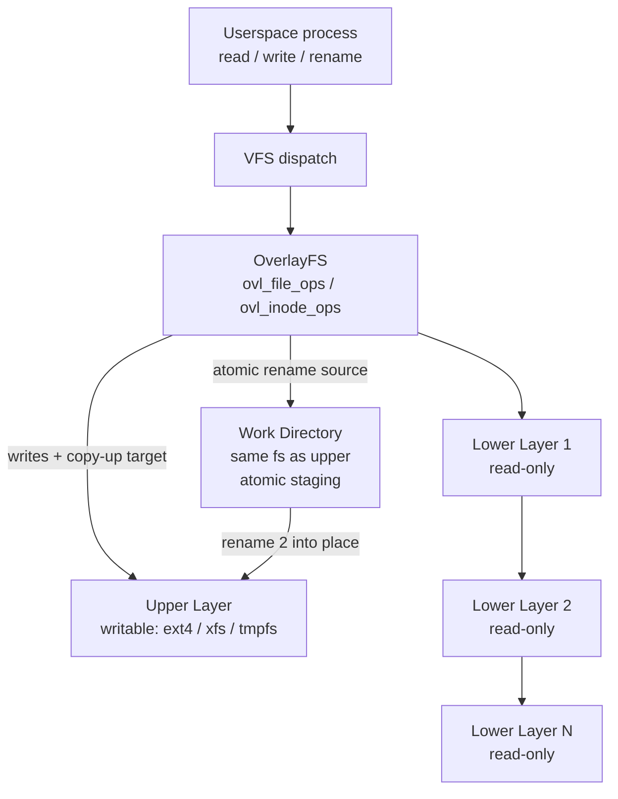
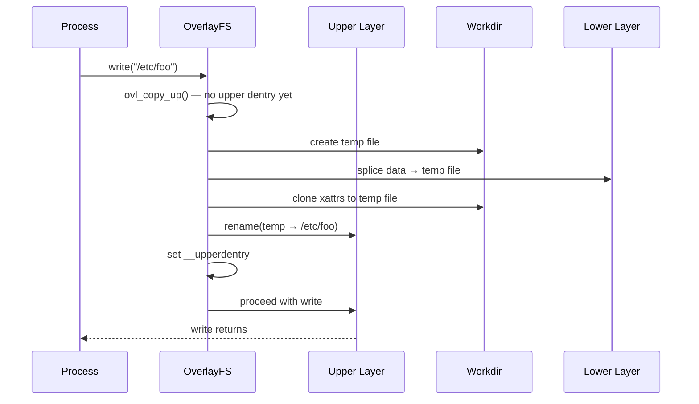

# OverlayFS Subsystem

## Overview

OverlayFS is a union filesystem that presents a merged view of two or more directory trees as a single coherent filesystem. It designates one writable *upper* layer and one or more read-only *lower* layers; reads fall through to the appropriate layer while writes are redirected to the upper layer via a copy-on-write mechanism. OverlayFS is the foundational technology behind container image layering in Docker, Podman, and most OCI-compliant container runtimes.

## Mental Model

Think of OverlayFS as a transparent sheet of acetate (the upper layer) placed on top of a printed reference sheet (the lower layer). Reading shows the combined picture; writing marks the acetate without touching the print below; and scratching something out leaves a smudge on the acetate (a whiteout) that hides the item underneath — the print stays pristine, ready to be shared with the next person who lays their own acetate on top.

## Architecture

Control flows down through VFS into overlayfs's own inode/file ops. For reads, overlayfs resolves which real dentry to use and hands the operation to the underlying filesystem. For writes, if the file lives only in a lower layer, overlayfs first copies it up to the upper layer via the work directory, then lets the write proceed normally against the upper layer file.

---

## Core Components

### [[layer-stack]]

**Purpose** — The layer stack encodes the union's membership: one optional writable upper layer, one mandatory set of lower layers, and a work directory that provides atomic scratch space for the upper filesystem.

**How it works** — At mount time, `ovl_fill_super()` in `fs/overlayfs/super.c` parses the `lowerdir=`, `upperdir=`, and `workdir=` mount options and builds an `ovl_fs` (formerly `ovl_super_info`) that holds path references to every participating directory. The lower stack is ordered from *most recent* (leftmost in the `lowerdir` option) to *oldest* (rightmost), mirroring how image layers are applied in sequence. When a name appears in multiple lower layers, only the topmost match is visible.

The upper and work directories *must* live on the same underlying filesystem (enforced at mount) so that the atomic `rename()` used during copy-up does not cross a device boundary. Lower layers have no such restriction — they may even be other overlay mounts or read-only bind mounts.

A read-only overlay (no `upperdir`/`workdir`) is legal and useful for union-mounting several source trees without enabling writes at all.

**Key struct**: `struct ovl_fs` (`fs/overlayfs/ovl_entry.h`)
- `upper_mnt` — vfsmount of the upper layer, NULL for read-only overlay
- `workbasedir` / `workdir` — dentries for the base work dir and its `work/` subdir
- `layers[]` — flexible array of `ovl_layer`, one per layer (upper first, then lowers)
- `numlayer` / `numdatalayer` — total layer count and data-only layer count
- `config` — `ovl_config` struct holding all parsed mount options

**Key functions**:
- `ovl_fill_super()` (`super.c`) — entry point; validates all layers, creates `ovl_fs`, calls `ovl_get_tree()`
- `ovl_parse_opt()` (`params.c`) — parses mount options into `ovl_config`

**Config & flags**:
- `CONFIG_OVERLAY_FS` — builds the module
- Mount: `lowerdir=`, `upperdir=`, `workdir=`; multiple lowers colon-separated
- Read-only overlay: omit `upperdir`/`workdir`

---

### [[copy-up]]

**Purpose** — Copy-up is overlayfs's copy-on-write mechanism: before any write to a lower-layer file, the file's data and metadata are promoted to the upper layer so that the lower layer remains untouched and shareable.

**How it works** — When a write, truncate, or metadata change arrives at a lower-layer inode, `ovl_copy_up()` (`fs/overlayfs/copy_up.c`) is called. It walks the path from the file up to the root, ensuring every ancestor directory exists in the upper layer before attempting to copy the file itself. For each directory ancestor that is missing from the upper layer, it creates a corresponding upper directory and, if necessary, sets the `trusted.overlay.opaque` xattr to prevent lower-layer directory contents from bleeding through unexpectedly.

The actual file copy is atomic. A temporary file is created inside `$workdir/work/`, data is transferred via `do_splice_direct()` (a zero-copy kernel path), extended attributes are cloned, and then the file is atomically `rename()`d to its final position in the upper tree. No partial result is ever visible because the rename is the commit. If interrupted mid-copy, the orphaned temp file in workdir is simply abandoned on the next mount.

After copy-up, overlayfs updates the inode's `__upperdentry` to point at the new upper-layer dentry. From that moment forward, all operations bypass the lower entirely and operate directly on the upper file.

**Key struct**: `struct ovl_inode` (`fs/overlayfs/ovl_entry.h`)
- `__upperdentry` — points to the upper dentry after copy-up; NULL while file lives only in lower
- `oe` — `ovl_entry` with lower-layer dentry/mnt pairs
- `version` — monotonic counter to invalidate page cache across copy-up
- `lowerdata` — for metacopy files, dentry of the lower data file

**Key functions**:
- `ovl_copy_up()` / `ovl_copy_up_flags()` (`copy_up.c`) — top-level entry points
- `ovl_copy_up_one()` — copies a single path component
- `ovl_copy_up_data()` — handles the file-data transfer via splice
- `ovl_copy_up_metadata()` — clones permissions, timestamps, xattrs

**Config & flags**:
- `metacopy=on` — enables metadata-only copy-up (data deferred until first write)
- `fsync=auto|strict|volatile` — controls whether fsync is issued after data copy-up

---

### [[whiteouts-and-opaque-dirs]]

**Purpose** — Because lower layers are immutable, deletion cannot physically remove a file; instead overlayfs creates a *whiteout* marker in the upper layer that hides the lower entry from the merged view. *Opaque directories* extend the same idea to directory replacement.

**How it works** — When `unlink()` or `rmdir()` is called on a lower-layer entry, overlayfs creates a whiteout in the upper layer at the same path. A whiteout is a character device file with device number 0:0, or (on filesystems that support it) a zero-size regular file bearing the `trusted.overlay.whiteout` xattr. During lookup, `ovl_lookup()` detects the whiteout and returns ENOENT without descending into lower layers.

Directories pose a harder problem: you can delete and recreate a directory, but the new directory must not reveal the original lower directory's contents. When overlayfs copies up the directory inode alone (without its children), it stamps `trusted.overlay.opaque="y"` on it. The `ovl_lookup()` path checks for this xattr when entering a directory; an opaque directory halts the lower-layer search, so old contents from lower layers are invisible.

A third xattr, `trusted.overlay.opaque="x"`, is a hint that says "this merged directory contains at least one whiteout child". Without it, overlayfs would have to scan the full directory on every lookup to find potential whiteouts; the hint allows it to skip the scan for clean directories.

**Key functions**:
- `ovl_create_whiteout()` (`dir.c`) — called from `ovl_unlink()` / `ovl_rmdir()`
- `ovl_is_whiteout()` (`namei.c`) — tests whether a dentry is a whiteout
- `ovl_lookup_single()` (`namei.c`) — checks for whiteout and opaque markers during directory traversal

**Config & flags**:
- No user-facing option; whiteouts are always created when a read-write overlay deletes a lower entry
- `trusted.overlay.*` xattrs require the upper filesystem to support the `trusted.*` namespace; unprivileged mounts use `user.overlay.*` via `-o userxattr`

---

### [[directory-merging]]

**Purpose** — Unlike files (where the first match wins), directories with the same name in upper and lower layers are *merged* — their contents are combined in a single readdir, with upper entries shadowing lower ones of the same name.

**How it works** — The central function is `ovl_lookup()` (`fs/overlayfs/namei.c`). It searches for a name in the upper layer first. If it finds a whiteout, it returns ENOENT immediately. If it finds a real directory, it then walks every lower layer in order, collecting lower dentries for directories that should be merged into the result. Non-directory files from lower layers are only used if the upper layer has nothing at that name.

The result is an `ovl_entry` that can hold a chain of lower dentries, one per contributing layer. When `getdents()` is issued on a merged directory, `ovl_iterate()` walks all layers' directory contents and deduplicates names, presenting a single unified listing.

Merging has a subtle performance implication: every `lookup()` in a merged directory must check the upper layer for a whiteout or shadow entry *and* all relevant lower layers. To bound the work, overlayfs tracks whether a directory is "pure upper" (no lower counterpart) and short-circuits the lower walk for those.

**Key struct**: `struct ovl_entry` (`fs/overlayfs/ovl_entry.h`)
- `numlower` — how many lower layers contribute to this inode
- `lowerstack[]` — array of `ovl_path` (dentry + mnt) for each contributing lower layer

**Key functions**:
- `ovl_lookup()` (`namei.c`) — performs the full upper+lower dentry resolution
- `ovl_iterate()` (`readdir.c`) — merges readdir output from all contributing layers
- `ovl_path_type()` (`overlayfs.h`) — returns flags indicating whether inode is upper, lower, or both

**Config & flags**:
- `redirect_dir=on` — required for cross-layer directory renames; changes how lookup follows redirects in `trusted.overlay.redirect`

---

### [[redirect-dir-and-index]]

**Purpose** — Two features address specific POSIX compliance gaps: `redirect_dir` enables `rename(2)` on directories that span layers (otherwise `EXDEV` is returned), and the `index` feature preserves hard-link identity across copy-up.

**How redirect_dir works** — Renaming a lower or merged directory into a different upper path would require moving all lower-layer children too, which overlayfs cannot do. Instead, `redirect_dir=on` copies up only the directory inode and writes the *original lower path* as a `trusted.overlay.redirect` xattr. Future lookups follow this redirect to find the correct lower content. Without `redirect_dir`, `rename(2)` on such a directory fails with EXDEV.

**How the index feature works** — Without `index=on`, copying up one hard link in a set creates an independent upper-layer inode; the other names still point to the lower inode. Writing through one link does not update the others, breaking hard-link semantics. With `index=on`, overlayfs maintains an index directory under workdir. Each copy-up stores the lower file handle as an index entry name; subsequent copy-ups of other links in the set find the index entry and create a hard link to the already-copied upper inode rather than duplicating data.

**Key struct**: Index entries are dentries under `$workdir/index/`, named by the hex encoding of the lower NFS file handle.

**Key functions**:
- `ovl_rename()` (`dir.c`) — triggers redirect xattr creation when `redirect_dir` is active
- `ovl_get_index_inode()` / `ovl_link_up()` (`namei.c`, `copy_up.c`) — index lookup and hard-link reconnection

**Config & flags**:
- `CONFIG_OVERLAY_FS_REDIRECT_DIR` / `redirect_dir={on|off|follow|nofollow}`
- `CONFIG_OVERLAY_FS_INDEX` / `index={on|off}`
- Both features require the underlying filesystem to support NFS file handles

---

### [[inode-numbering-xino]]

**Purpose** — By default, overlayfs assigns inode numbers arbitrarily, meaning `st_ino` values are not stable across remounts and may collide between layers. The `xino` feature composes globally unique, persistent inode numbers by encoding a per-filesystem ID into the high bits of the raw inode number.

**How it works** — Each underlying filesystem that contributes to the overlay is assigned a small integer *fsid* at mount time. For each real inode, overlayfs derives its synthetic `st_ino` as `(fsid << high_bit_shift) | real_ino`. Because most filesystems leave the high ~16 bits of their inode numbers unused, the encoding is lossless. If any filesystem exhausts the available high-bit space (i.e. uses very high inode numbers), xino falls back to non-unique behavior for those inodes and emits a warning.

This matters most for applications that rely on `(st_dev, st_ino)` pairs for identity — e.g. `find -samefile`, hardlink detection, NFS re-export. Without xino, two files from different lower layers can appear to have the same `st_ino`, producing spurious matches.

When all layers share the same underlying filesystem, xino is enabled implicitly and without overhead (no encoding needed — all inodes are already unique by real inode number).

**Key functions**:
- `ovl_assign_ino()` (`inode.c`) — encodes fsid into inode number at inode creation
- `ovl_map_ino()` — translates a real inode number to its xino-encoded form

**Config & flags**:
- `CONFIG_OVERLAY_FS_XINO_AUTO` — enables `xino=auto` as the default
- `xino={on|auto|off}` — mount option; `auto` enables only if all lower layers support file handles

---

### [[metacopy]]

**Purpose** — Full copy-up of large files on every `chown()` or `chmod()` is prohibitively expensive in containerized environments where a container startup may chown thousands of files. Metacopy defers data transfer: only the file's metadata is promoted to the upper layer; data remains in the lower layer until the file is actually opened for writing.

**How it works** — When `metacopy=on` and a metadata-only operation arrives (chown, chmod, utimes), overlayfs creates a new upper-layer inode with the new metadata but without file data. It stamps this inode with `trusted.overlay.metacopy` to record that it is a shell inode only. For reads, `d_real()` returns the lower dentry/inode so that multiple containers can still share the same page-cache pages for file data — this is the key efficiency gain.

When the file is first opened for writing, overlayfs detects the metacopy marker and triggers a *data copy-up*: the lower data is copied into the upper inode, the `trusted.overlay.metacopy` xattr is removed, and from that point the file is a fully self-contained upper file.

An optional fs-verity extension stores a digest of the lower data in the `trusted.overlay.metacopy` xattr. On access, overlayfs verifies the lower file against this digest (returning EIO on mismatch), enabling tamper-detection even when lower layers come from untrusted sources.

**Key functions**:
- `ovl_copy_up_metadata()` (`copy_up.c`) — performs the metadata-only copy when metacopy=on
- `ovl_copy_up_data()` — called lazily on first write to a metacopy file

**Config & flags**:
- `metacopy={on|off}` — mount option; default off
- `verity={off|on|require}` — controls digest generation/verification for metacopy files
- Incompatible with `nfs_export=on` and some `redirect_dir` modes

---

## How Components Interact

### Scenario 1: Container writes to a shared base image file

A container process calls `write()` on `/etc/hostname`, which lives only in a lower layer. VFS dispatches to `ovl_write_iter()`, which calls `ovl_copy_up()`. Copy-up walks upward from `/etc/hostname` to `/etc/` to `/`, ensuring each ancestor directory exists in the upper layer. It then creates a temp file in workdir, splices the lower `/etc/hostname` data into it, clones xattrs, and renames it to the upper `/etc/hostname`. `__upperdentry` on the overlay inode is set; subsequent writes go directly to the upper file. Other containers sharing the same lower layer are unaffected — they still read from the original.

### Scenario 2: Docker image build removes a file

`unlink("/usr/lib/old.so")` arrives at overlayfs. The file exists only in a lower layer, so overlayfs cannot actually delete it. Instead, `ovl_unlink()` calls `ovl_create_whiteout()` to create a character device 0:0 at `/usr/lib/old.so` in the upper layer. Any subsequent `lookup()` for that path finds the whiteout first and returns ENOENT. The lower layer's `old.so` is untouched.

### Scenario 3: Container `chmod -R` on a large tree (with metacopy=on)

`chmod()` arrives on a 500 MB file in the lower layer. With `metacopy=on`, overlayfs copies only the inode metadata (owner, mode, timestamps, xattrs) to the upper layer, writing `trusted.overlay.metacopy` as a marker. The data — 500 MB — stays in the lower layer. Page-cache pages for the file are still served from the lower inode, so containers sharing the base image continue to share those pages. Only when a container later opens the file for writing does the full data copy-up occur.

## Where It Fits in the Kernel

- **↑ Userspace**: Exposed via `mount(2)` with `-t overlay`; accessed through standard POSIX file operations (open, read, write, stat, rename, unlink). Container runtimes use the new mount API (`fsopen`, `fsconfig`, `fsmount`) for privileged control.
- **→ [[vfs]]**: Overlayfs registers standard `inode_operations`, `file_operations`, and `super_operations` with VFS. All internal paths go through the VFS layer when accessing underlying filesystems, so overlayfs never calls lower filesystem functions directly.
- **→ [[fscrypt]]**: Overlayfs explicitly blocks `upperdir` from being on an encrypted filesystem because fscrypt keys are per-directory and overlayfs cannot guarantee consistent key availability during copy-up.
- **→ [[security]]**: Security modules (SELinux, Smack) perform MAC checks on the overlay inodes. The dual-credential permission model ensures checks happen both at the overlay level and at the underlying layer, preventing privilege escalation through copy-up.
- **→ [[fscache]]**: Read-only lower layers can be backed by network filesystems (NFS, ceph); fscache may cache their data, but the overlay layer itself adds no caching.
- **↓ Hardware**: Purely software — no direct hardware dependencies. Performance is bounded by the I/O performance of the underlying filesystems hosting each layer.

## Design Decisions & Tradeoffs

**Simplicity over completeness** — The central design choice Miklos Szeredi made was to implement "good enough" union mounting rather than a complete POSIX-compliant union FS. Early competitors (UnionFS, AUFS) tried to handle every edge case and accumulated enormous complexity. OverlayFS accepted several documented POSIX deviations (no `st_atime` update on lower reads, non-stable `st_ino` by default, `EXDEV` on cross-layer renames without `redirect_dir`) in exchange for a codebase small enough to actually reach mainline.

**Kernel vs. userspace** — Andrew Morton questioned whether this belonged in the kernel at all. Linus Torvalds ended the debate: "People who think that userspace filesystems are realistic for anything but toys are just misguided." The FUSE overhead on every file operation would be prohibitive for container workloads.

**Copy-up atomicity via workdir rename** — Rather than writing directly to the upper layer (risking partial state on crash), overlayfs writes to workdir and renames into place. The rename is a single atomic metadata operation. This guarantees that either the old file or the new file is visible, never a partially-written intermediate. The cost is that workdir must be on the same filesystem as upper.

**Deferred data copy (metacopy)** — Full copy-up on every `chown` broke page-cache sharing between containers. Metacopy was the solution: accept a more complex code path (metacopy marker, lazy data promotion) to preserve sharing. The tradeoff is that metacopy files require extra xattr lookups on every access.

**Hard links and the index** — Without `index=on`, copying one hard link breaks the link set silently. The index feature fixes this at the cost of requiring file-handle support in the underlying filesystem and maintaining a persistent index directory. It is not the default because it makes overlay mounts non-portable across filesystem changes.

## How It Has Evolved

| Version | Change |
|---------|--------|
| **3.18** (2014) | Initial merge; basic upper/lower/workdir, copy-up, whiteouts, opaque dirs |
| **4.0** (2015) | Improvements enabling Docker overlay2 storage driver adoption |
| **4.13** (2017) | `index=on` feature: hard-link preservation across copy-up |
| **4.17** (2018) | `xino` feature: composite unique inode numbers from fsid + real ino |
| **4.19** (2018) | Multiple lower layers; `redirect_dir`, `nfs_export`; POSIX-compliance improvements |
| **5.2** (2019) | `metacopy=on`: metadata-only copy-up, deferred data copy |
| **5.11** (2021) | Unprivileged overlay mounts via `user.overlay.*` xattrs (`userxattr`) |
| **6.8** (2024) | `lowerdir+` via fsconfig API; automatic colon escaping in `/proc/self/mountinfo` |
| **6.13** (2025) | File-descriptor layer specification (`FSCONFIG_SET_FD` for all layer types) |
| **6.15** (2025) | `override_creds` mount option for credential stashing |

## Recent Development Activity

- **fs-verity integration**: The `verity={on|require}` metacopy mode (landed ~6.12) enables overlayfs to serve as a trusted execution environment using untrusted lower layers; active refinement of the threat model.
- **Data-only lower layers** (`::` separator in `lowerdir`): Allows splitting metadata and data storage for advanced containerization scenarios.
- **Unprivileged mounts** (`userxattr`): Ongoing work to make user-namespace overlays fully functional for rootless container runtimes; the main challenge is preventing privilege escalation through xattr manipulation.
- **NFS export correctness**: Persistent ESTALE issues when index UUIDs mismatch after reboot; active patches on linux-fsdevel.

## Further Reading

1. [Overlayfs issues and experiences — LWN.net (2015)](https://lwn.net/Articles/636943/) — covers the Docker adoption challenges and unresolved POSIX issues
2. [Debating overlayfs — LWN.net (2011)](https://lwn.net/Articles/447650/) — the original mainline debate: simplicity vs. completeness
3. [Overlayfs: Delayed copy up of data — LWN.net (2019)](https://lwn.net/Articles/755891/) — metacopy feature motivation and design
4. [Overlay Filesystem — kernel.org documentation](https://www.kernel.org/doc/html/latest/filesystems/overlayfs.html) — authoritative reference for all mount options
5. [kernel-internals.org: OverlayFS](https://kernel-internals.org/filesystems/overlayfs/) — container-focused technical deep dive
6. [Unioning file systems — LWN.net (2009)](https://lwn.net/Articles/324291/) — historical context and competing approaches

## LKML Highlights

- **Initial merge debate (2011)**: `<alpine.LFD.2.02.1106011623370.6788@localhost.localdomain>` — Andrew Morton raises completeness concerns; Linus overrules and approves simplicity-first approach. The thread established overlayfs's design philosophy for a decade.
- **Metacopy series (2018)**: `[PATCH 0/28] overlayfs: Delayed copy up of data` — Amir Goldstein's 28-patch series introducing metadata-only copy-up to fix page-cache sharing breakage caused by container `chown` storms.
- **Redirect dir correctness (2016)**: `[PATCH 0/9] overlayfs: allow moving directory trees` — debate about how to handle `rename(2)` across layers without EXDEV; resulted in the `redirect_dir` xattr design.
