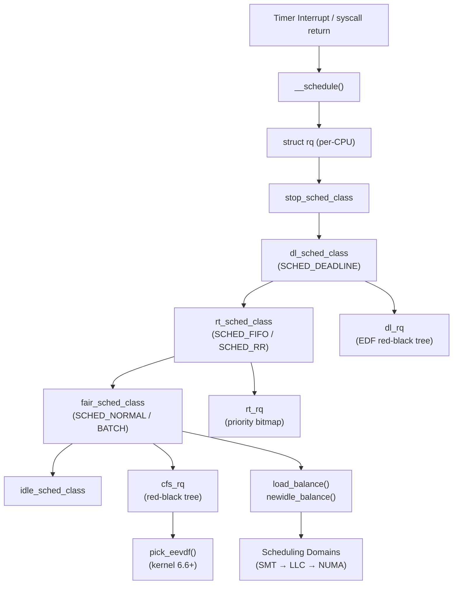

# Scheduler Subsystem

> 📘 Plain-language version: [[scheduler-explained]]

## Overview

The Linux scheduler decides which task runs on each CPU at every moment, balancing fairness between tasks, low latency for interactive work, high throughput for batch jobs, and determinism for real-time processes. It implements this through a layered class hierarchy — each scheduling policy (CFS/EEVDF, RT, DEADLINE) is a self-contained module that plugs into a common core via vtable callbacks, while per-CPU runqueues eliminate global lock contention.

## Mental Model

Think of the scheduler as a **tournament bracket** run once every timer tick. Tasks are seeded into different brackets based on their class — DEADLINE tasks always enter the finals, RT tasks compete in the semi-finals, and the vast majority of tasks fight it out in the fair/EEVDF bracket. Within the fair bracket, the winner is whoever has the earliest virtual deadline among eligible competitors. The bracket system (scheduler classes) is immutable by design; a lower bracket can never preempt a higher one.

## Architecture

Control enters `__schedule()` from timer ticks, blocking syscalls, or explicit yields. The function walks the scheduler class chain from highest to lowest priority, asking each class `pick_next_task()`. The first class with a runnable task wins, and `context_switch()` moves CPU execution to that task. Load balancing runs periodically and on idle to redistribute tasks across CPUs according to the domain topology.

---

## Core Components

### [[scheduler-classes]]

**Purpose** — Different scheduling algorithms make incompatible assumptions about their data structures (CFS needs a red-black tree by vruntime; RT needs a priority bitmap; DEADLINE needs an EDF tree). Rather than littering `__schedule()` with conditionals, each algorithm is encapsulated as a `sched_class` vtable.

**How it works** — Every scheduling policy is associated with a `sched_class` object containing function pointers. The five classes — `stop_sched_class`, `dl_sched_class`, `rt_sched_class`, `fair_sched_class`, `idle_sched_class` — form a statically linked priority chain. `__schedule()` walks this chain calling `pick_next_task()` on each; the first class returning a non-NULL task wins. The stop class (used for CPU hotplug and migration) sits at the top so it can preempt even priority-99 RT tasks without any special-case code — placement in the chain *is* the special case.

The abstraction was introduced in Linux 2.6.23 alongside CFS. When SCHED_DEADLINE was added in 3.14, it slotted in above RT purely by implementing the interface — zero changes to the scheduler core. For the common case where all tasks are fair-scheduled, `pick_next_task()` bypasses the chain entirely and calls `pick_next_task_fair()` directly, eliminating vtable overhead.

**Key struct**: `struct sched_class` (`kernel/sched/sched.h`)
- `enqueue_task` — add a task to the runqueue when it becomes runnable
- `dequeue_task` — remove a task when it blocks or exits
- `pick_next_task` — select the task to run next
- `put_prev_task` — account for the task being replaced (update stats, re-queue)
- `task_tick` — called on every timer tick for accounting and preemption checks
- `prio_changed` — react to priority changes without reinserting into the wrong queue
- `update_curr` — refresh per-task accounting (vruntime, exec time)

**Key functions**:
- `pick_next_task()` (`kernel/sched/core.c`) — outer loop over the class chain; returns the next task to run

**Config & flags**: `CONFIG_FAIR_GROUP_SCHED` enables group scheduling within the fair class. `CONFIG_RT_GROUP_SCHED` does the same for RT.

---

### [[runqueue]]

**Purpose** — Every CPU needs its own task list so task selection never requires cross-CPU locking. A single global runqueue would serialize all task selection decisions, becoming a bottleneck on multi-core systems.

**How it works** — `struct rq` is a per-CPU structure (accessed via `cpu_rq(cpu)` or `this_rq()`) that acts as the root for all scheduling state on a CPU. It contains three sub-queues — `cfs_rq` for fair tasks, `rt_rq` for real-time tasks, and `dl_rq` for deadline tasks — plus the currently running task pointer `curr` and a monotonic nanosecond clock.

Modifications to a runqueue are protected by `rq->__lock`, a raw spinlock. The runqueue clock (`rq->clock`) is updated by `update_rq_clock()` at the start of scheduling decisions; `rq->clock_task` is the same but excludes time stolen by VM guests, keeping scheduling decisions accurate in virtualized environments.

The `nr_running` field counts runnable tasks across all classes. When it drops to zero, `pick_next_task()` returns the idle thread. The `nr_switches` counter (voluntary + involuntary) is exposed via `/proc/$PID/status` for performance analysis.

**Key struct**: `struct rq` (`kernel/sched/sched.h`)
- `__lock` — raw spinlock; held during all runqueue modifications and task selection
- `nr_running` — total runnable tasks across all scheduling classes
- `curr` — currently executing `task_struct`
- `clock` / `clock_task` — nanosecond timestamps; `clock_task` excludes VM guest time
- `cfs`, `rt`, `dl` — per-class sub-queues embedded directly in the rq

**Key functions**:
- `this_rq()` — get the current CPU's runqueue (inline, no lock needed)
- `task_rq(p)` — get the runqueue a task is currently on
- `update_rq_clock()` — refresh `rq->clock` before scheduling decisions

**Config & flags**: `CONFIG_SMP` enables per-CPU runqueues; on UP systems the per-CPU structures still exist but load balancing is compiled out.

---

### [[cfs-eevdf]]

**Purpose** — The fair scheduler handles the vast majority of processes (interactive applications, daemons, containers). It must simultaneously provide fairness (no task starved), low latency (interactive tasks run promptly), and high throughput (batch tasks fully utilize the CPU).

**How it works** — CFS's foundational concept is *virtual runtime* (`vruntime`): every task accumulates vruntime proportional to the real CPU time it consumes, but scaled inversely by its priority weight. A high-priority task (nice -5, weight 3121) accumulates vruntime at ≈0.33× the real rate; a low-priority task (nice +5, weight 335) accumulates at ≈3.1×. Because the scheduler always selects the task with the smallest vruntime, high-priority tasks earn proportionally more CPU — the weight table is calibrated so each nice increment causes roughly 10% throughput difference.

Tasks are stored in a red-black tree (`cfs_rq->tasks_timeline`) keyed by vruntime. The leftmost node is cached, giving O(1) access to the next candidate. Since kernel 6.6, the selection function is `pick_eevdf()` rather than simple leftmost selection.

**EEVDF** (Eligible Virtual Deadline First, merged 6.6) adds two concepts to the fairness model. *Eligibility*: a task is eligible only if its vruntime hasn't exceeded the weighted average (`avg_vruntime`). *Virtual deadline*: each task receives a deadline computed as `vruntime + calc_delta_fair(slice, se)` — tasks requesting shorter slices get earlier deadlines and are scheduled sooner. `pick_eevdf()` finds the eligible task with the earliest virtual deadline, not just the smallest vruntime. This improves responsiveness for network I/O and multimedia workloads that need to be scheduled promptly, not just fairly.

When a sleeping task wakes, `place_entity()` adjusts its vruntime to approximately `avg_vruntime - half_slice` to prevent monopolization while ensuring prompt scheduling. `wakeup_preempt_fair()` then compares virtual deadlines: if the woken task's deadline is earlier than the running task's, `TIF_NEED_RESCHED` is set.

**Key struct**: `struct sched_entity` (`include/linux/sched.h`)
- `load` — weight derived from nice value
- `vruntime` — accumulated virtual runtime (ns, weighted)
- `exec_start` — wall-clock timestamp of last update
- `sum_exec_runtime` — total real CPU consumed
- `run_node` — position in the cfs_rq red-black tree
- `on_rq` — whether currently queued in a runqueue

`struct cfs_rq` (`kernel/sched/sched.h`)
- `tasks_timeline` — the red-black tree root (with cached leftmost node)
- `curr` — currently running entity
- `avg_vruntime` — weighted vruntime average for eligibility checks
- `nr_queued` — count of runnable entities

**Key functions**:
- `update_curr()` — tick/switch handler: computes elapsed time, advances vruntime
- `enqueue_entity()` / `dequeue_entity()` — insert/remove from the red-black tree
- `pick_eevdf()` — select the next task: earliest virtual deadline among eligible entities
- `place_entity()` — set initial vruntime for a waking or newly forked task

**Config & flags**:
- `CONFIG_FAIR_GROUP_SCHED` — enables group (cgroup) scheduling within the fair class
- `/proc/sys/kernel/sched_latency_ns` — target scheduling latency; tasks get a proportional slice
- `/proc/sys/kernel/sched_min_granularity_ns` — minimum task slice to prevent thrashing
- `/proc/$PID/sched` — per-task vruntime, exec time, and scheduling counters

---

### [[rt-scheduler]]

**Purpose** — Some tasks (audio servers, industrial control, network drivers) need deterministic CPU access within tight time bounds. Nice-value fairness cannot provide this — a real-time audio thread cannot wait 10ms because a batch job happened to have lower vruntime.

**How it works** — The RT scheduler implements two POSIX-mandated policies. `SCHED_FIFO` tasks run until they block or yield — no timeslice. `SCHED_RR` tasks have a default 100ms timeslice; when it expires, `task_tick_rt()` requeues them at the back of their priority level's FIFO list.

RT priorities range from 1 (lowest) to 99 (highest). The runqueue uses a bitmap plus per-priority FIFO queues (`struct rt_prio_array`). Task selection is O(1): `find_lowest_bit()` on the bitmap identifies the highest-priority non-empty queue instantly, then the head of that queue is returned.

On SMP systems, "pushable tasks" lists track RT tasks eligible for migration. When an RT task at priority P arrives on an already-occupied CPU, lower-priority RT tasks are pushed to other CPUs via `push_rt_task()`.

To prevent RT tasks from starving normal tasks entirely, the kernel throttles RT bandwidth: by default, RT tasks may consume at most 950ms out of every 1000ms (`/proc/sys/kernel/sched_rt_period_us` and `sched_rt_runtime_us`). Setting `sched_rt_runtime_us` to -1 disables throttling.

**Key struct**: `struct sched_rt_entity` (`include/linux/sched.h`)
- `run_list` — linkage in the per-priority FIFO queue
- `time_slice` — remaining RR timeslice (in jiffies)
- `timeout` — RLIMIT_RTTIME watchdog counter
- `on_rq` / `on_list` — queue membership flags

`struct rt_prio_array` (`kernel/sched/sched.h`)
- `bitmap[101]` — one bit per priority level; set when that level has tasks
- `queue[100]` — per-priority FIFO list heads

**Key functions**:
- `task_tick_rt()` — timer tick handler: decrements RR timeslice, requeues on expiry
- `pick_next_task_rt()` — find highest-priority RT task via bitmap scan
- `push_rt_task()` / `pull_rt_task()` — SMP migration for RT overload

**Config & flags**:
- `/proc/sys/kernel/sched_rt_period_us` — throttling window (default 1,000,000 µs)
- `/proc/sys/kernel/sched_rt_runtime_us` — RT budget per window (default 950,000 µs; -1 = unlimited)
- `CAP_SYS_NICE` — required to set SCHED_FIFO or SCHED_RR

---

### [[sched-deadline]]

**Purpose** — RT priorities are administratively assigned and subject to priority inversion. Real-time workloads with known computational budgets (video encode, network polling loops) benefit from *bandwidth-based* scheduling: declare how much CPU is needed and let the kernel enforce it.

**How it works** — Each SCHED_DEADLINE task declares three parameters: `sched_runtime` (budget per period), `sched_deadline` (deadline by which work must complete), and `sched_period` (repetition interval). Before a task can adopt SCHED_DEADLINE, the kernel runs admission control: the sum of all DEADLINE utilizations (`runtime/period`) across all tasks on all CPUs must remain below 100%. If the new task would violate this, `sched_setattr()` returns `-EBUSY`.

During execution, the kernel tracks the task's remaining budget via `sched_runtime`. On each timer tick, `task_tick_dl()` decrements it. When the budget hits zero, the task is throttled immediately and an hrtimer is set for the next period boundary, at which point the budget is replenished and the task is re-eligible.

The dl_rq uses a red-black tree ordered by absolute deadline. `pick_next_task_dl()` returns the leftmost node — the task with the earliest deadline, implementing Earliest Deadline First (EDF). The GRUB (Greedy Reclamation of Unused Bandwidth) mechanism allows idle DEADLINE tasks' unused budget to be reclaimed by the system, improving utilization without violating guarantees.

**Key struct**: `struct sched_dl_entity` (`include/linux/sched.h`)
- `dl_runtime` / `dl_deadline` / `dl_period` — the three declared parameters
- `runtime` — remaining budget in the current period
- `deadline` — absolute deadline for the current activation
- `dl_throttled` — set when budget is exhausted

`struct dl_rq` (`kernel/sched/sched.h`)
- `rb_root_cached` — red-black tree ordered by absolute deadline
- `running_bw` / `this_bw` — bandwidth in use and total committed
- `extra_bw` — reclaimed idle bandwidth via GRUB

**Key functions**:
- `dl_task_timer()` — hrtimer callback: replenish budget and unthrottle at period boundary
- `pick_next_task_dl()` — EDF selection: leftmost (earliest-deadline) node
- `task_tick_dl()` — tick handler: decrement runtime, throttle if exhausted

**Config & flags**:
- `sched_setattr(2)` — userspace API for setting SCHED_DEADLINE parameters
- `/proc/sys/kernel/sched_dl_period_max_us` / `sched_dl_period_min_us` — parameter validation bounds

---

### [[context-switch]]

**Purpose** — Task switching is the most performance-critical operation in the scheduler. Saving and restoring CPU state must happen correctly under all conditions (NMI, IRQ, lazy TLB) while minimizing cycles spent not running user code.

**How it works** — A context switch begins when `TIF_NEED_RESCHED` is set on the current task. This flag is checked at interrupt-exit points and explicit scheduling windows — the flag guarantees the scheduler will run soon but not necessarily immediately (except under `CONFIG_PREEMPT`).

`__schedule()` is the central function. It first disables local IRQs and acquires the runqueue lock. It calls `update_rq_clock()` to refresh the monotonic clock, then checks if the task voluntarily yielded (dequeue it if it's blocking) or was preempted (leave it on the runqueue). `pick_next_task()` selects the successor. If the successor is different, `context_switch()` runs.

`context_switch()` handles two separable concerns. *Address space*: for user tasks, it writes new page tables into CR3 (x86-64), flushing the TLB. Kernel threads borrow the previous task's page tables via the lazy TLB mechanism, avoiding the flush cost entirely. *Registers and stack*: `switch_to()` (architecture-specific assembly) saves callee-saved registers onto the outgoing task's kernel stack, swaps the stack pointer, and restores the incoming task's saved registers. After the stack pointer swap, code executes in the incoming task's context.

`finish_task_switch()` runs in the new task's context. It clears `prev->on_cpu` with release semantics — any concurrent `try_to_wake_up()` attempting to migrate the old task spins on this field until it's clear, preventing races. Then the runqueue lock is released.

**Key struct**: `struct task_struct` (selected fields, `include/linux/sched.h`)
- `__state` — `TASK_RUNNING`, `TASK_INTERRUPTIBLE`, `TASK_UNINTERRUPTIBLE`, etc.
- `on_cpu` — set while running, cleared by `finish_task_switch()` with release semantics
- `thread` — `struct thread_struct` with arch-specific saved register state
- `nvcsw` / `nivcsw` — voluntary / involuntary context switch counters

**Key functions**:
- `__schedule()` — orchestrates the entire switch: lock, clock update, pick, switch
- `context_switch()` — address space and register state transition
- `switch_to(prev, next, prev)` — arch assembly: register save/restore and stack swap
- `finish_task_switch()` — post-switch cleanup in the new task's context

**Config & flags**:
- `CONFIG_PREEMPT_NONE` / `CONFIG_PREEMPT_VOLUNTARY` / `CONFIG_PREEMPT` / `CONFIG_PREEMPT_RT` — control when preemption occurs (see [[preemption-model]])
- `/proc/$PID/status` — `voluntary_ctxt_switches` and `nonvoluntary_ctxt_switches`

---

### [[load-balancing]]

**Purpose** — Per-CPU runqueues are efficient but can become unbalanced: one CPU overloaded while others sit idle. Load balancing periodically redistributes tasks to maximize utilization while preserving cache locality and NUMA affinity.

**How it works** — The kernel models CPU topology as a hierarchy of *scheduling domains* (`struct sched_domain`): SMT siblings share L1/L2, cores share L3, sockets share a NUMA node. Each level has a `struct sched_group` ring listing its CPUs, plus parameters controlling how aggressively to balance (`min_interval`, `max_interval`, `imbalance_pct`).

Three mechanisms trigger balancing. *Periodic*: The scheduler tick calls `trigger_load_balance()`, which queues `run_rebalance_domains()` as a softirq. This function walks from the narrowest domain outward, calling `load_balance()` at each level. `load_balance()` identifies the busiest group in the domain and pulls tasks to the local CPU if the imbalance exceeds the domain's threshold. *Idle*: When a CPU becomes idle, `newidle_balance()` immediately walks domains outward, pulling work if the expected idle duration exceeds the migration cost. *Wakeup*: `select_task_rq_fair()` chooses the best CPU for a waking task — it applies wake affinity (prefer the waker's cache domain) then selects the idlest suitable CPU.

Load is tracked via **PELT** (Per-Entity Load Tracking): an exponentially decaying moving average where history older than ≈32ms contributes less than 1%. On heterogeneous hardware (ARM big.LITTLE, Intel P+E cores), tasks using more than 80% of their CPU class's capacity are flagged as "misfit" and immediately migrated to higher-capacity CPUs.

**Key struct**: `struct sched_domain` (`include/linux/sched/topology.h`)
- `parent` / `child` — pointers up and down the hierarchy
- `groups` — circular list of `sched_group` (the CPUs in this domain)
- `min_interval` / `max_interval` — load balance frequency bounds
- `imbalance_pct` — imbalance threshold before migration fires (default ~125%)
- `flags` — `SD_LOAD_BALANCE`, `SD_BALANCE_WAKE`, `SD_NUMA`, etc.

**Key functions**:
- `load_balance()` — periodic pull: find busiest group, migrate tasks
- `newidle_balance()` — idle-CPU pull: immediate migration on becoming idle
- `select_task_rq_fair()` — wakeup placement: cache affinity then idlest CPU

**Config & flags**:
- `/proc/sys/kernel/sched_domain/` — per-domain tuning knobs exposed at runtime
- `/proc/schedstat` — per-CPU and per-domain load balancing statistics
- `CONFIG_NUMA_BALANCING` — enables automatic NUMA page migration alongside task migration
- `isolcpus=` kernel boot parameter — removes CPUs from the load balancing domain

---

### [[cpu-cgroups]]

**Purpose** — Containers and VMs need CPU isolation: one container must not starve another even if it spawns unlimited threads. CPU cgroups let administrators assign proportional CPU shares and hard quotas to groups of tasks.

**How it works** — Each cgroup maps to a `task_group` structure. With `CONFIG_FAIR_GROUP_SCHED`, every `task_group` has a per-CPU `sched_entity` (representing the group) and a per-CPU `cfs_rq` (holding the group's tasks). The group's `sched_entity` competes in the parent cfs_rq using the group's assigned weight, while the group's internal `cfs_rq` independently distributes time among its members. This two-level scheduling creates a hierarchy without merging all tasks into one flat tree.

**Weight-based sharing** (soft limit): v1 uses `cpu.shares` (default 1024), v2 uses `cpu.weight` (default 100, range 1–10000). Both ultimately set `task_group->shares`. The kernel always works in v1 share units internally; v2 weight is converted as `shares = (weight × 1024) / 100`.

**Bandwidth throttling** (hard limit): A `cfs_bandwidth` structure tracks a global quota per cgroup. Each CPU's `cfs_rq` borrows 5ms slices from this pool when it needs to run. When the pool is exhausted, all cfs_rqs in the group are added to `throttled_cfs_rq`; they stop picking tasks until a periodic `hrtimer` fires at the next period boundary and refills the pool. v1 exposes `cpu.cfs_quota_us` and `cpu.cfs_period_us` separately; v2 combines them in `cpu.max` (e.g., `"50000 100000"` means 50ms quota per 100ms period).

**Key struct**: `struct task_group` (`kernel/sched/sched.h`)
- `shares` — CPU weight in v1-share units
- `se[NR_CPUS]` — per-CPU group sched_entity (for participating in parent cfs_rq)
- `cfs_rq[NR_CPUS]` — per-CPU runqueue holding the group's tasks
- `cfs_bandwidth` — quota tracking and throttle list

**Key functions**:
- `sched_group_set_shares()` — update group weight and propagate to per-CPU entities
- `throttle_cfs_rq()` / `unthrottle_cfs_rq()` — bandwidth enforcement
- `assign_cfs_rq_runtime()` — per-CPU runtime allocation from the global pool

**Config & flags**:
- `CONFIG_FAIR_GROUP_SCHED` — enables group scheduling
- `CONFIG_CFS_BANDWIDTH` — enables bandwidth throttling (requires `FAIR_GROUP_SCHED`)
- `cpu.weight` / `cpu.max` — cgroup v2 interfaces
- `cpu.shares` / `cpu.cfs_quota_us` / `cpu.cfs_period_us` — cgroup v1 interfaces

---

## How Components Interact

### Scenario 1: Timer Tick → Preemption

A timer interrupt fires. The interrupt handler calls `scheduler_tick()`, which invokes `task_tick()` on the current task's `sched_class`. For a fair-class task, `task_tick_fair()` calls `update_curr()` to advance vruntime, then checks whether the current task has run for more than its ideal slice. If so, it calls `resched_curr()`, which sets `TIF_NEED_RESCHED` on the current task. The interrupt returns; on the way out, the kernel checks `TIF_NEED_RESCHED` and calls `__schedule()`. `__schedule()` calls `pick_next_task()` → `pick_next_task_fair()` → `pick_eevdf()`, which walks the red-black tree to find the eligible task with the earliest virtual deadline. `context_switch()` swaps address space and registers, and execution resumes in the new task.

### Scenario 2: Blocking Syscall → Wakeup

A task calls `read()` on a pipe with no data. The VFS layer calls `schedule()` after setting the task state to `TASK_INTERRUPTIBLE`. `__schedule()` sees the non-running state, calls `dequeue_task()` to remove it from the cfs_rq, and switches to another task. When data arrives, the pipe's writer calls `wake_up()`, which calls `try_to_wake_up()`. This function acquires `p->pi_lock`, spins on `p->on_cpu` until the task is fully off its previous CPU, then calls `select_task_rq_fair()` to pick the best target CPU. It calls `enqueue_task()` to re-add the task to that CPU's cfs_rq with `place_entity()` adjusting vruntime. If the woken task's virtual deadline is earlier than the running task's, `TIF_NEED_RESCHED` is set on the target CPU.

### Scenario 3: Container CPU Throttle

A container's cgroup exhausts its 50ms `cpu.max` quota. The last `assign_cfs_rq_runtime()` call finds the global pool empty and calls `throttle_cfs_rq()`, adding the group's `cfs_rq` to the throttled list and stopping it from contributing tasks to `pick_next_task()`. At the next period boundary, `sched_cfs_period_timer()` fires, calls `do_sched_cfs_period_timer()` which refills the pool and calls `unthrottle_cfs_rq()` for every throttled runqueue, re-enabling task selection.

---

## Where It Fits in the Kernel

- **↑ Userspace**: `sched_setscheduler(2)`, `sched_setattr(2)`, `nice(1)`, `taskset(1)`, `cgroup` filesystem writes
- **→ [[memory-management]]**: The scheduler queries memory pressure via `task_struct->mm` and NUMA fault statistics; `[[numa-memory-policy]]` migrations are triggered by scheduler topology walks
- **→ [[locking]]**: Context switches must respect lock ownership; `[[rcu-read-copy-update]]` read-side sections cannot be preempted in certain configurations; `[[seqlocks-and-memory-barriers]]` ensure wakeup/sleep ordering
- **→ [[cgroups]]**: CPU cgroups delegate quota enforcement to `cfs_bandwidth` structures inside the scheduler; the cgroup subsystem calls `sched_group_set_shares()` on writes to `cpu.weight`
- **← [[interrupt-handling]]**: Timer interrupts drive `scheduler_tick()`, the primary periodic scheduling event; IRQ threads participate in the RT class
- **↓ Hardware**: Architecture-specific `switch_to()` saves/restores registers; `cpufreq` and energy-aware scheduling communicate via `struct em_perf_domain`

---

## Design Decisions & Tradeoffs

**Per-CPU runqueues** were chosen over a global queue to eliminate contention. The cost is that tasks can become stuck on busy CPUs while idle CPUs go unused; load balancing is the compensating mechanism, introducing migration latency and cache miss costs.

**Virtual runtime vs. absolute fairness**: CFS is not strictly fair at microsecond granularity — tasks run in slices, not atomically. The scheduler latency (`sched_latency_ns`) bounds how long any task waits; within that window, strict ordering by vruntime provides *approximate* fairness. Reducing latency means more context switches and more overhead.

**EEVDF over CFS heuristics**: CFS accumulated a collection of wakeup-boosting heuristics (`WAKEUP_PREEMPTION`, `NEXT_BUDDY`, etc.) to improve interactive latency. These heuristics were fragile — tuned for one workload, they degraded others. EEVDF's virtual deadline provides a principled mechanism that subsumes most heuristics: a task requesting a short slice gets an early deadline and is scheduled promptly without special-casing.

**Scheduling classes** sacrifice some optimization opportunities for modularity. The fair-class fast path in `pick_next_task()` is the main concession to performance — when all tasks are fair-scheduled (the common case), the class chain is bypassed.

**RT bandwidth throttling** protects the system from runaway RT tasks but adds overhead. The default 95% RT cap means RT tasks can be delayed up to 50ms in the worst case — acceptable for most real-time work but not for hard real-time requirements, which need `CONFIG_PREEMPT_RT`.

---

## How It Has Evolved

| Version | Change |
|---------|--------|
| 1.0–2.4 | O(n) scheduler: scans all runnable tasks; adequate at small scales |
| 2.6.0 (2003) | Ingo Molnár's O(1) scheduler: 140-priority bitmap, O(1) selection, but relied on opaque interactivity heuristics |
| 2.6.23 (2007) | CFS replaces O(1): Con Kolivas's RSDL/SD concept refined; virtual runtime makes fairness auditable |
| 2.6.23 (2007) | Scheduler classes introduced: extensible vtable architecture |
| 3.14 (2014) | SCHED_DEADLINE merged: EDF + CBS with admission control |
| 3.x–5.x | PELT (Per-Entity Load Tracking): exponential averaging replaces static load accounting |
| 5.x | Energy-aware scheduling: `struct em_perf_domain` guides task placement on heterogeneous CPUs |
| 6.6 (2023) | EEVDF replaces CFS task selection: virtual deadlines subsume wakeup heuristics |
| 6.6+ | Ongoing EEVDF refinement: latency-nice, server vs. desktop tuning, group scheduling integration |

---

## Recent Development Activity

- **EEVDF refinement**: Latency-nice (a per-task knob requesting shorter slices and earlier deadlines) is in active development post-6.6
- **Server vs. desktop preemption**: Ongoing debate around a new `CONFIG_PREEMPT_AUTO` that adapts preemption aggressiveness based on load
- **Machine learning for load balancing**: Experimental work (reported at OSPM 2024) using ML models to predict task migration benefit vs. cache cost
- **cpuset v2 improvements**: Cleaner integration between cgroup v2 partition roots and scheduling domain isolation

---

## Further Reading

1. [An EEVDF CPU scheduler for Linux (LWN, 2023)](https://lwn.net/Articles/925371/)
2. [Completing the EEVDF scheduler (LWN, 2024)](https://lwn.net/Articles/969062/)
3. [CFS Scheduler — kernel.org documentation](https://static.lwn.net/kerneldoc/scheduler/sched-design-CFS.html)
4. [Scheduler documentation index — kernel.org](https://static.lwn.net/kerneldoc/scheduler/index.html)
5. [Capacity Aware Scheduling — kernel.org](https://static.lwn.net/kerneldoc/scheduler/sched-capacity.html)
6. [kernel-internals.org/sched/](https://kernel-internals.org/sched/) — complete scheduler reference
7. [Reports from OSPM 2024 (LWN)](https://lwn.net/Articles/981371/) — energy and load balancing discussions

## LKML Highlights

- **EEVDF introduction**: Peter Zijlstra's cover letter (`2023-06-22`) introducing the EEVDF implementation, explaining why CFS heuristics had become unmaintainable and how virtual deadlines unify latency and fairness concerns.
- **CFS group scheduling throttling bugs**: A recurring thread from 2016–2019 around `cfs_bandwidth` where quota replenishment races with throttling, causing tasks to stall indefinitely — fixed across multiple patches by Ben Segall and others.
- **RT throttling controversy**: Linus's pushback on the 95% RT default in 2.6.25 (arguing it prevented legitimate RT applications from using full CPU); the compromise was making it tunable via sysctl rather than removing it.
