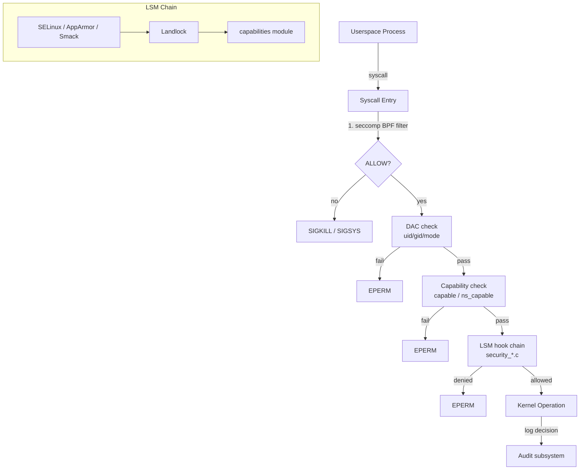
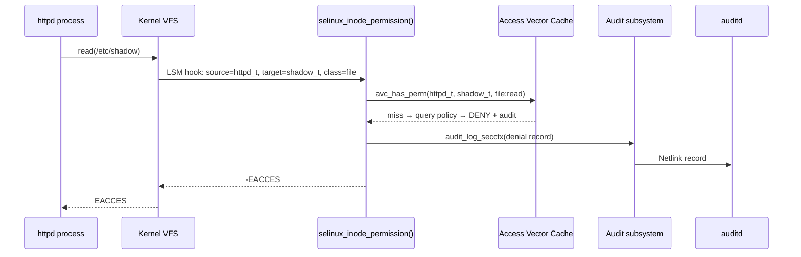

# Linux Security Subsystem

> 📘 Plain-language version: [[security-explained]]

## Overview

The Linux security subsystem is a defence-in-depth framework that enforces access control at every layer of the kernel stack. It combines a pluggable hook infrastructure ([[lsm-framework]]) with a set of orthogonal mechanisms — [[capabilities]], [[seccomp-bpf]], credentials, auditing, and kernel hardening — so that different policy models can be deployed without modifying core kernel code. No single mechanism is meant to operate alone; each layer reduces the blast radius of a compromise in a different dimension.

## Mental Model

Think of the security subsystem as a set of concentric gates around every sensitive kernel operation. The outermost gate is DAC (uid/gid permissions — always enforced). The next gate is [[capabilities]] (which fragment root's power into ~40 fine-grained privileges). Inside that sit the [[lsm-framework|LSM hooks]], where a mandatory access control module (SELinux, AppArmor, Smack) can apply its own policy. Finally, [[seccomp-bpf]] filters at the syscall boundary before a request even enters the kernel. A process must pass every gate it encounters — failing any one denies the operation.

## Architecture



Requests flow top-to-bottom: seccomp short-circuits first, then DAC, then capability checks, then the LSM hook chain. Each step can independently deny. The audit subsystem observes LSM decisions and records them for policy analysis.

---

## Core Components

### [[lsm-framework|LSM Framework]]

**Purpose** — The LSM framework is the extensibility backbone of the security subsystem. Without it, adding a new mandatory access control policy to the kernel would require patching core VFS, networking, and IPC code directly. LSM instead inserts lightweight call sites — hooks — at every security-sensitive kernel decision point; any registered module can attach logic to those hooks without touching the guarded code.

**How it works** — When the kernel needs to make a security decision (opening a file, creating a socket, forking a process), it calls a hook function such as `security_inode_permission()` or `security_socket_create()`. These wrapper functions are defined in `security/security.c` and internally iterate a per-hook linked list of registered handlers. Each active LSM has placed its own callback on that list via `security_add_hooks()`.

```c
/* Simplified from security/security.c */
int security_inode_permission(struct inode *inode, int mask)
{
    return call_int_hook(inode_permission, 0, inode, mask);
}
```

`call_int_hook` walks the hook list and stops at the first non-zero (denial) return; for hooks that aggregate results (e.g. `security_inode_getsecctx`) it instead merges all returns. The hook is looked up at runtime from a global `struct security_hook_heads` structure, one head per hook name.

Module registration happens during boot via `security_add_hooks()`. The ordering of modules in the list is controlled by `CONFIG_LSM` (a comma-separated string like `"lockdown,yama,selinux"`). The LSM core parses this string at startup and initialises each named module in order. Once boot is complete, the lists are frozen; hook removal is intentionally not supported (SELinux had a deprecated removal path that was eliminated).

**Security blobs** — Each LSM may need to store private state alongside kernel objects (inodes, tasks, sockets, credentials). Rather than adding a new opaque pointer to every major struct for every LSM, the kernel since v5.1 manages a single contiguous blob per object. Each LSM declares its storage need at registration time; the core allocates a combined blob and hands each LSM a fixed offset into it.

```c
struct lsm_blob_sizes {
    int     lbs_cred;
    int     lbs_file;
    int     lbs_inode;
    int     lbs_ipc;
    int     lbs_msg_msg;
    int     lbs_task;
    int     lbs_xattr_count;
    int     lbs_sock;
    int     lbs_superblock;
};
```

**Module stacking** — Historically only one "major" LSM (SELinux, AppArmor, or Smack) could be active because each needed its own per-object blob pointer and there was only one. Infrastructure-managed blobs removed that constraint for most object types by v5.1. The LSM_FLAG_EXCLUSIVE flag marks modules that still require exclusive use; once all such flags are removed from a module, it can stack freely. As of 2024 Linus Torvalds raised objections to the indirect-call patterns used by hook dispatch (they are affected by Spectre v2 branch-history injection), pushing back on full stacking in favour of using static calls — a debate still unresolved.

**Key struct**: `struct security_hook_list` (`include/linux/lsm_hooks.h`)
- `head` — pointer to the `struct hlist_head` for this hook in `security_hook_heads`
- `hook` — a union of all possible hook function signatures
- `lsm` — name of the owning module (for diagnostics and `/sys/kernel/security/lsm`)

**Key functions**:
- `security_add_hooks()` — called once per module at boot to register callbacks
- `security_inode_permission()` — canonical example of a hook wrapper
- `call_int_hook()` / `call_void_hook()` — internal list-iteration macros

**Config & flags**:
- `CONFIG_SECURITY` — enables the framework
- `CONFIG_LSM` — ordered list of modules to load
- `CONFIG_SECURITY_WRITABLE_HOOKS` — deprecated; historically allowed runtime hook changes
- `/sys/kernel/security/lsm` — reports active module list at runtime

---

### [[capabilities|Capabilities]]

**Purpose** — Capabilities decompose the all-or-nothing `root` privilege into ~40 discrete, independently grantable powers. A process that needs only the ability to bind to low-numbered ports should not also get the ability to load kernel modules, reboot the system, or bypass file permission checks. Without capabilities, any service needing one root-only operation had to run fully as uid 0.

**How it works** — The kernel stores five per-process capability bitmasks inside `struct cred`. At every privileged operation, the kernel calls `capable(CAP_X)` or the namespace-aware `ns_capable(ns, CAP_X)`, which checks whether `CAP_X` is set in the process's *effective* set.

The five sets have a precise relationship:
- **Permitted** is a superset ceiling — you cannot have effective caps you don't have permitted.
- **Effective** is what is actually checked during access decisions. A process can drop effective caps without losing permitted, and re-raise them later.
- **Inheritable** caps transfer across `execve()` only if the executed file also grants them.
- **Bounding** is a hard ceiling; once removed from bounding, a capability can never return, even via `setuid`.
- **Ambient** (added in v4.3) auto-inherit across `execve()` unconditionally, solving the problem of non-suid helper binaries that need certain caps from their parent.

File capabilities stored in the `security.capability` xattr extend this model to executables: a file can grant permitted or inheritable caps when executed, allowing non-suid binaries to acquire specific caps via `setcap(8)`.

```c
struct cred {
    /* ... */
    kernel_cap_t    cap_inheritable;
    kernel_cap_t    cap_permitted;
    kernel_cap_t    cap_effective;
    kernel_cap_t    cap_bounding;
    kernel_cap_t    cap_ambient;
    /* ... */
};
```

`CAP_SYS_ADMIN` is the notorious catch-all that covers ~40 unrelated operations (mounting filesystems, namespaces, ptrace, keyring access, quota, hostname changes). It is effectively a second root and should be avoided in capability profiles in favour of narrower caps.

**Key functions**:
- `capable(CAP_X)` — checks current task's effective set
- `ns_capable(ns, CAP_X)` — namespace-scoped check (important for containers)
- `cap_permitted_to_effective()` — raises effective from permitted
- `security_capset()` — LSM hook called on `capset(2)`

**Config & flags**:
- `CONFIG_MULTIUSER` — capability infrastructure requires this
- `prctl(PR_SET_NO_NEW_PRIVS, 1)` — prevents future `execve()` from gaining new privileges (blocks setuid and file cap escalation)
- `prctl(PR_CAP_AMBIENT, PR_CAP_AMBIENT_RAISE, CAP_X, ...)` — manages ambient set

---

### [[seccomp-bpf|seccomp BPF]]

**Purpose** — seccomp (Secure Computing Mode) gives a process the ability to self-restrict which system calls it may make. The BPF extension allows writing arbitrary filter programs rather than static allowlists, enabling fine-grained filtering based on syscall number *and* argument values. It is the primary mechanism by which container runtimes and browsers harden individual processes against exploitation.

**How it works** — A process installs a filter with `prctl(PR_SET_SECCOMP, SECCOMP_MODE_FILTER, &prog)`, where `prog` is a `struct sock_fprog` containing a classic BPF bytecode program. Before installation, the process must either hold `CAP_SYS_ADMIN` or have called `prctl(PR_SET_NO_NEW_PRIVS, 1)` — this prevents an unprivileged user from installing a filter and then `execve`-ing a setuid binary that would inherit the filter.

On every subsequent syscall, the kernel evaluates the filter against a `struct seccomp_data` snapshot:

```c
struct seccomp_data {
    int   nr;               /* syscall number */
    __u32 arch;             /* AUDIT_ARCH_* */
    __u64 instruction_pointer;
    __u64 args[6];          /* syscall arguments */
};
```

The filter returns a 32-bit value whose high 16 bits encode the action and whose low 16 bits encode data (e.g., an errno). Actions in decreasing priority:

| Action | Effect |
|---|---|
| `SECCOMP_RET_KILL_PROCESS` | Kill entire process group immediately |
| `SECCOMP_RET_KILL_THREAD` | Kill calling thread |
| `SECCOMP_RET_TRAP` | Send `SIGSYS` to the process |
| `SECCOMP_RET_ERRNO` | Return errno from the data field |
| `SECCOMP_RET_TRACE` | Notify a ptrace tracer |
| `SECCOMP_RET_LOG` | Allow and log the syscall |
| `SECCOMP_RET_ALLOW` | Allow the syscall |

Filters stack: each `prctl` call prepends a new filter to a linked list. All filters run for every syscall, and the highest-priority action among all filters wins. This allows frameworks like gVisor to install a base profile and then let child processes add further restrictions.

The `SECCOMP_RET_USER_NOTIF` action (added in v5.0) delivers the decision to a userspace supervisor process via a file descriptor. This enables seccomp-agent patterns where a privileged daemon can handle specific syscalls on behalf of a sandboxed process without giving that process elevated privilege.

**Key struct**: `struct seccomp_filter` (`kernel/seccomp.c`)
- `prog` — pointer to the JIT-compiled BPF program
- `prev` — linked list to the previous (less restrictive) filter

**Key functions**:
- `__secure_computing()` — hot path called on every syscall entry
- `seccomp_run_filters()` — iterates the filter chain
- `prctl(PR_SET_SECCOMP)` — userspace installation point

**Config & flags**:
- `CONFIG_SECCOMP` / `CONFIG_SECCOMP_FILTER` — enables classic and BPF modes
- `CONFIG_HAVE_ARCH_SECCOMP_FILTER` — per-arch BPF support flag

---

### [[selinux|SELinux]]

**Purpose** — SELinux provides Mandatory Access Control (MAC): a central policy governs every access decision, and even a root-privileged process is confined to the operations its security context permits. It was developed by the NSA and merged in v2.6.0 (2003), making it the oldest major LSM.

**How it works** — Every process and every kernel object (file, socket, IPC object) carries a *security context* — a label in the form `user:role:type:level`. The `type` component is the primary currency of the policy. SELinux's type enforcement engine stores allow rules of the form:

```
allow httpd_t httpd_content_t:file { read open getattr };
```

This rule says: a process labelled `httpd_t` may read, open, and stat files labelled `httpd_content_t`. Any operation not explicitly allowed is denied — the default is deny.

When `selinux_inode_permission()` fires (via the LSM hook), SELinux retrieves the process's SID (Security ID — an integer mapping of its context) and the inode's SID. It then looks up the (source SID, target SID, object class) tuple in the **Access Vector Cache (AVC)**, a hash table of recent decisions. Cache hits — typically ~97% — avoid expensive policy lookups. On a miss the policy decision engine traverses the policy database, caches the result, and returns the decision. Denials are sent to the audit subsystem.

```c
/* Simplified SELinux inode permission hook */
static int selinux_inode_permission(struct inode *inode, int mask)
{
    struct inode_security_struct *isec = inode->i_security;
    u32 sid = current_sid();
    return avc_has_perm(sid, isec->sid, isec->sclass,
                        file_mask_to_av(mask), &ad);
}
```

SELinux supports three modes: **Enforcing** (policy violations denied + logged), **Permissive** (violations logged but not denied — used for policy development), and **Disabled** (requires reboot to re-enable). The mode is set at boot via `enforcing=` on the kernel command line or toggled at runtime via `/sys/fs/selinux/enforce` (permissive↔enforcing only; disabling requires reboot).

Multi-Level Security (MLS) adds a `level` component to contexts enabling Bell-LaPadula confidentiality: processes at sensitivity `s0` cannot read files labelled `s1`, even with otherwise permissive type rules.

**Key struct**: `struct avc_entry` (internal to `security/selinux/avc.c`)
- `ssid` / `tsid` — source and target security IDs
- `tclass` — object class (file, socket, process, …)
- `avd` — cached `struct av_decision` (allow/audit bitmasks)

**Key functions**:
- `avc_has_perm()` — AVC lookup entry point
- `security_sid_to_context()` — translates SID to human-readable label
- `sel_write_enforce()` — `/selinuxfs/enforce` write handler

**Config & flags**:
- `CONFIG_SECURITY_SELINUX` / `CONFIG_SECURITY_SELINUX_BOOTPARAM`
- `selinux=0` / `enforcing=0` kernel command-line parameters
- `/etc/selinux/config` — distribution-level mode configuration

---

### [[apparmor|AppArmor]]

**Purpose** — AppArmor (Application Armor) provides path-based MAC using human-readable *profiles* rather than pervasive object labels. Its design goal is approachability: administrators write profiles in terms of file paths and capabilities rather than needing to understand system-wide label policies. It is the default LSM on Ubuntu and Debian-based distributions.

**How it works** — An AppArmor profile is a text file that enumerates what a confined program may do:

```
/usr/bin/firefox {
  /home/**  r,
  /tmp/**   rw,
  network inet stream,
  capability net_bind_service,
}
```

Profiles are compiled into a binary policy and loaded into the kernel via the `/sys/kernel/security/apparmor/` virtual filesystem interface. The kernel associates profiles with tasks using the `aa_profile` field in the task's security blob. At LSM hook sites, AppArmor retrieves the current task's profile, checks whether the requested operation matches any rule (path-based file rules, capability rules, network rules, signal rules), and denies if no rule matches.

Profile attachment uses pattern matching against the executable path. When a process `exec()`s a binary, AppArmor looks for a profile whose name matches the executed binary path and transitions the task into that profile (a *domain transition*). Administrators can also trigger transitions explicitly via change_hat or change_profile primitives.

AppArmor complements, rather than conflicts with, SELinux: a kernel can enable both, but because both carry LSM_FLAG_EXCLUSIVE for some object types, they currently cannot stack completely. The stacking work (tracked since v5.1) aims to remove this restriction.

**Key functions**:
- `aa_file_perm()` — path-based file permission check
- `aa_task_setrlimit()` — rlimit enforcement hook
- `/sys/kernel/security/apparmor/policy/` — profile management interface

**Config & flags**:
- `CONFIG_SECURITY_APPARMOR`
- `apparmor=0` kernel parameter to disable
- `aa-status`, `aa-enforce`, `aa-complain` userspace tools

---

### [[landlock|Landlock]]

**Purpose** — Landlock fills the gap between seccomp (syscall filtering) and LSM-based MAC (which requires root to configure). It lets *unprivileged* processes voluntarily restrict their own access to filesystem paths and network ports, creating application-level sandboxes without kernel policy or root involvement.

**How it works** — A process creates a *ruleset* via `landlock_create_ruleset(2)`, specifying which access rights it will govern (e.g., `LANDLOCK_ACCESS_FS_READ_FILE`). It then adds rules to the ruleset with `landlock_add_rule(2)` — each rule maps a file descriptor to a set of allowed operations. Finally, `landlock_restrict_self(2)` enforces the ruleset on the current task.

Once enforced, the ruleset becomes a *domain* attached to the task's credentials. Domains are immutable and stack: if a task's parent enforced a domain, the child inherits it and may only add further restrictions, never relax them. Rule lookup uses per-domain red-black trees keyed on inode pointer, making enforcement O(log n) in the number of rules.

Landlock differs from seccomp in targeting *objects* rather than *syscalls*: a `read(2)` on an allowed file goes through; a `read(2)` on a disallowed file fails, even though the syscall itself is not blocked. This is important for programs that legitimately use a wide range of syscalls but should only touch a narrow set of files.

**Key functions**:
- `landlock_create_ruleset(2)` — syscall to allocate a ruleset
- `landlock_add_rule(2)` — attach a rule (allow fd + rights)
- `landlock_restrict_self(2)` — enforce ruleset on calling task

**Config & flags**:
- `CONFIG_SECURITY_LANDLOCK` — enables Landlock (stackable, no exclusivity)
- Requires `LANDLOCK_CREATE_RULESET_VERSION` ABI negotiation

---

### [[credentials|Credentials]]

**Purpose** — The `struct cred` encapsulates everything the kernel needs to know about a task's identity and privilege: uid, gid, capability sets, security labels, and keyring references. Keeping all credentials in one immutable, reference-counted structure makes it possible to reason about privilege exactly and to perform credential changes atomically without locks visible to callers.

**How it works** — Every `task_struct` holds two credential pointers: `real_cred` (the actual identity — used for signal delivery) and `cred` (the effective identity — used for access checks). Both point into an RCU-protected `struct cred`. Because the struct is immutable after being committed, any code reading `current_cred()` with the RCU read lock held sees a stable snapshot.

To change credentials (e.g. during `setuid()`, `execve()` with setuid bit, or capability changes), the kernel calls `prepare_creds()` to duplicate the current struct, modifies the copy, validates it via LSM hooks (`security_prepare_creds()`), then atomically swaps the pointer with `commit_creds()`:

```c
struct cred *new = prepare_creds();
if (!new) return -ENOMEM;
new->uid = new_uid;
/* ... other modifications ... */
return commit_creds(new);   /* RCU-assigns task->cred, puts old */
```

If anything goes wrong before commit, `abort_creds(new)` drops the reference and frees. The old credential struct is freed only after an RCU grace period, ensuring any concurrent reader holding the RCU lock still has a valid pointer.

The `f_cred` field in `struct file` records the credentials of the *opener*. This prevents a privilege-escalation attack where a process opens a file with elevated privilege, drops privilege, and then passes the open file descriptor to code that assumes the file was opened with minimal privilege.

**Key struct**: `struct cred` (`include/linux/cred.h`)
- `uid`, `gid`, `euid`, `egid` — traditional UNIX identity
- `cap_permitted`, `cap_effective`, `cap_bounding`, `cap_inheritable`, `cap_ambient` — capability sets
- `security` — LSM blob pointer (opaque to the credentials layer)
- `user_ns` — user namespace for capability scoping

**Key functions**:
- `prepare_creds()` — allocate a mutable copy
- `commit_creds()` — atomic RCU swap
- `abort_creds()` — discard an uncommitted copy
- `current_cred()` — safe read of current task's creds (no lock needed)

---

### [[kernel-hardening|Kernel Hardening]]

**Purpose** — Kernel hardening is a collection of compile-time and runtime mitigations that raise the cost of exploiting kernel vulnerabilities. These are not access control mechanisms but rather safety nets: even if an attacker finds a memory-corruption bug, hardening features make it harder to turn that bug into arbitrary code execution or information disclosure.

**How it works** — Hardening operates at several levels:

*Address randomisation*: **KASLR** (Kernel Address Space Layout Randomisation) randomises the kernel's load address using entropy from RDRAND, CPU jitter, or RTC sources. An attacker who does not know the kernel base cannot hardcode return addresses or gadget locations in a ROP chain. KASLR is defeated by pointer-value leaks from `/proc` or uninitialized heap reads, which is why kernel pointer printing is controlled via `kptr_restrict`.

*Stack protection*: `CONFIG_STACKPROTECTOR_STRONG` has the compiler insert a randomised canary value before the return address of every function that takes the address of a local variable or has an array on the stack. `__stack_chk_fail()` triggers a kernel panic if the canary is corrupted before function return.

*Supervisor-mode protections*: **SMEP** (Supervisor Mode Execution Prevention) raises a fault if the kernel attempts to execute code in user-mode pages — defeating ret2user exploits. **SMAP** (Supervisor Mode Access Prevention) similarly faults on unexpected kernel reads/writes to user pages, preventing the kernel from being tricked into dereferencing a user-controlled pointer. ARM64 equivalents are PXN and PAN. The `stac`/`clac` instructions (or ARM64's `set_fs()` precursor) explicitly lower the SMAP barrier during legitimate `copy_to_user()` / `copy_from_user()` calls.

*Usercopy hardening*: `CONFIG_HARDENED_USERCOPY` validates that pointers passed to `copy_to_user()` / `copy_from_user()` reference valid slab objects and that copy sizes do not exceed allocation bounds, preventing heap over-read or overflow exploits that use the copy path as a primitive.

*Compiler hardening*: `CONFIG_FORTIFY_SOURCE` wraps `memcpy`, `strcpy`, etc. with bounds checks using `__builtin_object_size()`. `CONFIG_CFI_CLANG` (Control Flow Integrity via Clang) inserts a type-check before every indirect call — an attacker who overwrites a function pointer must also produce a pointer to a function with a compatible signature, or the kernel panics.

*Spectre/Meltdown mitigations*: **KPTI** (Kernel Page-Table Isolation) uses separate page-table roots for user and kernel mode, preventing Meltdown-class side-channel reads of kernel memory from userspace. Spectre v1 is mitigated with `array_index_nospec()` — a conditional-move that removes the speculative data dependency from array index operations. Spectre v2 uses retpolines (indirect calls via a controlled loop that prevents mis-speculation) and IBRS/IBPB MSR writes on context switches.

**Config & flags**:
- `CONFIG_STACKPROTECTOR_STRONG`, `CONFIG_SHADOW_CALL_STACK` (ARM64)
- `CONFIG_KASLR`, `CONFIG_RANDOMIZE_BASE`
- `CONFIG_PAGE_TABLE_ISOLATION` — KPTI
- `CONFIG_HARDENED_USERCOPY`, `CONFIG_FORTIFY_SOURCE`
- `CONFIG_CFI_CLANG` — Clang-only CFI
- `kernel.kptr_restrict` sysctl (0=allow, 1=hide from non-root, 2=always hide)

---

### [[linux-audit|Linux Audit]]

**Purpose** — The audit subsystem provides a tamper-resistant record of security-relevant kernel events. It supports compliance requirements (CISA, PCI-DSS, HIPAA, Common Criteria) by logging which user performed which privileged operation, when, and from where — information that DAC/MAC enforcement alone does not capture.

**How it works** — The kernel audit subsystem (`kernel/audit.c`) maintains a circular in-kernel event buffer. Audit records are generated from two sources: syscall wrappers that emit records on entry/exit (recording syscall number, pid, uid, return code, and argument summaries), and explicit `audit_log_*()` calls within subsystems (file access, credential changes, SELinux denials, etc.).

Records flow from the kernel buffer to the `auditd(8)` daemon via a Netlink socket (`NETLINK_AUDIT`). The daemon applies filter rules (set by `auditctl`) and writes matching records to disk. Because the channel is Netlink (a kernel→userspace socket), audit records cannot be silently dropped without a privilege-escalating attack on the daemon itself; the kernel tracks sequence numbers and reports gaps.

LSM modules integrate with audit via `audit_log_secctx()` — when SELinux denies an access, it calls into the audit path with the security context strings so the log entry names the exact policy labels involved.

**Config & flags**:
- `CONFIG_AUDIT`, `CONFIG_AUDITSYSCALL`
- `auditctl -w /etc/passwd -p wa -k passwd_changes` — example watch rule
- `/proc/sys/kernel/audit_backlog_limit` — ring buffer size

---

## How Components Interact

### Scenario 1 — A sandboxed browser renderer opens a file

1. The renderer calls `openat(2)`.
2. **seccomp** evaluates the filter installed by the browser's sandbox: `openat` is in the allowlist, so `SECCOMP_RET_ALLOW`.
3. The kernel performs **DAC**: checks the file's `mode` against the process's uid/gid. Passes.
4. **Capabilities**: no capability is needed for a normal file open.
5. **LSM hooks** (`security_inode_permission`): if AppArmor is active, it checks the browser renderer's profile — `openat` on `/tmp` is allowed, so passes.
6. **Landlock**: the renderer called `landlock_restrict_self()` with a ruleset permitting reads under `/tmp`. The inode is in the ruleset's red-black tree. Allowed.
7. The file descriptor is returned. The **audit** subsystem is not triggered (no audit rule for this path).

### Scenario 2 — A systemd service drops privileges

1. Service starts as root (uid=0, all capabilities permitted/effective).
2. `setuid(1000)` calls `commit_creds()`, replacing the `struct cred` atomically. The new cred has uid=1000 and, per POSIX rules, clears the effective and permitted capability sets.
3. The old `struct cred` is freed after an RCU grace period.
4. If the service also called `PR_SET_NO_NEW_PRIVS`, any future `execve()` on a setuid binary will not grant new privileges.
5. **SELinux** transitions the task's security context if the service's binary has a `type_transition` rule — the domain changes to the confined service type.
6. **Audit** logs the `setuid` event with old/new uid and the resulting capability sets.

### Scenario 3 — An SELinux denial triggers a policy audit



---

## Where It Fits in the Kernel

- **↑ Userspace**: security policy tools (`semanage`, `aa-status`, `auditctl`, `seccomp-bpf` via `prctl/seccomp(2)`), PAM modules, container runtimes (runc, containerd), and browsers all configure or observe this subsystem.
- **→ [[vfs|VFS]]**: Nearly every VFS operation (open, stat, rename, mount) has an LSM hook. The security subsystem is a mandatory observer of all filesystem access.
- **→ [[net|Networking]]**: Socket creation, bind, connect, accept, and packet sending/receiving all have security hooks. SELinux's network labelling (NetLabel, CIPSO) and AppArmor's network access rules plug into these.
- **→ [[scheduler|Scheduler]] / [[process-model|Process Model]]**: `fork()`, `exec()`, and credential changes all call security hooks. The credential subsystem is tightly coupled to `task_struct` lifecycle.
- **→ [[bpf|BPF]]**: seccomp uses classic BPF for filter programs. BPF itself has a security hook (`security_bpf()`) for access control on BPF program loading, and LSM BPF programs (added in v5.7) allow custom LSM hook implementations written in BPF.
- **← [[linux-audit|Audit]]**: Security decisions feed the audit subsystem; the audit subsystem does not itself make access control decisions.
- **↓ Hardware**: SMEP, SMAP, CET (shadow stack), PAN, PXN, and Spectre mitigation MSRs are all managed by the hardening layer.

## Design Decisions & Tradeoffs

**Hook-list vs. static dispatch** — The LSM framework originally used a single global `struct security_operations` vtable (one pointer per hook). This was replaced with per-hook linked lists to support stacking. The list approach enables multiple modules but introduces indirect function calls on every hook invocation — a concern that became acute with Spectre v2, since indirect branches are a primary speculative-execution attack surface. Torvalds' 2024 objection to the stacking design is rooted here: he prefers eliminating indirect calls entirely by statically linking one LSM at build time. The community has proposed static calls (`arch_static_call`) as a middle ground that preserves stacking without speculative-execution risk, but consensus has not been reached.

**Labels vs. paths** — SELinux uses type labels on every object; AppArmor uses filesystem paths. Labels survive renames and filesystem moves; paths are human-readable but can be fooled by symlinks or overly broad globs. The choice reflects different deployment philosophies: SELinux for high-assurance environments that require policy stability under administrative churn, AppArmor for distributions where policy authoring must be accessible to non-security experts.

**Kernel capabilities vs. POSIX capabilities** — Linux capabilities implement a superset of the withdrawn POSIX.1e draft. `CAP_SYS_ADMIN` is the canonical design regret: its scope grew organically over 25 years to cover nearly everything that did not warrant a new capability, making it effectively a second root. Modern efforts (Landlock, `io_uring` restrictions, namespace-specific capabilities) try to further decompose this into narrower grants.

**Seccomp strict vs. filter mode** — The original `SECCOMP_MODE_STRICT` allowed only `read`, `write`, `exit`, and `sigreturn` — used by cryptographic code that needed to provably avoid certain syscalls. Mode 2 (BPF filter) is vastly more flexible but also more complex; mistakes in a filter program can leave dangerous syscalls reachable. The `SECCOMP_RET_USER_NOTIF` action is a modern escape hatch that delegates complex decisions to a trusted supervisor process.

## How It Has Evolved

| Version | Change |
|---------|--------|
| 2.2 (1999) | POSIX capabilities introduced |
| 2.6.0 (2003) | LSM framework merged; SELinux shipped as first major module |
| 2.6.12 (2005) | `seccomp` Mode 1 (strict) merged |
| 3.5 (2012) | `seccomp` BPF filter mode merged |
| 3.17 (2014) | `SECCOMP_RET_USER_NOTIF` foundations |
| 4.3 (2015) | Ambient capabilities added |
| 5.1 (2019) | Infrastructure-managed LSM blobs; groundwork for stacking |
| 5.7 (2020) | Landlock LSM merged |
| 5.7 (2020) | BPF LSM: security hooks implementable in BPF |
| 5.12 (2021) | Landlock user-API (restrict_self syscall) merged |
| 5.15 (2021) | Landlock network access rules |
| 6.x (2022–) | Ongoing stacking work; Linus objection to indirect calls (2024) |

## Recent Development Activity

- **LSM stacking resolution**: The 2024 pushback from Torvalds on indirect-call semantics has led to proposals for using `static_call()` instead of function pointer lists. This is the primary open architectural debate in the security subsystem.
- **BPF LSM maturation**: Writing LSM hooks as BPF programs (attaching to `lsm/` tracepoints) has become a production pattern, used by projects like Tetragon (Cilium) and KubeArmor for kernel-level security observability and enforcement.
- **Landlock scoping expansion**: Landlock started with filesystem-only rules; network-port rules were added in v6.1. Inode-type rules and IPC restrictions are under active proposal.
- **io_uring security**: io_uring's async nature bypassed several security hooks in early implementations. Ongoing work adds proper LSM integration for io_uring operations.
- **Trusted Execution Environments (TEE)**: work on integrating Confidential Computing (AMD SEV, Intel TDX) with the security subsystem's credential and audit infrastructure.

## Further Reading

1. [LSM stacking and the future — LWN.net](https://lwn.net/Articles/804906/) — best overview of the blob management work
2. [A change in direction for security-module stacking? — LWN.net](https://lwn.net/Articles/970070/) — Torvalds' 2024 objection
3. [Still waiting for stackable security modules — LWN.net](https://lwn.net/Articles/912775/)
4. [Landlock LSM: Unprivileged sandboxing — LWN.net](https://lwn.net/Articles/698226/)
5. [kernel.org: LSM documentation](https://www.kernel.org/doc/html/latest/security/lsm.html)
6. [kernel.org: Credentials](https://www.kernel.org/doc/html/latest/security/credentials.html)
7. [kernel.org: seccomp filter](https://www.kernel.org/doc/html/latest/userspace-api/seccomp_filter.html)
8. [kernel.org: Landlock](https://www.kernel.org/doc/html/latest/security/landlock.html)
9. [kernel-internals.org: Capabilities](https://kernel-internals.org/security/capabilities/)
10. [kernel-internals.org: SELinux](https://kernel-internals.org/security/selinux/)

## LKML Highlights

- **LSM blob management** (`20190313134919.GA7018@jmorris.thinkhack.org`) — James Morris's initial patch series introducing infrastructure-managed blobs; the discussion reveals the back-and-forth over whether each LSM should own blob lifecycle or the framework should centralise it.
- **Landlock merge** — Mickaël Salaün's merge request for v5.7; the thread shows the design review debate around why a new LSM was preferable to extending seccomp with path-based semantics, and the decision to keep it strictly additive.
- **Torvalds' indirect-call objection (2024)** — Torvalds flagged that the multi-LSM hook lists are architecturally similar to the indirect-branch patterns that Spectre v2 branch-history injection exploits; the thread captures the tension between extensibility and security.
