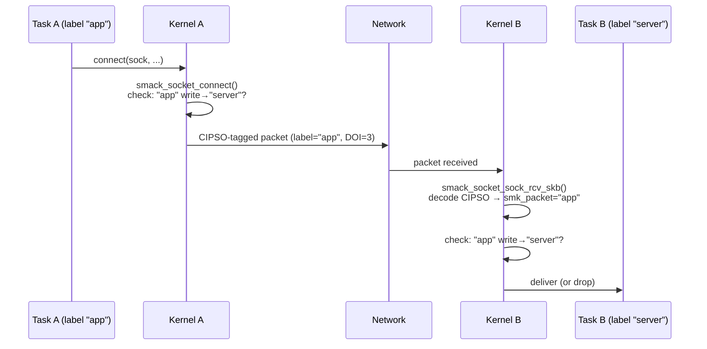

# Smack Subsystem

## Overview

Smack (Simplified Mandatory Access Control Kernel) is a Linux Security Module that enforces mandatory access control by attaching short ASCII labels to processes, files, sockets, and network packets and allowing access only when an explicit rule permits it. Created by Casey Schaufler and merged in Linux 2.6.25, Smack was designed as a deliberately simpler alternative to SELinux — trading policy expressiveness for ease of administration, making it attractive for embedded systems and products that need strong compartmentalisation without a full MAC policy compiler.

## Mental Model

Think of Smack as a postage stamp on every kernel object and a whitelist of permitted sender→receiver stamp pairs. A process carrying stamp "A" can only reach files, sockets, or other processes carrying stamp "B" if there is an explicit rule `A B rwxat` granting the desired access mode. Without a matching rule the access is silently denied. The entire policy fits in a small text file and the kernel enforces it from the moment init starts — no daemon required.

## Architecture

```mermaid
flowchart TD
    U[Userspace syscall] -->|open / connect / kill / …| VFS_NET[VFS / Net / IPC]
    VFS_NET -->|security_*()\nLSM hook| SMACK[smack_lsm.c\nhook dispatch]
    SMACK -->|smk_access()| RULES[Rule Table\nper-label RB-tree]
    SMACK -->|label lookup| LABELS[smack_known list\nglobal label registry]
    SMACK -->|audit| AUDIT[Linux Audit]
    SMACK -->|network labels| NETLABEL[NetLabel / CIPSO]
    NETLABEL -->|packet tagging| NET[Network Stack]
    ADMIN[Admin] -->|write rules,\nlabels, net policy| SMACKFS[smackfs\n/sys/fs/smackfs]
    SMACKFS --> RULES
    SMACKFS --> LABELS
    SMACKFS --> NETLABEL
```

Control flows top-to-bottom: every security-sensitive syscall hits an LSM hook in `smack_lsm.c`, which resolves the subject and object labels, looks up matching rules in the per-label RB-tree, and returns permit or deny. Administration happens through `smackfs`; network label propagation happens through the NetLabel subsystem.

---

## Core Components

### [[smack-label-registry]]

**Purpose** — Every Smack label has exactly one canonical `struct smack_known` entry. This shared registry means that two inodes carrying the same label text point to the same struct, making rule lookups a pointer comparison rather than a string comparison in the hot path.

**How it works** — When a label is first seen — whether loaded by an administrator via `smackfs/load2`, read from an xattr, or received in a CIPSO packet — `smk_import()` (`security/smack/smack_access.c`) is called. It hashes the label string, checks the global `smack_known_hash` table, and either returns the existing entry or allocates a new `struct smack_known`, initialises its `smk_netlabel` (the wire-format NetLabel representation), creates an empty per-label RB-tree for its access rules (`smk_rules`), and inserts the entry into both the hash table and the linked list `smack_known_list`. From that point forward, the label is identified by its pointer. Reserved labels (`*`, `^`, `_`, `?`, `@`) are pre-allocated at boot so they are always available without any administrator action.

**Key struct**: `struct smack_known` (`security/smack/smack.h`)
- `smk_known` — the label string (up to 255 chars, NUL-terminated)
- `smk_secid` — integer security ID used with the audit subsystem and SELinux interop interfaces
- `smk_netlabel` — pre-computed `netlbl_lsm_secattr` used when tagging outgoing packets; computed once on import
- `smk_rules` — RB-tree root of `struct smack_rule` nodes for rules where this label is the *subject*
- `smk_rules_lock` — `struct mutex` protecting concurrent rule insertions
- `list` / `smk_hashed` — list_head linking into `smack_known_list`; hlist_node for the hash bucket

**Key functions**:
- `smk_import()` — create or return a canonical label entry; called by xattr readers, rule parsers, and NetLabel callbacks
- `smk_find_entry()` — hash-based lookup without allocation; used in the access-check hot path

**Config & flags** — No specific Kconfig per label; the global label table is always present when `CONFIG_SECURITY_SMACK=y`.

---

### [[smack-access-engine]]

**Purpose** — The access engine is the central decision function that all LSM hooks funnel through. It answers one question: *does subject label S have mode M access to object label O?*

**How it works** — `smk_access()` (`security/smack/smack_access.c`) is called with pointers to two `struct smack_known` (subject, object) and a requested access bitmask. It first evaluates the hard-wired special-label rules in order:

1. If the subject is `"*"` (star) → always deny (a quarantine label: nothing escapes)
2. If the subject is `"^"` (hat) → allow read and execute, deny write
3. If the object is `"_"` (floor) → allow read and execute for everyone
4. If the object is `"*"` (star) → allow all access for everyone
5. If subject and object pointers are identical (same label) → allow

If none of the special rules match, the engine walks the subject's per-label RB-tree looking for a `struct smack_rule` node whose `smk_object` pointer equals the object label. If found, it ANDs the requested access against `smk_access` in the rule and returns 0 (permit) or `-EACCES`. If not found, it returns `-EACCES` — default deny.

`smk_curacc()` is a convenience wrapper over `smk_access()` for hooks that act on behalf of `current`; it also checks `CAP_MAC_OVERRIDE`, which allows a privileged process to bypass Smack rules. After `smk_access()` returns, an audit record is generated (if `CONFIG_AUDIT` is set) via `smack_log()`, recording subject, object, requested mode, and the denying function name.

**Key struct**: `struct smack_rule` (`security/smack/smack.h`)
- `smk_subject` — pointer to the subject `smack_known` entry
- `smk_object` — pointer to the object `smack_known` entry
- `smk_access` — bitmask of permitted modes (`MAY_READ`, `MAY_WRITE`, `MAY_EXEC`, `MAY_APPEND`, `MAY_TRANSMUTE`)
- `list` — RB-tree node embedded in subject's `smk_rules` tree

**Key functions**:
- `smk_access()` — core permit/deny logic; returns 0 or `-EACCES`
- `smk_curacc()` — `current`-context wrapper; checks `CAP_MAC_OVERRIDE` first
- `smack_log()` — generates `audit_log` entries for all access decisions

**Config & flags**:
- `CONFIG_SECURITY_SMACK_BRINGUP` — enables "unconfined" label interface; new objects temporarily receive unrestricted access while all decisions are logged, helping administrators build policy incrementally without a full lockdown
- `CONFIG_AUDIT` — enables audit logging of Smack decisions; without this, denials are silent

---

### [[smack-inode-and-task-labeling]]

**Purpose** — Every kernel object that participates in access control needs a label attached to it. Smack stores labels in two places: in extended attributes on persistent filesystem objects and in process credential blobs for tasks.

**How it works** — For *files and directories*, the label lives in the `security.SMACK64` xattr on the inode. When a file is opened, `smack_inode_init_security()` is called (during `security_inode_init_security()`); it sets the xattr to the creating task's current Smack label. Subsequent opens call `smack_inode_permission()`, which resolves the inode's label by reading `smack_inode(inode)->smk_inode` (already cached after first access) and calls `smk_curacc()`. If the filesystem is mounted on an untrusted superblock (`SMACK_SB_UNTRUSTED` flag in `superblock_smack.smk_flags`), the additional constraint that the inode label must match the filesystem root label is enforced — preventing privilege escalation through a hostile filesystem image.

For *processes*, the label is stored in `struct task_smack` inside the task's LSM credential blob (`cred->security`). On `fork()`, `smack_cred_prepare()` copies the parent's `task_smack`, preserving both `smk_task` (the active label) and `smk_forked` (a snapshot of the label at fork time). On `execve()`, `smack_bprm_committing_creds()` checks for `SMACK64EXEC` on the executable inode; if present, it transitions the process to the exec label, enabling role transitions without setuid.

The **transmute** mechanism further refines directory semantics: if a directory carries `SMACK64TRANSMUTE=TRUE` and the access rule includes the `t` (transmute) bit, new files created in that directory inherit the directory's label (`smk_transmute`) rather than the creator's label. This is critical for shared data directories where all producers should be identified with the directory's domain rather than their own.

**Key struct**: `struct inode_smack` (`security/smack/smack.h`)
- `smk_inode` — pointer to the file's canonical `smack_known` label
- `smk_task` — label of the task that created the inode (used for mmap checks)
- `smk_mmap` — label controlling which tasks may mmap this inode (from `SMACK64MMAP` xattr)
- `smk_flags` — bit flags: `SMK_INODE_INSTANT` (label cached), `SMK_INODE_TRANSMUTE` (directory is transmuting)

**Key struct**: `struct task_smack` (`security/smack/smack.h`)
- `smk_task` — the process's effective Smack label (used as subject in all access checks)
- `smk_forked` — snapshot of the label at fork time; used for exec-label transitions
- `smk_transmuted` — label to apply on transmute events
- `smk_rules` / `smk_rules_lock` — per-task temporary rules (used with `relabel-self`)
- `smk_relabel` — list of labels the process is allowed to self-relabel to

**Key functions**:
- `smack_inode_init_security()` — sets `SMACK64` xattr on new inodes to creator's label
- `smack_inode_permission()` — main file permission hook; resolves label and calls `smk_curacc()`
- `smack_bprm_committing_creds()` — handles exec-label transitions from `SMACK64EXEC`
- `smack_cred_prepare()` — copies `task_smack` on fork
- `smack_setprocattr()` — allows `CAP_MAC_ADMIN` to change `/proc/self/attr/current`

**Config & flags**:
- `SMACK64EXEC` xattr — if present on an executable, the task transitions to that label on exec
- `SMACK64MMAP` xattr — restricts which tasks can mmap the file (must have write access to this label)
- `SMACK64TRANSMUTE` xattr — marks a directory as transmuting; requires `t` bit in the access rule

---

### [[smackfs]]

**Purpose** — smackfs is the administration plane for Smack: a pseudo-filesystem (mounted at `/sys/fs/smackfs`) through which privileged processes load rules, inspect labels, configure network policies, and observe access decisions. Without smackfs, no policy beyond the defaults can be applied.

**How it works** — smackfs is registered as a `securityfs` subdirectory and populated at mount time by `smk_fill_super()` in `security/smack/smackfs.c`. Each file corresponds to one Smack policy interface:

- **`load2`** (write) — the primary rule-loading interface. A write of `"subject object rwxat"` is parsed, both labels are imported via `smk_import()`, and a `smack_rule` is inserted (or updated) in the subject's RB-tree. The older `load` interface is still present for compatibility but accepts shorter (7-char) labels.
- **`access2`** (write/read) — write a `"subject object mode"` triple; read back `"1"` (permitted) or `"0"` (denied). Used by policy-testing scripts and PAM modules to pre-validate rules.
- **`cipso2`** (write) — maps CIPSO DOI/category combinations to Smack labels; tells NetLabel what wire label corresponds to each Smack label. Replaces the older `cipso` interface.
- **`netlabel`** (write) — assigns fixed labels to specific IP addresses or CIDR ranges (format: `@IP/mask LABEL`). Packets from those addresses bypass CIPSO and are treated as carrying that label directly. Useful for labeling infrastructure nodes that do not support CIPSO.
- **`doi`** (read/write) — the CIPSO Domain of Interpretation number (default: 3). All CIPSO-aware peers must agree on the DOI.
- **`ambient`** (read/write) — the Smack label applied to unlabeled network packets received from peers that do not emit CIPSO headers.
- **`onlycap`** (read/write) — restricts Smack capability checks to processes carrying a specific label; used to harden systems where `CAP_MAC_ADMIN` should only be usable by a designated management domain.
- **`unconfined`** (write, requires `CONFIG_SECURITY_SMACK_BRINGUP`) — assigns a label "unconfined" access, bypassing access checks while logging them; used for bringup of new policy domains.
- **`relabel-self`** (write) — lists labels that a process is permitted to self-relabel to without `CAP_MAC_ADMIN`; allows session-manager–style transitions in user space.

All write operations require `CAP_MAC_ADMIN` except `relabel-self`, which enforces its own per-process allowlist.

**Key struct**: `struct superblock_smack` (`security/smack/smack.h`)
- `smk_root` — label of the filesystem root inode
- `smk_floor` — label readable by all tasks on this filesystem
- `smk_hat` — label that can read all other labels on this filesystem
- `smk_default` — label applied to unlabeled inodes when first accessed
- `smk_flags` — `SMACK_SB_INITIALIZED` and `SMACK_SB_UNTRUSTED` bits

**Key functions**:
- `smk_fill_super()` — creates the smackfs tree at mount time
- `smk_write_rules_list()` — iterates all `smack_known` entries and emits their rules; used by both `load2` and `load` read handlers
- `smk_parse_long_rule()` — parses a `"subject object mode"` triple from userspace

**Config & flags**:
- `CONFIG_SECURITY_SMACK_BRINGUP` — enables the `unconfined` and audit-all interfaces
- Mount options on filesystems: `smackfsdef=<label>`, `smackfsroot=<label>`, `smackfsfloor=<label>`, `smackfshat=<label>`, `smackfstransmute=<label>`

---

### [[smack-network-labeling]]

**Purpose** — Smack extends its label enforcement to the network by embedding labels in IP packets via CIPSO (Common IP Security Option) headers. Without network labeling, two processes in different Smack domains on different hosts could communicate freely, undermining cross-host MAC policy.

**How it works** — Smack delegates all wire-format label encoding to the kernel's [[netlabel]] subsystem. When a task sends a packet, the `smack_netlabel()` helper looks up the socket's outbound label (`socket_smack.smk_out`) and calls `netlbl_skbuff_setattr()` with the pre-computed `netlbl_lsm_secattr` from the label's `smk_netlabel` field. The NetLabel layer encodes this as a CIPSO Type 1 tag in the IPv4 options header (DOI 3 by default). For IPv6, CALIPSO (RFC 5570) is used via the same NetLabel interface.

On receipt, `smack_socket_sock_rcv_skb()` calls `netlbl_skbuff_getattr()` to decode the CIPSO/CALIPSO label from the incoming packet. That label is resolved to a `smack_known` entry (or the `ambient` label if absent) and stored in `socket_smack.smk_packet` for the duration of the connection. Subsequent `smack_socket_connect()` calls check that the connecting task has write access to the peer's label — because Smack models sending data as a *write* to the receiver.

For hosts that do not support CIPSO, the `netlabel` smackfs interface creates per-host label overrides: packets from `192.168.1.5` are always treated as carrying label `WEBSERVER`, regardless of what CIPSO says.

**Key struct**: `struct socket_smack` (`security/smack/smack.h`)
- `smk_out` — label applied to outgoing packets; defaults to the creating task's label
- `smk_in` — label used for access checks on incoming connections
- `smk_packet` — label decoded from the last received CIPSO/CALIPSO packet
- `smk_state` — `SMACK_NETLBL_UNSET`, `SMACK_NETLBL_UNLABELED`, or `SMACK_NETLBL_LABELED`

**Key struct**: `struct smk_net4addr` / `struct smk_net6addr` (`security/smack/smack.h`)
- `smk_host` / `smk_mask` — IPv4/IPv6 address and mask for this host override
- `smk_label` — pointer to the `smack_known` entry for this host

**Key functions**:
- `smack_netlabel()` — applies the outbound Smack label to a socket via NetLabel
- `smack_socket_connect()` — checks that current has write access to the peer label before connection
- `smack_socket_sock_rcv_skb()` — decodes incoming CIPSO label and verifies access
- `smk_netlbl_mls()` — converts a Smack label string into a NetLabel MLS attribute for CIPSO encoding

**Config & flags**:
- `smackfs/doi` — CIPSO DOI value (default 3); all hosts must agree
- `smackfs/ambient` — label for unlabeled packets (default `"_"`)
- `smackfs/cipso2` — maps CIPSO categories to Smack labels
- `smackfs/netlabel` — per-host IP label overrides

---

## How Components Interact

### Process opens a file

1. Task calls `open(2)`. VFS calls `security_inode_permission()`.
2. `smack_inode_permission()` resolves the inode's `smk_inode` label (from xattr, cached in `inode_smack`).
3. It calls `smk_curacc()` with the task's `task_smack.smk_task` as subject and the inode label as object.
4. `smk_access()` walks the subject's `smk_rules` RB-tree; if a rule grants the requested mode, returns 0. Otherwise `-EACCES`.
5. If denied and `CONFIG_AUDIT` is set, `smack_log()` emits an audit record.

### Network connection between two Smack domains



### New file in a transmuting directory

1. Task creates `file.txt` inside directory `/data` (which has `SMACK64=shared` and `SMACK64TRANSMUTE=TRUE`).
2. `smack_inode_init_security()` is called for the new inode.
3. It checks the parent directory's `inode_smack.smk_flags` for `SMK_INODE_TRANSMUTE`.
4. Because the directory transmutes, the rule `"creator_label shared rwxat"` is checked for the `t` (transmute) bit.
5. If the bit is set, the new file's `SMACK64` is set to `"shared"` (the directory's label) rather than `"creator_label"`.

---

## Where It Fits in the Kernel

- **↑ Userspace**: administrators write rules to `/sys/fs/smackfs/load2`; processes read their label from `/proc/self/attr/current`; privileged processes may change their label via the same file with `CAP_MAC_ADMIN`
- **→ [[lsm-framework]]**: Smack registers ~100 LSM hooks via `security_add_hooks(smack_hooks, …)` at `init_smack()` time; LSM dispatches every `security_*()` call through these hooks
- **→ [[netlabel]]**: Smack uses NetLabel for CIPSO and CALIPSO packet tagging; all label-to-wire encoding is delegated there, keeping Smack independent of protocol details
- **→ [[linux-audit]]**: denied (and optionally permitted) access decisions are emitted as audit events; SELinux and Smack share the audit subsystem but use different AVC record formats
- **← [[vfs]]**: VFS calls `security_inode_permission()`, `security_inode_init_security()`, and `security_inode_setxattr()` on every inode operation; Smack's hooks intercept these
- **← [[credentials]]**: task labels are embedded in `struct cred` via the LSM blob mechanism; Smack accesses them through `smack_cred()` helpers
- **↓ Hardware**: no direct hardware dependency; network labeling is protocol-level and works over any IP transport

---

## Design Decisions & Tradeoffs

**Simplicity over expressiveness** — Smack deliberately excludes role-based access control, type enforcement, and policy transitivity. An administrator can write a complete policy for a small system in a single text file. The cost is that Smack cannot express the fine-grained domain transitions that SELinux supports; a process cannot change its label except via exec or explicit `relabel-self`. This makes Smack unsuitable for general-purpose desktop use but ideal for single-purpose appliances and embedded products.

**Label equality, not hierarchy** — Labels are opaque strings compared only for equality. There is no notion of a label being "more privileged" than another; the entire ordering is in the rules. This prevents policy surprises from implicit inheritance but means every permission must be stated explicitly — no shorthand for "label A dominates all labels below it."

**Pointer identity in the hot path** — By maintaining a global canonical registry of `smack_known` structs, rule lookups compare pointers rather than strings. This makes `smk_access()` fast even with hundreds of labels, at the cost of a small allocation on first label import.

**CIPSO as the network transport** — Smack chose CIPSO (an IETF draft from 1992 that never reached RFC status) rather than designing a new protocol. CIPSO is a de facto standard in trusted OS history, already supported by NetLabel, and understood by some commercial hardware. The tradeoff is that CIPSO is IPv4-only; IPv6 requires CALIPSO (RFC 5570), which Smack added later via the same NetLabel abstraction.

**No daemon required** — Unlike SELinux, which benefits from the `auditd` and `semanage` toolchain, Smack needs only the `attr` command and basic shell scripts to operate. This simplicity was deliberate for embedded targets where a userspace policy daemon is a security liability in itself.

---

## How It Has Evolved

**Linux 2.6.25 (2008)** — Smack merged into mainline as the second LSM (after SELinux), ending the debate about whether LSM should remain in the kernel. Initial features: label files via xattr, per-task labels, basic rule engine, smackfs.

**Linux 2.6.30** — Added netlabel/CIPSO integration, enabling cross-host Smack policy for the first time.

**Linux 3.x series** — Transmute semantics stabilised; `SMACK64EXEC` and `SMACK64MMAP` xattrs added, enabling exec-label transitions and mmap controls. The `load2`/`access2`/`cipso2` interfaces replaced the original 7-character-limited variants.

**Linux 4.x series** — `relabel-self` interface added, allowing session-manager–style label transitions without `CAP_MAC_ADMIN`. IPv6/CALIPSO support added via NetLabel. Bringup mode (`CONFIG_SECURITY_SMACK_BRINGUP`) introduced.

**Linux 5.x series** — LSM stacking work began; Smack (alongside SELinux and AppArmor) was identified as an "exclusive" LSM that must be modified before full stacking is possible. Infrastructure-managed blobs for task credentials and inodes were adopted. Per-network-namespace smackfs mounts were discussed but not yet landed.

**Ongoing** — Casey Schaufler continues submitting patches for LSM stacking; the remaining blocker for running Smack alongside SELinux simultaneously is the shared `/proc/PID/attr/current` and `SO_PEERSEC` interfaces that can only represent one LSM's context at a time.

---

## Recent Development Activity

The LSM stacking effort is the dominant active thread. The `lsm=smack,bpf` kernel parameter syntax (introduced in 5.15) allows selecting which LSMs run, but the "exclusive" constraint still prevents Smack and SELinux from co-existing. Patches to lift this constraint continue to be proposed by Schaufler and reviewed by Paul Moore (SELinux maintainer).

Smack is the primary security module in Tizen OS, so Samsung and Intel contributions tend to focus on embedded and IoT scenarios: per-namespace policy, lighter-weight audit paths, and integration with cgroupsv2 for containerised workloads.

---

## Further Reading

1. [Smack for simplified access control — LWN.net (2007)](https://lwn.net/Articles/244531/)
2. [SMACK meets the One True Security Module (merge debate) — LWN.net](https://lwn.net/Articles/252562/)
3. [LSM stacking and the future — LWN.net (2020)](https://lwn.net/Articles/804906/)
4. [Smack — official kernel documentation](https://www.kernel.org/doc/html/latest/admin-guide/LSM/Smack.html)
5. [The Smack Project — Casey Schaufler's site](https://schaufler-ca.com/)
6. [Security:SmackConfiguration — Tizen Wiki](https://wiki.tizen.org/Security:SmackConfiguration)
7. [NetLabel CIPSO/IPv4 Protocol Engine — kernel.org](https://www.kernel.org/doc/html/v5.4/netlabel/cipso_ipv4.html)

## LKML Highlights

- **[PATCH] Version 7 (2.6.23) Smack** (`lwn.net/Articles/254354/`) — The v7 submission that landed in 2.6.25; discussion revealed the core tension between Smack's simplicity goals and SELinux developers' preference for a single unified MAC framework. Linus's ruling that "LSM stays in" settled the matter.
- **Smack: label for task objects** (`lwn.net/Articles/415590/`) — Introduced per-task Smack labels independent of the filesystem; enabled exec transitions and task-to-task access control, significantly expanding Smack's policy expressiveness beyond file MAC.
- **[PATCH v1 00/22] LSM: Full security module stacking** (`lkml.kernel.org/lkml/CAJHCu1+Je_eTdvmobUU3ZqeeWDqH5v8gGUTqEF0XWVP4TyxbFg@mail.gmail.com/`) — Schaufler's stacking series; documents the remaining obstacles (shared `/proc/attr`, `SO_PEERSEC`, CIPSO single-label constraint) that prevent Smack and SELinux from running simultaneously.
