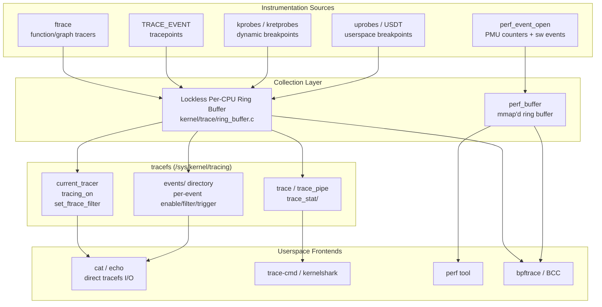

# Linux Kernel Tracing Subsystem

> 📘 Plain-language version: [[tracing-explained]]

## Overview

The Linux kernel tracing subsystem provides a layered set of mechanisms for observing, measuring, and debugging kernel behaviour at runtime — from static developer-placed annotations to dynamic runtime probes and hardware performance counters. It was designed around the principle that different observability needs require different tools, so the infrastructure is deliberately pluralistic: ftrace, perf, kprobes, tracepoints, uprobes, and BPF all coexist and share a common low-level foundation (tracefs and the lockless ring buffer).

## Mental Model

Think of the tracing subsystem as a **telescope with interchangeable lenses**: the ring buffer and tracefs form the mounting hardware that never changes, while ftrace (function call recording), tracepoints (structured annotations), kprobes (dynamic breakpoints), uprobes (user-space probes), and perf events (hardware counters) are lenses you swap in depending on what you need to see. Higher-level tools like `trace-cmd`, `perf`, and `bpftrace` are the eyepiece — they interpret what comes through the optics. The key insight is that adding a new lens doesn't require rebuilding the mount; all lenses ultimately route events into the same per-CPU ring buffers under tracefs.

## Architecture

Instrumentation sources inject events into per-CPU ring buffers. tracefs exposes control knobs (left side) and data output (right side). Frontends consume via file reads, mmap, or BPF helpers.

---

## Core Components

### [[tracefs and the Ring Buffer]]

**Purpose** — Every traced event needs a place to land without stopping the CPU to take locks. tracefs is the control-plane filesystem; the lockless ring buffer is the data-plane store they share.

**How it works** — At boot, tracefs mounts (usually at `/sys/kernel/tracing`; for historical reasons it also appears under `/sys/kernel/debug/tracing` via debugfs automount). The filesystem exposes a hierarchy of control files: `current_tracer` selects which tracer plugin is active; `tracing_on` is a binary gate that can halt ring-buffer writes without removing instrumentation (useful for "arm now, fire later" workflows); `set_ftrace_filter` restricts which functions are probed; the `events/` tree contains one subdirectory per tracepoint subsystem, each with `enable`, `filter`, and `trigger` files.

The ring buffer underneath is per-CPU to eliminate false sharing. Each CPU has a linked list of page-sized sub-buffers. Three cursors track state: `tail_page` (where the next write lands), `commit_page` (last fully completed write), and `head_page` (next page the reader can consume). Writers use `cmpxchg` (compare-and-exchange) to advance `tail_page` atomically — no spinlock on the write path. If a higher-priority context (interrupt or NMI) preempts a writer mid-write, it starts its own nested write; the preempted writer is blocked from committing until the nested write completes, maintaining a stack discipline. Readers swap their private scratch page with `head_page` using a second `cmpxchg`, meaning reads are also lock-free. The `overwrite` option controls what happens when the buffer is full: by default the oldest sub-buffer is recycled; with overwrite disabled, new events are dropped.

Trace instances under `instances/` create independent ring buffers sharing the same event definitions, enabling multiple concurrent tracing sessions without interference — essential when a tool like `trace-cmd` needs to record one workload without contaminating a system-wide trace.

**Key struct**: `struct ring_buffer_per_cpu` (`kernel/trace/ring_buffer.c`)
- `tail_page` — pointer to the page being written; advanced atomically by writers
- `commit_page` — the last fully committed page; readers may consume up to here
- `head_page` — the next page available for reader consumption (swapped atomically)
- `reader_page` — the consumer's private scratch page, swapped in to avoid copying

**Key functions**:
- `ring_buffer_lock_reserve()` — acquires space in the tail page for one event (lockless on the fast path)
- `ring_buffer_unlock_commit()` — marks the event committed; advances `commit_page` if no nested writes are pending
- `ring_buffer_consume()` — reads and removes one event from the head page

**Config & flags** — `CONFIG_TRACING`, `CONFIG_RING_BUFFER`. `buffer_size_kb` (tracefs) sets per-CPU buffer size. `overwrite` option controls full-buffer policy.

---

### [[ftrace]]

**Purpose** — ftrace gives developers and operators an always-available, zero-overhead-when-idle function tracer that requires no kernel recompilation to enable. Its plugin architecture lets specialized tracers (latency, scheduling, hardware) share the same infrastructure.

**How it works** — When `CONFIG_DYNAMIC_FTRACE=y` (the common case), the compiler inserts a call to `__fentry__` at the very start of every traceable function. At boot, the tracing core walks the `__mcount_loc` section — a table of all patched sites — and replaces each `call __fentry__` with a 5-byte NOP using `text_poke_bp()`. This breakpoint-based patching avoids sending an IPI to stop all other CPUs: it briefly installs an INT3 at the site, lets all CPUs drain through the handler, then patches the full 5-byte NOP, then removes the INT3. The result is genuine zero overhead when no tracer is active.

When the `function` tracer is enabled via `echo function > /sys/kernel/tracing/current_tracer`, the patching reverses: NOPs become calls to `ftrace_caller`, a small assembly stub that looks up the per-function `ftrace_ops` list and invokes registered callbacks. Each callback receives the calling function's IP and its caller's IP. The `function_graph` tracer hooks both entry and return: on entry it injects `return_to_handler` as the return address by manipulating the stack frame, and on return it records the timestamp delta, building a call-tree with per-function durations marked with `+` (>10 µs), `!` (>100 µs), `#` (>1 ms).

Latency tracers (`irqsoff`, `preemptoff`, `wakeup`) work by enabling function tracing only when the kernel enters a latency-sensitive window, then recording the longest observed window with its full call trace. This makes ftrace the go-to tool for diagnosing scheduling and interrupt latency.

The advanced histogram engine allows in-kernel aggregation: a trigger like `hist:keys=pid:vals=bytes_req:sort=bytes_req.descending` counts bytes requested per PID entirely in-kernel, producing a sorted table with zero per-event userspace round-trips. Synthetic events combine two probes (e.g. syscall entry and exit) to derive a latency metric and fire it as a new event, enabling correlated multi-event analysis.

**Key struct**: `struct ftrace_ops` (`include/linux/ftrace.h`)
- `func` — the callback invoked at each traced site
- `flags` — controls per-call behaviour (save regs, recursion guard, RCU-safe)
- `trampoline` — optional per-ops trampoline, used by BPF `fentry`/`fexit` programs

**Key functions**:
- `ftrace_set_filter()` — restricts the set of traced functions (glob patterns, module scope)
- `register_ftrace_function()` — installs an `ftrace_ops` callback
- `ftrace_graph_entry()` / `ftrace_graph_return()` — graph tracer entry/exit hooks
- `text_poke_bp()` — safe live-patching primitive used during NOP⟷call transitions

**Config & flags** — `CONFIG_FUNCTION_TRACER`, `CONFIG_FUNCTION_GRAPH_TRACER`, `CONFIG_DYNAMIC_FTRACE`, `CONFIG_HAVE_FENTRY`. tracefs: `current_tracer`, `set_ftrace_filter`, `set_ftrace_notrace`, `set_ftrace_pid`, `max_graph_depth`, `tracing_thresh`.

---

### [[Tracepoints and TRACE_EVENT]]

**Purpose** — Kprobes can attach to any instruction but break silently when a function is renamed or inlined. Tracepoints are developer-placed, named hooks with a stable ABI contract: their names and field layouts are treated as userspace-visible interfaces and must not change across kernel versions.

**How it works** — A tracepoint is declared with `DECLARE_TRACE(name, proto, args)` (or the richer `TRACE_EVENT` macro) in a header. At the call site the developer writes `trace_name(args...)`, which expands to an inline function that checks a `static_key` (a jump-label). When no probe is attached the key is false and the CPU executes a single unconditional NOP — no branch, no cache miss. When a probe is attached, the jump-label infrastructure patches that NOP to a short forward jump into the probe body using `text_poke()`, with all the same BP-based safety as ftrace patching.

`TRACE_EVENT` is richer than `DECLARE_TRACE`: it also declares how to serialise event data into the ring buffer (`TP_STRUCT__entry` + `TP_fast_assign`) and how to print it (`TP_printk`). This metadata appears as a `format` file under `events/<subsystem>/<event>/`, which userspace tools parse to decode binary ring-buffer entries without hardcoding field offsets — a lesson learned from the powertop incident of 2.6.39 (see Design Decisions).

The ABI stability guarantee means that tracing a production system with a tool built against one kernel version continues to work on a newer kernel, provided the tracepoint names and fields are unchanged. Adding new fields to an event requires explicit ABI coordination.

**Key struct**: `struct tracepoint` (`include/linux/tracepoint.h`)
- `key` — a `static_key_false` jump-label; the sole overhead when disabled
- `funcs` — `__rcu` pointer to array of registered probe callbacks
- `name` — the stable string name exposed to userspace

**Key functions**:
- `tracepoint_probe_register()` — attaches a callback to a named tracepoint
- `trace_foo()` — generated by TRACE_EVENT; the call site that fires the probe
- `trace_foo_enabled()` — check if the tracepoint is active (uses the static_key directly, no branch when disabled)

**Config & flags** — `CONFIG_TRACEPOINTS`. Enable individual events via tracefs `events/<subsys>/<event>/enable` or `set_event`. Filters use boolean expressions over event fields (`pid == 1234`, `bytes > 1024`).

---

### [[kprobes and kretprobes]]

**Purpose** — Tracepoints cover developer-chosen locations; kprobes cover everywhere else. A kprobe can attach to any kernel instruction at runtime without recompilation, making it the primary tool for ad-hoc debugging of uninstrumented kernel code.

**How it works** — To register a kprobe at address `addr`, the kernel copies the original instruction(s) to a private "out-of-line" buffer, then overwrites the first byte at `addr` with INT3 (0xCC on x86). When the CPU reaches INT3, the trap handler calls `kprobe_int3_handler()`, which identifies the kprobe from the address, calls the registered `pre_handler`, then sets the trap flag (TF) in EFLAGS and restores the original instruction bytes so the CPU single-steps the real instruction. After single-stepping, a debug trap fires and the `post_handler` is called; INT3 is restored and normal execution resumes. The INT3 → single-step sequence imposes roughly 0.5–1.0 µs overhead per hit (reduced to ~0.07 µs with `CONFIG_OPTPROBES=y`, which replaces INT3 with a longer direct jump when the probe region is safe to patch).

Kretprobes capture function returns by installing a kprobe at the function entry that saves the real return address and replaces it with a trampoline address. When the function returns, the CPU jumps to the trampoline, which calls the return handler and then jumps to the saved return address. The `maxactive` field pre-allocates `kretprobe_instance` objects (one per concurrent invocation) so the return handler is never dropped due to resource exhaustion.

The key fragility of kprobes is compiler opaqueness: if a function is inlined, the kprobe at its nominal address probes only the out-of-line copy (if any); calls from inlined sites are invisible. If a function is renamed between kernel versions, the kprobe silently does nothing. These limitations are why tracepoints are preferred for production monitoring.

Since Linux 5.0, `fprobe` provides a higher-level abstraction over kprobes that attaches to function names (resolved at registration time) and is safe for production use in BPF programs.

**Key struct**: `struct kprobe` (`include/linux/kprobes.h`)
- `addr` — the kernel virtual address being probed
- `pre_handler` — called before the probed instruction executes (receives `pt_regs`)
- `post_handler` — called after single-stepping completes
- `ainsn` — the saved original instruction(s) and their out-of-line copy

**Key functions**:
- `register_kprobe()` — validates and activates a kprobe; replaces instruction with INT3
- `unregister_kprobe()` — restores the original instruction and frees resources
- `register_kretprobe()` — installs entry kprobe that hijacks the return address
- `kprobe_int3_handler()` — the x86 INT3 trap handler that dispatches to pre_handler

**Config & flags** — `CONFIG_KPROBES`, `CONFIG_OPTPROBES` (jump optimisation), `CONFIG_KRETPROBES`. Kprobe events exposed to tracefs via `kprobe_events` file; syntax: `p:label func+offset reg=%reg`.

---

### [[uprobes and USDT]]

**Purpose** — kprobes reach deep into kernel code; uprobes bring the same breakpoint-based dynamic instrumentation to userspace binaries without modifying source or using `ptrace`. USDT (User Statically Defined Tracepoints) adds the stability of tracepoints to userspace programs.

**How it works** — A uprobe is registered against an (inode, file-offset) pair rather than a kernel address. When the kernel maps a page containing a probed offset, it applies a copy-on-write clone of that page and patches offset 0 of the uprobe with INT3. When any process executing that binary hits the INT3, the page fault/trap handler identifies the uprobe, calls the registered handler, single-steps the original instruction (from a separate trampoline page mapped in the process's address space), and resumes. Because the patched page is CoW, the probe affects all processes executing that binary simultaneously with a single registration.

USDT markers are placed by developers using `DTRACE_PROBE` macros (originally from DTrace) or equivalent SystemTap/libstapsdt annotations. These compile to NOP instructions with ELF note metadata in a `.probes` section describing the probe name and argument types. At tracing time, `bpftrace`, `perf`, or `trace-cmd` reads the ELF notes, resolves each NOP to a file offset, and registers uprobes at those offsets. Since the NOP is already present in the binary, enabling the probe is purely a kernel-side CoW patch — the application binary ships ready to be traced with no runtime overhead when inactive.

**Key struct**: `struct uprobe` (`kernel/events/uprobes.c`)
- `inode` / `offset` — identifies the probe site in the filesystem
- `consumers` — list of registered callbacks
- `arch_uprobe.insn[]` — saved original bytes for single-stepping

**Key functions**:
- `uprobe_register()` — registers a consumer at (inode, offset); triggers CoW patching of all existing mappings
- `handle_trampoline()` — called on INT3 trap inside a user process; dispatches to consumers and executes the trampoline

**Config & flags** — `CONFIG_UPROBES`, `CONFIG_UPROBE_EVENTS`. Userspace interface: `uprobe_events` in tracefs, syntax `p:<label> /path/to/binary:0xoffset`.

---

### [[perf Events]]

**Purpose** — ftrace and kprobes record discrete events; perf events sample the system statistically and read hardware performance counters, which is the right model for CPU profiling, cache analysis, and performance regression detection.

**How it works** — The `perf_event_open()` syscall creates one event descriptor per counter. The caller passes a `perf_event_attr` struct specifying the event type (hardware PMU counter, software counter, tracepoint, kprobe, or uprobe), the sample period or frequency, and what data to capture per sample (IP, PID, TID, call stack, register state). The kernel allocates a `struct perf_event` bound to a task or CPU context.

For hardware PMU events, the kernel programs the hardware performance monitoring unit registers (Intel: `IA32_PERFEVTSELx` / `IA32_PMCx`; ARM: PMCCNTR / PMEVCNTR). When the counter overflows (i.e. reaches the sample period), the PMU fires an NMI. The NMI handler captures the saved instruction pointer and (if requested) unwinds the call stack, then writes a sample record to the `perf_buffer` — a mmap-shared ring buffer between kernel and userspace, with kernel-controlled `data_head` and user-controlled `data_tail`.

Because hardware has a fixed number of PMU counters (e.g. Intel Skylake: 4 general-purpose + 3 fixed-function), the kernel multiplexes more events than counters exist by time-slicing them during context switches. Each event records the time it was actually scheduled vs. total elapsed time, enabling `perf` to extrapolate counts to "estimated total" values.

For call-stack unwinding, `perf` supports three modes: frame-pointer unwinding (fast, unreliable without `-fno-omit-frame-pointer`), DWARF-based stack unwinding (accurate but copies up to 65535 bytes of stack per sample into the ring buffer), and LBR (Last Branch Record, an Intel hardware feature that records the last 16–32 taken branches with zero sampling overhead).

**Key struct**: `struct perf_event` (`include/linux/perf_event.h`)
- `attr` — `perf_event_attr` with user configuration (type, config, sample_period, sample_type)
- `hw` — `hw_perf_event` with hardware counter state (reg index, prev_count)
- `rb` — the `perf_buffer` (mmap ring buffer) used to deliver samples
- `overflow_handler` — called on counter overflow (NMI context)

**Key functions**:
- `perf_event_open()` — syscall entry point; validates attr, allocates event, binds to PMU
- `perf_event_overflow()` — NMI handler path; samples IP and stack, writes to ring buffer
- `perf_pmu_sched_task()` — saves/restores counter state on context switch (multiplexing)

**Config & flags** — `CONFIG_PERF_EVENTS`, `CONFIG_HW_PERF_EVENTS`, `CONFIG_PERF_EVENTS_INTEL_UNCORE`. `perf_event_paranoid` sysctl controls who can create system-wide events (0=all, 1=normal users, 2=root only, -1=no restrictions). `kptr_restrict` affects whether kernel addresses appear in samples.

---

## How Components Interact

### Scenario 1: `bpftrace -e 'kprobe:tcp_sendmsg { @bytes = hist(arg2); }'`

1. **bpftrace** resolves `tcp_sendmsg` to a kernel address via `/proc/kallsyms`.
2. It loads a BPF program and calls `bpf(BPF_PROG_LOAD, ...)` with type `BPF_PROG_TYPE_KPROBE`.
3. The BPF subsystem calls `register_kprobe()`. The kprobe layer copies the instruction at `tcp_sendmsg+0`, patches INT3, and records the kprobe.
4. When a process calls `tcp_sendmsg`, the CPU hits INT3 → `kprobe_int3_handler()` → the BPF JIT'd program runs in kernel context.
5. The BPF program reads `arg2` (the `size_t len` argument) from the saved `pt_regs` and updates a BPF histogram map — entirely in-kernel, no ring-buffer event written.
6. When bpftrace exits, `unregister_kprobe()` restores the original instruction.

### Scenario 2: `perf record -F 99 -ag -- sleep 10`

1. `perf` calls `perf_event_open()` for a software `PERF_COUNT_SW_CPU_CLOCK` event at 99 Hz, with `PERF_SAMPLE_CALLCHAIN` and `PERF_SAMPLE_TID`.
2. The kernel programs a high-resolution timer to fire every ~10 ms; on each timer interrupt it writes a sample to the per-CPU `perf_buffer`.
3. The sample contains the interrupted IP and a DWARF-unwound call chain (if `-g dwarf` was passed, up to 65535 bytes of raw stack is copied and unwound offline).
4. `perf report` reads the mmap'd ring buffer, symbolises addresses via the build-id cache, and produces a flame graph.

### Scenario 3: Tracing `sched_switch` via ftrace event

1. `echo 1 > /sys/kernel/tracing/events/sched/sched_switch/enable` activates the tracepoint by calling `tracepoint_probe_register()`, which patches the jump-label NOP to a branch.
2. On every context switch, `__schedule()` calls `trace_sched_switch(prev, next, prev_state)`. The jump-label branch is now taken; the TRACE_EVENT framework serialises PID, comm, priority fields into the ring buffer via `TP_fast_assign`.
3. `cat /sys/kernel/tracing/trace_pipe` reads the ring buffer and pretty-prints events using the `TP_printk` format string.

---

## Where It Fits in the Kernel

- **↑ Userspace**: `perf_event_open()` syscall (perf events); `/sys/kernel/tracing/` filesystem reads/writes (ftrace, tracepoints, kprobes, uprobes); BPF `bpf()` syscall attaches to any instrumentation source.
- **→ BPF subsystem**: ftrace fentry/fexit hooks (since 5.5) are backed by the ftrace dynamic patching machinery; BPF programs attached to kprobes and uprobes go through the kprobes/uprobes infrastructure; BPF map access from tracing programs uses the same ring buffer paths.
- **→ Scheduler**: wakeup/wakeup_rt/wakeup_dl latency tracers instrument `try_to_wake_up()` and context-switch paths; `PERF_COUNT_SW_CONTEXT_SWITCHES` is generated by `perf_sw_event()` calls inside the scheduler.
- **→ Memory Management**: `kmem` tracepoints (`kmem_cache_alloc`, `mm_page_alloc`) fire from slab/page allocator hot paths; `perf_event_mmap()` is called on every `mmap()` to notify perf of new mappings for call-chain symbolisation.
- **← All subsystems**: every kernel subsystem that wants observability places `trace_<subsys>_<event>()` calls at interesting points; the tracing layer imposes zero overhead on these when no tool is active.
- **↓ Hardware**: perf events drives PMU hardware (Intel PEBS, AMD IBS, ARM PMU); Intel PT (Processor Trace) streams compressed instruction traces via the Intel Trace Hub.

---

## Design Decisions & Tradeoffs

**Per-CPU ring buffers over a global buffer** — A single global ring buffer would be simpler but requires locking. Per-CPU buffers allow lockless writes at the cost of out-of-order timestamps across CPUs (mitigated by per-event TSC timestamps, but not eliminated). The additional complexity of the `cmpxchg`-based page management was accepted as necessary for production use at scale.

**NOP patching for zero inactive overhead** — Both ftrace and tracepoints patch NOP/JMP bytes using `text_poke_bp()` rather than runtime conditionals. This means disabled instrumentation has literally zero CPU overhead — not "near zero" but zero. The tradeoff is write-protect complexity and the need for BP-based patching on SMP to keep all CPUs consistent during the transition.

**Tracepoints as stable ABI** — After the powertop incident in 2.6.39 (a tracepoint field removal broke a userspace tool that had hardcoded the binary layout), the kernel community declared tracepoint names and fields as userspace-visible ABI. This was Linus Torvalds' pragmatic recognition that "if an interface can be used without parsing the description, we're stuck with it." The cost is that adding new fields to an existing tracepoint requires ABI review and may require keeping the old format alongside the new one.

**Multiple tracing tools over one unified tool** — Steven Rostedt explicitly rejected the premise that fragmentation (ftrace vs. perf vs. LTTng vs. bpftrace) is a problem: "diversity brings innovation." Instead of forcing convergence, the community built shared libraries (`libtraceevent`, `libperf`, `libftrace`) that let all tools share kernel infrastructure while keeping distinct UX and analytics capabilities.

**kprobes fragility is a feature, not a bug** — The deliberate lack of stability guarantee for kprobe probe points keeps the compiler and kernel developers free to rename, inline, and reorganise code. Tracepoints are the stable API; kprobes are the escape hatch. BPF `fentry`/`fexit` (backed by ftrace, resolved at attach time) provides a middle ground: name-based attachment with zero overhead when detached.

---

## How It Has Evolved

- **2.6.27 (2008)** — ftrace introduced by Steven Rostedt; initial function tracer with per-CPU ring buffer (still locked at this point).
- **2.6.28** — `TRACE_EVENT` macro system introduced; tracepoints become structured with format metadata.
- **2.6.29** — function_graph tracer added (Frédéric Weisbecker); measures per-function execution duration.
- **2.6.31** — `perf_event_open()` syscall added (Ingo Molnár, Peter Zijlstra); hardware PMU counters exposed via a uniform interface.
- **2.6.32** — Ring buffer becomes lockless (Rostedt's `cmpxchg`-based algorithm).
- **3.5 (2012)** — uprobes added; userspace binary instrumentation without ptrace.
- **4.1 (2015)** — `hist` triggers added: in-kernel histogram aggregation eliminates per-event userspace round-trips.
- **4.7 (2016)** — BPF attaches to uprobes; USDT probes become addressable via BPF programs.
- **4.17 (2018)** — Synthetic events: two-probe correlated events enable in-kernel latency measurement.
- **5.0 (2019)** — `fprobe` introduced as a higher-level kprobe abstraction safe for BPF.
- **5.5 (2020)** — BPF `fentry`/`fexit` hooks use ftrace's dynamic patching, offering near-zero overhead BPF function tracing.
- **5.14 (2021)** — `user_events` added: userspace applications can define and fire tracepoints into the kernel ring buffer.
- **6.1+ (ongoing)** — Continued work on `fprobe` to replace kprobes in BPF, unified tracing libraries (`libtraceevent`, `libperf`), and ARM CoreSight hardware tracing integration.

---

## Recent Development Activity

- **Unified tracing libraries** (`libtraceevent`, `libperf`, `libftrace`) — ongoing effort to let all tracing tools share kernel infrastructure without duplicating parsers.
- **`user_events`** — maturing interface for userspace-defined tracepoints; allows applications to fire events into tracefs ring buffers with kernel-side filtering.
- **fprobe over kprobes for BPF** — the BPF community is migrating `BPF_PROG_TYPE_KPROBE` programs to use fprobe-backed attachment, which is safer and has lower overhead.
- **Ring buffer memory mapping** (tracefs `buffer_mmap`) — work to expose the ring buffer as a directly mmap-able region, reducing copy overhead for high-rate event consumers.
- **Intel PT / CoreSight integration** — hardware instruction tracing backends being integrated into the perf subsystem for full execution recording at low overhead.

---

## Further Reading

1. [A lockless ring-buffer (LWN, 2009)](https://lwn.net/Articles/340400/) — Rostedt's original proposal with algorithm walkthrough
2. [Ftrace, perf, and the tracing ABI (LWN, 2012)](https://lwn.net/Articles/442113/) — the powertop incident and the ABI stability decision
3. [Unifying kernel tracing (LWN, 2019)](https://lwn.net/Articles/803347/) — Rostedt on shared libraries and the "diversity is fine" argument
4. [Kernel analysis with bpftrace (LWN, 2019)](https://lwn.net/Articles/793749/) — practical bpftrace patterns built on kprobes/tracepoints
5. [Lockless Ring Buffer Design](https://www.kernel.org/doc/html/latest/trace/ring-buffer-design.html) — official design doc with cmpxchg algorithm detail
6. [ftrace documentation](https://www.kernel.org/doc/html/latest/trace/ftrace.html) — comprehensive reference for tracefs control files
7. [Kprobes documentation](https://www.kernel.org/doc/html/latest/trace/kprobes.html) — INT3 mechanism, kretprobe design, limitations
8. [Introduction to Linux Tracing (Elena Zannoni, LF 2021)](https://events.linuxfoundation.org/wp-content/uploads/2022/10/elena-zannoni-tracing-tutorial-LF-2021.pdf) — broad conceptual overview

---

## LKML Highlights

- **`[GIT PULL][for 2.6.32] lockless ring buffer`** — Rostedt's pull request introducing the cmpxchg-based lockless algorithm; thread debated correctness of the lock-free protocol since no formal proof existed (see LWN discussion at lwn.net/Articles/336961/).
- **Tracepoint ABI thread (2011)** — The powertop breakage triggered a long thread where Linus said "if you made an interface that can be used without parsing the interface description, we're stuck with the interface" — establishing tracepoint field layouts as stable ABI.
- **Unifying kernel tracing (2019)** — Rostedt's LPC talk thread where he argued that creating shared libraries rather than one unified tool is the correct path forward for the tracing ecosystem.
