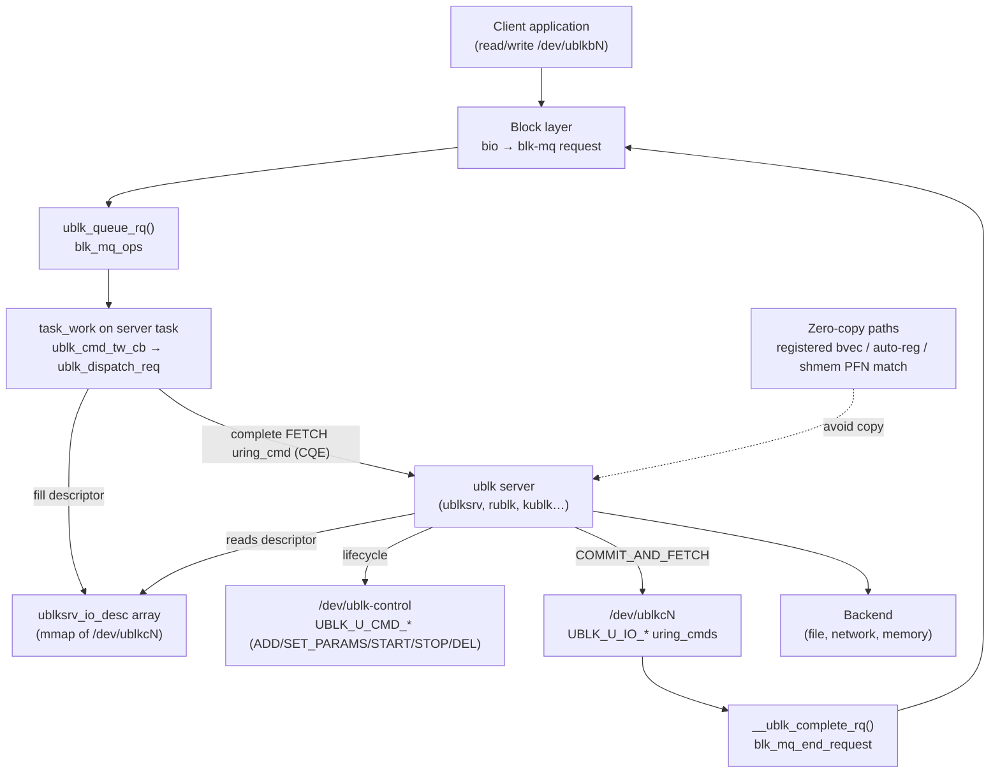
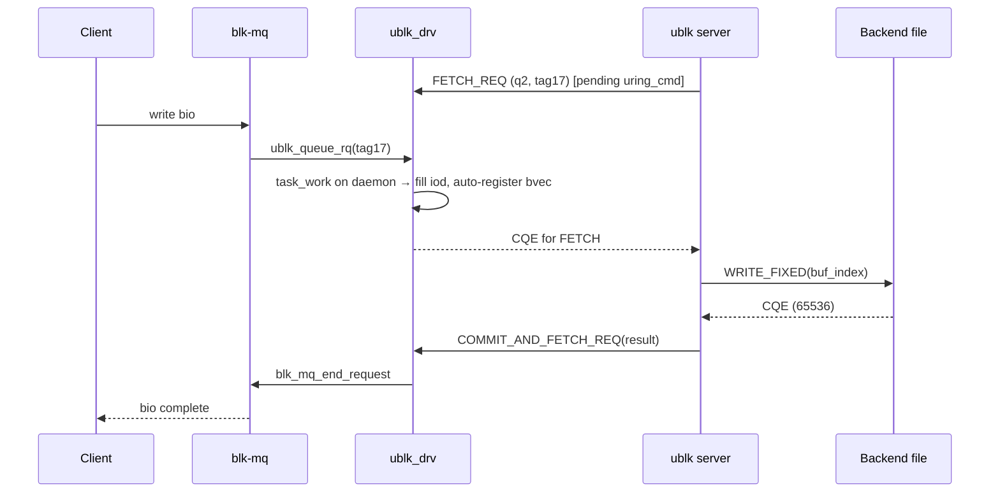

# ublk Subsystem

## Overview

ublk ("userspace block") lets a normal process implement a block device. The kernel driver `ublk_drv` registers a real blk-mq disk, `/dev/ublkbN`. Every request that reaches it is handed to a userspace *ublk server* over [[io_uring]] passthrough commands. The server does the actual work (read a qcow2 image, talk to an NBD or Ceph server, compress, replicate) and then commits the result back. Ming Lei (Red Hat) wrote it, and it was merged in **6.0** (2022). Its goal is to move virtual block drivers such as loop, nbd and qcow2 out of the kernel without the performance loss that earlier userspace-block schemes had.

## Mental Model

ublk is **a blk-mq driver whose "hardware" is a userspace process, and io_uring is the doorbell and completion queue**. Think of the ublk server as an NVMe controller. It posts empty "fetch" commands the way a controller keeps receive slots open. When the block layer has a request, the kernel completes one of those commands, which rings the doorbell. The server processes the request and then posts a "commit-and-fetch" command, which returns the completion and re-arms the slot in one step. A per-queue shared-memory array of I/O descriptors works like the controller's submission-queue entries. Most of the subsystem's later work is about making the data movement across that boundary cheaper (copy → user-copy → zero-copy → shared-memory zero-copy) or the doorbell cheaper (per-I/O → batched).

## Architecture

Read it left to right as a request's journey. The client's I/O becomes a blk-mq `struct request`. `ublk_queue_rq()` cannot talk to userspace directly from the submitting context, so it schedules task_work on the server thread that owns the I/O slot. That callback fills the slot's `ublksrv_io_desc` and completes the pending FETCH uring_cmd, and the server sees a CQE. The server does the I/O against its backend and sends COMMIT_AND_FETCH, which ends the block request and re-arms the slot. Separately, `/dev/ublk-control` carries the control-plane commands that create, configure, start, stop and recover devices.

---

## Core Components

### [[ublk-control-plane]]

**Purpose** — Creates and tears down ublk devices and negotiates their shape (queues, depth, limits, features). Without it there would be no way to turn a userspace promise ("I will serve I/O") into a `gendisk`.

**How it works** — A server opens the misc device `/dev/ublk-control` and sends uring_cmds on it. `UBLK_U_CMD_ADD_DEV` carries a `ublksrv_ctrl_dev_info` (queue count, depth, max I/O buffer size, feature `flags`). `ublk_ctrl_add_dev()` allocates the `struct ublk_device`, its `ublk_queue`s and a `blk_mq_tag_set`, and creates the per-device char device `/dev/ublkcN`. From then on the device info is frozen. `UBLK_U_CMD_SET_PARAMS` supplies `struct ublk_params`: block sizes, max sectors, discard, zoned, DMA alignment, segment and integrity limits. The server then opens `/dev/ublkcN`, `mmap()`s the descriptor arrays and posts one FETCH per tag on every queue. Finally `UBLK_U_CMD_START_DEV` runs `ublk_ctrl_start_dev()`, which waits until every queue reports ready (`nr_queue_ready`), applies the parameters and calls `add_disk()`, which creates `/dev/ublkbN`. Teardown is `STOP_DEV` (remove the disk, fail/cancel I/O) followed by `DEL_DEV` (free the char device and ID). `UBLK_U_CMD_GET_FEATURES` lets a server discover which `UBLK_F_*` bits the running kernel supports. Later additions cover live resize (`UPDATE_SIZE`), quiesce (`QUIESCE_DEV`), a non-destructive `TRY_STOP_DEV` that fails if the disk is still open, and shared-memory buffer registration (`REG_BUF`/`UNREG_BUF`).

With `UBLK_F_UNPRIVILEGED_DEV`, a non-root user can create devices. Every control command then carries the char-device path (`dev_path_len`), and the kernel checks permissions on that path. Device ownership (`owner_uid`/`owner_gid`) is recorded, and the device can only be driven from where it was created.

**Key struct**: `struct ublksrv_ctrl_dev_info` (`include/uapi/linux/ublk_cmd.h`)
- `nr_hw_queues`, `queue_depth` — blk-mq shape; up to 4096 queues × 4096 tags
- `max_io_buf_bytes` — largest single I/O the server buffers
- `flags` — negotiated `UBLK_F_*` feature bits
- `state` — `UBLK_S_DEV_DEAD/LIVE/QUIESCED/FAIL_IO`
- `ublksrv_pid`, `owner_uid`, `owner_gid` — who serves and owns the device

**Key functions**:
- `ublk_ctrl_uring_cmd()` — dispatcher for all `/dev/ublk-control` commands
- `ublk_ctrl_add_dev()` / `ublk_ctrl_start_dev()` / `ublk_ctrl_stop_dev()` / `ublk_ctrl_del_dev()`
- `ublk_ch_mmap()` — maps the read-only per-queue descriptor buffer into the server

**Config & flags** — `CONFIG_BLK_DEV_UBLK`; module parameter `ublks_max` (limit on unprivileged devices, default 64); `UBLK_F_UNPRIVILEGED_DEV`, `UBLK_F_CMD_IOCTL_ENCODE`, `UBLK_F_UPDATE_SIZE`, `UBLK_F_QUIESCE`, `UBLK_F_SAFE_STOP_DEV`, `UBLK_F_NO_AUTO_PART_SCAN`, `UBLK_F_ZONED`.

---

### [[ublk-io-command-protocol]]

**Purpose** — The data-plane handshake that moves each block request to the server and its completion back, using io_uring uring_cmds instead of syscalls per request.

**How it works** — Each I/O slot is identified by `(q_id, tag)`, and the blk-mq tag of the request maps 1:1 to it. The server primes every slot with `UBLK_U_IO_FETCH_REQ` (a `struct ublksrv_io_cmd` with a buffer address). The driver marks the slot's `struct ublk_io` `UBLK_IO_FLAG_ACTIVE` and keeps the `io_uring_cmd` pending, so it is a long-lived, cancelable [[uring-cmd-passthrough|uring_cmd]]. When blk-mq calls `ublk_queue_rq()`, the driver stores the request and schedules [[io-uring-task-work|task_work]] on the slot's daemon task. The reason is that copying into the server's buffer and completing its CQE must happen in the server's own context. There, `ublk_dispatch_req()` fills the slot's `ublksrv_io_desc` (op, flags, start sector, length, buffer address). For a WRITE it copies the data into the server buffer (`ublk_map_io()`), then completes the FETCH command via `io_uring_cmd_done()`, and the slot becomes `UBLK_IO_FLAG_OWNED_BY_SRV`. The server reads the descriptor from its mmap, does the work, and submits `UBLK_U_IO_COMMIT_AND_FETCH_REQ` with the result. `__ublk_complete_rq()` copies READ data back (`ublk_unmap_io()`), ends the request, and re-arms the slot with the same command.

Originally each queue had one daemon thread. Since 6.16 (`UBLK_F_PER_IO_DAEMON`) each slot can have its own daemon, namely the task that issued its FETCH, which decouples server threads from hardware queues. `UBLK_F_NEED_GET_DATA` adds an extra round trip for WRITEs, so a server can supply the buffer only after it has seen the request.

**Key struct**: `struct ublk_io` (`drivers/block/ublk_drv.c`)
- `flags` — `ACTIVE`, `OWNED_BY_SRV`, `NEED_GET_DATA`, `AUTO_BUF_REG`, `CANCELED`
- `cmd` / `req` — the pending uring_cmd, or the request while the server owns it
- `task` — the daemon task allowed to issue commands for this slot
- `ref`, `task_registered_buffers` — lifetime counting for zero-copy buffers

**Key functions**:
- `ublk_queue_rq()` / `ublk_queue_rqs()` — blk-mq entry points
- `ublk_cmd_tw_cb()` → `ublk_dispatch_req()` → `ublk_complete_io_cmd()` — delivery to the server
- `ublk_ch_uring_cmd()` / `ublk_ch_uring_cmd_local()` — handle FETCH, COMMIT_AND_FETCH, NEED_GET_DATA, (UN)REGISTER_IO_BUF
- `__ublk_complete_rq()` — finish the block request

**Config & flags** — `UBLK_F_PER_IO_DAEMON`, `UBLK_F_NEED_GET_DATA`, `UBLK_F_URING_CMD_COMP_IN_TASK`, `UBLK_F_IO_DESC_SIZE`.

---

### [[ublk-batch-io]]

**Purpose** — Removes the one-uring_cmd-per-I/O overhead and the fixed slot-to-thread binding by delivering and committing many I/Os per command (7.0).

**How it works** — With `UBLK_F_BATCH_IO` the per-I/O commands are replaced by three per-queue commands. `UBLK_U_IO_PREP_IO_CMDS` primes a set of tags in one go. `UBLK_U_IO_FETCH_IO_CMDS` is a **multishot** uring_cmd that uses io_uring [[provided-buffer-rings|buffer selection]]: each time requests arrive, the driver writes a batch of tags into a selected buffer and posts one CQE. `UBLK_U_IO_COMMIT_IO_CMDS` commits results for many tags at once, as an array of `ublk_elem_header {tag, buf_index, result}` entries. Inside the kernel, `ublk_batch_queue_rq()` pushes tags into a per-queue `evts_fifo` (writers take `evts_lock`, the single reader is lockless). `ublk_batch_dispatch()` drains it into whichever fetch command is currently `active_fcmd`. Several server tasks may each post a fetch, and whichever is active takes the next batch, so load balances across tasks automatically. Measured gain: about +12% IOPS on 16-job copy workloads (37.8M → 42.4M) and +3.7% with zero-copy.

**Key struct**: `struct ublk_batch_io` (uapi)
- `q_id`, `nr_elem`, `elem_bytes` — which queue, how many elements, element stride
- `flags` — `UBLK_BATCH_F_HAS_BUF_ADDR`, `HAS_ZONE_LBA`, `AUTO_BUF_REG_FALLBACK`

**Key functions**: `ublk_batch_queue_cmd()`, `ublk_batch_dispatch()`, `__ublk_batch_dispatch()`, `ublk_batch_commit_io()`, `ublk_batch_cancel_queue()`.

**Config & flags** — `UBLK_F_BATCH_IO`; mutually exclusive with the per-I/O command set on a device.

---

### [[ublk-zero-copy]]

**Purpose** — Stops copying every byte between the client request's pages and the server's buffers, which is ublk's main remaining overhead compared with an in-kernel driver.

**How it works** — ublk has four data paths, in the order they appeared.
1. **Copy (default).** The driver copies into or out of a server-supplied buffer during dispatch/commit (`ublk_copy_user_pages()`).
2. **User copy (`UBLK_F_USER_COPY`, ~6.5).** No buffer address is exchanged. The server calls `pread()`/`pwrite()` on `/dev/ublkcN` at an offset that encodes `(q_id, tag)`, so it copies only what it needs, when it needs it.
3. **Registered-buffer zero-copy (`UBLK_F_SUPPORT_ZERO_COPY`, 6.15).** The server sends `UBLK_U_IO_REGISTER_IO_BUF`. The driver calls `io_buffer_register_request()`, which installs the request's bvec into a [[registered-resources|registered-buffer]] slot of an io_uring. Fixed-buffer reads/writes against the backend then move data straight between the client's pages and the backend. `UNREGISTER_IO_BUF` drops it, and a release callback (`ublk_io_release()`) keeps the request alive until the last user is gone. `UBLK_F_AUTO_BUF_REG` (6.16) makes the kernel register the buffer at an index the server chose before dispatch and unregister it on commit, which saves two uring_cmds per I/O. `UBLK_F_BUF_REG_OFF_DAEMON` (6.17) allows registration from any task.
4. **Shared-memory zero-copy (`UBLK_F_SHMEM_ZC`, 2026).** When the client and server `mmap` the same memfd or hugetlbfs file, the server registers it with `UBLK_U_CMD_REG_BUF`. The kernel pins the pages and indexes their PFNs in a maple tree. For an `O_DIRECT` client I/O whose pages match, the descriptor carries a buffer index and offset instead of copied data (`UBLK_IO_F_SHMEM_ZC`). Non-matching I/O falls back to copying.

**Key struct**: `struct ublk_auto_buf_reg` (uapi) — `index` (slot in the sparse buffer table), `flags` (`UBLK_AUTO_BUF_REG_FALLBACK`), passed in `sqe->addr`.

**Key functions**: `ublk_register_io_buf()`, `ublk_daemon_register_io_buf()`, `ublk_auto_buf_register()`, `ublk_io_release()`, `ublk_try_buf_match()`; io_uring side `io_buffer_register_bvec()` / `io_buffer_unregister_bvec()`.

**Config & flags** — `UBLK_F_USER_COPY`, `UBLK_F_SUPPORT_ZERO_COPY` (requires `CAP_SYS_ADMIN`), `UBLK_F_AUTO_BUF_REG`, `UBLK_F_BUF_REG_OFF_DAEMON`, `UBLK_F_SHMEM_ZC`.

---

### [[ublk-user-recovery]]

**Purpose** — Keeps `/dev/ublkbN` alive while its server crashes and restarts, so a server crash doesn't look like a disk being ripped out.

**How it works** — When the server exits, all its uring_cmds are cancelled (`ublk_uring_cmd_cancel_fn()`), and the release of `/dev/ublkcN` runs `ublk_ch_release_work_fn()`. Without recovery flags the device is torn down and I/O fails. With `UBLK_F_USER_RECOVERY`, requests the server had not yet seen are requeued, requests it owned are failed, and the device enters `UBLK_S_DEV_QUIESCED`, so new I/O queues up rather than erroring. `UBLK_F_USER_RECOVERY_REISSUE` requeues owned requests too, which suits idempotent backends. `UBLK_F_USER_RECOVERY_FAIL_IO` instead enters `UBLK_S_DEV_FAIL_IO` and errors new I/O until recovery. A new server process issues `UBLK_U_CMD_START_USER_RECOVERY`, re-opens the char device, re-posts FETCHes and then `END_USER_RECOVERY`, at which point queues are unquiesced and requeued I/O flows to the new daemon. `UBLK_F_QUIESCE` (6.16) reuses the same machinery for planned server upgrades.

**Key struct**: `struct ublk_device` (`drivers/block/ublk_drv.c`)
- `dev_info.state` — `LIVE` → `QUIESCED`/`FAIL_IO` → `LIVE`
- `ublksrv_tgid`, `mm` — identity of the current daemon; reset on release
- `mutex`, `cancel_mutex` — serialise control commands against cancellation

**Key functions**: `ublk_ch_release_work_fn()`, `ublk_abort_queue()`, `__ublk_fail_req()`, `ublk_ctrl_start_recovery()`, `ublk_ctrl_end_recovery()`, `ublk_ctrl_quiesce_dev()`.

**Config & flags** — `UBLK_F_USER_RECOVERY`, `UBLK_F_USER_RECOVERY_REISSUE`, `UBLK_F_USER_RECOVERY_FAIL_IO`, `UBLK_F_QUIESCE`.

---

## How Components Interact

**Bringing up a qcow2 device.** The server sends `ADD_DEV` with 4 queues × 128 depth and flags `AUTO_BUF_REG | PER_IO_DAEMON | USER_RECOVERY` ([[ublk-control-plane]]), then `SET_PARAMS` with 512-byte logical blocks and discard limits. It spawns worker threads, each with its own io_uring and a sparse buffer table. Each thread posts `FETCH_REQ` for the tags it will own ([[ublk-io-command-protocol]]). `START_DEV` blocks until all slots are ready, then `add_disk()` exposes `/dev/ublkb0` and udev scans partitions.

**A 64 KiB write.** The filesystem submits a bio. blk-mq allocates tag 17 on hctx 2 and calls `ublk_queue_rq()`, which schedules task_work on the thread that fetched `(2,17)`. In that thread's context `ublk_dispatch_req()` fills descriptor `(2,17)` and, because `AUTO_BUF_REG` is on, registers the request's bvec at the index the server chose ([[ublk-zero-copy]]). It then completes the FETCH CQE. The server maps the guest offset to a qcow2 cluster and issues `IORING_OP_WRITE_FIXED` on the image file with that buffer index. The data goes from the client's pages to the image file with no copy. On the write's CQE the server sends `COMMIT_AND_FETCH_REQ(result=65536)`, the kernel unregisters the buffer, ends the request and re-arms the slot.

**Server crash mid-flight.** The server segfaults with tags 3 and 9 owned. io_uring teardown cancels every pending FETCH. `ublk_ch_release_work_fn()` waits for buffer references to drain, then (with `USER_RECOVERY`) fails or requeues those requests and marks the device `QUIESCED` ([[ublk-user-recovery]]). Client I/O now waits in blk-mq instead of erroring. systemd restarts the server, which runs `START_USER_RECOVERY`, re-fetches all tags and runs `END_USER_RECOVERY`, and the queued I/O drains to the new process.

## Where It Fits in the Kernel

- **↑ Userspace**: clients see an ordinary block device `/dev/ublkbN` (filesystems, LVM, databases, VMs). Servers use `/dev/ublk-control` and `/dev/ublkcN` through io_uring `IORING_OP_URING_CMD` plus `mmap()` and, in user-copy mode, `pread`/`pwrite`. Server implementations include ublksrv/libublksrv (C, loop/null/qcow2/nbd targets), rublk and libublk-rs (Rust), in-tree `kublk` selftests, and language bindings (Go, Ruby).
- **→ [[blk-mq]]**: ublk is a blk-mq driver (`ublk_mq_ops`). It relies on tags for slot identity, requeue/quiesce for recovery, and `queue_limits` for the parameters the server declares.
- **→ [[io_uring]]**: all server communication rides [[uring-cmd-passthrough]]. Delivery uses [[io-uring-task-work]], zero-copy uses [[registered-resources]] (kernel bvec registration), and batch fetch uses multishot plus [[provided-buffer-rings]].
- **→ [[get-user-pages-and-pinning]]**: shared-memory zero-copy pins the registered memfd/hugetlbfs pages and matches request pages by PFN.
- **← [[block]]**: the block layer drives it like any disk. Integrity metadata (7.0) and zoned devices (`UBLK_F_ZONED`) are passed through to the server.
- **↓ Hardware**: none directly. The "device" is a process, whose backend may itself be a file, a socket, or another block device.

## Design Decisions & Tradeoffs

- **io_uring passthrough instead of a new syscall or a read()/write() char-device protocol.** Earlier userspace block schemes (NBD over a socket, BUSE, TCMU via a shared ring plus uio) each paid context switches or a network-protocol tax. By making fetch and commit uring_cmds, ublk gets batching, polling-friendly completion and one combined "commit + fetch" command per I/O for free, and its loop target benchmarked *faster* than the in-kernel loop driver at launch. The cost is a hard dependency on io_uring. Environments that disable io_uring for security reasons cannot use ublk.
- **Task-work delivery to a fixed daemon.** Completing a uring_cmd and copying into a server buffer both need the server's `mm` and ring context, so dispatch always bounces through task_work on the owning task. This made the first design strictly one thread per queue. Per-I/O daemons (6.16) and batch I/O (7.0) progressively relaxed that binding, because real servers wanted thread pools not tied to blk-mq hardware queues.
- **The long zero-copy detour.** Zero-copy was reserved in the uAPI in 2022 (`UBLK_F_SUPPORT_ZERO_COPY` is bit 0) but not implemented until 6.15. Candidates in 2023 were Xiaoguang Wang's BPF program type, Ming Lei's "fused" io_uring command pairs, and Pavel Begunkov's splice/registered-buffer idea. Fused commands were merged for 6.4 and then pulled because io_uring maintainers found them too intrusive and special-purpose. `UBLK_F_USER_COPY` was the interim answer. Keith Busch's 2025 design won in the end because it made kernel buffers behave exactly like user-registered buffers, so no new io_uring opcode semantics were needed.
- **Recovery as opt-in flags, not a default.** Whether an owned-but-uncommitted request can be safely reissued depends on the backend (a network write may have landed). So the kernel offers fail, reissue and fail-all as separate flags rather than guessing.
- **Unprivileged devices with a kill switch.** Allowing non-root users to create block devices raises the risk of hung I/O and of bugs reachable from attacker-controlled disks. The kernel limits the count (`ublks_max`), scopes devices to their creator, and on timeout for unprivileged devices sends `SIGKILL` to the server rather than waiting indefinitely.

## How It Has Evolved

- **6.0 (2022)** — Merged inside the io_uring pull, initially without documentation. It had the per-queue daemon, copy mode, `NEED_GET_DATA` and `URING_CMD_COMP_IN_TASK`.
- **6.1** — `UBLK_F_USER_RECOVERY` and `_REISSUE` (Ziyang Zhang, Alibaba).
- **6.2** — Unprivileged devices, ioctl-encoded command opcodes (`UBLK_U_*`), `GET_DEV_INFO2`.
- **6.4–6.5** — Fused-command zero-copy merged and reverted; `UBLK_F_USER_COPY` (pread/pwrite) added instead.
- **6.6** — Zoned block device support (`UBLK_F_ZONED`).
- **6.13** — `UBLK_F_USER_RECOVERY_FAIL_IO`.
- **6.15** — Real zero-copy via io_uring kernel bvec registration (Keith Busch, Meta).
- **6.16** — `UBLK_F_AUTO_BUF_REG`, `UBLK_F_QUIESCE`, `UBLK_U_CMD_UPDATE_SIZE`, `UBLK_F_PER_IO_DAEMON` (server threads decoupled from hctxs).
- **6.17** — Off-daemon buffer registration (`UBLK_F_BUF_REG_OFF_DAEMON`).
- **6.19** — NUMA-aware allocation of queue memory.
- **7.0** — `UBLK_F_BATCH_IO`, integrity/metadata support (`UBLK_F_INTEGRITY`), `UBLK_U_CMD_TRY_STOP_DEV`.
- **2026 (7.1 cycle)** — Shared-memory zero-copy (`UBLK_F_SHMEM_ZC`, `REG_BUF`/`UNREG_BUF`) and variable descriptor size (`UBLK_F_IO_DESC_SIZE`).

## Recent Development Activity

In 2026 activity is concentrated on data-movement cost and scaling. The shared-memory zero-copy series (Ming Lei, March 2026) drew uAPI review from Caleb Sander Mateos, who questioned whether to encode buffer index plus offset or plain virtual addresses. Batch I/O has had follow-up fixes (for example, snapshotting batch commit buffers before processing them, June 2026). Integrity support continues to expand metadata handling in user-copy mode. Much of the review and hardening comes from Uday Shankar and Caleb Sander Mateos (Pure Storage), who run ublk in production, and the in-tree `kublk` selftests have become the reference test server.

## Further Reading

1. [An io_uring-based user-space block driver — LWN (2022)](https://lwn.net/Articles/903855/) — the introduction and protocol walk-through.
2. [Crash recovery for user-space block drivers — LWN (2022)](https://lwn.net/Articles/906097/)
3. [Zero-copy I/O for ublk, three different ways — LWN (2023)](https://lwn.net/Articles/926118/)
4. [ublk zero-copy support — LWN patch posting (2025)](https://lwn.net/Articles/1007721/)
5. [Userspace block device driver (ublk driver) — kernel.org](https://www.kernel.org/doc/html/latest/block/ublk.html) — authoritative command and flag reference.
6. [include/uapi/linux/ublk_cmd.h](https://github.com/torvalds/linux/blob/master/include/uapi/linux/ublk_cmd.h) — the uAPI.
7. [ublksrv / libublksrv — GitHub](https://github.com/ublk-org/ublksrv)
8. [Linux 6.16](https://kernelnewbies.org/Linux_6.16) and [Linux 7.0](https://kernelnewbies.org/Linux_7.0) — Kernelnewbies release notes.

## LKML Highlights

- **"[PATCH V5 0/2] ublk: add io_uring based userspace block driver" (Ming Lei, July 2022, `20220713140711.97356-1-ming.lei@redhat.com`)** — The original series. It argues that uring_cmd gives a userspace block path that can beat kernel loop, and it sets the FETCH / COMMIT_AND_FETCH protocol that is still the default.
- **"ublk zero-copy support" (Keith Busch, Feb 2025)** — Replaces the fused-command design with kernel-registered bvecs in io_uring's buffer table, after reviewers asked that kernel buffers "behave more similar to user registered buffers". It became the 6.15 zero-copy.
- **"[PATCH V6 00/24] ublk: add UBLK_F_BATCH_IO" (Ming Lei, Jan 2026)** — Per-queue multishot fetch/commit with a lockless event FIFO. Caleb Sander Mateos's review reshaped several internals before it was merged for 7.0.
