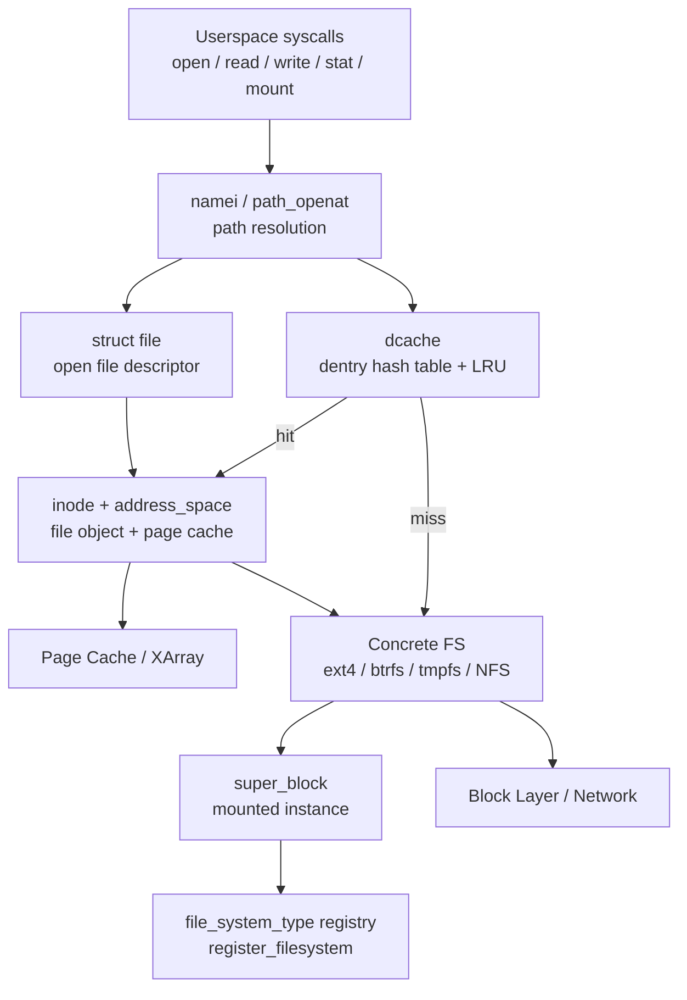
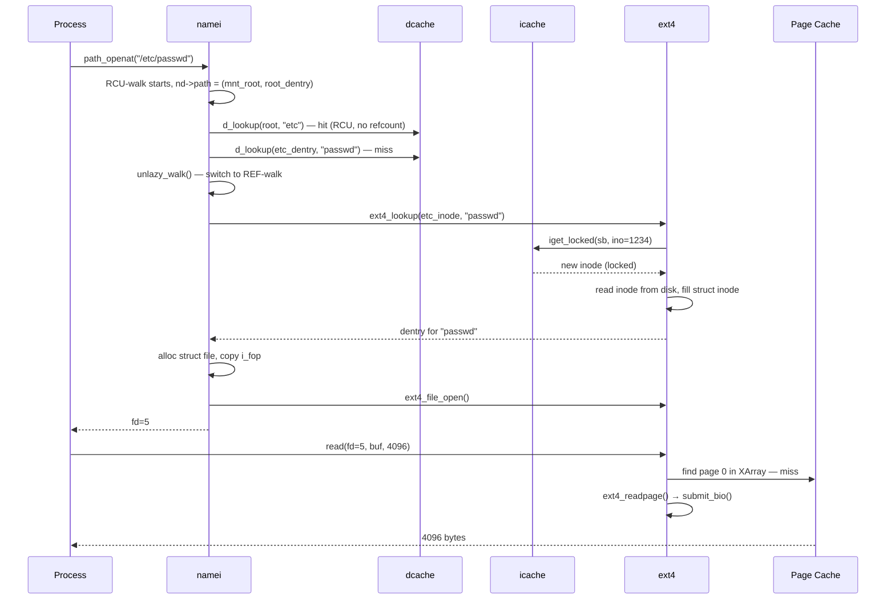

# Virtual File System (VFS) Subsystem

## Related Notes

> **See also**: [[fs]] (VFS overview + full component guide), [[nfs]] (Network File System client & server), [[btrfs]] (B-tree copy-on-write filesystem).

## Overview

The Virtual File System (VFS) is the kernel layer that provides a single, uniform filesystem interface to both userspace and to other kernel subsystems. It defines a generic object model — superblock, inode, dentry, file — and a set of operation tables (vtables) that every concrete filesystem must implement. When a process calls `open("/etc/passwd")`, VFS walks the path, resolves the dentry, allocates a file object, and delegates storage-specific work to the appropriate filesystem without the process ever knowing which filesystem it is talking to.

> **See also**: [[fs]] for the broader Linux filesystem subsystem overview. This note focuses on VFS internals — the dentry cache, path-lookup machinery, mount API, and filesystem registration — rather than repeating the high-level object descriptions.

## Mental Model

VFS is a **dispatch table in the shape of a tree**. The dcache is the tree: every pathname component that has ever been looked up lives there as a `struct dentry`, linked parent-to-child to mirror the directory hierarchy. Each dentry holds a pointer to an inode, and each inode holds a pointer to a vtable of operations. A syscall like `open` is, at its core, a tree walk followed by a vtable dispatch. Superblocks are the roots of subtrees; mounts are the joins between them.

## Architecture

**Reading the diagram**: system calls land in the namei path-resolution code, which walks the dcache component by component. Cache hits return the inode directly; misses delegate to the concrete filesystem's `lookup()`. Once a dentry and inode are found, VFS allocates a `struct file` and hands a file descriptor back to the process. Data I/O passes through the inode's `address_space` into the page cache; dirty pages eventually flow through the concrete filesystem to the block or network layer.

---

## Core Components

### [[Dentry Cache]] (dcache)

**Purpose** — The dcache is the kernel's in-memory view of the entire path namespace. Its primary job is to make repeated pathname lookups O(1) by caching the mapping from (parent dentry, component name) to inode. Without it, every `open` would call into the filesystem for each path component.

**How it works** — Each `struct dentry` represents exactly one pathname component. Dentries are stored in a global hash table (`dentry_hashtable`) keyed on the hash of `(parent_dentry, name)`. On a `d_lookup()` call, the hash table is searched under RCU; on a hit, the dentry's reference count is bumped and the dentry is returned. On a miss, the parent directory's `inode_operations.lookup()` is called, the resulting inode is attached to a new dentry via `d_add()`, and the dentry is inserted into the hash table.

Dentries form a tree: each has a `d_parent` pointer and a `d_subdirs` list of children. This tree is the canonical path namespace representation — it is the foundation on which mount namespaces and path lookups operate.

**Dentry states**:
- **Positive** — `d_inode != NULL`; maps a name to a live inode.
- **Negative** — `d_inode == NULL`; caches the fact that a name does not exist, preventing repeated failed lookups.
- **Unused** — reference count zero; on the LRU list and eligible for eviction by `prune_dcache()`.
- **In-use** — positive dentry with active references (open files, cwd pointers, etc.).

**Eviction** — When the system is under memory pressure, the dcache shrinker (`dcache_shrinker`) walks the LRU and calls `dentry_kill()` on unused dentries. This can transiently increase `lookup()` latency for rarely-accessed paths. The shrinker is tuned via `/proc/sys/vm/vfs_cache_pressure`.

**Key struct**: `struct dentry` (`include/linux/dcache.h`)
- `d_inode` — the inode this dentry points to (NULL for negative dentries)
- `d_parent` — parent dentry
- `d_name` — the component name as a `qstr` (length, hash, string pointer)
- `d_lockref` — combined spinlock + reference count (one atomic word, reduces false sharing)
- `d_op` — pointer to `struct dentry_operations` (filesystem-specific overrides for hashing, comparison, revalidation)
- `d_subdirs` / `d_child` — sibling/child list links
- `d_seq` — seqlock counter used by RCU-walk to detect concurrent modifications

**Key functions**:
- `d_lookup()` — hash-table search; returns a referenced dentry or NULL
- `d_add()` / `d_instantiate()` — attach a freshly created inode to a dentry
- `dget()` / `dput()` — reference counting; `dput` feeds the LRU
- `d_splice_alias()` — for hard-linked directories and NFS reexport; handles aliased inodes

**Config & flags** — `CONFIG_DCACHE_WORD_ACCESS` enables word-at-a-time name comparison for fast lookups on architectures that support it.

---

### [[Path Lookup]] (namei)

**Purpose** — Path lookup converts a pathname string into a `(vfsmount, dentry)` pair. Every syscall that accepts a path — `open`, `stat`, `rename`, `unlink`, `mkdir` — runs through this machinery.

**How it works** — The entry points are `path_lookupat()`, `path_parentat()`, and `path_openat()` in `fs/namei.c`. They share a core walking loop that splits the path at `/` and processes one component at a time, using `walk_component()` for each.

Walk state is kept in `struct nameidata`:
- `nd->path` — current `(vfsmount, dentry)` after each component
- `nd->root` — the effective filesystem root (captured at walk start; used for absolute paths and `..` at the root)
- `nd->last` / `nd->last_type` — the component being processed and its classification (normal, dot, dotdot, root)
- `nd->seq` / `nd->m_seq` — sequence numbers for RCU-walk validation

**Two walk modes** operate concurrently and the algorithm begins in RCU-walk:

1. **RCU-walk** — Holds `rcu_read_lock()` throughout. Never increments `d_lockref`. Validates that each dentry is still consistent by checking `d_seq` (the per-dentry seqlock) before and after reading `d_inode`. Mount-point transitions are validated against `mount_lock` (a global seqlock). This path is completely lockless and writes nothing to shared data structures. It is the common-case fast path for well-cached, stable paths.

2. **REF-walk** — Increments `d_lockref` on each dentry traversed; holds `i_rwsem` on directories when calling `lookup()`. Used whenever RCU-walk encounters an inconsistency (concurrent rename, missing dentry, blocking required) and transitions via `unlazy_walk()`. REF-walk is robust but causes cacheline traffic.

**Component classification** — `walk_component()` calls `d_lookup()` (RCU hash table search), then on a miss calls `lookup_slow()` which acquires `i_rwsem` and calls `inode_operations.lookup()`. The result is cached in the dcache for future lookups.

**Mount-point traversal** — When the walk reaches a dentry flagged `DCACHE_MOUNTED`, it calls `follow_mount()` to switch the `vfsmount` to the mounted filesystem's root, making the mount invisible to the caller.

**Symlink handling** — Symlinks are expanded using a depth-limited stack inside `nameidata`. The limit is `MAXSYMLINKS = 40`. Each expansion reads the link target (via `inode_operations.get_link()`) and restarts the walk from that point, preserving the current directory context. Magic symlinks (e.g., `/proc/self/exe`) are handled by returning a `struct path` directly rather than a string.

**Key struct**: `struct nameidata` (`fs/namei.c` — not exported)
- `path` — current vfsmount + dentry
- `root` — root vfsmount + dentry for this lookup
- `last` — qstr for the next component
- `seq`, `m_seq` — RCU validation sequence numbers
- `depth` — current symlink nesting depth

**Key functions**:
- `path_openat()` — the `open()` path; ends with `do_open()`
- `path_lookupat()` — generic lookup returning the final dentry
- `link_path_walk()` — the loop processing all-but-final components
- `walk_component()` — process one component; may call `lookup_slow()`
- `unlazy_walk()` — transition from RCU-walk to REF-walk
- `follow_mount()` — cross a mount boundary

---

### [[Mount Namespace]] and vfsmount

**Purpose** — A mount namespace is a per-process (more precisely, per-mount-namespace) view of the filesystem hierarchy. It allows containers and sandboxes to have a different view of which filesystems are mounted where, without affecting the rest of the system.

**How it works** — Each mounted filesystem instance is represented by a `struct mount` (kernel-internal wrapper around the exported `struct vfsmount`). A `struct mount` records:
- `mnt_sb` — the superblock (shared with all other mounts of the same filesystem instance)
- `mnt_root` — the root dentry of this mounted tree
- `mnt_mountpoint` — the dentry in the parent mount where this filesystem is grafted
- `mnt_parent` — the parent `struct mount`
- `mnt_ns` — the namespace this mount belongs to

The mount namespace (`struct mnt_namespace`, `fs/mount.h`) holds a tree of `struct mount` objects. When a process calls `clone(CLONE_NEWNS)`, a copy of the parent's mount namespace is created; subsequent mount/umount operations in the child namespace do not affect the parent.

**Path resolution and mounts** — When `walk_component()` returns a dentry that has `DCACHE_MOUNTED` set, the namei code calls `lookup_mnt()` to find the `struct mount` grafted at that dentry, then switches `nd->path.mnt` to the child mount. The `mount_lock` seqlock ensures this transition is atomic with respect to concurrent `umount` operations.

**Shared subtrees** — Linux implements *shared*, *slave*, *private*, and *unbindable* propagation modes for mount points. When a mount is shared, new child mounts on it are propagated to all mounts in the same peer group. This is the mechanism behind `systemd`'s mount units and container overlay mounts.

**Key struct**: `struct vfsmount` (`include/linux/mount.h`)
- `mnt_root` — root dentry
- `mnt_sb` — superblock
- `mnt_flags` — per-mount flags (read-only, no-exec, no-suid, etc.)

**Key functions**:
- `do_mount()` — the `mount(2)` syscall handler
- `lookup_mnt()` — find the mount grafted at a given dentry
- `clone_mnt()` — copy a mount for namespace duplication
- `propagate_mnt()` — propagate a new mount to peer group members

---

### [[Filesystem Registration]] and the Mount API

**Purpose** — Filesystems are kernel modules that register themselves with VFS. VFS then knows how to instantiate, configure, and destroy them on demand when a mount is requested.

**How it works — legacy path** — The traditional `file_system_type` provided a `mount()` callback that received the device name, flags, and an opaque option string. VFS called it with zero context. The callback had to parse options, read the superblock from disk, allocate `struct super_block`, and return the root dentry. This made error reporting and option validation happen after the superblock was half-created, leading to subtle mount-time failures.

**How it works — modern path (Linux 5.1+)** — The new mount API introduces `struct fs_context` as a builder for a mount operation. The workflow is:

1. **`fsopen(fsname)`** — userspace allocates an `fs_context` for a named filesystem type. The filesystem's `init_fs_context()` callback populates the context with default values and sets up `fs_context_operations`.
2. **`fsconfig(fd, cmd, ...)`** — userspace sets individual mount options. Each call invokes `fc->ops->parse_param()`, which can validate and store options immediately. Errors are reported here, before any superblock is created.
3. **`fsmount(fd)`** — VFS calls `fc->ops->get_tree()`, which either finds an existing superblock (for filesystems sharing state across mounts, like `tmpfs`) or allocates a fresh one via `sget_fc()`. The result is a detached mount tree.
4. **`move_mount(fd, target)`** — attaches the detached mount tree to its mountpoint in a specific namespace.

This separation gives filesystems a chance to validate options early, enables unprivileged configuration (setting options before committing), and cleanly separates the "what" (context) from the "where" (namespace attachment).

**Filesystem registration** — Filesystems call `register_filesystem(&my_fs_type)` at module load time. The `file_system_type` struct must provide:
- `name` — the filesystem name (e.g., `"ext4"`)
- `init_fs_context()` — (modern) or `mount()` (legacy) — how to set up or create the filesystem
- `kill_sb()` — how to tear down the superblock on umount
- `fs_flags` — capabilities (e.g., `FS_REQUIRES_DEV`, `FS_USERNS_MOUNT`, `FS_ALLOW_IDMAP`)

The registry is a linked list; `get_fs_type()` searches it by name.

**Key struct**: `struct fs_context` (`include/linux/fs_context.h`)
- `fs_type` — the `file_system_type` being instantiated
- `fs_private` — filesystem-specific data (parsed options, etc.)
- `root` — the root dentry once `get_tree()` completes
- `purpose` — `FS_CONTEXT_FOR_MOUNT`, `FS_CONTEXT_FOR_RECONFIGURE`, etc.
- `ops` — pointer to `struct fs_context_operations`

**Key functions**:
- `register_filesystem()` / `unregister_filesystem()` — module-level registration
- `fsopen()` / `fsconfig()` / `fsmount()` / `move_mount()` — new syscall API
- `vfs_get_tree()` — calls `fc->ops->get_tree()` and validates the result
- `sget_fc()` — search for an existing superblock or allocate a new one

**Config & flags** — `FS_USERNS_MOUNT` allows unprivileged users in a user namespace to mount a filesystem. `FS_ALLOW_IDMAP` signals that the filesystem supports idmapped mounts.

---

### [[Inode Cache]] (icache)

**Purpose** — The inode cache keeps recently-used inodes in memory to avoid repeated disk reads of filesystem metadata. It is the counterpart to the dcache: dentries cache name-to-inode mappings; the icache caches the inodes themselves.

**How it works** — Inodes are keyed by `(superblock, inode_number)`. The kernel maintains a hash table (`inode_hashtable`) for fast lookup. When a filesystem's `lookup()` callback is called, it calls `iget_locked()`, which searches the hash table; on a hit it returns the cached inode; on a miss it allocates a new `struct inode`, inserts it into the hash, and returns it locked so the filesystem can populate it from disk.

Each superblock tracks all its inodes in `sb->s_inodes`. This list is used during umount (to find and evict all inodes), during sync (to find dirty inodes), and by the memory shrinker (`prune_icache_sb()`).

**Lifecycle**:
- **Alloc**: `alloc_inode()` calls the filesystem's `sb->s_op->alloc_inode()` (which may embed the `struct inode` inside a larger filesystem-specific struct).
- **Use**: reference-counted via `ihold()` / `iput()`.
- **Dirty**: `mark_inode_dirty()` sets `I_DIRTY_*` flags and enqueues the inode on the BDI writeback worker's dirty list (`wb->b_dirty`) — *not* on a superblock list. (Note: an older `sb->s_dirty` list existed but was removed when per-BDI writeback was introduced in Linux 3.2.)
- **Eviction**: when reference count hits zero, the inode moves to a free list. If `i_nlink == 0` (file was deleted while open), `evict_inode()` is called immediately; otherwise, the inode waits on the LRU for the shrinker.

**Key struct**: `struct inode` (`include/linux/fs.h`)
- `i_sb` — owning superblock
- `i_ino` — inode number (filesystem-assigned)
- `i_state` — lifecycle flags (`I_NEW`, `I_DIRTY`, `I_SYNC`, `I_FREEING`)
- `i_count` — reference count
- `i_nlink` — hard link count
- `i_op` — inode operations vtable
- `i_fop` — file operations vtable (used when creating a `struct file`)
- `i_mapping` — address_space for page cache

**Key functions**:
- `iget_locked()` — look up or allocate an inode
- `unlock_new_inode()` — mark a newly created inode as ready
- `mark_inode_dirty()` — schedule writeback
- `iput()` — drop reference; triggers eviction pipeline
- `evict_inode()` — final cleanup, calls `sb->s_op->evict_inode()`

---

### [[fsnotify]] Hooks in VFS

**Purpose** — VFS is the natural interception point for filesystem events. The fsnotify framework provides inline hooks at VFS function boundaries so that `inotify`, `fanotify`, and similar consumers receive events without modifying individual filesystem drivers.

**How it works** — `include/linux/fsnotify.h` defines a set of static inline functions (`fsnotify_create`, `fsnotify_unlink`, `fsnotify_modify`, `fsnotify_open`, `fsnotify_access`, `fsnotify_attrib`, `fsnotify_move`, etc.). Each is called at the corresponding VFS operation site:

| VFS site | fsnotify hook |
|---|---|
| `vfs_create()` | `fsnotify_create(dir, dentry)` |
| `vfs_unlink()` | `fsnotify_unlink(dir, dentry)` |
| `vfs_mkdir()` / `vfs_rmdir()` | `fsnotify_mkdir` / `fsnotify_rmdir` |
| `vfs_rename()` | `fsnotify_move()` |
| `file_open()` | `fsnotify_open(file)` |
| `vfs_read()` / `read_iter` | `fsnotify_access(file)` |
| buffered write, `dirty_folio` | `fsnotify_modify(file)` |
| `notify_change()` (chmod/chown) | `fsnotify_attrib(inode)` |

Each hook function is a **no-op if no watchers are registered** — it checks `inode->i_fsnotify_marks` and `inode->i_sb->s_fsnotify_marks` for the quick-exit case; this makes the overhead near zero in the common case.

When a watcher is present, `fsnotify()` is called, which iterates registered notification groups and invokes each group's `handle_inode_event()`. The framework supports:
- **inotify** — per-inode watches; events delivered as `inotify_event` structs through a queue fd.
- **fanotify** — per-mount or filesystem-wide watches; optionally **permission events** where the calling process is paused until the daemon allows/denies the operation.

**Key struct**: `struct fsnotify_mark` — a watcher registration attached to an inode, vfsmount, or superblock; carries an event mask.
**Key struct**: `struct fsnotify_group` — one inotify/fanotify listener instance; owns an event queue and a list of marks.

**Config** — `CONFIG_FSNOTIFY` (enabled by inotify/fanotify), `CONFIG_INOTIFY_USER`, `CONFIG_FANOTIFY`, `CONFIG_FANOTIFY_ACCESS_PERMISSIONS`.

---

## How Components Interact

### Scenario 1: `open("/etc/passwd", O_RDONLY)` end-to-end

### Scenario 2: `mount -t tmpfs none /tmp` with the new mount API

1. `fsopen("tmpfs")` — kernel allocates `fs_context`, calls `tmpfs_init_fs_context()`, sets up `fc->ops`.
2. `fsconfig(fd, FSCONFIG_SET_STRING, "size", "512m")` — `tmpfs_parse_param()` stores the size limit in `fc->fs_private`.
3. `fsmount(fd)` — VFS calls `vfs_get_tree()` → `tmpfs_get_tree()` → `sget_fc()`. Since no existing tmpfs superblock matches, a new `struct super_block` is allocated and `tmpfs_fill_super()` sets up the root inode and dentry. The result is a detached mount.
4. `move_mount(fd, "/tmp")` — the detached mount is attached to `/tmp`'s dentry in the current mount namespace. Subsequent path lookups reaching `/tmp` follow the new `vfsmount`.

### Scenario 3: Dcache eviction under memory pressure

1. `kswapd` calls the dcache shrinker (`dcache_shrinker.scan_objects()`).
2. The shrinker pulls unused dentries from the LRU tail via `list_lru_walk()`.
3. For each candidate, `dentry_kill()` checks: is the dentry still unused? Is it not pinned by a `vfsmount`? If yes, it unhashes the dentry (removes from `dentry_hashtable`), detaches it from its parent's `d_subdirs`, calls `d_op->d_release()`, and frees the memory.
4. If the dentry's inode loses its last dentry reference and is also unused, `iput()` is called, eventually reaching `evict_inode()` and freeing the inode memory too.

---

## Where It Fits in the Kernel

- **↑ Userspace**: VFS is the primary destination for filesystem syscalls: `open`, `read`, `write`, `close`, `stat`, `lstat`, `fstat`, `lseek`, `rename`, `link`, `unlink`, `mkdir`, `rmdir`, `mount`, `umount2`, `fsopen`, `fsconfig`, `fsmount`, `move_mount`, `openat2`, `getdents64`.
- **→ Memory Management (mm)**: The page cache lives inside mm; VFS accesses it through `struct address_space`. The `mmap()` path crosses from VFS into mm's VMA machinery; page reclaim calls back into VFS via the `address_space_operations` shrinker/writeback hooks.
- **→ Block Layer**: Concrete disk filesystems submit `struct bio` to the block layer. VFS never touches block I/O directly; it delegates entirely through filesystem vtables.
- **→ Network Stack**: NFS, CIFS, and 9P implement VFS vtables but use RPC over sockets for I/O. VFS treats them identically to local filesystems.
- **← LSM (Security)**: The Linux Security Module framework (`security/`) hooks into VFS at `inode_permission()`, `file_open()`, `inode_create()`, and dozens of other points. SELinux, AppArmor, and Landlock all intercept VFS calls this way.
- **← Process Management (sched/task)**: `struct task_struct` embeds `struct fs_struct` (holds the root and cwd dentries) and `struct files_struct` (holds the file descriptor table). Every `chdir`, `chroot`, `clone(CLONE_NEWNS)`, and `open` reads or updates these.
- **← Namespaces**: Mount namespaces (`CLONE_NEWNS`) are a VFS-internal concept. User namespaces interact with VFS via `FS_USERNS_MOUNT` and idmapped mounts. PID and network namespaces interact indirectly through procfs and network socket files.
- **↓ Hardware**: VFS sits above all hardware. It reaches storage through filesystem implementations that talk to block devices or network interfaces.

---

## Design Decisions & Tradeoffs

**Four-object model** — Separating superblock (mounted instance), inode (filesystem object), dentry (name binding), and file (open descriptor) cleanly handles hard links (many dentries, one inode), multiple concurrent opens (many files, one inode), and multiple mounts of the same device (many superblocks are not needed — mount creates a new `vfsmount` but can share the superblock). The cost is indirection: every operation involves at least one vtable dispatch.

**RCU-walk** — Introduced in Linux 2.6.38, this was the single biggest VFS scalability improvement. Before it, every `d_lookup()` incremented and decremented `d_lockref`, causing cacheline bouncing across cores. RCU-walk makes the common path (well-cached, stable paths) touch no shared writable state. Paths that require blocking (missing dentries, symlinks, slow filesystems) transparently fall back to REF-walk. The cost is complexity: the dentry's `d_seq` seqlock must be checked on every field read, and inodes must support RCU-safe deallocation via `call_rcu`.

**Negative dentries** — Caching non-existent names avoids repeated `lookup()` calls for files that don't exist. This is important for shell command search (`$PATH` expansion tries many non-existent paths). The downside is that creation of a file at a previously-negative-cached path must invalidate the negative dentry, which requires a lock.

**`d_lockref` combining lock and refcount** — The `lockref` data structure stores a spinlock bit and a reference count in a single 64-bit word. On architectures that support compare-and-swap, `lockref_get()` and `lockref_put()` can succeed without actually taking the spinlock, reducing contention further. This was added in Linux 3.9.

**Filesystem context API** — The old `mount()` callback received a raw `void *data` options blob. This made option parsing happen deep inside filesystem code, error messages were impossible to return to userspace cleanly, and partial initialization on error was hard to clean up. The `fs_context` model (Linux 5.1) moves all option parsing to before `get_tree()` is called, enables structured error messages via `errorf()`, and allows userspace tools to probe supported options without actually mounting.

**Idmapped mounts** — Rather than teaching every filesystem about UID/GID remapping, Linux 5.12 introduced idmapped mounts: a per-mount ID mapping that the VFS applies when translating between filesystem UIDs and the calling process's user namespace. Filesystems opt in by setting `FS_ALLOW_IDMAP`; VFS handles the translation transparently at the `inode_permission()` and `getattr()` layers.

---

## How It Has Evolved

- **Linux 0.x–1.x**: VFS was minimal, modeled on Sun's SVR4 VFS. The four-object model was present from the start but lacked a dentry cache — every lookup called into the filesystem.
- **Linux 2.0 (1996)**: Dentry cache introduced, dramatically reducing filesystem call overhead for cached paths. Inode caching was also formalized.
- **Linux 2.4 (2001)**: `address_space` introduced, cleanly separating page-cache management from inode semantics. The VFS became the page cache's primary customer.
- **Linux 2.6.12 (2005)**: Mount namespaces (`CLONE_NEWNS`) formalized as a first-class kernel feature.
- **Linux 2.6.38 (2011)**: RCU-walk path lookup replaced the old spin-locked walk, removing the biggest multi-core scalability bottleneck.
- **Linux 3.9 (2013)**: `d_lockref` introduced, eliminating false sharing between the dentry spinlock and reference count.
- **Linux 3.18 (2014)**: `openat2(2)` foundations; `O_TMPFILE` support.
- **Linux 4.18 (2018)**: `io_uring` prototype merged (initially minimal VFS impact; later versions drove heavy VFS changes).
- **Linux 5.1 (2019)**: New mount API (`fsopen`/`fsconfig`/`fsmount`/`move_mount`) and `struct fs_context` replace the legacy opaque-string `mount()` callback.
- **Linux 5.12 (2021)**: Idmapped mounts (`vfs_idmap_mount()`), enabling container-friendly per-mount UID/GID translation.
- **Linux 5.15 (2021)**: `openat2(2)` stabilized; `RESOLVE_*` flags for safer path resolution.
- **Linux 6.6 (2023)**: `fanotify` gained pre-content hooks for user-space file content scanning (e.g., anti-virus).
- **Linux 6.12 (2024)**: FUSE-over-io_uring design landed; dcache LRU scalability improvements.
- **Linux 6.15 (2025)**: `open_tree_attr()` syscall; detached mounts and nested idmapped mounts now supported.

---

## Recent Development Activity

- **FUSE-over-io_uring**: Delivering FUSE requests through io_uring rings instead of `/dev/fuse` read/write eliminates the context-switch round-trip that makes user-space filesystems slow. VFS changes are needed to enqueue requests asynchronously.
- **Inode reference counting rework** (Josef Bacik, 2025, 54-patch series): Restructuring `iput()` and the inode LRU to reduce lock contention, particularly for network filesystems with cross-mount-point shared inodes.
- **Landlock expansion**: The Landlock security module (in-process sandboxing via VFS hooks) is gaining new access-control scopes (network, IPC) on top of its VFS hooks.
- **Larger folio support in the page cache**: Filesystems are migrating to `read_folio` / `writepages` with multi-page folios, improving I/O efficiency for large sequential reads and reducing TLB pressure.
- **Mount namespace API expansion**: Christian Brauner continues work on allowing unprivileged containers to manage their own mount namespaces via `FS_USERNS_MOUNT` and the new `move_mount` / `open_tree` API.

---

## Further Reading

1. **[Overview of the Linux Virtual File System — kernel.org](https://www.kernel.org/doc/html/latest/filesystems/vfs.html)** — authoritative reference for all VFS operation tables and object semantics (includes current folio API).
2. **[Filesystem Mount API — kernel.org](https://www.kernel.org/doc/html/latest/filesystems/mount_api.html)** — full documentation of `fs_context`, `fsopen`, `fsconfig`, and `fsmount`.
3. **[Pathname lookup in Linux — LWN.net (2015)](https://lwn.net/Articles/649115/)** — four-part series by Neil Brown on RCU-walk, nameidata, and symlink handling.
4. **[Dcache scalability and RCU-walk — LWN.net (2011)](https://lwn.net/Articles/419811/)** — Nick Piggin's explanation of the RCU-walk redesign and its motivation.
5. **[Flushing out pdflush — LWN.net (2009)](https://lwn.net/Articles/326552/)** — explains per-BDI writeback replacing pdflush and `bdi_writeback` design.
6. **[Page folios — LWN.net (2021)](https://lwn.net/Articles/840593/)** — why `struct folio` replaces `struct page` in the page cache and VFS address_space operations.
7. **[fsnotify, dnotify, and inotify — LWN.net (2009)](https://lwn.net/Articles/311350/)** — fsnotify framework design and how inotify/dnotify are built on it.
8. **[The fanotify API — LWN.net (2010)](https://lwn.net/Articles/339399/)** — fanotify's permission event model and VFS integration.
9. **[A VFS deadlock post-mortem — LWN.net (2013)](https://lwn.net/Articles/545119/)** — real incident dissecting inode and dentry locking interactions.
10. **[VFS: Introduce filesystem context — LWN.net (2019)](https://lwn.net/Articles/780267/)** — the motivation and design of `struct fs_context` replacing legacy `mount()`.
11. **[Creating Linux virtual filesystems — LWN.net (2003)](https://lwn.net/Articles/57369/)** — accessible tutorial for writing a minimal VFS-backed filesystem.

---

## LKML Highlights

- **`cover.1756222464.git.josef@toxicpanda.com`** — "fs: rework inode reference counting" (Josef Bacik, 2025). 54-patch series restructuring `iput()` and the inode LRU to reduce lock contention on network filesystems. Represents the most significant in-progress VFS core surgery as of 2025–2026.
- **`20190703085904.19516-1-viro@ZenIV.linux.org.uk`** — Al Viro's "filesystem context" series introducing `fs_context` (2019). The cover letter explains why the opaque-string `mount()` callback was fundamentally broken for error reporting and early option validation. A landmark redesign of how filesystems integrate with VFS.
- **`20211122142745.272848-1-christian.brauner@ubuntu.com`** — Christian Brauner's idmapped mounts series (2021). Explains how adding a per-mount ID mapping layer to VFS's permission checks avoided the need to modify individual filesystems while enabling rootless container workflows.
